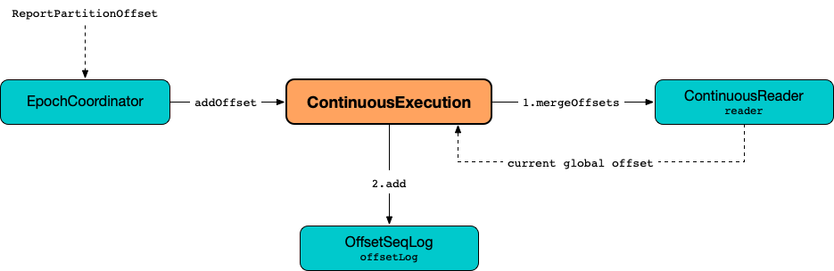

# ContinuousExecution

`ContinuousExecution` is the [stream execution engine](StreamExecution.md) of [Continuous Stream Processing](continuous-stream-processing.md).

`ContinuousExecution` is <<creating-instance, created>> when `StreamingQueryManager` is requested to [create a streaming query](StreamingQueryManager.md#createQuery) with a <<sink, StreamWriteSupport sink>> and a <<trigger, ContinuousTrigger>> (when `DataStreamWriter` is requested to [start an execution of the streaming query](DataStreamWriter.md#start)).

`ContinuousExecution` can only run streaming queries with [StreamingRelationV2](logical-operators/StreamingRelationV2.md) leaf logical operators with [ContinuousReadSupport](ContinuousReadSupport.md) data source.

[[sources]]
`ContinuousExecution` supports one <<continuousSources, ContinuousReader>> only in a <<logicalPlan, streaming query>> (and asserts it when <<addOffset, addOffset>> and <<commit, committing an epoch>>). When requested for available [streaming sources](monitoring/ProgressReporter.md#sources), `ContinuousExecution` simply gives the <<continuousSources, single ContinuousReader>>.

```text
import org.apache.spark.sql.streaming.Trigger
import scala.concurrent.duration._
val sq = spark
  .readStream
  .format("rate")
  .load
  .writeStream
  .format("console")
  .option("truncate", false)
  .trigger(Trigger.Continuous(1.minute)) // <-- Gives ContinuousExecution
  .queryName("rate2console")
  .start

import org.apache.spark.sql.streaming.StreamingQuery
assert(sq.isInstanceOf[StreamingQuery])

// The following gives access to the internals
// And to ContinuousExecution
import org.apache.spark.sql.execution.streaming.StreamingQueryWrapper
val engine = sq.asInstanceOf[StreamingQueryWrapper].streamingQuery
import org.apache.spark.sql.execution.streaming.StreamExecution
assert(engine.isInstanceOf[StreamExecution])

import org.apache.spark.sql.execution.streaming.continuous.ContinuousExecution
val continuousEngine = engine.asInstanceOf[ContinuousExecution]
assert(continuousEngine.trigger == Trigger.Continuous(1.minute))
```

When <<creating-instance, created>> (for a streaming query), `ContinuousExecution` is given the <<analyzedPlan, analyzed logical plan>>. The analyzed logical plan is immediately transformed to include a [ContinuousExecutionRelation](ContinuousExecutionRelation.md) for every [StreamingRelationV2](logical-operators/StreamingRelationV2.md) leaf logical operator with [ContinuousReadSupport](ContinuousReadSupport.md) data source (and is the [logical plan](#logicalPlan) internally).

!!! note
    `ContinuousExecution` uses the same instance of `ContinuousExecutionRelation` for the same instances of [StreamingRelationV2](logical-operators/StreamingRelationV2.md) with [ContinuousReadSupport](ContinuousReadSupport.md) data source.

When requested to <<runContinuous, run the streaming query>>, `ContinuousExecution` collects [ContinuousReadSupport](ContinuousReadSupport.md) data sources (inside [ContinuousExecutionRelation](ContinuousExecutionRelation.md)) from the <<logicalPlan, analyzed logical plan>> and requests each and every `ContinuousReadSupport` to [create a ContinuousReader](ContinuousReadSupport.md#createContinuousReader) (that are stored in <<continuousSources, continuousSources>> internal registry).

[[EPOCH_COORDINATOR_ID_KEY]]
`ContinuousExecution` uses *__epoch_coordinator_id* local property for...FIXME

[[START_EPOCH_KEY]]
`ContinuousExecution` uses *__continuous_start_epoch* local property for...FIXME

[[EPOCH_INTERVAL_KEY]]
`ContinuousExecution` uses *__continuous_epoch_interval* local property for...FIXME

[[logging]]
[TIP]
====
Enable `ALL` logging level for `org.apache.spark.sql.execution.streaming.continuous.ContinuousExecution` to see what happens inside.

Add the following line to `conf/log4j.properties`:

```
log4j.logger.org.apache.spark.sql.execution.streaming.continuous.ContinuousExecution=ALL
```

Refer to <<spark-sql-streaming-spark-logging.md#, Logging>>.
====

## <span id="triggerExecutor"> TriggerExecutor

[TriggerExecutor](TriggerExecutor.md) for the [Trigger](#trigger):

* `ProcessingTimeExecutor` for [ContinuousTrigger](Trigger.md#ContinuousTrigger)

Used when...FIXME

!!! note
    `StreamExecution` throws an `IllegalStateException` when the [Trigger](#trigger) is not a [ContinuousTrigger](Trigger.md#ContinuousTrigger).

=== [[runActivatedStream]] Running Activated Streaming Query -- `runActivatedStream` Method

[source, scala]
----
runActivatedStream(sparkSessionForStream: SparkSession): Unit
----

`runActivatedStream` simply [runs the streaming query in continuous mode](#runContinuous) as long as the [state](StreamExecution.md#state) is `ACTIVE`.

`runActivatedStream` is part of [StreamExecution](StreamExecution.md#runActivatedStream) abstraction.

## <span id="runContinuous"> Running Streaming Query in Continuous Mode

```scala
runContinuous(
  sparkSessionForQuery: SparkSession): Unit
```

`runContinuous` initializes the <<continuousSources, continuousSources>> internal registry by traversing the <<logicalPlan, analyzed logical plan>> to find [ContinuousExecutionRelation](ContinuousExecutionRelation.md) leaf logical operators and requests their [ContinuousReadSupport](ContinuousReadSupport.md) data sources to [create a ContinuousReader](ContinuousReadSupport.md#createContinuousReader) (with the *sources* metadata directory under the [checkpoint directory](StreamExecution.md#resolvedCheckpointRoot)).

`runContinuous` initializes the [uniqueSources](StreamExecution.md#uniqueSources) internal registry to be the <<continuousSources, continuousSources>> distinct.

`runContinuous` <<getStartOffsets, gets the start offsets>> (they may or may not be available).

`runContinuous` transforms the <<logicalPlan, analyzed logical plan>>. For every [ContinuousExecutionRelation](ContinuousExecutionRelation.md) `runContinuous` finds the corresponding <<spark-sql-streaming-ContinuousReader.md#, ContinuousReader>> (in the <<continuousSources, continuousSources>>), requests it to <<spark-sql-streaming-ContinuousReader.md#deserializeOffset, deserialize the start offsets>> (from their JSON representation), and then <<spark-sql-streaming-ContinuousReader.md#setStartOffset, setStartOffset>>. In the end, `runContinuous` creates a [StreamingDataSourceV2Relation](logical-operators/StreamingDataSourceV2Relation.md) (with the read schema of the `ContinuousReader` and the `ContinuousReader` itself).

`runContinuous` rewires the transformed plan (with the `StreamingDataSourceV2Relation`) to use the new attributes from the source (the reader).

!!! important
    `CurrentTimestamp` and `CurrentDate` expressions are not supported for continuous processing.

`runContinuous`...FIXME

`runContinuous` finds the only [ContinuousReader](spark-sql-streaming-ContinuousReader.md) (of the only `StreamingDataSourceV2Relation`) in the query plan with the `WriteToContinuousDataSource`.

<span id="runContinuous-queryPlanning"/>
In **queryPlanning** [time-tracking section](monitoring/ProgressReporter.md#reportTimeTaken), `runContinuous` creates an [IncrementalExecution](IncrementalExecution.md) (that becomes the [lastExecution](StreamExecution.md#lastExecution)) that is immediately executed (the entire query execution pipeline is executed up to and including _executedPlan_).

`runContinuous` sets the following local properties:

* [__is_continuous_processing](StreamExecution.md#IS_CONTINUOUS_PROCESSING) as `true`

* <<START_EPOCH_KEY, __continuous_start_epoch>> as the [currentBatchId](StreamExecution.md#currentBatchId)

* <<EPOCH_COORDINATOR_ID_KEY, __epoch_coordinator_id>> as the <<currentEpochCoordinatorId, currentEpochCoordinatorId>>, i.e. [runId](StreamExecution.md#runId) followed by `--` with a random UUID

* <<EPOCH_INTERVAL_KEY, __continuous_epoch_interval>> as the interval of the [ContinuousTrigger](Trigger.md#ContinuousTrigger)

`runContinuous` uses the `EpochCoordinatorRef` helper to <<spark-sql-streaming-EpochCoordinatorRef.md#create, create a remote reference to the EpochCoordinator RPC endpoint>> (with the <<spark-sql-streaming-ContinuousReader.md#, ContinuousReader>>, the <<currentEpochCoordinatorId, currentEpochCoordinatorId>>, and the [currentBatchId](StreamExecution.md#currentBatchId)).

NOTE: The <<spark-sql-streaming-EpochCoordinator.md#, EpochCoordinator RPC endpoint>> runs on the driver as the single point to coordinate epochs across partition tasks.

`runContinuous` creates a daemon <<runContinuous-epoch-update-thread, epoch update thread>> and starts it immediately.

[[runContinuous-runContinuous]]
In *runContinuous* [time-tracking section](monitoring/ProgressReporter.md#reportTimeTaken), `runContinuous` requests the physical query plan (of the [IncrementalExecution](StreamExecution.md#lastExecution)) to execute (that simply requests the physical operator to `doExecute` and generate an `RDD[InternalRow]`).

`runContinuous` is used when `ContinuousExecution` is requested to <<runActivatedStream, run an activated streaming query>>.

==== [[runContinuous-epoch-update-thread]] Epoch Update Thread

`runContinuous` creates an *epoch update thread* that...FIXME

==== [[getStartOffsets]] Getting Start Offsets From Checkpoint -- `getStartOffsets` Internal Method

[source, scala]
----
getStartOffsets(sparkSessionToRunBatches: SparkSession): OffsetSeq
----

`getStartOffsets`...FIXME

NOTE: `getStartOffsets` is used exclusively when `ContinuousExecution` is requested to <<runContinuous, run a streaming query in continuous mode>>.

=== [[commit]] Committing Epoch -- `commit` Method

[source, scala]
----
commit(epoch: Long): Unit
----

In essence, `commit` [adds](HDFSMetadataLog.md#add) the given epoch to [commit log](StreamExecution.md#commitLog) and the [committedOffsets](StreamExecution.md#committedOffsets), and requests the <<continuousSources, ContinuousReader>> to <<spark-sql-streaming-ContinuousReader.md#commit, commit the corresponding offset>>. In the end, `commit` [removes old log entries](HDFSMetadataLog.md#purge) from the [offset](StreamExecution.md#offsetLog) and [commit](StreamExecution.md#commitLog) logs (to keep [spark.sql.streaming.minBatchesToRetain](StreamExecution.md#minLogEntriesToMaintain) entries only).

Internally, `commit` [recordTriggerOffsets](monitoring/ProgressReporter.md#recordTriggerOffsets) (with the from and to offsets as the [committedOffsets](StreamExecution.md#committedOffsets) and [availableOffsets](StreamExecution.md#availableOffsets), respectively).

At this point, `commit` may simply return when the [stream execution thread](StreamExecution.md#queryExecutionThread) is no longer alive (died).

`commit` requests the [commit log](StreamExecution.md#commitLog) to [store a metadata](HDFSMetadataLog.md#add) for the epoch.

`commit` requests the single <<continuousSources, ContinuousReader>> to <<spark-sql-streaming-ContinuousReader.md#deserializeOffset, deserialize the offset>> for the epoch (from the [offset write-ahead log](StreamExecution.md#offsetLog)).

`commit` adds the single <<continuousSources, ContinuousReader>> and the offset (for the epoch) to the [committedOffsets](StreamExecution.md#committedOffsets) registry.

`commit` requests the single <<continuousSources, ContinuousReader>> to <<spark-sql-streaming-ContinuousReader.md#commit, commit the offset>>.

`commit` requests the [offset](StreamExecution.md#offsetLog) and [commit](StreamExecution.md#commitLog) logs to [remove log entries](HDFSMetadataLog.md#purge) to keep [spark.sql.streaming.minBatchesToRetain](StreamExecution.md#minLogEntriesToMaintain) only.

`commit` then acquires the [awaitProgressLock](StreamExecution.md#awaitProgressLock), wakes up all threads waiting for the [awaitProgressLockCondition](StreamExecution.md#awaitProgressLockCondition) and in the end releases the [awaitProgressLock](StreamExecution.md#awaitProgressLock).

NOTE: `commit` supports only one continuous source (registered in the <<continuousSources, continuousSources>> internal registry).

`commit` asserts that the given epoch is available in the [offsetLog](StreamExecution.md#offsetLog) internal registry (i.e. the offset for the given epoch has been reported before).

`commit` is used when `EpochCoordinator` is requested to [commitEpoch](spark-sql-streaming-EpochCoordinator.md#commitEpoch).

=== [[addOffset]] `addOffset` Method

[source, scala]
----
addOffset(
  epoch: Long,
  reader: ContinuousReader,
  partitionOffsets: Seq[PartitionOffset]): Unit
----

In essense, `addOffset` requests the given <<spark-sql-streaming-ContinuousReader.md#, ContinuousReader>> to <<spark-sql-streaming-ContinuousReader.md#mergeOffsets, mergeOffsets>> (with the given `PartitionOffsets`) and then requests the [OffsetSeqLog](StreamExecution.md#offsetLog) to [register the offset with the given epoch](HDFSMetadataLog.md#add).



Internally, `addOffset` requests the given <<spark-sql-streaming-ContinuousReader.md#, ContinuousReader>> to <<spark-sql-streaming-ContinuousReader.md#mergeOffsets, mergeOffsets>> (with the given `PartitionOffsets`) and to get the current "global" offset back.

`addOffset` then requests the [OffsetSeqLog](StreamExecution.md#offsetLog) to [add](HDFSMetadataLog.md#add) the current "global" offset for the given `epoch`.

`addOffset` requests the [OffsetSeqLog](StreamExecution.md#offsetLog) for the [offset at the previous epoch](HDFSMetadataLog.md#get).

If the offsets at the current and previous epochs are the same, `addOffset` turns the [noNewData](StreamExecution.md#noNewData) internal flag on.

`addOffset` then acquires the [awaitProgressLock](StreamExecution.md#awaitProgressLock), wakes up all threads waiting for the [awaitProgressLockCondition](StreamExecution.md#awaitProgressLockCondition) and in the end releases the [awaitProgressLock](StreamExecution.md#awaitProgressLock).

NOTE: `addOffset` supports exactly one <<continuousSources, continuous source>>.

`addOffset` is used when `EpochCoordinator` is requested to <<spark-sql-streaming-EpochCoordinator.md#ReportPartitionOffset, handle a ReportPartitionOffset message>>.

## <span id="logicalPlan"> Analyzed Logical Plan of Streaming Query

```scala
logicalPlan: LogicalPlan
```

`logicalPlan` resolves [StreamingRelationV2](logical-operators/StreamingRelationV2.md) leaf logical operators (with a [ContinuousReadSupport](ContinuousReadSupport.md) source) to [ContinuousExecutionRelation](ContinuousExecutionRelation.md) leaf logical operators.

Internally, `logicalPlan` transforms the <<analyzedPlan, analyzed logical plan>> as follows:

. For every [StreamingRelationV2](logical-operators/StreamingRelationV2.md) leaf logical operator with a [ContinuousReadSupport](ContinuousReadSupport.md) source, `logicalPlan` looks it up for the corresponding [ContinuousExecutionRelation](ContinuousExecutionRelation.md) (if available in the internal lookup registry) or creates a `ContinuousExecutionRelation` (with the `ContinuousReadSupport` source, the options and the output attributes of the `StreamingRelationV2` operator)

. For any other `StreamingRelationV2`, `logicalPlan` throws an `UnsupportedOperationException`:
+
```text
Data source [name] does not support continuous processing.
```

`logicalPlan` is part of the [StreamExecution](StreamExecution.md#logicalPlan) abstraction.

## Creating Instance

`ContinuousExecution` takes the following when created:

* [[sparkSession]] `SparkSession`
* [[name]] The name of the structured query
* [[checkpointRoot]] Path to the checkpoint directory (aka _metadata directory_)
* [[analyzedPlan]] Analyzed logical query plan (`LogicalPlan`)
* [[trigger]] [Trigger](Trigger.md)
* [[triggerClock]] `Clock`
* [[outputMode]] [OutputMode](OutputMode.md)
* [[extraOptions]] Options (`Map[String, String]`)
* [[deleteCheckpointOnStop]] `deleteCheckpointOnStop` flag to control whether to delete the checkpoint directory on stop

=== [[stop]] Stopping Stream Processing (Execution of Streaming Query) -- `stop` Method

[source, scala]
----
stop(): Unit
----

NOTE: `stop` is part of the <<StreamingQuery.md#stop, StreamingQuery Contract>> to stop a streaming query.

`stop` transitions the streaming query to `TERMINATED` state.

If the [queryExecutionThread](StreamExecution.md#queryExecutionThread) is alive (i.e. it has been started and has not yet died), `stop` interrupts it and waits for this thread to die.

In the end, `stop` prints out the following INFO message to the logs:

```text
Query [prettyIdString] was stopped
```

!!! note
    [prettyIdString](StreamExecution.md#prettyIdString) is in the format of `queryName [id = [id], runId = [runId]]`.

=== [[awaitEpoch]] `awaitEpoch` Internal Method

[source, scala]
----
awaitEpoch(epoch: Long): Unit
----

`awaitEpoch`...FIXME

NOTE: `awaitEpoch` seems to be used exclusively in tests.

=== [[internal-properties]] Internal Properties

[cols="30m,70",options="header",width="100%"]
|===
| Name
| Description

| continuousSources
a| [[continuousSources]]

[source, scala]
----
continuousSources: Seq[ContinuousReader]
----

Registry of <<spark-sql-streaming-ContinuousReader.md#, ContinuousReaders>> (in the <<logicalPlan, analyzed logical plan of the streaming query>>)

As asserted in <<commit, commit>> and <<addOffset, addOffset>> there could only be exactly one `ContinuousReaders` registered.

Used when `ContinuousExecution` is requested to <<commit, commit>>, <<getStartOffsets, getStartOffsets>>, and <<runContinuous, runContinuous>>

Use <<sources, sources>> to access the current value

| currentEpochCoordinatorId
| [[currentEpochCoordinatorId]] FIXME

Used when...FIXME
|===
