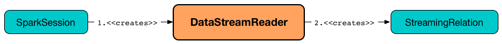

# DataStreamReader

`DataStreamReader` is an interface that Spark developers use to describe how to [load data](#load) from a [streaming data source](datasources/index.md).



## <span id="readStream"> Accessing DataStreamReader

`DataStreamReader` is available using `SparkSession.readStream` method.

```text
import org.apache.spark.sql.SparkSession
val spark: SparkSession = ...

val streamReader = spark.readStream
```

## Built-in Formats

`DataStreamReader` supports loading streaming data from the following [built-in data sources](datasources/index.md):

* `csv`
* `json`
* `orc`
* `parquet` (default)
* `text`
* `textFile`

!!! tip
    Use `spark.sql.sources.default` configuration property to change the default data source.

!!! note
    Hive data source can only be used with tables, and it is an `AnalysisException` when specified explicitly.

## <span id="load"> Loading Data

```scala
load(): DataFrame
load(
  path: String): DataFrame
```

`DataStreamReader` gives specialized methods for [built-in data systems and formats](#built-in-formats).

In order to plug in a custom data source, `DataStreamReader` gives `format` and `load` methods.

`load` creates a streaming `DataFrame` that represents a "loading" streaming data node (and is internally a logical plan with a [StreamingRelationV2](logical-operators/StreamingRelationV2.md) or [StreamingRelation](logical-operators/StreamingRelation.md) leaf logical operators).

`load` uses `DataSource.lookupDataSource` utility to look up the data source by `source` alias.

!!! tip
    Learn more about [DataSource.lookupDataSource]({{ book.spark_sql }}/DataSource#lookupDataSource) utility in [The Internals of Spark SQL]({{ book.spark_sql }}) online book.

### SupportsRead Tables with MICRO_BATCH_READ or CONTINUOUS_READ

For a `TableProvider` (that is not a `FileDataSourceV2`), `load` requests it for a `Table`.

!!! tip
    Learn more about [TableProvider]({{ book.spark_sql }}/connector/TableProvider) in [The Internals of Spark SQL]({{ book.spark_sql }}) online book.

For a `Table` with `SupportsRead` with `MICRO_BATCH_READ` or `CONTINUOUS_READ` capabilities, `load` creates a `DataFrame` with [StreamingRelationV2](logical-operators/StreamingRelationV2.md) leaf logical operator.

!!! tip
    Learn more about [Table]({{ book.spark_sql }}/connector/Table), [SupportsRead]({{ book.spark_sql }}/connector/SupportsRead) and [capabilities]({{ book.spark_sql }}/connector/TableCapability) in [The Internals of Spark SQL]({{ book.spark_sql }}) online book.

If the `DataSource` is a [StreamSourceProvider](StreamSourceProvider.md), `load` creates the `StreamingRelationV2` with a [StreamingRelation](logical-operators/StreamingRelation.md) leaf logical operator.

For other `Table`s, `load` creates a `DataFrame` with a [StreamingRelation](logical-operators/StreamingRelation.md) leaf logical operator.

### Other Data Sources

`load` creates a `DataFrame` with a [StreamingRelation](logical-operators/StreamingRelation.md) leaf logical operator.
