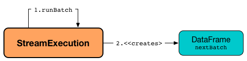

# MicroBatchExecution

`MicroBatchExecution` is the [stream execution engine](StreamExecution.md) in [Micro-Batch Stream Processing](micro-batch-stream-processing.md).

`MicroBatchExecution` is created when `StreamingQueryManager` is requested to [create a streaming query](StreamingQueryManager.md#createQuery) (when `DataStreamWriter` is requested to [start an execution of the streaming query](DataStreamWriter.md#start)) with the following:

* Any type of <<sink, sink>>

* Any type of [trigger](#trigger) but [ContinuousTrigger](Trigger.md#ContinuousTrigger)

```text
import org.apache.spark.sql.streaming.Trigger
val query = spark
  .readStream
  .format("rate")
  .load
  .writeStream
  .format("console")          // <-- not a StreamWriteSupport sink
  .option("truncate", false)
  .trigger(Trigger.Once)      // <-- Gives MicroBatchExecution
  .queryName("rate2console")
  .start

// The following gives access to the internals
// And to MicroBatchExecution
import org.apache.spark.sql.execution.streaming.StreamingQueryWrapper
val engine = query.asInstanceOf[StreamingQueryWrapper].streamingQuery
import org.apache.spark.sql.execution.streaming.StreamExecution
assert(engine.isInstanceOf[StreamExecution])

import org.apache.spark.sql.execution.streaming.MicroBatchExecution
val microBatchEngine = engine.asInstanceOf[MicroBatchExecution]
assert(microBatchEngine.trigger == Trigger.Once)
```

Once <<creating-instance, created>>, `MicroBatchExecution` (as a [stream execution engine](StreamExecution.md)) is requested to <<runActivatedStream, run an activated streaming query>>.

[[logging]]
[TIP]
====
Enable `ALL` logging level for `org.apache.spark.sql.execution.streaming.MicroBatchExecution` to see what happens inside.

Add the following line to `conf/log4j.properties`:

```
log4j.logger.org.apache.spark.sql.execution.streaming.MicroBatchExecution=ALL
```

Refer to <<spark-sql-streaming-spark-logging.md#, Logging>>.
====

## Creating Instance

`MicroBatchExecution` takes the following to be created:

* [[sparkSession]] `SparkSession`
* [[name]] Name of the streaming query
* [[checkpointRoot]] Path of the checkpoint directory
* [[analyzedPlan]] Analyzed logical query plan of the streaming query (`LogicalPlan`)
* [[trigger]] [Trigger](Trigger.md)
* [[triggerClock]] Trigger clock (`Clock`)
* [[outputMode]] [OutputMode](OutputMode.md)
* [[extraOptions]] Extra options (`Map[String, String]`)
* [[deleteCheckpointOnStop]] `deleteCheckpointOnStop` flag to control whether to delete the checkpoint directory on stop

`MicroBatchExecution` initializes the <<internal-properties, internal properties>>.

=== [[triggerExecutor]] MicroBatchExecution and TriggerExecutor -- `triggerExecutor` Property

[source, scala]
----
triggerExecutor: TriggerExecutor
----

`triggerExecutor` is the [TriggerExecutor](TriggerExecutor.md) of the streaming query that is how micro-batches are executed at regular intervals.

`triggerExecutor` is initialized based on the given <<trigger, Trigger>> (that was used to create the `MicroBatchExecution`):

* [ProcessingTimeExecutor](TriggerExecutor.md) for [Trigger.ProcessingTime](Trigger.md#ProcessingTime)

* [OneTimeExecutor](TriggerExecutor.md) for [OneTimeTrigger](Trigger.md#OneTimeTrigger) (aka [Trigger.Once](Trigger.md#Once) trigger)

`triggerExecutor` throws an `IllegalStateException` when the <<trigger, Trigger>> is not one of the [built-in implementations](Trigger.md#available-implementations).

```text
Unknown type of trigger: [trigger]
```

NOTE: `triggerExecutor` is used exclusively when `StreamExecution` is requested to <<runActivatedStream, run an activated streaming query>> (at regular intervals).

=== [[runActivatedStream]] Running Activated Streaming Query -- `runActivatedStream` Method

[source, scala]
----
runActivatedStream(
  sparkSessionForStream: SparkSession): Unit
----

`runActivatedStream` simply requests the <<triggerExecutor, TriggerExecutor>> to execute micro-batches using the <<batchRunner, batch runner>> (until `MicroBatchExecution` is [terminated](StreamExecution.md#isActive) due to a query stop or a failure).

`runActivatedStream` is part of [StreamExecution](StreamExecution.md#runActivatedStream) abstraction.

==== [[batchRunner]][[batch-runner]] TriggerExecutor's Batch Runner

The batch runner (of the <<triggerExecutor, TriggerExecutor>>) is executed as long as the `MicroBatchExecution` is [active](StreamExecution.md#isActive).

NOTE: _trigger_ and _batch_ are considered equivalent and used interchangeably.

[[runActivatedStream-startTrigger]]
The batch runner [initializes query progress for the new trigger](monitoring/ProgressReporter.md#startTrigger) (aka _startTrigger_).

[[runActivatedStream-triggerExecution]][[runActivatedStream-triggerExecution-populateStartOffsets]]
The batch runner starts *triggerExecution* [execution phase](monitoring/ProgressReporter.md#reportTimeTaken) that is made up of the following steps:

. <<populateStartOffsets, Populating start offsets from checkpoint>> before the first "zero" batch (at every start or restart)

. <<constructNextBatch, Constructing or skipping the next streaming micro-batch>>

. <<runBatch, Running the streaming micro-batch>>

At the start or restart (_resume_) of a streaming query (when the <<currentBatchId, current batch ID>> is uninitialized and `-1`), the batch runner <<populateStartOffsets, populates start offsets from checkpoint>> and then prints out the following INFO message to the logs (using the [committedOffsets](StreamExecution.md#committedOffsets) internal registry):

```text
Stream started from [committedOffsets]
```

The batch runner sets the human-readable description for any Spark job submitted (that streaming sources may submit to get new data) as the [batch description](StreamExecution.md#getBatchDescriptionString).

[[runActivatedStream-triggerExecution-isCurrentBatchConstructed]]
The batch runner <<constructNextBatch, constructs the next streaming micro-batch>> (when the <<isCurrentBatchConstructed, isCurrentBatchConstructed>> internal flag is off).

The batch runner <<recordTriggerOffsets, records trigger offsets>> (with the [committed](StreamExecution.md#committedOffsets) and [available](StreamExecution.md#availableOffsets) offsets).

The batch runner updates the [current StreamingQueryStatus](monitoring/ProgressReporter.md#currentStatus) with the <<isNewDataAvailable, isNewDataAvailable>> for [isDataAvailable](monitoring/StreamingQueryStatus.md#isDataAvailable) property.

[[runActivatedStream-triggerExecution-runBatch]]
With the <<isCurrentBatchConstructed, isCurrentBatchConstructed>> flag enabled (`true`), the batch runner [updates the status message](monitoring/ProgressReporter.md#updateStatusMessage) to one of the following (per <<isNewDataAvailable, isNewDataAvailable>>) and <<runBatch, runs the streaming micro-batch>>.

```text
Processing new data
```

```text
No new data but cleaning up state
```

With the <<isCurrentBatchConstructed, isCurrentBatchConstructed>> flag disabled (`false`), the batch runner simply [updates the status message](monitoring/ProgressReporter.md#updateStatusMessage) to the following:

```text
Waiting for data to arrive
```

[[runActivatedStream-triggerExecution-finishTrigger]]
The batch runner [finalizes query progress for the trigger](monitoring/ProgressReporter.md#finishTrigger) (with a flag that indicates whether the current batch had new data).

With the <<isCurrentBatchConstructed, isCurrentBatchConstructed>> flag enabled (`true`), the batch runner increments the <<currentBatchId, currentBatchId>> and turns the <<isCurrentBatchConstructed, isCurrentBatchConstructed>> flag off (`false`).

With the <<isCurrentBatchConstructed, isCurrentBatchConstructed>> flag disabled (`false`), the batch runner simply sleeps (as long as configured using the [spark.sql.streaming.pollingDelay](StreamExecution.md#pollingDelayMs) configuration property).

In the end, the batch runner [updates the status message](monitoring/ProgressReporter.md#updateStatusMessage) to the following status and returns whether the `MicroBatchExecution` is [active](StreamExecution.md#isActive) or not.

```text
Waiting for next trigger
```

=== [[populateStartOffsets]] Populating Start Offsets From Checkpoint (Resuming from Checkpoint) -- `populateStartOffsets` Internal Method

[source, scala]
----
populateStartOffsets(
  sparkSessionToRunBatches: SparkSession): Unit
----

`populateStartOffsets` requests the [Offset Write-Ahead Log](StreamExecution.md#offsetLog) for the [latest committed batch id with metadata](HDFSMetadataLog.md#getLatest) (i.e. [OffsetSeq](OffsetSeq.md)).

NOTE: The batch id could not be available in the write-ahead log when a streaming query started with a new log or no batch was persisted (_added_) to the log before.

`populateStartOffsets` branches off based on whether the latest committed batch was <<populateStartOffsets-getLatest-available, available>> or <<populateStartOffsets-getLatest-not-available, not>>.

NOTE: `populateStartOffsets` is used exclusively when `MicroBatchExecution` is requested to <<runActivatedStream, run an activated streaming query>> ([before the first "zero" micro-batch](#runActivatedStream-triggerExecution-populateStartOffsets)).

==== [[populateStartOffsets-getLatest-available]] Latest Committed Batch Available

When the latest committed batch id with the metadata was available in the [Offset Write-Ahead Log](StreamExecution.md#offsetLog), `populateStartOffsets` (re)initializes the internal state as follows:

* Sets the [current batch ID](StreamExecution.md#currentBatchId) to the latest committed batch ID found

* Turns the <<isCurrentBatchConstructed, isCurrentBatchConstructed>> internal flag on (`true`)

* Sets the <<availableOffsets, available offsets>> to the offsets (from the metadata)

When the latest batch ID found is greater than `0`, `populateStartOffsets` requests the [Offset Write-Ahead Log](StreamExecution.md#offsetLog) for the [second latest batch ID with metadata](HDFSMetadataLog.md#get) or throws an `IllegalStateException` if not found.

```text
batch [latestBatchId - 1] doesn't exist
```

`populateStartOffsets` sets the <<committedOffsets, committed offsets>> to the second latest committed offsets.

[[populateStartOffsets-getLatest-available-offsetSeqMetadata]]
`populateStartOffsets` updates the offset metadata.

CAUTION: FIXME Describe me

`populateStartOffsets` requests the [Offset Commit Log](StreamExecution.md#commitLog) for the [latest committed batch id with metadata](HDFSMetadataLog.md#getLatest).

CAUTION: FIXME Describe me

When the latest committed batch id with metadata was found which is exactly the latest batch ID (found in the [Offset Commit Log](StreamExecution.md#commitLog)), `populateStartOffsets`...FIXME

When the latest committed batch id with metadata was found, but it is not exactly the second latest batch ID (found in the [Offset Commit Log](StreamExecution.md#commitLog)), `populateStartOffsets` prints out the following WARN message to the logs:

[options="wrap"]
----
Batch completion log latest batch id is [latestCommittedBatchId], which is not trailing batchid [latestBatchId] by one
----

When no commit log present in the [Offset Commit Log](StreamExecution.md#commitLog), `populateStartOffsets` prints out the following INFO message to the logs:

```text
no commit log present
```

In the end, `populateStartOffsets` prints out the following DEBUG message to the logs:

```text
Resuming at batch [currentBatchId] with committed offsets [committedOffsets] and available offsets [availableOffsets]
```

==== [[populateStartOffsets-getLatest-not-available]] No Latest Committed Batch

When the latest committed batch id with the metadata could not be found in the [Offset Write-Ahead Log](StreamExecution.md#offsetLog), it is assumed that the streaming query is started for the very first time (or the [checkpoint location](StreamExecution.md#checkpointRoot) has changed).

`populateStartOffsets` prints out the following INFO message to the logs:

```text
Starting new streaming query.
```

[[populateStartOffsets-currentBatchId-0]]
`populateStartOffsets` sets the [current batch ID](StreamExecution.md#currentBatchId) to `0` and creates a new <<watermarkTracker, WatermarkTracker>>.

## <span id="constructNextBatch"> Constructing Or Skipping Next Streaming Micro-Batch

```scala
constructNextBatch(
  noDataBatchesEnabled: Boolean): Boolean
```

`constructNextBatch` is used when `MicroBatchExecution` is requested to [run the activated streaming query](#runActivatedStream).

!!! note
    `constructNextBatch` is only executed when the [isCurrentBatchConstructed](#isCurrentBatchConstructed) internal flag is enabled (`true`).

`constructNextBatch` performs the following steps:

1. [Requesting the latest offsets from every streaming source](#constructNextBatch-latestOffsets) (of the streaming query)

1. [Updating availableOffsets StreamProgress with the latest available offsets](#constructNextBatch-availableOffsets)

1. [Updating batch metadata with the current event-time watermark and batch timestamp](#constructNextBatch-offsetSeqMetadata)

1. [Checking whether to construct the next micro-batch or not (skip it)](#constructNextBatch-shouldConstructNextBatch)

In the end, `constructNextBatch` returns [whether the next streaming micro-batch was constructed or skipped](#constructNextBatch-shouldConstructNextBatch).

### <span id="constructNextBatch-latestOffsets"> Requesting Latest Offsets from Streaming Sources (getOffset, setOffsetRange and getEndOffset Phases)

`constructNextBatch` firstly requests every [streaming source](StreamExecution.md#uniqueSources) for the latest offsets.

NOTE: `constructNextBatch` checks out the latest offset in every streaming data source sequentially, i.e. one data source at a time.

.MicroBatchExecution's Getting Offsets From Streaming Sources
image::images/MicroBatchExecution-constructNextBatch.png[align="center"]

For every [streaming source](Source.md) (Data Source API V1), `constructNextBatch` [updates the status message](monitoring/ProgressReporter.md#updateStatusMessage) to the following:

```text
Getting offsets from [source]
```

[[constructNextBatch-getOffset]]
In *getOffset* [time-tracking section](monitoring/ProgressReporter.md#reportTimeTaken), `constructNextBatch` requests the `Source` for the <<getOffset, latest offset>>.

For every <<spark-sql-streaming-MicroBatchReader.md#, MicroBatchReader>> (Data Source API V2), `constructNextBatch` [updates the status message](monitoring/ProgressReporter.md#updateStatusMessage) to the following:

```text
Getting offsets from [source]
```

[[constructNextBatch-setOffsetRange]]
In *setOffsetRange* [time-tracking section](monitoring/ProgressReporter.md#reportTimeTaken), `constructNextBatch` finds the available offsets of the source (in the <<availableOffsets, available offset>> internal registry) and, if found, requests the `MicroBatchReader` to <<spark-sql-streaming-MicroBatchReader.md#deserializeOffset, deserialize the offset>> (from [JSON format](Offset.md#json)). `constructNextBatch` requests the `MicroBatchReader` to <<spark-sql-streaming-MicroBatchReader.md#setOffsetRange, set the desired offset range>>.

[[constructNextBatch-getEndOffset]]
In *getEndOffset* [time-tracking section](monitoring/ProgressReporter.md#reportTimeTaken), `constructNextBatch` requests the `MicroBatchReader` for the <<spark-sql-streaming-MicroBatchReader.md#getEndOffset, end offset>>.

### <span id="constructNextBatch-availableOffsets"> Updating availableOffsets StreamProgress with Latest Available Offsets

`constructNextBatch` updates the [availableOffsets StreamProgress](StreamExecution.md#availableOffsets) with the latest reported offsets.

### <span id="constructNextBatch-offsetSeqMetadata"> Updating Batch Metadata with Current Event-Time Watermark and Batch Timestamp

`constructNextBatch` updates the [batch metadata](StreamExecution.md#offsetSeqMetadata) with the current <<spark-sql-streaming-WatermarkTracker.md#currentWatermark, event-time watermark>> (from the <<watermarkTracker, WatermarkTracker>>) and the batch timestamp.

### <span id="constructNextBatch-shouldConstructNextBatch"> Checking Whether to Construct Next Micro-Batch or Not (Skip It)

`constructNextBatch` checks whether or not the next streaming micro-batch should be constructed (`lastExecutionRequiresAnotherBatch`).

`constructNextBatch` uses the [last IncrementalExecution](StreamExecution.md#lastExecution) if the [last execution requires another micro-batch](IncrementalExecution.md#shouldRunAnotherBatch) (using the [batch metadata](StreamExecution.md#offsetSeqMetadata)) and the given `noDataBatchesEnabled` flag is enabled (`true`).

`constructNextBatch` also <<isNewDataAvailable, checks out whether new data is available (based on available and committed offsets)>>.

NOTE: `shouldConstructNextBatch` local flag is enabled (`true`) when <<isNewDataAvailable, there is new data available (based on offsets)>> or the [last execution requires another micro-batch](IncrementalExecution.md#shouldRunAnotherBatch) (and the given `noDataBatchesEnabled` flag is enabled).

`constructNextBatch` prints out the following TRACE message to the logs:

```text
noDataBatchesEnabled = [noDataBatchesEnabled], lastExecutionRequiresAnotherBatch = [lastExecutionRequiresAnotherBatch], isNewDataAvailable = [isNewDataAvailable], shouldConstructNextBatch = [shouldConstructNextBatch]
```

`constructNextBatch` branches off per whether to <<constructNextBatch-shouldConstructNextBatch-enabled, constructs>> or <<constructNextBatch-shouldConstructNextBatch-disabled, skip>> the next batch (per `shouldConstructNextBatch` flag in the above TRACE message).

### <span id="constructNextBatch-shouldConstructNextBatch-enabled"> Constructing Next Micro-Batch

With the <<constructNextBatch-shouldConstructNextBatch, shouldConstructNextBatch>> flag enabled (`true`), `constructNextBatch` [updates the status message](monitoring/ProgressReporter.md#updateStatusMessage) to the following:

```text
Writing offsets to log
```

[[constructNextBatch-walCommit]]
In *walCommit* [time-tracking section](monitoring/ProgressReporter.md#reportTimeTaken), `constructNextBatch` requests the [availableOffsets StreamProgress](StreamExecution.md#availableOffsets) to [convert to OffsetSeq](StreamProgress.md#toOffsetSeq) (with the <<sources, BaseStreamingSources>> and the [current batch metadata (event-time watermark and timestamp)](StreamExecution.md#offsetSeqMetadata)) that is in turn [added](HDFSMetadataLog.md#add) to the [write-ahead log](StreamExecution.md#offsetLog) for the [current batch ID](StreamExecution.md#currentBatchId).

`constructNextBatch` prints out the following INFO message to the logs:

```text
Committed offsets for batch [currentBatchId]. Metadata [offsetSeqMetadata]
```

NOTE: FIXME (`if (currentBatchId != 0) ...`)

NOTE: FIXME (`if (minLogEntriesToMaintain < currentBatchId) ...`)

`constructNextBatch` turns the [noNewData](StreamExecution.md#noNewData) internal flag off (`false`).

In case of a failure while [adding the available offsets](HDFSMetadataLog.md#add) to the [write-ahead log](StreamExecution.md#offsetLog), `constructNextBatch` throws an `AssertionError`:

```text
Concurrent update to the log. Multiple streaming jobs detected for [currentBatchId]
```

### <span id="constructNextBatch-shouldConstructNextBatch-disabled"> Skipping Next Micro-Batch

With the <<constructNextBatch-shouldConstructNextBatch, shouldConstructNextBatch>> flag disabled (`false`), `constructNextBatch` turns the [noNewData](StreamExecution.md#noNewData) flag on (`true`) and wakes up (_notifies_) all threads waiting for the [awaitProgressLockCondition](StreamExecution.md#awaitProgressLockCondition) lock.

## <span id="runBatch"> Running Single Streaming Micro-Batch

```scala
runBatch(
  sparkSessionToRunBatch: SparkSession): Unit
```

`runBatch` prints out the following DEBUG message to the logs (with the [current batch ID](StreamExecution.md#currentBatchId)):

```text
Running batch [currentBatchId]
```

`runBatch` then performs the following steps (aka _phases_):

. <<runBatch-getBatch, getBatch Phase -- Creating Logical Query Plans For Unprocessed Data From Sources and MicroBatchReaders>>
. <<runBatch-newBatchesPlan, Transforming Logical Plan to Include Sources and MicroBatchReaders with New Data>>
. <<runBatch-newAttributePlan, Transforming CurrentTimestamp and CurrentDate Expressions (Per Batch Metadata)>>
. <<runBatch-triggerLogicalPlan, Adapting Transformed Logical Plan to Sink with StreamWriteSupport>>
. <<runBatch-setLocalProperty, Setting Local Properties>>
. <<runBatch-queryPlanning, queryPlanning Phase -- Creating and Preparing IncrementalExecution for Execution>>
. <<runBatch-nextBatch, nextBatch Phase -- Creating DataFrame (with IncrementalExecution for New Data)>>
. <<runBatch-addBatch, addBatch Phase -- Adding DataFrame With New Data to Sink>>
. <<runBatch-updateWatermark-commitLog, Updating Watermark and Committing Offsets to Offset Commit Log>>

In the end, `runBatch` prints out the following DEBUG message to the logs (with the [current batch ID](StreamExecution.md#currentBatchId)):

```text
Completed batch [currentBatchId]
```

NOTE: `runBatch` is used exclusively when `MicroBatchExecution` is requested to <<runActivatedStream, run an activated streaming query>> (and there is new data to process).

### <span id="runBatch-getBatch"> getBatch Phase -- Creating Logical Query Plans For Unprocessed Data From Sources and MicroBatchReaders

In *getBatch* [time-tracking section](monitoring/ProgressReporter.md#reportTimeTaken), `runBatch` goes over the [available offsets](StreamExecution.md#availableOffsets) and processes every <<runBatch-getBatch-Source, Source>> and <<runBatch-getBatch-MicroBatchReader, MicroBatchReader>> (associated with the available offsets) to create logical query plans (`newData`) for data processing (per offset ranges).

NOTE: `runBatch` requests sources and readers for data per offset range sequentially, one by one.

.StreamExecution's Running Single Streaming Batch (getBatch Phase)
image::images/StreamExecution-runBatch-getBatch.png[align="center"]

### <span id="runBatch-getBatch-Source"> getBatch Phase and Sources

For a [Source](Source.md) (with the available [offset](Offset.md)s different from the [committedOffsets](StreamExecution.md#committedOffsets) registry), `runBatch` does the following:

* Requests the [committedOffsets](StreamExecution.md#committedOffsets) for the committed offsets for the `Source` (if available)

* Requests the `Source` for a [dataframe for the offset range](Source.md#getBatch) (the current and available offsets)

`runBatch` prints out the following DEBUG message to the logs.

```text
Retrieving data from [source]: [current] -> [available]
```

In the end, `runBatch` returns the `Source` and the logical plan of the streaming dataset (for the offset range).

In case the `Source` returns a dataframe that is not streaming, `runBatch` throws an `AssertionError`:

```text
DataFrame returned by getBatch from [source] did not have isStreaming=true\n[logicalQueryPlan]
```

### <span id="runBatch-getBatch-MicroBatchReader"> getBatch Phase and MicroBatchReaders

For a <<spark-sql-streaming-MicroBatchReader.md#, MicroBatchReader>> (with the available [offset](Offset.md)s different from the [committedOffsets](StreamExecution.md#committedOffsets) registry),  `runBatch` does the following:

* Requests the [committedOffsets](StreamExecution.md#committedOffsets) for the committed offsets for the `MicroBatchReader` (if available)

* Requests the `MicroBatchReader` to <<spark-sql-streaming-MicroBatchReader.md#deserializeOffset, deserialize the committed offsets>> (if available)

* Requests the `MicroBatchReader` to <<spark-sql-streaming-MicroBatchReader.md#deserializeOffset, deserialize the available offsets>> (only for [SerializedOffset](Offset.md#SerializedOffset)s)

* Requests the `MicroBatchReader` to <<spark-sql-streaming-MicroBatchReader.md#setOffsetRange, set the offset range>> (the current and available offsets)

`runBatch` prints out the following DEBUG message to the logs.

```text
Retrieving data from [reader]: [current] -> [availableV2]
```

`runBatch` looks up the `DataSourceV2` and the options for the `MicroBatchReader` (in the <<readerToDataSourceMap, readerToDataSourceMap>> internal registry).

In the end, `runBatch` requests the `MicroBatchReader` for the <<spark-sql-streaming-MicroBatchReader.md#readSchema, read schema>> and creates a `StreamingDataSourceV2Relation` logical operator (with the read schema, the `DataSourceV2`, options, and the `MicroBatchReader`).

### <span id="runBatch-newBatchesPlan"> Transforming Logical Plan to Include Sources and MicroBatchReaders with New Data

.StreamExecution's Running Single Streaming Batch (and Transforming Logical Plan for New Data)
image::images/StreamExecution-runBatch-newBatchesPlan.png[align="center"]

`runBatch` transforms the <<logicalPlan, analyzed logical plan>> to include <<runBatch-getBatch, Sources and MicroBatchReaders with new data>> (`newBatchesPlan` with logical plans to process data that has arrived since the last batch).

For every [StreamingExecutionRelation](logical-operators/StreamingExecutionRelation.md), `runBatch` tries to find the corresponding logical plan for processing new data.

If the logical plan is found, `runBatch` makes the plan a child operator of `Project` (with `Aliases`) logical operator and replaces the `StreamingExecutionRelation`.

Otherwise, if not found, `runBatch` simply creates an empty streaming `LocalRelation` (for scanning data from an empty local collection).

In case the number of columns in dataframes with new data and ``StreamingExecutionRelation``'s do not match, `runBatch` throws an `AssertionError`:

```text
Invalid batch: [output] != [dataPlan.output]
```

### <span id="runBatch-newAttributePlan"> Transforming CurrentTimestamp and CurrentDate Expressions (Per Batch Metadata)

`runBatch` replaces all `CurrentTimestamp` and `CurrentDate` expressions in the <<runBatch-newBatchesPlan, transformed logical plan (with new data)>> with the [current batch timestamp](OffsetSeqMetadata.md#batchTimestampMs) (based on the [batch metadata](StreamExecution.md#offsetSeqMetadata)).

!!! note
    `CurrentTimestamp` and `CurrentDate` expressions correspond to `current_timestamp` and `current_date` standard function, respectively.

### <span id="runBatch-triggerLogicalPlan"> Adapting Transformed Logical Plan to Sink with StreamWriteSupport

`runBatch`...FIXME

For a [Sink](Sink.md) (Data Source API V1), `runBatch` changes nothing.

For any other <<sink, BaseStreamingSink>> type, `runBatch` simply throws an `IllegalArgumentException`:

```text
unknown sink type for [sink]
```

### <span id="runBatch-setLocalProperty"> Setting Local Properties

`runBatch` sets the local properties.

Local Property | Value
---------------|------
[streaming.sql.batchId](#BATCH_ID_KEY) | [currentBatchId](StreamExecution.md#currentBatchId)
[__is_continuous_processing](StreamExecution.md#IS_CONTINUOUS_PROCESSING) | `false`

### <span id="runBatch-queryPlanning"> queryPlanning Phase -- Creating and Preparing IncrementalExecution for Execution

.StreamExecution's Query Planning (queryPlanning Phase)
image::images/StreamExecution-runBatch-queryPlanning.png[align="center"]

In *queryPlanning* [time-tracking section](monitoring/ProgressReporter.md#reportTimeTaken), `runBatch` creates a new [IncrementalExecution](StreamExecution.md#lastExecution) with the following:

* <<runBatch-triggerLogicalPlan, Transformed logical plan>>

* <<outputMode, Output mode>>

* `state` <<checkpointFile, checkpoint directory>>

* [Run ID](StreamExecution.md#runId)

* [Batch ID](StreamExecution.md#currentBatchId)

* [Batch Metadata (Event-Time Watermark and Timestamp)](StreamExecution.md#offsetSeqMetadata)

In the end (of the `queryPlanning` phase), `runBatch` requests the `IncrementalExecution` to prepare the transformed logical plan for execution (i.e. execute the `executedPlan` query execution phase).

TIP: Read up on the `executedPlan` query execution phase in https://jaceklaskowski.gitbooks.io/mastering-spark-sql/spark-sql-QueryExecution.html[The Internals of Spark SQL].

### <span id="runBatch-nextBatch"> nextBatch Phase &mdash; Creating DataFrame (with IncrementalExecution for New Data)



`runBatch` creates a new `DataFrame` with the new <<runBatch-queryPlanning, IncrementalExecution>>.

The `DataFrame` represents the result of executing the current micro-batch of the streaming query.

### <span id="runBatch-addBatch"> addBatch Phase &mdash; Adding DataFrame With New Data to Sink


In **addBatch** [time-tracking section](monitoring/ProgressReporter.md#reportTimeTaken), `runBatch` adds the `DataFrame` with new data to the [BaseStreamingSink](#sink).

For a [Sink](Sink.md) (Data Source API V1), `runBatch` simply requests the `Sink` to [add the DataFrame](Sink.md#addBatch) (with the [batch ID](StreamExecution.md#currentBatchId)).

`runBatch` uses `SQLExecution.withNewExecutionId` to execute and track all the Spark jobs under one execution id (so it is reported as one single multi-job execution, e.g. in web UI).

!!! note
    `SQLExecution.withNewExecutionId` posts a `SparkListenerSQLExecutionStart` event before execution and a `SparkListenerSQLExecutionEnd` event right afterwards.

!!! tip
    Register `SparkListener` to get notified about the SQL execution events (`SparkListenerSQLExecutionStart` and `SparkListenerSQLExecutionEnd`).

### <span id="runBatch-updateWatermark-commitLog"> Updating Watermark and Committing Offsets to Offset Commit Log

`runBatch` requests the <<watermarkTracker, WatermarkTracker>> to <<spark-sql-streaming-WatermarkTracker.md#updateWatermark, update event-time watermark>> (with the `executedPlan` of the <<runBatch-queryPlanning, IncrementalExecution>>).

`runBatch` requests the [Offset Commit Log](StreamExecution.md#commitLog) to [persisting metadata of the streaming micro-batch](HDFSMetadataLog.md#add) (with the current [batch ID](StreamExecution.md#currentBatchId) and <<spark-sql-streaming-WatermarkTracker.md#currentWatermark, event-time watermark>> of the <<watermarkTracker, WatermarkTracker>>).

In the end, `runBatch` [adds](StreamProgress.md#plusplus) the [available offsets](StreamExecution.md#availableOffsets) to the [committed offsets](StreamExecution.md#committedOffsets) (and updates the [offset](Offset.md)s of every source with new data in the current micro-batch).

## <span id="stop"> Stopping Stream Processing (Execution of Streaming Query)

```scala
stop(): Unit
```

`stop` sets the [state](StreamExecution.md#state) to `TERMINATED`.

When the [stream execution thread](StreamExecution.md#queryExecutionThread) is alive, `stop` requests the current `SparkContext` to `cancelJobGroup` identified by the [runId](StreamExecution.md#runId) and waits for this thread to die. Just to make sure that there are no more streaming jobs, `stop` requests the current `SparkContext` to `cancelJobGroup` identified by the [runId](StreamExecution.md#runId) again.

In the end, `stop` prints out the following INFO message to the logs:

```text
Query [prettyIdString] was stopped
```

`stop` is part of the [StreamingQuery](StreamingQuery.md#stop) abstraction.

=== [[isNewDataAvailable]] Checking Whether New Data Is Available (Based on Available and Committed Offsets) -- `isNewDataAvailable` Internal Method

[source, scala]
----
isNewDataAvailable: Boolean
----

`isNewDataAvailable` checks whether there is a streaming source (in the <<availableOffsets, available offsets>>) for which <<committedOffsets, committed offsets>> are different from the available offsets or not available (committed) at all.

`isNewDataAvailable` is positive (`true`) when there is at least one such streaming source.

NOTE: `isNewDataAvailable` is used when `MicroBatchExecution` is requested to <<runActivatedStream, run an activated streaming query>> and <<constructNextBatch, construct the next streaming micro-batch>>.

## <span id="logicalPlan"> Analyzed Logical Plan

```scala
logicalPlan: LogicalPlan
```

`logicalPlan` is part of the [StreamExecution](StreamExecution.md#logicalPlan) abstraction.

`logicalPlan` resolves (_replaces_) [StreamingRelation](logical-operators/StreamingRelation.md), [StreamingRelationV2](logical-operators/StreamingRelationV2.md) logical operators to [StreamingExecutionRelation](logical-operators/StreamingExecutionRelation.md) logical operators. `logicalPlan` uses the transformed logical plan to set the [uniqueSources](StreamExecution.md#uniqueSources) and <<sources, sources>> internal registries to be the [BaseStreamingSources](logical-operators/StreamingExecutionRelation.md#source) of all the `StreamingExecutionRelations` unique and not, respectively.

??? note "Lazy Value"
    `logicalPlan` is a Scala **lazy value** to guarantee that the code to initialize it is executed once only (when accessed for the first time) and cached afterwards.

Internally, `logicalPlan` transforms the <<analyzedPlan, analyzed logical plan>>.

For every [StreamingRelation](logical-operators/StreamingRelation.md) logical operator, `logicalPlan` tries to replace it with the [StreamingExecutionRelation](logical-operators/StreamingExecutionRelation.md) that was used earlier for the same `StreamingRelation` (if used multiple times in the plan) or creates a new one. While creating a new `StreamingExecutionRelation`, `logicalPlan` requests the `DataSource` to [create a streaming Source](DataSource.md#createSource) with the metadata path as `sources/uniqueID` directory in the [checkpoint root directory](StreamExecution.md#resolvedCheckpointRoot). `logicalPlan` prints out the following INFO message to the logs:

```text
Using Source [source] from DataSourceV1 named '[sourceName]' [dataSourceV1]
```

For every [StreamingRelationV2](logical-operators/StreamingRelationV2.md) logical operator with a [MicroBatchStream](MicroBatchStream.md) data source (which is not on the list of [spark.sql.streaming.disabledV2MicroBatchReaders](spark-sql-streaming-properties.md#spark.sql.streaming.disabledV2MicroBatchReaders)), `logicalPlan` tries to replace it with the [StreamingExecutionRelation](logical-operators/StreamingExecutionRelation.md) that was used earlier for the same `StreamingRelationV2` (if used multiple times in the plan) or creates a new one. While creating a new `StreamingExecutionRelation`, `logicalPlan` requests the `MicroBatchStream` to [create a MicroBatchStream](MicroBatchStream.md#createMicroBatchReader) with the metadata path as `sources/uniqueID` directory in the [checkpoint root directory](StreamExecution.md#resolvedCheckpointRoot). `logicalPlan` prints out the following INFO message to the logs:

```text
Using MicroBatchReader [reader] from DataSourceV2 named '[sourceName]' [dataSourceV2]
```

For every other [StreamingRelationV2](logical-operators/StreamingRelationV2.md) leaf logical operator, `logicalPlan` tries to replace it with the [StreamingExecutionRelation](logical-operators/StreamingExecutionRelation.md) that was used earlier for the same `StreamingRelationV2` (if used multiple times in the plan) or creates a new one. While creating a new `StreamingExecutionRelation`, `logicalPlan` requests the `StreamingRelation` for the underlying [DataSource](logical-operators/StreamingRelation.md#dataSource) that is in turn requested to [create a streaming Source](DataSource.md#createSource) with the metadata path as `sources/uniqueID` directory in the [checkpoint root directory](StreamExecution.md#resolvedCheckpointRoot). `logicalPlan` prints out the following INFO message to the logs:

```text
Using Source [source] from DataSourceV2 named '[sourceName]' [dataSourceV2]
```

`logicalPlan` requests the transformed analyzed logical plan for all `StreamingExecutionRelations` that are then requested for [BaseStreamingSources](logical-operators/StreamingExecutionRelation.md#source), and saves them as the <<sources, sources>> internal registry.

In the end, `logicalPlan` sets the [uniqueSources](StreamExecution.md#uniqueSources) internal registry to be the unique `BaseStreamingSources` above.

`logicalPlan` throws an `AssertionError` when not executed on the [stream execution thread](StreamExecution.md#queryExecutionThread).

```text
logicalPlan must be initialized in QueryExecutionThread but the current thread was [currentThread]
```

## <span id="BATCH_ID_KEY"><span id="streaming.sql.batchId"> streaming.sql.batchId Local Property

`MicroBatchExecution` defines **streaming.sql.batchId** as the name of the local property to be the current **batch** or **epoch IDs** (that Spark tasks can use at execution time).

`streaming.sql.batchId` is used when:

* `MicroBatchExecution` is requested to [run a single streaming micro-batch](#runBatch) (and sets the property to be the current batch ID)
* `DataWritingSparkTask` is requested to run (and needs an epoch ID)

## Internal Properties

[cols="30m,70",options="header",width="100%"]
|===
| Name
| Description

| isCurrentBatchConstructed
a| [[isCurrentBatchConstructed]] Flag to control whether to <<runBatch, run a streaming micro-batch>> (`true`) or not (`false`)

Default: `false`

* When disabled (`false`), changed to whatever <<constructNextBatch, constructing the next streaming micro-batch>> gives back when <<runActivatedStream, running activated streaming query>>

* Disabled (`false`) after <<runBatch, running a streaming micro-batch>> (when enabled after <<constructNextBatch, constructing the next streaming micro-batch>>)

* Enabled (`true`) when <<populateStartOffsets, populating start offsets>> (when <<runActivatedStream, running an activated streaming query>>) and [re-starting a streaming query from a checkpoint](HDFSMetadataLog.md#getLatest) (using the [Offset Write-Ahead Log](StreamExecution.md#offsetLog))

* Disabled (`false`) when <<populateStartOffsets, populating start offsets>> (when <<runActivatedStream, running an activated streaming query>>) and [re-starting a streaming query from a checkpoint](HDFSMetadataLog.md#getLatest) when the latest offset checkpointed (written) to the [offset write-ahead log](StreamExecution.md#offsetLog) has been successfully processed and [committed](HDFSMetadataLog.md#getLatest) to the [Offset Commit Log](StreamExecution.md#commitLog)

| readerToDataSourceMap
a| [[readerToDataSourceMap]] (`Map[MicroBatchReader, (DataSourceV2, Map[String, String])]`)

| sources
a| [[sources]] Streaming sources and readers (of the [StreamingExecutionRelations](logical-operators/StreamingExecutionRelation.md) of the <<analyzedPlan, analyzed logical query plan>> of the streaming query)

Default: (empty)

`sources` is part of the [ProgressReporter](monitoring/ProgressReporter.md#sources) abstraction.

* Initialized when `MicroBatchExecution` is requested for the <<logicalPlan, transformed logical query plan>>

Used when:

* <<populateStartOffsets, Populating start offsets>> (for the [available](StreamExecution.md#availableOffsets) and [committed](StreamExecution.md#committedOffsets) offsets)

* <<constructNextBatch, Constructing or skipping next streaming micro-batch>> (and persisting offsets to write-ahead log)

| watermarkTracker
a| [[watermarkTracker]] <<spark-sql-streaming-WatermarkTracker.md#, WatermarkTracker>> that is created when `MicroBatchExecution` is requested to <<populateStartOffsets, populate start offsets>> (when requested to <<runActivatedStream, run an activated streaming query>>)

|===
