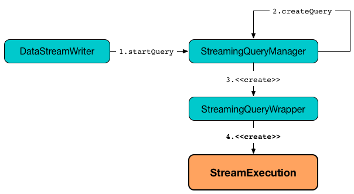
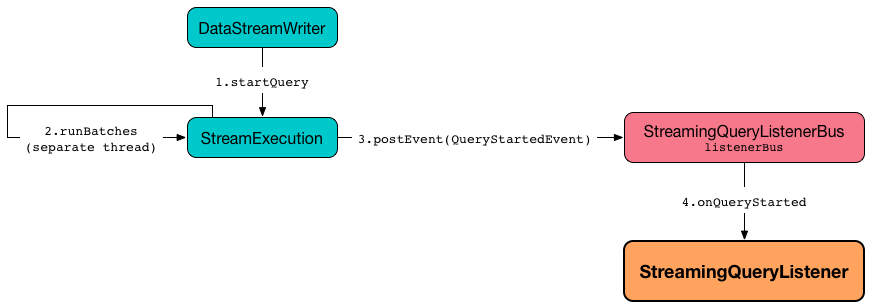
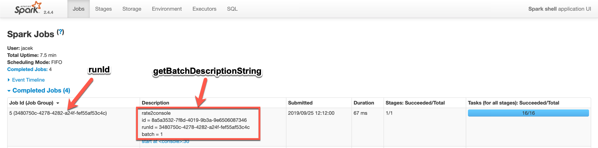

# StreamExecution

`StreamExecution` is an [abstraction](#contract) of [stream execution engines](#implementations) (_streaming query processing engines_) that can [run](#runStream) a [structured query](#logicalPlan) (on a [stream execution thread](#queryExecutionThread)).



!!! note
    **Continuous query**, **streaming query**, **continuous Dataset**, **streaming Dataset** are all considered high-level synonyms for an executable entity that stream execution engines run using the [analyzed logical plan](#logicalPlan) internally.

!!! important
    `StreamExecution` does not support adaptive query execution and cost-based optimizer (and turns them off when requested to [run stream processing](#runStream)).

`StreamExecution` is the **execution environment** of a [streaming query](StreamingQuery.md) that is executed every [trigger](#trigger) and in the end [adds the results to a sink](#MicroBatchExecution.md#runBatch-addBatch).

`StreamExecution` corresponds to a [single streaming query](StreamingQuery.md) with one or more [streaming sources](Source.md) and exactly one [streaming sink](Sink.md).

```text
import org.apache.spark.sql.streaming.Trigger
import scala.concurrent.duration._
val q = spark.
  readStream.
  format("rate").
  load.
  writeStream.
  format("console").
  trigger(Trigger.ProcessingTime(10.minutes)).
  start
scala> :type q
org.apache.spark.sql.streaming.StreamingQuery

// Pull out StreamExecution off StreamingQueryWrapper
import org.apache.spark.sql.execution.streaming.{StreamExecution, StreamingQueryWrapper}
val se = q.asInstanceOf[StreamingQueryWrapper].streamingQuery
scala> :type se
org.apache.spark.sql.execution.streaming.StreamExecution
```

## Contract

### <span id="logicalPlan"> Logical Plan

```scala
logicalPlan: LogicalPlan
```

Analyzed logical plan of the streaming query to [execute](#runActivatedStream)

Used when `StreamExecution` is requested to [run stream processing](#runStream)

`logicalPlan` is part of the [ProgressReporter](monitoring/ProgressReporter.md#logicalPlan) abstraction.

### <span id="runActivatedStream"> Running Activated Streaming Query

```scala
runActivatedStream(
  sparkSessionForStream: SparkSession): Unit
```

Executes (_runs_) the activated [streaming query](StreamingQuery.md) (that is described by the [logical plan](#logicalPlan))

Used when `StreamExecution` is requested to [run the streaming query](#runStream) (when transitioning from `INITIALIZING` to `ACTIVE` state)

## Implementations

* [ContinuousExecution](ContinuousExecution.md)
* [MicroBatchExecution](MicroBatchExecution.md)

## Creating Instance

`StreamExecution` takes the following to be created:

* <span id="sparkSession"> `SparkSession`
* <span id="name"> [Name](monitoring/ProgressReporter.md#name) of the streaming query (can be `null`)
* <span id="checkpointRoot"> Path of the checkpoint directory (_metadata directory_)
* <span id="analyzedPlan"> Streaming query (not used due to [logicalPlan](#logicalPlan))
* <span id="sink"> `Table` ([Spark SQL]({{ book.spark_sql }}/connector/catalog/Table/))
* <span id="trigger"> [Trigger](Trigger.md)
* <span id="triggerClock"> `Clock`
* <span id="outputMode"> [OutputMode](OutputMode.md)
* <span id="deleteCheckpointOnStop"> `deleteCheckpointOnStop` flag (whether to delete the checkpoint directory on stop)

??? note "Abstract Class"
    `StreamExecution` is an abstract class and cannot be created directly. It is created indirectly for the [concrete StreamExecutions](#implementations).

## Demo

```text
import org.apache.spark.sql.streaming.StreamingQuery
assert(sq.isInstanceOf[StreamingQuery])

import org.apache.spark.sql.execution.streaming.StreamingQueryWrapper
val se = sq.asInstanceOf[StreamingQueryWrapper].streamingQuery

scala> :type se
org.apache.spark.sql.execution.streaming.StreamExecution
```

## Configuration Properties

### <span id="minLogEntriesToMaintain"><span id="spark.sql.streaming.minBatchesToRetain"> s.s.s.minBatchesToRetain

`StreamExecution` uses the [spark.sql.streaming.minBatchesToRetain](configuration-properties.md#spark.sql.streaming.minBatchesToRetain) configuration property to allow the [StreamExecutions](#implementations) to discard old log entries (from the [offset](#offsetLog) and [commit](#commitLog) logs).

### <span id="pollingDelayMs"><span id="streamingPollingDelay"><span id="spark.sql.streaming.pollingDelay"> s.s.s.pollingDelay

`StreamExecution` uses [spark.sql.streaming.pollingDelay](configuration-properties.md#spark.sql.streaming.pollingDelay) configuration property to control how long to [delay polling for new data](#runBatches-batchRunner-no-data) (when no data was available to process in a batch).

## ProgressReporter

`StreamExecution` is a [ProgressReporter](monitoring/ProgressReporter.md) and [reports status of the streaming query](#postEvent) (when it starts, progresses and terminates) by posting `StreamingQueryListener` events.

```text
import org.apache.spark.sql.streaming.Trigger
import scala.concurrent.duration._
val sq = spark
  .readStream
  .text("server-logs")
  .writeStream
  .format("console")
  .queryName("debug")
  .trigger(Trigger.ProcessingTime(20.seconds))
  .start

// Enable the log level to see the INFO and DEBUG messages
// log4j.logger.org.apache.spark.sql.execution.streaming.StreamExecution=DEBUG

17/06/18 21:21:07 INFO StreamExecution: Starting new streaming query.
17/06/18 21:21:07 DEBUG StreamExecution: getOffset took 5 ms
17/06/18 21:21:07 DEBUG StreamExecution: Stream running from {} to {}
17/06/18 21:21:07 DEBUG StreamExecution: triggerExecution took 9 ms
17/06/18 21:21:07 DEBUG StreamExecution: Execution stats: ExecutionStats(Map(),List(),Map())
17/06/18 21:21:07 INFO StreamExecution: Streaming query made progress: {
  "id" : "8b57b0bd-fc4a-42eb-81a3-777d7ba5e370",
  "runId" : "920b227e-6d02-4a03-a271-c62120258cea",
  "name" : "debug",
  "timestamp" : "2017-06-18T19:21:07.693Z",
  "numInputRows" : 0,
  "processedRowsPerSecond" : 0.0,
  "durationMs" : {
    "getOffset" : 5,
    "triggerExecution" : 9
  },
  "stateOperators" : [ ],
  "sources" : [ {
    "description" : "FileStreamSource[file:/Users/jacek/dev/oss/spark/server-logs]",
    "startOffset" : null,
    "endOffset" : null,
    "numInputRows" : 0,
    "processedRowsPerSecond" : 0.0
  } ],
  "sink" : {
    "description" : "org.apache.spark.sql.execution.streaming.ConsoleSink@2460208a"
  }
}
17/06/18 21:21:10 DEBUG StreamExecution: Starting Trigger Calculation
17/06/18 21:21:10 DEBUG StreamExecution: getOffset took 3 ms
17/06/18 21:21:10 DEBUG StreamExecution: triggerExecution took 3 ms
17/06/18 21:21:10 DEBUG StreamExecution: Execution stats: ExecutionStats(Map(),List(),Map())
```

## <span id="uniqueSources"> Unique Streaming Sources

`StreamExecution` tracks unique streaming data sources in `uniqueSources` internal registry.


Used when `StreamExecution`:

* [Constructs the next streaming micro-batch](#constructNextBatch) (and gets new offsets for every streaming data source)
* [Stops all streaming data sources](#stopSources)

## Streaming Query Identifiers

The [name](#name), [id](#id) and [runId](#runId) are all unique across all active queries (in a [StreamingQueryManager](StreamingQueryManager.md)). The difference is that:

* [name](#name) is optional and user-defined

* [id](#id) is a UUID that is auto-generated at the time `StreamExecution` is created and persisted to `metadata` checkpoint file

* [runId](#runId) is a UUID that is auto-generated every time `StreamExecution` is created

### <span id="id"> Id

`StreamExecution` is uniquely identified by an **ID of the streaming query** (which is the `id` of the [StreamMetadata](#streamMetadata)).

Since the [StreamMetadata](#streamMetadata) is persisted (to the `metadata` file in the [checkpoint directory](#checkpointFile)), the streaming query ID "survives" query restarts as long as the checkpoint directory is preserved.

### <span id="runId"> Run Id

`StreamExecution` is uniquely identified by a **run ID of the streaming query**. A run ID is a randomly-generated 128-bit universally unique identifier (UUID) that is assigned at the time `StreamExecution` is created.

`runId` does not "survive" query restarts and will always be different yet unique (across all active queries).

## <span id="streamMetadata"> StreamMetadata

`StreamExecution` uses a [StreamMetadata](StreamMetadata.md) that is [persisted](StreamMetadata.md#write) in the `metadata` file in the [checkpoint directory](#checkpointFile).

If the `metadata` file is available it is [read](StreamMetadata.md#read) and is the way to recover the [id](#id) of a streaming query when resumed (i.e. restarted after a failure or a planned stop).

## Metadata Logs

### <span id="offsetLog"> Write-Ahead Offset Log

```scala
offsetLog: OffsetSeqLog
```

`offsetLog` is a [Hadoop DFS-based metadata storage](OffsetSeqLog.md) (of [OffsetSeq](OffsetSeq.md)s) with `offsets` [metadata directory](#checkpointFile).

`offsetLog` is used as a **Write-Ahead Log of Offsets** to [persist offsets](HDFSMetadataLog.md#add) of the data about to be processed in every trigger.

!!! tip
    Monitor `offsets` and `commits` metadata logs to know the progress of a streaming query.

The number of entries in the `OffsetSeqLog` is controlled using [spark.sql.streaming.minBatchesToRetain](configuration-properties.md#spark.sql.streaming.minBatchesToRetain) configuration property.

`offsetLog` is used when:

* `ContinuousExecution` stream execution engine is requested to [commit an epoch](ContinuousExecution.md#commit), [getStartOffsets](ContinuousExecution.md#getStartOffsets), and [addOffset](ContinuousExecution.md#addOffset)

* `MicroBatchExecution` stream execution engine is requested to [populate start offsets](MicroBatchExecution.md#populateStartOffsets) and [construct (or skip) the next streaming micro-batch](MicroBatchExecution.md#constructNextBatch)

### <span id="commitLog"> Offset Commit Log

`StreamExecution` uses **offset commit log** ([CommitLog](CommitLog.md) with `commits` [metadata checkpoint directory](#checkpointFile)) for streaming batches successfully executed (with a single file per batch with a file name being the batch id) or committed epochs.

!!! note
    **Metadata log** or **metadata checkpoint** are synonyms and are often used interchangeably.

`commitLog` is used by the <<extensions, stream execution engines>> for the following:

* `MicroBatchExecution` is requested to <<MicroBatchExecution.md#runActivatedStream, run an activated streaming query>> (that in turn requests to <<MicroBatchExecution.md#populateStartOffsets, populate the start offsets>> at the very beginning of the streaming query execution and later regularly every <<MicroBatchExecution.md#runBatch, single batch>>)

* `ContinuousExecution` is requested to <<ContinuousExecution.md#runActivatedStream, run an activated streaming query in continuous mode>> (that in turn requests to <<ContinuousExecution.md#getStartOffsets, retrieve the start offsets>> at the very beginning of the streaming query execution and later regularly every <<ContinuousExecution.md#commit, commit>>)

## <span id="state"> State of Streaming Query

```scala
state: AtomicReference[State]
```

`state` indicates the internal state of execution of the streaming query (as [java.util.concurrent.atomic.AtomicReference]({{ java.api }}/java/util/concurrent/atomic/AtomicReference.html)).

### <span id="ACTIVE"> ACTIVE

`StreamExecution` has been requested to <<runStream, run stream processing>> (and is about to <<runActivatedStream, run the activated streaming query>>)

### <span id="INITIALIZING"> INITIALIZING

`StreamExecution` has been [created](#creating-instance).

### <span id="TERMINATED"> TERMINATED

Indicates that:

* `MicroBatchExecution` has been requested to [stop](MicroBatchExecution.md#stop)
* `ContinuousExecution` has been requested to [stop](#ContinuousExecution.md#stop)
* `StreamExecution` has been requested to [run stream processing](runStream) (and has finished [running the activated streaming query](#runActivatedStream))

### <span id="RECONFIGURING"> RECONFIGURING

Used when `ContinuousExecution` is requested to [run a streaming query in continuous mode](ContinuousExecution.md#runContinuous) (and the [ContinuousReader](spark-sql-streaming-ContinuousReader.md) indicated a [need for reconfiguration](spark-sql-streaming-ContinuousReader.md#needsReconfiguration))

## <span id="createStreamingWrite"> Creating StreamingWrite

```scala
createStreamingWrite(
  table: SupportsWrite,
  options: Map[String, String],
  inputPlan: LogicalPlan): StreamingWrite
```

`createStreamingWrite` creates a `LogicalWriteInfoImpl` (with the [query ID](#id), the schema of the input `LogicalPlan` and the given options).

`createStreamingWrite` requests the given `SupportsWrite` table for a `WriteBuilder` (for the `LogicalWriteInfoImpl`).

!!! tip
    Learn more about [SupportsWrite]({{ book.spark_sql }}/connector/SupportsWrite/) and [WriteBuilder]({{ book.spark_sql }}/connector/WriteBuilder/) in [The Internals of Spark SQL]({{ book.spark_sql }}) online book.

`createStreamingWrite` branches based on the [OutputMode](#outputMode):

* For [Append](OutputMode.md#Append) output mode, `createStreamingWrite` requests the `WriteBuilder` to build a `StreamingWrite`.

* For [Complete](OutputMode.md#Complete) output mode, `createStreamingWrite` assumes that the `WriteBuilder` is a `SupportsTruncate` and requests it to `truncate` followed by `buildForStreaming`

* For [Update](OutputMode.md#Update) output mode, `createStreamingWrite` assumes that the `WriteBuilder` is a `SupportsStreamingUpdate` and requests it to `update` followed by `buildForStreaming`

!!! tip
    Learn more about [SupportsTruncate]({{ book.spark_sql }}/connector/SupportsTruncate/) and [SupportsStreamingUpdate]({{ book.spark_sql }}/connector/SupportsStreamingUpdate/) in [The Internals of Spark SQL]({{ book.spark_sql }}) online book.

`createStreamingWrite` is used when [MicroBatchExecution](MicroBatchExecution.md#logicalPlan) and [ContinuousExecution](ContinuousExecution.md#logicalPlan) stream execution engines are requested for analyzed logical plans.

## <span id="availableOffsets"> Available Offsets (StreamProgress)

```scala
availableOffsets: StreamProgress
```

`availableOffsets` is a [registry of offsets per streaming source](StreamProgress.md) to track what data (by [offset](Offset.md)) is available for processing for every [streaming source](monitoring/ProgressReporter.md#sources) in the [streaming query](#analyzedPlan) (and have not yet been [committed](#committedOffsets)).

`availableOffsets` works in tandem with the [committedOffsets](#committedOffsets) internal registry.

`availableOffsets` is [empty](StreamProgress.md#creating-instance) when `StreamExecution` is [created](#creating-instance) (i.e. no offsets are reported for any streaming source in the streaming query).

`availableOffsets` is used when:

* `MicroBatchExecution` stream execution engine is requested to <<MicroBatchExecution.md#populateStartOffsets, resume and fetch the start offsets from checkpoint>>, <<MicroBatchExecution.md#isNewDataAvailable, check whether new data is available>>, <<MicroBatchExecution.md#constructNextBatch, construct the next streaming micro-batch>> and <<MicroBatchExecution.md#runBatch, run a single streaming micro-batch>>

* `ContinuousExecution` stream execution engine is requested to [commit an epoch](ContinuousExecution.md#commit)

* `StreamExecution` is requested for the [internal string representation](#toDebugString)

## <span id="committedOffsets"> Committed Offsets (StreamProgress)

```scala
committedOffsets: StreamProgress
```

`committedOffsets` is a [registry of offsets per streaming source](StreamProgress.md) to track what data (by [offset](Offset.md)) has already been processed and committed (to the sink or state stores) for every [streaming source](monitoring/ProgressReporter.md#sources) in the [streaming query](#analyzedPlan).

`committedOffsets` works in tandem with the [availableOffsets](#availableOffsets) internal registry.

`committedOffsets` is used when:

* `MicroBatchExecution` stream execution engine is requested for the <<MicroBatchExecution.md#populateStartOffsets, start offsets (from checkpoint)>>, to <<MicroBatchExecution.md#isNewDataAvailable, check whether new data is available>> and <<MicroBatchExecution.md#runBatch, run a single streaming micro-batch>>
* `ContinuousExecution` stream execution engine is requested for the <<ContinuousExecution.md#getStartOffsets, start offsets (from checkpoint)>> and to <<ContinuousExecution.md#commit, commit an epoch>>
* `StreamExecution` is requested for the [internal string representation](#toDebugString)

## <span id="resolvedCheckpointRoot"> Fully-Qualified (Resolved) Path to Checkpoint Root Directory

```scala
resolvedCheckpointRoot: String
```

`resolvedCheckpointRoot` is a fully-qualified path of the given [checkpoint root directory](#checkpointRoot).

The given [checkpoint root directory](#checkpointRoot) is defined using **checkpointLocation** option or the [spark.sql.streaming.checkpointLocation](configuration-properties.md#spark.sql.streaming.checkpointLocation) configuration property with `queryName` option.

`checkpointLocation` and `queryName` options are defined when `StreamingQueryManager` is requested to [create a streaming query](StreamingQueryManager.md#createQuery).

`resolvedCheckpointRoot` is used when [creating the path to the checkpoint directory](#checkpointFile) and when `StreamExecution` finishes [running streaming batches](#runBatches).

`resolvedCheckpointRoot` is used for the [logicalPlan](#logicalPlan) (while transforming [analyzedPlan](#analyzedPlan) and planning `StreamingRelation` logical operators to corresponding `StreamingExecutionRelation` physical operators with the streaming data sources created passing in the path to `sources` directory to store checkpointing metadata).

`resolvedCheckpointRoot` is printed out immediately when resolved as a INFO message to the logs:

```text
Checkpoint root [checkpointRoot] resolved to [resolvedCheckpointRoot].
```

`resolvedCheckpointRoot` is printed out again as a INFO message to the logs when `StreamExecution` is [started](#start):

```text
Starting [prettyIdString]. Use [resolvedCheckpointRoot] to store the query checkpoint.
```

## <span id="sinkCommitProgress"> StreamWriterCommitProgress

```scala
sinkCommitProgress: Option[StreamWriterCommitProgress]
```

`sinkCommitProgress` is part of the [ProgressReporter](monitoring/ProgressReporter.md#sinkCommitProgress) abstraction.

`StreamExecution` initializes `sinkCommitProgress` registry to be `None` when [created](#creating-instance).

## <span id="lastExecution"> Last Query Execution Of Streaming Query (IncrementalExecution)

```scala
lastExecution: IncrementalExecution
```

`lastExecution` is part of the [ProgressReporter](monitoring/ProgressReporter.md#lastExecution) abstraction.

`lastExecution` is a [IncrementalExecution](IncrementalExecution.md) (a `QueryExecution` of a streaming query) of the most recent (_last_) execution.

`lastExecution` is created when the <<extensions, stream execution engines>> are requested for the following:

* `MicroBatchExecution` is requested to <<MicroBatchExecution.md#runBatch, run a single streaming micro-batch>> (when in <<MicroBatchExecution.md#runBatch-queryPlanning, queryPlanning Phase>>)

* `ContinuousExecution` stream execution engine is requested to <<ContinuousExecution.md#runContinuous, run a streaming query>> (when in <<ContinuousExecution.md#runContinuous-queryPlanning, queryPlanning Phase>>)

`lastExecution` is used when:

* `StreamExecution` is requested to <<explain, explain a streaming query>> (via <<explainInternal, explainInternal>>)

* `ProgressReporter` is requested to [extractStateOperatorMetrics](monitoring/ProgressReporter.md#extractStateOperatorMetrics), [extractExecutionStats](monitoring/ProgressReporter.md#extractExecutionStats), and [extractSourceToNumInputRows](monitoring/ProgressReporter.md#extractSourceToNumInputRows)

* `MicroBatchExecution` stream execution engine is requested to <<MicroBatchExecution.md#constructNextBatch-shouldConstructNextBatch, construct or skip the next streaming micro-batch>> (based on [StateStoreWriters in a streaming query](IncrementalExecution.md#shouldRunAnotherBatch)), <<MicroBatchExecution.md#runBatch, run a single streaming micro-batch>> (when in <<MicroBatchExecution.md#runBatch-addBatch, addBatch Phase>> and <<MicroBatchExecution.md#runBatch-updateWatermark-commitLog, updating watermark and committing offsets to offset commit log>>)

* `ContinuousExecution` stream execution engine is requested to <<ContinuousExecution.md#runContinuous, run a streaming query>> (when in <<ContinuousExecution.md#runContinuous-runContinuous, runContinuous Phase>>)

* For debugging query execution of streaming queries (using `debugCodegen`)

## <span id="explain"> Explaining Streaming Query

```scala
explain(): Unit // <1>
explain(extended: Boolean): Unit
```
<1> Turns the `extended` flag off (`false`)

`explain` simply prints out <<explainInternal, explainInternal>> to the standard output.

## <span id="stopSources"> Stopping Streaming Sources and Readers

```scala
stopSources(): Unit
```

`stopSources` requests every [streaming source](#uniqueSources) to stop.

In case of an non-fatal exception, `stopSources` prints out the following WARN message to the logs:

```text
Failed to stop streaming source: [source]. Resources may have leaked.
```

`stopSources` is used when:

* `StreamExecution` is requested to <<runStream, run stream processing>> (and <<runStream-finally, terminates>> successfully or not)

* `ContinuousExecution` is requested to <<ContinuousExecution.md#runContinuous, run the streaming query in continuous mode>> (and terminates)

## <span id="runStream"> Running Stream Processing

```scala
runStream(): Unit
```

`runStream` simply prepares the environment to [execute the activated streaming query](#runActivatedStream).

`runStream` is used when the [stream execution thread](#queryExecutionThread) is requested to [start](#start) (when `DataStreamWriter` is requested to [start an execution of the streaming query](DataStreamWriter.md#start)).

Internally, `runStream` sets the job group (to all the Spark jobs started by this thread) as follows:

* [runId](#runId) for the job group ID

* [getBatchDescriptionString](#getBatchDescriptionString) for the job group description (to display in web UI)

* `interruptOnCancel` flag on

!!! note
    `runStream` uses the [SparkSession](#sparkSession) to access `SparkContext` and assign the job group id.

    Learn more about [SparkContext.setJobGroup]({{ book.spark_core }}/SparkContext#setJobGroup) method in [The Internals of Apache Spark]({{ book.spark_core }}) online book.

`runStream` sets `sql.streaming.queryId` local property to [id](#id).

`runStream` requests the `MetricsSystem` to register the [MetricsReporter](#streamMetrics) when [spark.sql.streaming.metricsEnabled](configuration-properties.md#spark.sql.streaming.metricsEnabled) configuration property is enabled.

<span id="runStream-QueryStartedEvent"/>
`runStream` notifies [StreamingQueryListeners](monitoring/StreamingQueryListener.md) that the streaming query has been started (by [posting](#postEvent) a new [QueryStartedEvent](monitoring/StreamingQueryListener.md#QueryStartedEvent) event with [id](#id), [runId](#runId), and [name](#name)).



`runStream` unblocks the [main starting thread](#start) (by decrementing the count of the [startLatch](#startLatch) that when `0` lets the starting thread continue).

`runStream` [updates the status message](monitoring/ProgressReporter.md#updateStatusMessage) to be **Initializing sources**.

<span id="runStream-initializing-sources"/>
`runStream` initializes the [analyzed logical plan](#logicalPlan).

??? note "Lazy Value"
    The [analyzed logical plan](#logicalPlan) is a Scala **lazy value** to guarantee that the code to initialize it is executed once only (when accessed for the first time) and cached afterwards.

`runStream` disables **adaptive query execution** and **cost-based join optimization** (by turning `spark.sql.adaptive.enabled` and `spark.sql.cbo.enabled` configuration properties off, respectively).

`runStream` creates a new "zero" [OffsetSeqMetadata](#offsetSeqMetadata).

(when in [INITIALIZING](#INITIALIZING) state) `runStream` enters [ACTIVE](#ACTIVE) state:

* Decrements the count of [initializationLatch](#initializationLatch)

* <span id="runStream-runActivatedStream"> [Executes the activated streaming query](#runActivatedStream)

!!! note
    `runBatches` does the main work only when first started (when in [INITIALIZING](#INITIALIZING) state).

<span id="runStream-stopped"/>
`runStream`...FIXME (describe the failed and stop states)

Once [TriggerExecutor](#triggerExecutor) has finished executing batches, `runBatches` [updates the status message](monitoring/ProgressReporter.md#updateStatusMessage) to **Stopped**.

NOTE: [TriggerExecutor](#triggerExecutor) finishes executing batches when the [batch runner](#runBatches-batch-runner) returns whether the streaming query is stopped or not (while [active](#isActive)).

### <span id="runStream-finally"> finally Block

`runStream` releases the [startLatch](#startLatch) and [initializationLatch](#initializationLatch) latches.

`runStream` [stopSources](#stopSources).

`runStream` enters [TERMINATED](#TERMINATED) state.

`runStream` sets the [StreamingQueryStatus](monitoring/ProgressReporter.md#currentStatus) with the `isTriggerActive` and `isDataAvailable` flags off (`false`).

`runStream` removes the [stream metrics reporter](#streamMetrics) from the application's `MetricsSystem`.

`runStream` requests the `StreamingQueryManager` to [handle termination of a streaming query](StreamingQueryManager.md#notifyQueryTermination).

`runStream` creates a new [QueryTerminatedEvent](monitoring/StreamingQueryListener.md#QueryTerminatedEvent) (with the [id](#id) and [run id](#runId) of the streaming query) and [posts it](#postEvent).

<span id="runStream-finally-deleteCheckpointOnStop"/>
With the [deleteCheckpointOnStop](#deleteCheckpointOnStop) flag enabled and no `StreamingQueryException`, `runStream` deletes the [checkpoint directory](#resolvedCheckpointRoot).

In the end, `runStream` releases the [terminationLatch](#terminationLatch) latch.

### <span id="runBatches-batch-runner"> TriggerExecutor's Batch Runner

**Batch Runner** (`batchRunner`) is an executable block executed by [TriggerExecutor](#triggerExecutor) in [runBatches](#runBatches).

`batchRunner` [starts trigger calculation](#startTrigger).

As long as the query is not stopped (i.e. [state](#state) is not [TERMINATED](#terminated)), `batchRunner` executes the streaming batch for the trigger.

In **triggerExecution** [time-tracking section](monitoring/ProgressReporter.md#reportTimeTaken), `runBatches` branches off per [currentBatchId](#currentBatchId):

* For `currentBatchId < 0`:

    1. [populateStartOffsets](#populateStartOffsets)
    1. Setting Job Description as [getBatchDescriptionString](#getBatchDescriptionString)

    ```text
    Stream running from [committedOffsets] to [availableOffsets]
    ```

* For `currentBatchId >= 0`:

    1. [Constructing the next streaming micro-batch](#constructNextBatch)

If there is [data available](#dataAvailable) in the sources, `batchRunner` marks [currentStatus](#currentStatus) with `isDataAvailable` enabled.

!!! tip
    You can check out the status of a [streaming query](StreamingQuery.md) using [status](StreamingQuery.md#status) method.

    ```text
    scala> spark.streams.active(0).status
    res1: org.apache.spark.sql.streaming.StreamingQueryStatus =
    {
      "message" : "Waiting for next trigger",
      "isDataAvailable" : false,
      "isTriggerActive" : false
    }
    ```

`batchRunner` then [updates the status message](monitoring/ProgressReporter.md#updateStatusMessage) to **Processing new data** and [runs the current streaming batch](#runBatch).


<span id="runBatches-batch-runner-finishTrigger"/>
After **triggerExecution** section has finished, `batchRunner` [finishes the streaming batch for the trigger](monitoring/ProgressReporter.md#finishTrigger) (and collects query execution statistics).

When there was <<dataAvailable, data available>> in the sources, `batchRunner` updates committed offsets (by [adding](CommitLog.md#add) the <<currentBatchId, current batch id>> to [BatchCommitLog](#batchCommitLog) and adding [availableOffsets](#availableOffsets) to [committedOffsets](#committedOffsets)).

`batchRunner` prints out the following DEBUG message to the logs:

```text
batch [currentBatchId] committed
```

`batchRunner` increments the [current batch id](#currentBatchId) and sets the job description for all the following Spark jobs to [include the new batch id](#getBatchDescriptionString).

<span id="runBatches-batchRunner-no-data"/>
When no [data was available](#dataAvailable) in the sources to process, `batchRunner` does the following:

1. Marks [currentStatus](#currentStatus) with `isDataAvailable` disabled

1. [Updates the status message](monitoring/ProgressReporter.md#updateStatusMessage) to **Waiting for data to arrive**

1. Sleeps the current thread for [pollingDelayMs](#pollingDelayMs) milliseconds.

`batchRunner` [updates the status message](monitoring/ProgressReporter.md#updateStatusMessage) to **Waiting for next trigger** and returns whether the query is currently active or not (so [TriggerExecutor](#triggerExecutor) can decide whether to finish executing the batches or not)

## <span id="start"> Starting Streaming Query (on Stream Execution Thread)

```scala
start(): Unit
```

`start` starts a [stream execution thread](#queryExecutionThread) that simply [runs stream processing](#runStream) (and hence the streaming query).


`start` prints out the following INFO message to the logs:

```text
Starting [prettyIdString]. Use [resolvedCheckpointRoot] to store the query checkpoint.
```

`start` then starts the <<queryExecutionThread, stream execution thread>> (as a daemon thread).

NOTE: `start` uses Java's ++https://docs.oracle.com/javase/8/docs/api/java/lang/Thread.html#start--++[java.lang.Thread.start] to run the streaming query on a separate execution thread.

NOTE: When started, a streaming query runs in its own execution thread on JVM.

In the end, `start` pauses the main thread (using the <<startLatch, startLatch>> until `StreamExecution` is requested to <<runStream, run the streaming query>> that in turn sends a [QueryStartedEvent](monitoring/StreamingQueryListener.md#QueryStartedEvent) to all streaming listeners followed by decrementing the count of the <<startLatch, startLatch>>).

`start` is used when `StreamingQueryManager` is requested to [start a streaming query](StreamingQueryManager.md#startQuery) (when `DataStreamWriter` is requested to [start an execution of the streaming query](DataStreamWriter.md#start)).

## <span id="checkpointFile"> Path to Checkpoint Directory

```scala
checkpointFile(
  name: String): String
```

`checkpointFile` gives the path of a directory with `name` in [checkpoint directory](#resolvedCheckpointRoot).

`checkpointFile` is used for [streamMetadata](#streamMetadata), [OffsetSeqLog](#offsetLog), [BatchCommitLog](#batchCommitLog), and [lastExecution](#lastExecution) (for [runBatch](#runBatch)).

## <span id="postEvent"> Posting StreamingQueryListener Event

```scala
postEvent(
  event: StreamingQueryListener.Event): Unit
```

`postEvent` is a part of the [ProgressReporter](monitoring/ProgressReporter.md#postEvent) abstraction.

`postEvent` simply requests the `StreamingQueryManager` to [post](StreamingQueryManager.md#postListenerEvent) the input event (to the [StreamingQueryListenerBus](StreamingQueryListenerBus.md) in the current `SparkSession`).

!!! note
    `postEvent` uses `SparkSession` to access the current `StreamingQueryManager`.

`postEvent` is used when:

* `ProgressReporter` is requested to [report update progress](monitoring/ProgressReporter.md#updateProgress) (while [finishing a trigger](monitoring/ProgressReporter.md#finishTrigger))

* `StreamExecution` [runs streaming batches](#runBatches) (and announces starting a streaming query by posting a [QueryStartedEvent](monitoring/StreamingQueryListener.md#QueryStartedEvent) and query termination by posting a [QueryTerminatedEvent](monitoring/StreamingQueryListener.md#QueryTerminatedEvent))

## <span id="processAllAvailable"> Waiting Until No New Data Available in Sources or Query Has Been Terminated

```scala
processAllAvailable(): Unit
```

`processAllAvailable` is a part of the [StreamingQuery](StreamingQuery.md#processAllAvailable) abstraction.

`processAllAvailable` reports the <<streamDeathCause, StreamingQueryException>> if reported (and returns immediately).

NOTE: <<streamDeathCause, streamDeathCause>> is reported exclusively when `StreamExecution` is requested to <<runStream, run stream execution>> (that terminated with an exception).

`processAllAvailable` returns immediately when `StreamExecution` is no longer <<isActive, active>> (in `TERMINATED` state).

`processAllAvailable` acquires a lock on the <<awaitProgressLock, awaitProgressLock>> and turns the <<noNewData, noNewData>> internal flag off (`false`).

`processAllAvailable` keeps polling with 10-second pauses (locked on <<awaitProgressLockCondition, awaitProgressLockCondition>>) until <<noNewData, noNewData>> flag is turned on (`true`) or `StreamExecution` is no longer <<isActive, active>> (in `TERMINATED` state).

NOTE: The 10-second pause is hardcoded and cannot be changed.

In the end, `processAllAvailable` releases <<awaitProgressLock, awaitProgressLock>> lock.

`processAllAvailable` throws an `IllegalStateException` when executed on the <<queryExecutionThread, stream execution thread>>:

```text
Cannot wait for a query state from the same thread that is running the query
```

## <span id="queryExecutionThread"> Stream Execution Thread

```scala
queryExecutionThread: QueryExecutionThread
```

`queryExecutionThread` is a Java thread of execution ([java.util.Thread]({{ java.api }}/java/lang/Thread.html)) that [runs a streaming query](#runStream).

`queryExecutionThread` is started (as a daemon thread) when `StreamExecution` is requested to <<start, start>>. At that time, `start` prints out the following INFO message to the logs (with the <<prettyIdString, prettyIdString>> and the <<resolvedCheckpointRoot, resolvedCheckpointRoot>>):

```text
Starting [prettyIdString]. Use [resolvedCheckpointRoot] to store the query checkpoint.
```

When started, `queryExecutionThread` sets the <<callSite, call site>> and <<runStream, runs the streaming query>>.

`queryExecutionThread` uses the name *stream execution thread for [id]* (that uses <<prettyIdString, prettyIdString>> for the id, i.e. `queryName [id = [id], runId = [runId]]`).

`queryExecutionThread` is a `QueryExecutionThread` that is a custom `UninterruptibleThread` from Apache Spark with `runUninterruptibly` method for running a block of code without being interrupted by `Thread.interrupt()`.

!!! tip
    Use Java's [jconsole]({{ java.docs }}/technotes/guides/management/jconsole.html) or [jstack]({{ java.docs }}/technotes/tools/unix/jstack.html) to monitor stream execution threads.

    ```
    $ jstack <driver-pid> | grep -e "stream execution thread"
    "stream execution thread for kafka-topic1 [id =...
    ```

## <span id="offsetSeqMetadata"> Current Batch Metadata (Event-Time Watermark and Timestamp)

```scala
offsetSeqMetadata: OffsetSeqMetadata
```

`offsetSeqMetadata` is a [OffsetSeqMetadata](OffsetSeqMetadata.md).

`offsetSeqMetadata` is used to create an [IncrementalExecution](IncrementalExecution.md) in the **queryPlanning** phase of the [MicroBatchExecution](MicroBatchExecution.md#runBatch-queryPlanning) and [ContinuousExecution](ContinuousExecution.md#runContinuous-queryPlanning) execution engines.

`offsetSeqMetadata` is initialized (with `0` for `batchWatermarkMs` and `batchTimestampMs`) when `StreamExecution` is requested to <<runStream, run stream processing>>.

`offsetSeqMetadata` is then updated (with the current event-time watermark and timestamp) when `MicroBatchExecution` is requested to <<MicroBatchExecution.md#constructNextBatch, construct the next streaming micro-batch>>.

NOTE: `MicroBatchExecution` uses the <<MicroBatchExecution.md#watermarkTracker, WatermarkTracker>> for the current event-time watermark and the <<MicroBatchExecution.md#triggerClock, trigger clock>> for the current batch timestamp.

`offsetSeqMetadata` is stored (_checkpointed_) in <<MicroBatchExecution.md#constructNextBatch-walCommit, walCommit phase>> of `MicroBatchExecution` (and printed out as INFO message to the logs).

`offsetSeqMetadata` is restored (_re-created_) from a checkpointed state when `MicroBatchExecution` is requested to <<MicroBatchExecution.md#populateStartOffsets, populate start offsets>>.

`offsetSeqMetadata` is part of the [ProgressReporter](monitoring/ProgressReporter.md#offsetSeqMetadata) abstraction.

## <span id="isActive"> isActive

```scala
isActive: Boolean
```

`isActive` is part of the [StreamingQuery](StreamingQuery.md#isActive) abstraction.

`isActive` is enabled (`true`) as long as the [State](#state) is not [TERMINATED](#TERMINATED).

## <span id="getBatchDescriptionString"> Human-Readable HTML Description of Spark Jobs (for web UI)

```scala
getBatchDescriptionString: String
```

`getBatchDescriptionString` is a human-readable description (in HTML format) that uses the optional [name](#name) if defined, the <<id, id>>, the <<runId, runId>> and `batchDescription` that can be **init** (for the <<currentBatchId, current batch ID>> negative) or the [current batch ID](#currentBatchId) itself.

`getBatchDescriptionString` is of the following format:

```text
[name]
id = [id]
runId = [runId]
batch = [batchDescription]
```



`getBatchDescriptionString` is used when:

* `MicroBatchExecution` stream execution engine is requested to <<MicroBatchExecution.md#runActivatedStream, run an activated streaming query>> (as the job description of any Spark jobs triggerred as part of query execution)

* `StreamExecution` is requested to <<runStream, run stream processing>> (as the job group description of any Spark jobs triggerred as part of query execution)

## <span id="noNewData"> No New Data Available

```scala
noNewData: Boolean
```

`noNewData` is a flag that indicates that a batch has completed with no new data left and [processAllAvailable](#processAllAvailable) could stop waiting till all streaming data is processed.

Default: `false`

Turned on (`true`) when:

* `MicroBatchExecution` stream execution engine is requested to <<constructNextBatch, construct or skip the next streaming micro-batch>> (while <<MicroBatchExecution.md#constructNextBatch-shouldConstructNextBatch-disabled, skipping the next micro-batch>>)

* `ContinuousExecution` stream execution engine is requested to <<ContinuousExecution.md#addOffset, addOffset>>

Turned off (`false`) when:

* `MicroBatchExecution` stream execution engine is requested to <<constructNextBatch, construct or skip the next streaming micro-batch>> (right after the <<MicroBatchExecution.md#constructNextBatch-walCommit, walCommit>> phase)

* `StreamExecution` is requested to <<processAllAvailable, processAllAvailable>>

## <span id="currentBatchId"> Current Batch ID

* `-1` when `StreamExecution` is [created](#creating-instance)

* `0` when `StreamExecution` [populates start offsets](#populateStartOffsets) (and [OffsetSeqLog](#offsetLog) is empty, i.e. no offset files in `offsets` directory in checkpoint)

* Incremented when `StreamExecution` [runs streaming batches](#runBatches) and finishes a trigger that had [data available from sources](#dataAvailable) (right after [committing the batch](#batchCommitLog)).

## <span id="newData"> newData Registry

```scala
newData: Map[BaseStreamingSource, LogicalPlan]
```

Registry of the streaming sources (in the [logical query plan](#logicalPlan)) that have new data available in the current batch. The new data is a streaming `DataFrame`.

`newData` is part of the [ProgressReporter](monitoring/ProgressReporter.md#newData) abstraction.

Set when `StreamExecution` is requested to [requests unprocessed data from streaming sources](MicroBatchExecution.md#runBatch-getBatch) (while [running a single streaming batch](#runBatch))

Used when `StreamExecution` is requested to [transform the logical plan (of the streaming query) to include the Sources and the MicroBatchReaders with new data](MicroBatchExecution.md#runBatch-newBatchesPlan) (while [running a single streaming batch](#runBatch))

## <span id="streamMetrics"> Streaming Metrics

`StreamExecution` uses [MetricsReporter](monitoring/MetricsReporter.md) for reporting streaming metrics.

`MetricsReporter` is created with the following source name (with [name](#name) if defined or [id](#id)):

```text
spark.streaming.[name or id]
```

`MetricsReporter` is registered only when [spark.sql.streaming.metricsEnabled](configuration-properties.md#spark.sql.streaming.metricsEnabled) configuration property is enabled (when `StreamExecution` is requested to [runStream](#runStream)).

`MetricsReporter` is deactivated (_removed_) when a streaming query is stopped (when `StreamExecution` is requested to [runStream](#runStream)).

## Latches

`StreamExecution` uses [java.util.concurrent.CountDownLatch]({{ java.api }}/java/util/concurrent/CountDownLatch.html)es (with count `1`).

### <span id="initializationLatch"> initializationLatch

Counted down when requested to [runStream](#runStream):

* Changes state from [INITIALIZING](#INITIALIZING) to [ACTIVE](#ACTIVE) just before [runActivatedStream](#runActivatedStream)
* In [runStream's finally block](#runStream-finally)

Awaited for tests only (which seems to indicate that it is a test-only latch)

### <span id="startLatch"> startLatch

Counted down when requested to [runStream](#runStream):

* [Right after posting a QueryStartedEvent](#runStream-QueryStartedEvent)
* In [runStream's finally block](#runStream-finally)

Awaited when requested to [start](#start) (to pause the main thread until `StreamExecution` was requested to [run the streaming query](#runStream) on a separate thread)

### <span id="terminationLatch"> terminationLatch

Counted down at the end of [runStream](#runStream)

Awaited when requested to [awaitTermination](#awaitTermination) (that pauses the thread until the streaming query has finished successfully or not).

## Locks

### <span id="awaitProgressLock"> awaitProgressLock

`StreamExecution` uses a fair reentrant mutual exclusion [java.util.concurrent.locks.ReentrantLock]({{ java.api }}/java/util/concurrent/locks/ReentrantLock.html) (that favors granting access to the longest-waiting thread under contention)

## <span id="IS_CONTINUOUS_PROCESSING"> __is_continuous_processing Local Property

`StreamExecution` uses **__is_continuous_processing** local property (default: `false`) to differentiate between <<ContinuousExecution.md#, ContinuousExecution>> (`true`) and <<MicroBatchExecution.md#, MicroBatchExecution>> (`false`) which is used when `StateStoreRDD` is requested to [compute a partition](StateStoreRDD.md#compute) (and <<spark-sql-streaming-StateStore.md#get, finds a StateStore>> for a given version).

## Logging

Enable `ALL` logging level for `org.apache.spark.sql.execution.streaming.StreamExecution` logger to see what happens inside.

Add the following line to `conf/log4j.properties`:

```text
log4j.logger.org.apache.spark.sql.execution.streaming.StreamExecution=ALL
```

Refer to [Logging](spark-logging.md).
