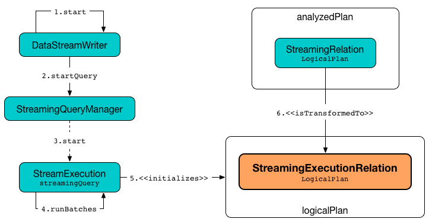

# StreamingExecutionRelation Leaf Logical Operator

`StreamingExecutionRelation` is a leaf logical operator (i.e. `LogicalPlan`) that represents a [streaming source](Source.md) in the logical query plan of a streaming `Dataset`.

The main use of `StreamingExecutionRelation` logical operator is to be a "placeholder" in a logical query plan that will be replaced with the real relation (with new data that has arrived since the last batch) or an empty `LocalRelation` when `StreamExecution` is requested to <<MicroBatchExecution.md#runBatch-newBatchesPlan, transforming logical plan to include the Sources and MicroBatchReaders with new data>>.

`StreamingExecutionRelation` is <<creating-instance, created>> for a spark-sql-streaming-StreamingRelation.md[StreamingRelation] in [analyzed logical query plan](StreamExecution.md#analyzedPlan) (that is the execution representation of a streaming Dataset).

!!! note
    Right after `StreamExecution` MicroBatchExecution.md#runStream-initializing-sources[has started running streaming batches] it initializes the streaming sources by transforming the analyzed logical plan of the streaming Dataset so that every spark-sql-streaming-StreamingRelation.md[StreamingRelation] logical operator is replaced by the corresponding `StreamingExecutionRelation`.

!!! note
    `StreamingExecutionRelation` is also resolved (_planned_) to a [StreamingRelationExec](physical-operators/StreamingRelationExec.md) physical operator in [StreamingRelationStrategy](StreamingRelationStrategy.md) execution planning strategy only when [explaining](operators/explain.md) a streaming `Dataset`.

=== [[creating-instance]] Creating StreamingExecutionRelation Instance

`StreamingExecutionRelation` takes the following when created:

* [[source]] [Streaming source](Source.md)
* [[output]] Output attributes

=== [[apply]] Creating StreamingExecutionRelation (based on a Source) -- `apply` Object Method

[source, scala]
----
apply(source: Source): StreamingExecutionRelation
----

`apply` creates a `StreamingExecutionRelation` for the input `source` and with the attributes of the [schema](Source.md#schema) of the `source`.

NOTE: `apply` _seems_ to be used for tests only.
