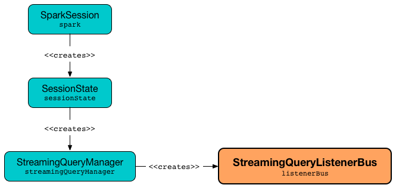

# StreamingQueryListenerBus &mdash; Event Bus for Streaming Events

`StreamingQueryListenerBus` is an event bus (`ListenerBus[StreamingQueryListener, StreamingQueryListener.Event]`) for <<post, dispatching streaming life-cycle events>> of <<activeQueryRunIds, active streaming queries>> (that eventually are delivered to <<spark-sql-streaming-StreamingQueryListener.md#, StreamingQueryListeners>>).

`StreamingQueryListenerBus` is created for [StreamingQueryManager](StreamingQueryManager.md#listenerBus) (once per `SparkSession`).



`StreamingQueryListenerBus` is also a `SparkListener` and registers itself with the <<sparkListenerBus, LiveListenerBus>> (of the `SparkSession`) to <<post, intercept QueryStartedEvents>>.

## Creating Instance

`StreamingQueryListenerBus` takes the following when created:

* [[sparkListenerBus]] `LiveListenerBus`

`StreamingQueryListenerBus` registers itself with the <<sparkListenerBus, LiveListenerBus>>.

=== [[activeQueryRunIds]] Run IDs of Active Streaming Queries

[source, scala]
----
activeQueryRunIds: HashSet[UUID]
----

`activeQueryRunIds` is an internal registry of <<StreamingQuery.md#runId, run IDs>> of active streaming queries in the `SparkSession`.

* A `runId` is added when `StreamingQueryListenerBus` is requested to <<post, post a QueryStartedEvent>>

* A `runId` is removed when `StreamingQueryListenerBus` is requested to <<postToAll, post a QueryTerminatedEvent>>

`activeQueryRunIds` is used internally to <<doPostEvent, dispatch a streaming event to a StreamingQueryListener>> (so the events gets sent out to streaming queries in the `SparkSession`).

=== [[post]] Posting Streaming Event to LiveListenerBus -- `post` Method

[source, scala]
----
post(event: StreamingQueryListener.Event): Unit
----

`post` simply posts the input `event` directly to the <<sparkListenerBus, LiveListenerBus>> unless it is a <<spark-sql-streaming-StreamingQueryListener.md#QueryStartedEvent, QueryStartedEvent>>.

For a <<spark-sql-streaming-StreamingQueryListener.md#QueryStartedEvent, QueryStartedEvent>>, `post` adds the `runId` (of the streaming query that has been started) to the <<activeQueryRunIds, activeQueryRunIds>> internal registry first, posts the event to the <<sparkListenerBus, LiveListenerBus>> and then <<postToAll, postToAll>>.

`post` is used when `StreamingQueryManager` is requested to [post a streaming event](StreamingQueryManager.md#postListenerEvent).

## <span id="doPostEvent"> Posting Streaming Event to StreamingQueryListeners

```scala
doPostEvent(
  listener: StreamingQueryListener,
  event: StreamingQueryListener.Event): Unit
```

`doPostEvent` is part of the `ListenerBus` abstraction ([Spark Core](https://books.japila.pl/apache-spark-internals/apache-spark-internals/spark-SparkListenerBus.html#ListenerBus)).

`doPostEvent` branches per the type of <<spark-sql-streaming-StreamingQueryListener.md#events, StreamingQueryListener.Event>>:

* For a <<spark-sql-streaming-StreamingQueryListener.md#QueryStartedEvent, QueryStartedEvent>>, requests the <<spark-sql-streaming-StreamingQueryListener.md#, StreamingQueryListener>> to <<spark-sql-streaming-StreamingQueryListener.md#onQueryStarted, onQueryStarted>>

* For a <<spark-sql-streaming-StreamingQueryListener.md#QueryProgressEvent, QueryProgressEvent>>, requests the <<spark-sql-streaming-StreamingQueryListener.md#, StreamingQueryListener>> to <<spark-sql-streaming-StreamingQueryListener.md#onQueryProgress, onQueryProgress>>

* For a <<spark-sql-streaming-StreamingQueryListener.md#QueryTerminatedEvent, QueryTerminatedEvent>>, requests the <<spark-sql-streaming-StreamingQueryListener.md#, StreamingQueryListener>> to <<spark-sql-streaming-StreamingQueryListener.md#onQueryTerminated, onQueryTerminated>>

For any other event, `doPostEvent` simply does nothing (_swallows it_).

=== [[postToAll]] `postToAll` Method

[source, scala]
----
postToAll(event: Event): Unit
----

NOTE: `postToAll` is part of Spark Core's `ListenerBus` contract to post an event to all registered listeners.

`postToAll` first requests the parent `ListenerBus` to post the event to all registered listeners.

For a <<spark-sql-streaming-StreamingQueryListener.md#QueryTerminatedEvent, QueryTerminatedEvent>>, `postToAll` simply removes the `runId` (of the streaming query that has been terminated) from the <<activeQueryRunIds, activeQueryRunIds>> internal registry.
