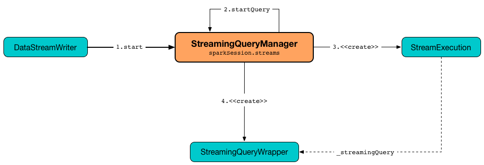
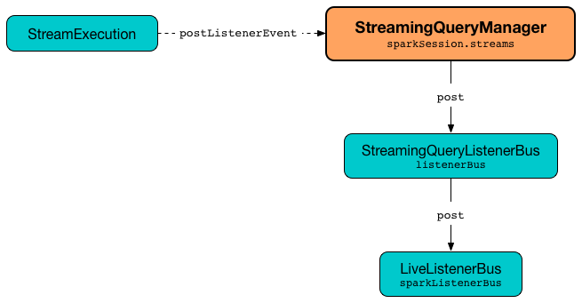

# StreamingQueryManager

`StreamingQueryManager` is the management interface for [active streaming queries](#activeQueries) of a [SparkSession](#sparkSession).

`StreamingQueryManager` is used (internally) to [create a StreamingQuery (and its StreamExecution)](#createQuery).



## Creating Instance

`StreamingQueryManager` takes the following to be created:

* <span id="sparkSession"> `SparkSession`

`StreamingQueryManager` is created when `SessionState` is requested for one.

!!! tip
    Learn more about [SessionState]({{ book.spark_sql }}/SessionState) in [The Internals of Spark SQL]({{ book.spark_sql }}) online book.


## <span id="active"> All Active Streaming Queries

```scala
active: Array[StreamingQuery]
```

[Active streaming queries](#activeQueries)

## <span id="addListener"> Registering StreamingQueryListener

```scala
addListener(
  listener: StreamingQueryListener): Unit
```

Registers (_adds_) a [StreamingQueryListener](monitoring/StreamingQueryListener.md)

## <span id="awaitAnyTermination"> Awaiting Any Termination

```scala
awaitAnyTermination(): Unit
awaitAnyTermination(
  timeoutMs: Long): Boolean
```

Waits until any streaming query terminates or `timeoutMs` elapses

## <span id="get"> Getting Active StreamingQuery by ID

```scala

get(
  id: String): StreamingQuery
get(
  id: UUID): StreamingQuery
```

Gets the [StreamingQuery](StreamingQuery.md) by [id](StreamingQuery.md#id)

## <span id="removeListener"> Deregistering StreamingQueryListener

```scala
removeListener(
  listener: StreamingQueryListener): Unit
```

De-registers (_removes_) the [StreamingQueryListener](monitoring/StreamingQueryListener.md)

## <span id="resetTerminated"> Resetting Terminated Queries

```scala
resetTerminated(): Unit
```

Resets the internal registry of the terminated streaming queries (that lets [awaitAnyTermination](#awaitAnyTermination) to be used again)

## Accessing StreamingQueryManager

`StreamingQueryManager` is available using `SparkSession.streams` property.

```text
scala> :type spark
org.apache.spark.sql.SparkSession

scala> :type spark.streams
org.apache.spark.sql.streaming.StreamingQueryManager
```

## <span id="listenerBus"> StreamingQueryListenerBus

```scala
listenerBus: StreamingQueryListenerBus
```

`listenerBus` is a [StreamingQueryListenerBus](StreamingQueryListenerBus.md) (for the current [SparkSession](#sparkSession)) that is created immediately when `StreamingQueryManager` is [created](#creating-instance).

`listenerBus` is used for the following:

* [Register](#addListener) or [de-register](#removeListener) a given [StreamingQueryListener](monitoring/StreamingQueryListener.md)

* [Post a streaming event](#postListenerEvent) (and notify [registered StreamingQueryListeners about the event](#addListener))

## <span id="addListener"> Registering StreamingQueryListener

```scala
addListener(
  listener: StreamingQueryListener): Unit
```

`addListener` requests the [StreamingQueryListenerBus](#listenerBus) to [add](StreamingQueryListenerBus.md#addListener) the input [StreamingQueryListener](monitoring/StreamingQueryListener.md).

## <span id="removeListener"> De-Registering StreamingQueryListener

```scala
removeListener(
  listener: StreamingQueryListener): Unit
```

`removeListener` requests [StreamingQueryListenerBus](#listenerBus) to [remove](StreamingQueryListenerBus.md#removeListener) the input [StreamingQueryListener](monitoring/StreamingQueryListener.md).

## <span id="createQuery"> Creating Streaming Query

```scala
createQuery(
  userSpecifiedName: Option[String],
  userSpecifiedCheckpointLocation: Option[String],
  df: DataFrame,
  extraOptions: Map[String, String],
  sink: BaseStreamingSink,
  outputMode: OutputMode,
  useTempCheckpointLocation: Boolean,
  recoverFromCheckpointLocation: Boolean,
  trigger: Trigger,
  triggerClock: Clock): StreamingQueryWrapper
```

`createQuery` creates a [StreamingQueryWrapper](StreamingQueryWrapper.md) (for a [StreamExecution](StreamExecution.md) per the input user-defined properties).

Internally, `createQuery` first finds the name of the checkpoint directory of a query (aka **checkpoint location**) in the following order:

1. Exactly the input `userSpecifiedCheckpointLocation` if defined

1. [spark.sql.streaming.checkpointLocation](configuration-properties.md#spark.sql.streaming.checkpointLocation) Spark property if defined for the parent directory with a subdirectory per the optional `userSpecifiedName` (or a randomly-generated UUID)

1. (only when `useTempCheckpointLocation` is enabled) A temporary directory (as specified by `java.io.tmpdir` JVM property) with a subdirectory with `temporary` prefix.

!!! note
    `userSpecifiedCheckpointLocation` can be any path that is acceptable by Hadoop's [Path]({{ hadoop.api }}/org/apache/hadoop/fs/Path.html).

If the directory name for the checkpoint location could not be found, `createQuery` reports a `AnalysisException`.

```text
checkpointLocation must be specified either through option("checkpointLocation", ...) or SparkSession.conf.set("spark.sql.streaming.checkpointLocation", ...)
```

`createQuery` reports a `AnalysisException` when the input `recoverFromCheckpointLocation` flag is turned off but there is *offsets* directory in the checkpoint location.

`createQuery` makes sure that the logical plan of the structured query is analyzed (i.e. no logical errors have been found).

Unless [spark.sql.streaming.unsupportedOperationCheck](configuration-properties.md#spark.sql.streaming.unsupportedOperationCheck) configuration property is enabled, `createQuery` [checks the logical plan of the streaming query for unsupported operations](UnsupportedOperationChecker.md#checkForStreaming).

(only when `spark.sql.adaptive.enabled` Spark property is turned on) `createQuery` prints out a WARN message to the logs:

```text
spark.sql.adaptive.enabled is not supported in streaming DataFrames/Datasets and will be disabled.
```

In the end, `createQuery` creates a [StreamingQueryWrapper](StreamingQueryWrapper.md) with a new [MicroBatchExecution](micro-batch-execution/MicroBatchExecution.md).

`createQuery` is used when `StreamingQueryManager` is requested to [start a streaming query](#startQuery) (when `DataStreamWriter` is requested to [start an execution of a streaming query](DataStreamWriter.md#start)).

### <span id="recoverFromCheckpointLocation"> recoverFromCheckpointLocation

`recoverFromCheckpointLocation` flag corresponds to `recoverFromCheckpointLocation` flag that `StreamingQueryManager` uses to [start a streaming query](#startQuery) and which is enabled by default (and is in fact the only place where `createQuery` is used).

* `memory` sink has the flag enabled for [Complete](OutputMode.md#Complete) output mode only

* `foreach` sink has the flag always enabled

* `console` sink has the flag always disabled

* all other sinks have the flag always enabled

### <span id="userSpecifiedName"> userSpecifiedName

`userSpecifiedName` corresponds to `queryName` option (that can be defined using ``DataStreamWriter``'s [queryName](DataStreamWriter.md#queryName) method) while `userSpecifiedCheckpointLocation` is `checkpointLocation` option.

## <span id="startQuery"> Starting Streaming Query Execution

```scala
startQuery(
  userSpecifiedName: Option[String],
  userSpecifiedCheckpointLocation: Option[String],
  df: DataFrame,
  extraOptions: Map[String, String],
  sink: BaseStreamingSink,
  outputMode: OutputMode,
  useTempCheckpointLocation: Boolean = false,
  recoverFromCheckpointLocation: Boolean = true,
  trigger: Trigger = ProcessingTime(0),
  triggerClock: Clock = new SystemClock()): StreamingQuery
```

`startQuery` starts a [streaming query](StreamingQuery.md) and returns a handle to it.

Internally, `startQuery` first [creates a StreamingQueryWrapper](#createQuery), registers it in [activeQueries](#activeQueries) internal registry (by the [id](StreamExecution.md#id)), requests it for the underlying [StreamExecution](StreamingQueryWrapper.md#streamingQuery) and [starts it](StreamExecution.md#start).

In the end, `startQuery` returns the [StreamingQueryWrapper](StreamingQueryWrapper.md) (as part of the fluent API so you can chain operators) or throws the exception that was reported when attempting to start the query.

`startQuery` throws an `IllegalArgumentException` when there is another query registered under `name`. `startQuery` looks it up in the [activeQueries](#activeQueries) internal registry.

```text
Cannot start query with name [name] as a query with that name is already active
```

`startQuery` throws an `IllegalStateException` when a query is started again from checkpoint. `startQuery` looks it up in [activeQueries](#activeQueries) internal registry.

```text
Cannot start query with id [id] as another query with same id is already active. Perhaps you are attempting to restart a query from checkpoint that is already active.
```

`startQuery` is used when `DataStreamWriter` is requested to [start an execution of the streaming query](DataStreamWriter.md#start).

## <span id="postListenerEvent"> Posting StreamingQueryListener Event to StreamingQueryListenerBus

```scala
postListenerEvent(
  event: StreamingQueryListener.Event): Unit
```

`postListenerEvent` simply posts the input `event` to the internal [event bus for streaming events (StreamingQueryListenerBus)](#listenerBus).



`postListenerEvent` is used when `StreamExecution` is requested to [post a streaming event](StreamExecution.md#postEvent).

## <span id="notifyQueryTermination"> Handling Termination of Streaming Query (and Deactivating Query in StateStoreCoordinator)

```scala
notifyQueryTermination(
  terminatedQuery: StreamingQuery): Unit
```

`notifyQueryTermination` removes the `terminatedQuery` from [activeQueries](#activeQueries) internal registry (by the [query id](StreamingQuery.md#id)).

`notifyQueryTermination` records the `terminatedQuery` in [lastTerminatedQuery](#lastTerminatedQuery) internal registry (when no earlier streaming query was recorded or the `terminatedQuery` terminated due to an exception).

`notifyQueryTermination` notifies others that are blocked on [awaitTerminationLock](#awaitTerminationLock).

In the end, `notifyQueryTermination` requests [StateStoreCoordinator](#stateStoreCoordinator) to [deactivate all active runs of the streaming query](stateful-stream-processing/StateStoreCoordinatorRef.md#deactivateInstances).


`notifyQueryTermination` is used when `StreamExecution` is requested to [run a streaming query](StreamExecution.md#runStream) and the query [has finished (running streaming batches)](StreamExecution.md#runStream-finally) (with or without an exception).

## <span id="activeQueries"> Active Streaming Queries by ID

Registry of [StreamingQuery](StreamingQuery.md)s per `UUID`

Used when `StreamingQueryManager` is requested for [active streaming queries](#active), [get a streaming query by id](#get), [starts a streaming query](#startQuery) and [is notified that a streaming query has terminated](#notifyQueryTermination).

## <span id="lastTerminatedQuery"> Last-Terminated Streaming Query

[StreamingQuery](StreamingQuery.md) that has recently been terminated (i.e. [stopped](StreamingQuery.md#stop) or [due to an exception](StreamingQuery.md#exception)).

`null` when no streaming query has terminated yet or [resetTerminated](#resetTerminated).

* Used in [awaitAnyTermination](#awaitAnyTermination) to know when a streaming query has terminated

* Set when `StreamingQueryManager` [is notified that a streaming query has terminated](#notifyQueryTermination)

## <span id="stateStoreCoordinator"> StateStoreCoordinatorRef

[StateStoreCoordinatorRef](stateful-stream-processing/StateStoreCoordinatorRef.md) to the `StateStoreCoordinator` RPC Endpoint

* [Created](stateful-stream-processing/StateStoreCoordinatorRef.md#forDriver) when `StreamingQueryManager` is [created](#creating-instance)

Used when:

* `StreamingQueryManager` [is notified that a streaming query has terminated](#notifyQueryTermination)

* Stateful operators are executed ([FlatMapGroupsWithStateExec](physical-operators/FlatMapGroupsWithStateExec.md), [StateStoreRestoreExec](physical-operators/StateStoreRestoreExec.md), [StateStoreSaveExec](physical-operators/StateStoreSaveExec.md), [StreamingDeduplicateExec](physical-operators/StreamingDeduplicateExec.md) and [StreamingSymmetricHashJoinExec](physical-operators/StreamingSymmetricHashJoinExec.md))

* [Creating StateStoreRDD (with storeUpdateFunction aborting StateStore when a task fails)](stateful-stream-processing/StateStoreOps.md#mapPartitionsWithStateStore)
