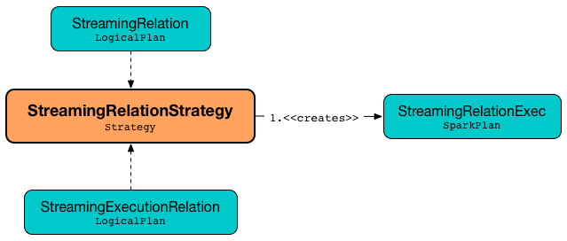

# StreamingRelationStrategy Execution Planning Strategy

[[apply]]
`StreamingRelationStrategy` is an execution planning strategy that can plan streaming queries with [StreamingRelation](logical-operators/StreamingRelation.md), [StreamingExecutionRelation](logical-operators/StreamingExecutionRelation.md), and [StreamingRelationV2](logical-operators/StreamingRelationV2.md) logical operators to [StreamingRelationExec](physical-operators/StreamingRelationExec.md) physical operators.



`StreamingRelationStrategy` is used when [IncrementalExecution](IncrementalExecution.md) is requested to plan a streaming query.

`StreamingRelationStrategy` is available using `SessionState` (of a `SparkSession`).

```scala
spark.sessionState.planner.StreamingRelationStrategy
```

## Demo

```text
val rates = spark.
  readStream.
  format("rate").
  load // <-- gives a streaming Dataset with a logical plan with StreamingRelation logical operator

// StreamingRelation logical operator for the rate streaming source
scala> println(rates.queryExecution.logical.numberedTreeString)
00 StreamingRelation DataSource(org.apache.spark.sql.SparkSession@31ba0af0,rate,List(),None,List(),None,Map(),None), rate, [timestamp#0, value#1L]

// StreamingRelationExec physical operator (shown without "Exec" suffix)
scala> rates.explain
== Physical Plan ==
StreamingRelation rate, [timestamp#0, value#1L]

// Let's do the planning manually
import spark.sessionState.planner.StreamingRelationStrategy
val physicalPlan = StreamingRelationStrategy.apply(rates.queryExecution.logical).head
scala> println(physicalPlan.numberedTreeString)
00 StreamingRelation rate, [timestamp#0, value#1L]
```
