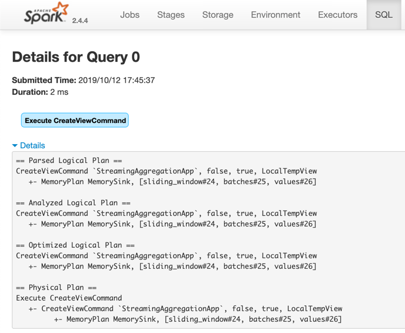

# Memory Data Source

*Memory Data Source* is made up of the following two base implementations to support the older DataSource API V1 and the modern DataSource API V2:

* [MemoryStreamBase](MemoryStreamBase.md)

* [MemorySinkBase](MemorySinkBase.md)

Memory data source supports [Micro-Batch](../../micro-batch-stream-processing.md) and [Continuous](../../continuous-stream-processing.md) stream processing modes.

[cols="30,35,35",options="header",width="100%"]
|===
| Stream Processing
| Source
| Sink

| [Micro-Batch](../../micro-batch-stream-processing.md)
| [MemoryStream](MemoryStream.md)
| [MemorySink](MemorySink.md)

| [Continuous](../../continuous-stream-processing.md)
| [ContinuousMemoryStream](ContinuousMemoryStream.md)
| [MemorySinkV2](MemorySinkV2.md)

|===

[CAUTION]
====
Memory Data Source is *not* for production use due to design contraints, e.g. infinite in-memory collection of lines read and no fault recovery.

`MemoryStream` is designed primarily for unit tests, tutorials and debugging.
====

=== [[memory-sink]] Memory Sink

Memory sink requires that a streaming query has a name (defined using [DataStreamWriter.queryName](../../DataStreamWriter.md#queryName) or `queryName` option).

Memory sink may optionally define checkpoint location using `checkpointLocation` option that is used to recover from for [Complete](../../OutputMode.md#Complete) output mode only.

### Memory Sink and CreateViewCommand

When a streaming query with `memory` sink is [started](../../DataStreamWriter.md#start), [DataStreamWriter](../../DataStreamWriter.md) uses `Dataset.createOrReplaceTempView` operator to create or replace a local temporary view with the name of the query (which is required).

## Examples

.Memory Source in Micro-Batch Stream Processing
[source, scala]
----
val spark: SparkSession = ???

implicit val ctx = spark.sqlContext

import org.apache.spark.sql.execution.streaming.MemoryStream
// It uses two implicits: Encoder[Int] and SQLContext
val intsIn = MemoryStream[Int]

val ints = intsIn.toDF
  .withColumn("t", current_timestamp())
  .withWatermark("t", "5 minutes")
  .groupBy(window($"t", "5 minutes") as "window")
  .agg(count("*") as "total")

import org.apache.spark.sql.streaming.{OutputMode, Trigger}
import scala.concurrent.duration._
val totalsOver5mins = ints.
  writeStream.
  format("memory").
  queryName("totalsOver5mins").
  outputMode(OutputMode.Append).
  trigger(Trigger.ProcessingTime(10.seconds)).
  start

val zeroOffset = intsIn.addData(0, 1, 2)
totalsOver5mins.processAllAvailable()
spark.table("totalsOver5mins").show

scala> intsOut.show
+-----+
|value|
+-----+
|    0|
|    1|
|    2|
+-----+

memoryQuery.stop()
----

.Memory Sink in Micro-Batch Stream Processing
[source, scala]
----
val queryName = "memoryDemo"
val sq = spark
  .readStream
  .format("rate")
  .load
  .writeStream
  .format("memory")
  .queryName(queryName)
  .start

// The name of the streaming query is an in-memory table
val showAll = sql(s"select * from $queryName")
scala> showAll.show(truncate = false)
+-----------------------+-----+
|timestamp              |value|
+-----------------------+-----+
|2019-10-10 15:19:16.431|42   |
|2019-10-10 15:19:17.431|43   |
+-----------------------+-----+

import org.apache.spark.sql.streaming.StreamingQuery
assert(sq.isInstanceOf[StreamingQuery])

import org.apache.spark.sql.execution.streaming.StreamingQueryWrapper
val se = sq.asInstanceOf[StreamingQueryWrapper].streamingQuery

import org.apache.spark.sql.execution.streaming.MemorySink
val sink = se.sink.asInstanceOf[MemorySink]

assert(sink.toString == "MemorySink")

sink.clear()
----
