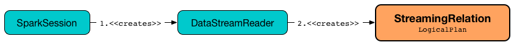

# StreamingRelation Leaf Logical Operator

`StreamingRelation` is a leaf logical operator ([Spark SQL]({{ book.spark_sql }}/logical-operators/LeafNode)) that represents a [streaming source](../Source.md) in a logical plan.

`StreamingRelation` is [resolved](../StreamExecution.md#logicalPlan) (_planned_) to a [StreamingExecutionRelation](StreamingExecutionRelation.md) (right after `StreamExecution` [starts running batches](../StreamExecution.md#runStream)).

## Creating Instance

`StreamingRelation` takes the following to be created:

* <span id="dataSource"> [DataSource](../DataSource.md)
* <span id="sourceName"> Short Name of the Streaming Source
* <span id="output"> Output Attributes (`Seq[Attribute]`)

`StreamingRelation` is created when:

* `DataStreamReader` is requested to [load data from a streaming source](../DataStreamReader.md#load) and creates a streaming query.



## <span id="apply"> Creating StreamingRelation for DataSource

```scala
apply(
  dataSource: DataSource): StreamingRelation
```

`apply` creates a `StreamingRelation` for the given [DataSource](#dataSource).

`apply` is used when:

* `DataStreamReader` is requested for a [streaming query](../DataStreamReader.md#load)

## <span id="isStreaming"> isStreaming

```scala
isStreaming: Boolean
```

`isStreaming` is part of the `LogicalPlan` ([Spark SQL]({{ book.spark_sql }}/logical-operators/LogicalPlan#isStreaming)) abstraction.

`isStreaming` flag is always `true`.

```scala
import org.apache.spark.sql.execution.streaming.StreamingRelation
val relation = rate.queryExecution.logical.asInstanceOf[StreamingRelation]
assert(relation.isStreaming)
```

## <span id="toString"> Text Respresentation

```scala
toString: String
```

`toString` gives the [source name](#sourceName).

## Demo

```scala
val rate = spark.
  readStream.
  format("rate").
  load("hello")
```

```text
scala> println(rate.queryExecution.logical.numberedTreeString)
00 StreamingRelationV2 org.apache.spark.sql.execution.streaming.sources.RateStreamProvider@69ab1abc, rate, Map(path -> hello), [timestamp#0, value#1L]
```
