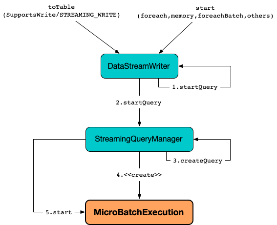
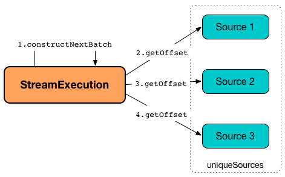
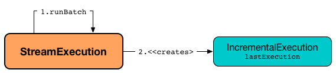

# MicroBatchExecution

`MicroBatchExecution` is a [stream execution engine](../StreamExecution.md) for [Micro-Batch Stream Processing](index.md).

<figure markdown>
  
</figure>

Once [created](#creating-instance), `MicroBatchExecution` is requested to [start](../StreamExecution.md#start).

## Creating Instance

`MicroBatchExecution` takes the following to be created:

* <span id="sparkSession"> `SparkSession` ([Spark SQL]({{ book.spark_sql }}/SparkSession))
* <span id="trigger"> [Trigger](../Trigger.md)
* <span id="triggerClock"> `Clock`
* <span id="extraOptions"> Extra Options (`Map[String, String]`)
* [WriteToStream Logical Operator](#plan)

`MicroBatchExecution` is created when:

* `StreamingQueryManager` is requested to [create a streaming query](../StreamingQueryManager.md#createQuery) (when `DataStreamWriter` is requested to [start execution of the streaming query](../DataStreamWriter.md#start)) for all [trigger](#trigger)s but [ContinuousTrigger](../Trigger.md#ContinuousTrigger)

### <span id="plan"> WriteToStream Logical Operator

`MicroBatchExecution` is given a [WriteToStream](../logical-operators/WriteToStream.md) logical operator when [created](#creating-instance).

The `WriteToStream` is used to initialize the parent [StreamExecution](../StreamExecution.md) attributes:

* [Name](../StreamExecution.md#name)
* [resolvedCheckpointRoot](../StreamExecution.md#resolvedCheckpointRoot)
* [Analyzed Logical Plan](../StreamExecution.md#analyzedPlan)
* [Sink Table](../StreamExecution.md#sink)
* [OutputMode](../StreamExecution.md#outputMode)
* [deleteCheckpointOnStop](../StreamExecution.md#deleteCheckpointOnStop)

The `WriteToStream` can be used to create a [WriteToMicroBatchDataSource](../logical-operators/WriteToMicroBatchDataSource.md) as the [logical write operator](#logicalPlan) when the [sink table](#sink) is `SupportsWrite` ([Spark SQL]({{ book.spark_sql }}/connector/SupportsWrite)).

### <span id="triggerExecutor"> TriggerExecutor

```scala
triggerExecutor: TriggerExecutor
```

`MicroBatchExecution` creates a [TriggerExecutor](../TriggerExecutor.md) when [created](#creating-instance) (based on the given [Trigger](#trigger)):

Trigger | TriggerExecutor
--------|----------------
 [MultiBatchExecutor](../TriggerExecutor.md#MultiBatchExecutor) | [AvailableNowTrigger](../Trigger.md#AvailableNowTrigger)
 [ProcessingTimeExecutor](../ProcessingTimeExecutor.md) | [ProcessingTimeTrigger](../Trigger.md#ProcessingTimeTrigger)
 [SingleBatchExecutor](../TriggerExecutor.md#SingleBatchExecutor) | [OneTimeTrigger](../Trigger.md#OneTimeTrigger)

`MicroBatchExecution` uses the `TriggerExecutor` for the following:

* [runActivatedStream](#runActivatedStream)
* Determine the [unique streaming sources](#uniqueSources)

---

`triggerExecutor` throws an `IllegalStateException` when the [Trigger](#trigger) is not one of the [built-in implementations](../Trigger.md#implementations).

```text
Unknown type of trigger: [trigger]
```

## Execution Phases

`MicroBatchExecution` splits execution of a single micro-batch into the following execution phases (and [tracks their duration](../ProgressReporter.md#reportTimeTaken)):

1. [triggerExecution](#runActivatedStream-triggerExecution)
1. [latestOffset](#constructNextBatch-latestOffset) and [getOffset](#constructNextBatch-getOffset)
1. [walCommit](#constructNextBatch-walCommit)
1. [getBatch](#runBatch-getBatch)
1. [queryPlanning](#runBatch-queryPlanning)
1. [addBatch](#runBatch-addBatch)

## <span id="startTrigger"> Initializing Query Progress for New Trigger

```scala
startTrigger(): Unit
```

`startTrigger` is part of the [ProgressReporter](../ProgressReporter.md#startTrigger) abstraction.

---

`startTrigger`...FIXME

## <span id="sources"> SparkDataStreams

```scala
sources: Seq[SparkDataStream]
```

`sources` is part of the [ProgressReporter](../ProgressReporter.md#sources) abstraction.

---

Streaming sources and readers (of the [StreamingExecutionRelations](../logical-operators/StreamingExecutionRelation.md) of the [analyzed logical query plan](#analyzedPlan) of the streaming query)

Default: (empty)

Initialized when `MicroBatchExecution` is requested for the [transformed logical query plan](#logicalPlan)

Used when:

* [Populating start offsets](#populateStartOffsets) (for the [available](../StreamExecution.md#availableOffsets) and [committed](../StreamExecution.md#committedOffsets) offsets)
* [Constructing or skipping next streaming micro-batch](#constructNextBatch) (and persisting offsets to write-ahead log)

## <span id="runActivatedStream"> Running Activated Streaming Query

```scala
runActivatedStream(
  sparkSessionForStream: SparkSession): Unit
```

`runActivatedStream` is part of [StreamExecution](../StreamExecution.md#runActivatedStream) abstraction.

---

`runActivatedStream` requests the [TriggerExecutor](#triggerExecutor) to [execute](../TriggerExecutor.md#execute) (the [batch runner](#runActivatedStream-batchRunner)).

!!! note
    As long as the [TriggerExecutor](#triggerExecutor) is [executing the batch running](../TriggerExecutor.md#execute) as long `runActivatedStream` keeps running.

### <span id="batchRunner"><span id="batch-runner"><span id="runActivatedStream-batchRunner"> Batch Runner

The batch runner checks [whether the streaming query is active](../StreamExecution.md#isActive) (as, in the meantime, it could be terminated).

When terminated, the batch runner [waits for the next trigger](#runActivatedStream-waiting-for-next-trigger). Otherwise, the batch runner [initializes the trigger](#runActivatedStream-startTrigger).

### <span id="runActivatedStream-startTrigger"> startTrigger

When [active](../StreamExecution.md#isActive), the batch runner [initializes query progress for the new trigger](../ProgressReporter.md#startTrigger) (aka _startTrigger_).

### <span id="runActivatedStream-triggerExecution"> triggerExecution Execution Phase

The batch runner starts **triggerExecution** [execution phase](../ProgressReporter.md#reportTimeTaken).

#### <span id="runActivatedStream-triggerExecution-populateStartOffsets"> populateStartOffsets

This phase happens only at the start or restart (_resume_) of a streaming query (when the [current batch ID](../StreamExecution.md#currentBatchId) is uninitialized and `-1`).

The batch runner requests the [OffsetSeqLog](../StreamExecution.md#offsetLog) for the [latest batch ID](../HDFSMetadataLog.md#getLatest) and [sets the latest seen offset](../AcceptsLatestSeenOffsetHandler.md#setLatestSeenOffsetOnSources) on the [SparkDataStreams](#sources).

The batch runner [populates start offsets from checkpoint](#populateStartOffsets) and prints out the following INFO message to the logs (with the [committedOffsets](../StreamExecution.md#committedOffsets)):

```text
Stream started from [committedOffsets]
```

#### <span id="runActivatedStream-triggerExecution-getBatchDescriptionString"> getBatchDescriptionString

The batch runner sets the human-readable description for any Spark job submitted as part of this micro-batch as the [batch description](../StreamExecution.md#getBatchDescriptionString) (using [SparkContext.setJobDescription]({{ book.spark_core }}/SparkContext#setJobDescription)).

A Spark job can be submitted while streaming sources are pulling new data or as part of a sink (e.g., [DataStreamWriter.foreachBatch](../DataStreamWriter.md#foreachBatch) operator).

#### <span id="runActivatedStream-triggerExecution-isCurrentBatchConstructed"> isCurrentBatchConstructed

Unless [already constructed](#isCurrentBatchConstructed), the batch runner [constructs the next streaming micro-batch](#constructNextBatch) with the value of [spark.sql.streaming.noDataMicroBatches.enabled](../configuration-properties.md#spark.sql.streaming.noDataMicroBatches.enabled) configuration property.

#### <span id="runActivatedStream-triggerExecution-recordTriggerOffsets"> Recording Offsets

The batch runner [records the trigger offset range for progress reporting](#recordTriggerOffsets) (with the [committed](../StreamExecution.md#committedOffsets), [available](../StreamExecution.md#availableOffsets) and [latestOffsets](../StreamExecution.md#latestOffsets) offsets).

#### <span id="runActivatedStream-triggerExecution-isNewDataAvailable"><span id="currentBatchHasNewData"> currentBatchHasNewData

The batch runner uses
`currentBatchHasNewData` to remember [whether the current batch has data or not](#isNewDataAvailable) (based on the offsets [available](../StreamExecution.md#availableOffsets) and [committed](../StreamExecution.md#committedOffsets) that can change over time).

The batch runner updates [isDataAvailable](../monitoring/StreamingQueryStatus.md#isDataAvailable) of the [StreamingQueryStatus](../ProgressReporter.md#currentStatus).

#### <span id="runActivatedStream-triggerExecution-runBatch"> Running Micro-Batch

With the [streaming micro-batch constructed](#isCurrentBatchConstructed), the batch runner [updates the status message](../ProgressReporter.md#updateStatusMessage) to one of the following (based on [whether the current batch has data or not](#isNewDataAvailable)):

```text
Processing new data
```

```text
No new data but cleaning up state
```

The batch runner [runs the streaming micro-batch](#runBatch).

#### <span id="runActivatedStream-triggerExecution-waiting-for-data-to-arrive"> Waiting for data to arrive

Otherwise, the batch runner [updates the status message](../ProgressReporter.md#updateStatusMessage) to the following:

```text
Waiting for data to arrive
```

### <span id="runActivatedStream-finishTrigger"> finishTrigger

The batch runner [finalizes query progress for the trigger](../ProgressReporter.md#finishTrigger) (with the flags that indicate [whether the current batch had new data](#isNewDataAvailable) and the [isCurrentBatchConstructed](#isCurrentBatchConstructed)).

### <span id="runActivatedStream-closing-up"> Closing Up

At the final step of [runActivatedStream](#runActivatedStream) when the [isActive](#isActive) was enabled, the batch runner does some _closing-up_ work.

#### <span id="runActivatedStream-batchRunner-isCurrentBatchConstructed"> isCurrentBatchConstructed

With the [isCurrentBatchConstructed](#isCurrentBatchConstructed) flag enabled, the batch runner increments the [currentBatchId](../StreamExecution.md#currentBatchId) and turns the [isCurrentBatchConstructed](#isCurrentBatchConstructed) flag off.

#### <span id="runActivatedStream-closing-up-MultiBatchExecutor"> MultiBatchExecutor

For [MultiBatchExecutor](../TriggerExecutor.md#MultiBatchExecutor), the batch runner prints out the following INFO message to the logs:

```text
Finished processing all available data for the trigger,
terminating this Trigger.AvailableNow query
```

The batch runner sets the [state](../StreamExecution.md#state) to [TERMINATED](../StreamExecution.md#TERMINATED).

#### <span id="runActivatedStream-closing-up-otherwise"> Otherwise

With the [isCurrentBatchConstructed](#isCurrentBatchConstructed) flag disabled (`false`) and the [non-MultiBatchExecutor triggerExecutor](#triggerExecutor), the batch runner sleeps (as long as configured using the [spark.sql.streaming.pollingDelay](../StreamExecution.md#pollingDelayMs) configuration property).

### <span id="runActivatedStream-waiting-for-next-trigger"> Waiting for next trigger

When [inactive](../StreamExecution.md#isActive), the batch runner [updates the status message](../ProgressReporter.md#updateStatusMessage) to the following:

```text
Waiting for next trigger
```

In the end, the batch runner returns [whether the streaming query is active or not](../StreamExecution.md#isActive).

!!! note
    The state of the streaming query (i.e., [whether the streaming query is active or not](../StreamExecution.md#isActive)) can change while a micro-batch is executed (e.g., for [MultiBatchExecutor](#runActivatedStream-closing-up-MultiBatchExecutor) when no [next batch was constructed](#constructNextBatch)).

## <span id="populateStartOffsets"> Populating Start Offsets From Checkpoint (Resuming from Checkpoint)

```scala
populateStartOffsets(
  sparkSessionToRunBatches: SparkSession): Unit
```

`populateStartOffsets` requests the [Offset Write-Ahead Log](../StreamExecution.md#offsetLog) for the [latest committed batch id with metadata](../HDFSMetadataLog.md#getLatest) (i.e. [OffsetSeq](../OffsetSeq.md)).

!!! note
    The batch id could not be available in the write-ahead log when a streaming query started with a new log or no batch was persisted (_added_) to the log before.

`populateStartOffsets` branches off based on whether the latest committed batch was [available](#populateStartOffsets-getLatest-available) or [not](#populateStartOffsets-getLatest-not-available).

`populateStartOffsets` is used when `MicroBatchExecution` is requested to [run an activated streaming query](#runActivatedStream) ([before the first "zero" micro-batch](#runActivatedStream-triggerExecution-populateStartOffsets)).

### <span id="populateStartOffsets-getLatest-available"> Latest Committed Batch Available

When the latest committed batch id with the metadata was available in the [Offset Write-Ahead Log](../StreamExecution.md#offsetLog), `populateStartOffsets` (re)initializes the internal state as follows:

* Sets the [current batch ID](../StreamExecution.md#currentBatchId) to the latest committed batch ID found

* Turns the [isCurrentBatchConstructed](#isCurrentBatchConstructed) internal flag on (`true`)

* Sets the [available offsets](#availableOffsets) to the offsets (from the metadata)

When the latest batch ID found is greater than `0`, `populateStartOffsets` requests the [Offset Write-Ahead Log](../StreamExecution.md#offsetLog) for the [second latest batch ID with metadata](../HDFSMetadataLog.md#get) or throws an `IllegalStateException` if not found.

```text
batch [latestBatchId - 1] doesn't exist
```

`populateStartOffsets` sets the [committed offsets](#committedOffsets) to the second latest committed offsets.

<span id="populateStartOffsets-getLatest-available-offsetSeqMetadata">
`populateStartOffsets` updates the offset metadata.

CAUTION: FIXME Describe me

`populateStartOffsets` requests the [Offset Commit Log](../StreamExecution.md#commitLog) for the [latest committed batch id with metadata](../HDFSMetadataLog.md#getLatest).

CAUTION: FIXME Describe me

When the latest committed batch id with metadata was found which is exactly the latest batch ID (found in the [Offset Commit Log](../StreamExecution.md#commitLog)), `populateStartOffsets`...FIXME

When the latest committed batch id with metadata was found, but it is not exactly the second latest batch ID (found in the [Offset Commit Log](../StreamExecution.md#commitLog)), `populateStartOffsets` prints out the following WARN message to the logs:

```text
Batch completion log latest batch id is [latestCommittedBatchId], which is not trailing batchid [latestBatchId] by one
```

When no commit log present in the [Offset Commit Log](../StreamExecution.md#commitLog), `populateStartOffsets` prints out the following INFO message to the logs:

```text
no commit log present
```

In the end, `populateStartOffsets` prints out the following DEBUG message to the logs:

```text
Resuming at batch [currentBatchId] with committed offsets [committedOffsets] and available offsets [availableOffsets]
```

### <span id="populateStartOffsets-getLatest-not-available"> No Latest Committed Batch

When the latest committed batch id with the metadata could not be found in the [Offset Write-Ahead Log](../StreamExecution.md#offsetLog), it is assumed that the streaming query is started for the very first time (or the [checkpoint location](../StreamExecution.md#checkpointRoot) has changed).

`populateStartOffsets` prints out the following INFO message to the logs:

```text
Starting new streaming query.
```

[[populateStartOffsets-currentBatchId-0]]
`populateStartOffsets` sets the [current batch ID](../StreamExecution.md#currentBatchId) to `0` and creates a new [WatermarkTracker](#watermarkTracker).

## <span id="constructNextBatch"> Constructing Next Micro-Batch (Or Skipping It)

```scala
constructNextBatch(
  noDataBatchesEnabled: Boolean): Boolean
```

`constructNextBatch` is used when `MicroBatchExecution` is requested to [run the activated streaming query](#runActivatedStream).

!!! note
    `constructNextBatch` is only executed when the [isCurrentBatchConstructed](#isCurrentBatchConstructed) internal flag is disabled (`false`).

    As a matter of fact, [isCurrentBatchConstructed](#isCurrentBatchConstructed) guards execution of `constructNextBatch` in [runActivatedStream](#runActivatedStream) so it should not be called.

`constructNextBatch` performs the following steps:

1. [Requesting next and recent offsets from the data streams](#constructNextBatch-nextOffsets-recentOffsets)

1. [Requesting the latest offsets from the data streams](#constructNextBatch-latestOffsets)

1. [Updating availableOffsets StreamProgress with the latest available offsets](#constructNextBatch-availableOffsets)

1. [Updating batch metadata with the current event-time watermark and batch timestamp](#constructNextBatch-offsetSeqMetadata)

1. [Checking whether to construct the next micro-batch or not (skip it)](#constructNextBatch-shouldConstructNextBatch)

In the end, `constructNextBatch` returns [whether the next streaming micro-batch was constructed or should be skipped](#constructNextBatch-shouldConstructNextBatch).

### <span id="constructNextBatch-nextOffsets-recentOffsets"><span id="constructNextBatch-latestOffset"> Requesting Next and Recent Offsets from Data Streams

`constructNextBatch` uses the [uniqueSources](../StreamExecution.md#uniqueSources) registry to request every [SparkDataStream](../SparkDataStream.md) for the next and recent offsets (based on the type of a `SparkDataStream`).

For all types of data streams, `constructNextBatch` [updates the status message](../ProgressReporter.md#updateStatusMessage) to the following:

```text
Getting offsets from [source]
```

#### <span id="constructNextBatch-nextOffsets-recentOffsets-AvailableNowDataStreamWrapper"> AvailableNowDataStreamWrappers

For [AvailableNowDataStreamWrapper](../AvailableNowDataStreamWrapper.md)s, `constructNextBatch` does the following in **latestOffset** [time-tracking section](../ProgressReporter.md#reportTimeTaken):

1. [Gets the start offset](#getStartOffset) of the [wrapped SparkDataStream](../AvailableNowDataStreamWrapper.md#delegate) (of this `AvailableNowDataStreamWrapper`)
1. Requests the `AvailableNowDataStreamWrapper` for the [latest offset per ReadLimit](../AvailableNowDataStreamWrapper.md#latestOffset) (for the start offset and the [ReadLimit](../ReadLimit.md))
1. Requests the `AvailableNowDataStreamWrapper` for the [latest offset available](../AvailableNowDataStreamWrapper.md#reportLatestOffset)

In the end (of this phase), `constructNextBatch` gives the following pair (of pairs):

* The [wrapped SparkDataStream](../AvailableNowDataStreamWrapper.md#delegate) (of this `AvailableNowDataStreamWrapper`) with the [latest offset](../AvailableNowDataStreamWrapper.md#latestOffset)
* The [wrapped SparkDataStream](../AvailableNowDataStreamWrapper.md#delegate) (of this `AvailableNowDataStreamWrapper`) with the [latest offset reported](../AvailableNowDataStreamWrapper.md#reportLatestOffset)

#### <span id="constructNextBatch-nextOffsets-recentOffsets-SupportsAdmissionControl"> SupportsAdmissionControls

For [SupportsAdmissionControl](../SupportsAdmissionControl.md)s, `constructNextBatch` does the following in **latestOffset** [time-tracking section](../ProgressReporter.md#reportTimeTaken):

1. [Gets the start offset](#getStartOffset) of the `SupportsAdmissionControl`
1. Requests the `SupportsAdmissionControl` for the [latest offset per ReadLimit](../SupportsAdmissionControl.md#latestOffset) (for the start offset and the [ReadLimit](../ReadLimit.md))
1. Requests the `SupportsAdmissionControl` for the [latest offset available](../SupportsAdmissionControl.md#reportLatestOffset)

In the end (of this phase), `constructNextBatch` gives the following pair (of pairs):

* The `SupportsAdmissionControl` with the [latest offset](../SupportsAdmissionControl.md#latestOffset)
* The `SupportsAdmissionControl` with the [latest offset reported](../SupportsAdmissionControl.md#reportLatestOffset)

!!! note
    The difference of how `constructNextBatch` handles [AvailableNowDataStreamWrappers](#constructNextBatch-nextOffsets-recentOffsets-AvailableNowDataStreamWrapper) and `SupportsAdmissionControl`s is only that the [AvailableNowDataStreamWrapper](../AvailableNowDataStreamWrapper.md) is requested for the [wrapped SparkDataStream](../AvailableNowDataStreamWrapper.md#delegate) while [SupportsAdmissionControl](../SupportsAdmissionControl.md) are used directly.

#### <span id="constructNextBatch-nextOffsets-recentOffsets-others"> Others

!!! note "FIXME Describe Sources and MicroBatchStreams"

### <span id="constructNextBatch-latestOffsets"> Requesting Latest Offsets from Data Streams

!!! note "FIXME"
    Likely to be merged with the above section

`constructNextBatch` requests every [SparkDataStream](../SparkDataStream.md) (from [uniqueSources](../StreamExecution.md#uniqueSources) registry) for a pair of the next and recent offsets. `constructNextBatch` checks out the offsets in every `SparkDataStream` sequentially (i.e. one data source at a time).



For every [streaming source](../Source.md) (Data Source API V1), `constructNextBatch` [updates the status message](../ProgressReporter.md#updateStatusMessage) to the following:

```text
Getting offsets from [source]
```

### <span id="constructNextBatch-getOffset"> getOffset Phase

!!! note "FIXME This phase should be merged with the above one"

In **getOffset** [time-tracking section](../ProgressReporter.md#reportTimeTaken), `constructNextBatch` requests the `Source` for the [latest offset](#getOffset).

For every data source, `constructNextBatch` [updates the status message](../ProgressReporter.md#updateStatusMessage) to the following:

```text
Getting offsets from [source]
```

### <span id="constructNextBatch-setOffsetRange"> setOffsetRange Phase

!!! note "FIXME There is no setOffsetRange phase anymore"

In **setOffsetRange** [time-tracking section](../ProgressReporter.md#reportTimeTaken), `constructNextBatch` finds the available offsets of the source (in the [available offset](#availableOffsets) internal registry) and, if found, requests the `MicroBatchReader` to...FIXME (from [JSON format](../Offset.md#json)). `constructNextBatch` requests the `MicroBatchReader` to...FIXME

### <span id="constructNextBatch-getEndOffset"> getEndOffset Phase

!!! note "FIXME There is no getEndOffset phase anymore"

In **getEndOffset** [time-tracking section](../ProgressReporter.md#reportTimeTaken), `constructNextBatch` requests the `MicroBatchReader` for...FIXME

### <span id="constructNextBatch-availableOffsets"> Updating availableOffsets StreamProgress with Latest Available Offsets

`constructNextBatch` updates the [availableOffsets StreamProgress](../StreamExecution.md#availableOffsets) with the latest reported offsets.

### <span id="constructNextBatch-offsetSeqMetadata"> Updating Batch Metadata with Current Event-Time Watermark and Batch Timestamp

`constructNextBatch` updates the [batch metadata](../StreamExecution.md#offsetSeqMetadata) with the current [event-time watermark](../watermark/WatermarkTracker.md#currentWatermark) (from the [WatermarkTracker](#watermarkTracker)) and the batch timestamp.

### <span id="constructNextBatch-shouldConstructNextBatch"> Checking Whether to Construct Next Micro-Batch or Not (Skip It)

`constructNextBatch` checks whether or not the next streaming micro-batch should be constructed (`lastExecutionRequiresAnotherBatch`).

`constructNextBatch` uses the [last IncrementalExecution](../StreamExecution.md#lastExecution) if the [last execution requires another micro-batch](../IncrementalExecution.md#shouldRunAnotherBatch) (using the [batch metadata](../StreamExecution.md#offsetSeqMetadata)) and the given `noDataBatchesEnabled` flag is enabled (`true`).

`constructNextBatch` also [checks out whether new data is available (based on available and committed offsets)](#isNewDataAvailable).

!!! note
    `shouldConstructNextBatch` local flag is enabled (`true`) when [there is new data available (based on offsets)](#isNewDataAvailable) or the [last execution requires another micro-batch](../IncrementalExecution.md#shouldRunAnotherBatch) (and the given `noDataBatchesEnabled` flag is enabled).

`constructNextBatch` prints out the following TRACE message to the logs:

```text
noDataBatchesEnabled = [noDataBatchesEnabled], lastExecutionRequiresAnotherBatch = [lastExecutionRequiresAnotherBatch], isNewDataAvailable = [isNewDataAvailable], shouldConstructNextBatch = [shouldConstructNextBatch]
```

`constructNextBatch` branches off per whether to [constructs](#constructNextBatch-shouldConstructNextBatch-enabled) or [skip](#constructNextBatch-shouldConstructNextBatch-disabled) the next batch (per `shouldConstructNextBatch` flag in the above TRACE message).

### <span id="constructNextBatch-shouldConstructNextBatch-enabled"> Constructing Next Micro-Batch

With the [shouldConstructNextBatch](#constructNextBatch-shouldConstructNextBatch) flag enabled (`true`), `constructNextBatch` [updates the status message](../ProgressReporter.md#updateStatusMessage) to the following:

```text
Writing offsets to log
```

[[constructNextBatch-walCommit]]
In *walCommit* [time-tracking section](../ProgressReporter.md#reportTimeTaken), `constructNextBatch` requests the [availableOffsets StreamProgress](../StreamExecution.md#availableOffsets) to [convert to OffsetSeq](../StreamProgress.md#toOffsetSeq) (with the [BaseStreamingSources](#sources) and the [current batch metadata (event-time watermark and timestamp)](../StreamExecution.md#offsetSeqMetadata)) that is in turn [added](../HDFSMetadataLog.md#add) to the [write-ahead log](../StreamExecution.md#offsetLog) for the [current batch ID](../StreamExecution.md#currentBatchId).

`constructNextBatch` prints out the following INFO message to the logs:

```text
Committed offsets for batch [currentBatchId]. Metadata [offsetSeqMetadata]
```

??? fixme
    (`if (currentBatchId != 0) ...`)

??? fixme
    (`if (minLogEntriesToMaintain < currentBatchId) ...`)

`constructNextBatch` turns the [noNewData](../StreamExecution.md#noNewData) internal flag off (`false`).

In case of a failure while [adding the available offsets](../HDFSMetadataLog.md#add) to the [write-ahead log](../StreamExecution.md#offsetLog), `constructNextBatch` throws an `AssertionError`:

```text
Concurrent update to the log. Multiple streaming jobs detected for [currentBatchId]
```

### <span id="constructNextBatch-shouldConstructNextBatch-disabled"> Skipping Next Micro-Batch

With the [shouldConstructNextBatch](#constructNextBatch-shouldConstructNextBatch) flag disabled (`false`), `constructNextBatch` turns the [noNewData](../StreamExecution.md#noNewData) flag on (`true`) and wakes up (_notifies_) all threads waiting for the [awaitProgressLockCondition](../StreamExecution.md#awaitProgressLockCondition) lock.

## <span id="runBatch"> Running Single Streaming Micro-Batch

```scala
runBatch(
  sparkSessionToRunBatch: SparkSession): Unit
```

`runBatch` prints out the following DEBUG message to the logs (with the [current batch ID](../StreamExecution.md#currentBatchId)):

```text
Running batch [currentBatchId]
```

`runBatch` then performs the following steps (aka _phases_):

1. [getBatch Phase -- Creating Logical Query Plans For Unprocessed Data From Sources and MicroBatchReaders](#runBatch-getBatch)
1. [Transforming Logical Plan to Include Sources and MicroBatchReaders with New Data](#runBatch-newBatchesPlan)
1. [Transforming CurrentTimestamp and CurrentDate Expressions (Per Batch Metadata)](#runBatch-newAttributePlan)
1. [Adapting Transformed Logical Plan to Sink with StreamWriteSupport](#runBatch-triggerLogicalPlan)
1. [Setting Local Properties](#runBatch-setLocalProperty)
1. [queryPlanning Phase -- Creating and Preparing IncrementalExecution for Execution](#runBatch-queryPlanning)
1. [nextBatch Phase -- Creating DataFrame (with IncrementalExecution for New Data)](#runBatch-nextBatch)
1. [addBatch Phase -- Adding DataFrame With New Data to Sink](#runBatch-addBatch)
1. [Updating Watermark and Committing Offsets to Offset Commit Log](#runBatch-updateWatermark-commitLog)

In the end, `runBatch` prints out the following DEBUG message to the logs (with the [current batch ID](../StreamExecution.md#currentBatchId)):

```text
Completed batch [currentBatchId]
```

!!! NOTE
    `runBatch` is used exclusively when `MicroBatchExecution` is requested to [run an activated streaming query](#runActivatedStream) (and there is a new data to process).

### <span id="runBatch-getBatch"> getBatch Phase -- Creating Logical Query Plans For Unprocessed Data From Sources and MicroBatchReaders

In *getBatch* [time-tracking section](../ProgressReporter.md#reportTimeTaken), `runBatch` goes over the [available offsets](../StreamExecution.md#availableOffsets) and processes every [Source](#runBatch-getBatch-Source) and [MicroBatchReader](#runBatch-getBatch-MicroBatchReader) (associated with the available offsets) to create logical query plans (`newData`) for data processing (per offset ranges).

!!! NOTE
    `runBatch` requests sources and readers for data per offset range sequentially, one by one.


### <span id="runBatch-getBatch-Source"> getBatch Phase and Sources

For a [Source](../Source.md) (with the available [offset](../Offset.md)s different from the [committedOffsets](../StreamExecution.md#committedOffsets) registry), `runBatch` does the following:

* Requests the [committedOffsets](../StreamExecution.md#committedOffsets) for the committed offsets for the `Source` (if available)

* Requests the `Source` for a [dataframe for the offset range](../Source.md#getBatch) (the current and available offsets)

`runBatch` prints out the following DEBUG message to the logs.

```text
Retrieving data from [source]: [current] -> [available]
```

In the end, `runBatch` returns the `Source` and the logical plan of the streaming dataset (for the offset range).

In case the `Source` returns a dataframe that is not streaming, `runBatch` throws an `AssertionError`:

```text
DataFrame returned by getBatch from [source] did not have isStreaming=true\n[logicalQueryPlan]
```

### <span id="runBatch-getBatch-MicroBatchReader"> getBatch Phase and MicroBatchReaders

`runBatch` does the following...FIXME

* Requests the [committedOffsets](../StreamExecution.md#committedOffsets) for the committed offsets for the `MicroBatchReader` (if available)

* Requests the `MicroBatchReader` to...FIXME (if available)

* Requests the `MicroBatchReader` to...FIXME (only for [SerializedOffset](../Offset.md#SerializedOffset)s)

* Requests the `MicroBatchReader` to...FIXME (the current and available offsets)

`runBatch` prints out the following DEBUG message to the logs.

```text
Retrieving data from [reader]: [current] -> [availableV2]
```

`runBatch` looks up the `DataSourceV2` and the options for the `MicroBatchReader` (in the [readerToDataSourceMap](#readerToDataSourceMap) internal registry).

In the end, `runBatch` requests the `MicroBatchReader` for...FIXME and creates a [StreamingDataSourceV2Relation](../logical-operators/StreamingDataSourceV2Relation.md) logical operator (with the read schema, the `DataSourceV2`, options, and the `MicroBatchReader`).

### <span id="runBatch-newBatchesPlan"> Transforming Logical Plan to Include Sources and MicroBatchReaders with New Data


`runBatch` transforms the [analyzed logical plan](#logicalPlan) to include [Sources and MicroBatchReaders with new data](#runBatch-getBatch) (`newBatchesPlan` with logical plans to process data that has arrived since the last batch).

For every [StreamingExecutionRelation](../logical-operators/StreamingExecutionRelation.md), `runBatch` tries to find the corresponding logical plan for processing new data.

If the logical plan is found, `runBatch` makes the plan a child operator of `Project` (with `Aliases`) logical operator and replaces the `StreamingExecutionRelation`.

Otherwise, if not found, `runBatch` simply creates an empty streaming `LocalRelation` (for scanning data from an empty local collection).

In case the number of columns in dataframes with new data and ``StreamingExecutionRelation``'s do not match, `runBatch` throws an `AssertionError`:

```text
Invalid batch: [output] != [dataPlan.output]
```

### <span id="runBatch-newAttributePlan"> Transforming CurrentTimestamp and CurrentDate Expressions (Per Batch Metadata)

`runBatch` replaces all `CurrentTimestamp` and `CurrentDate` expressions in the [transformed logical plan (with new data)](#runBatch-newBatchesPlan) with the [current batch timestamp](../OffsetSeqMetadata.md#batchTimestampMs) (based on the [batch metadata](../StreamExecution.md#offsetSeqMetadata)).

!!! note
    `CurrentTimestamp` and `CurrentDate` expressions correspond to `current_timestamp` and `current_date` standard function, respectively.

### <span id="runBatch-triggerLogicalPlan"> Adapting Transformed Logical Plan to Sink with StreamWriteSupport

`runBatch`...FIXME

For a [Sink](../Sink.md) (Data Source API V1), `runBatch` changes nothing.

For any other [BaseStreamingSink](#sink) type, `runBatch` simply throws an `IllegalArgumentException`:

```text
unknown sink type for [sink]
```

### <span id="runBatch-setLocalProperty"> Setting Local Properties

`runBatch` sets the local properties.

Local Property | Value
---------------|------
[streaming.sql.batchId](#BATCH_ID_KEY) | [currentBatchId](../StreamExecution.md#currentBatchId)
[__is_continuous_processing](../StreamExecution.md#IS_CONTINUOUS_PROCESSING) | `false`

### <span id="runBatch-queryPlanning"> queryPlanning Phase -- Creating and Preparing IncrementalExecution for Execution



In *queryPlanning* [time-tracking section](../ProgressReporter.md#reportTimeTaken), `runBatch` creates a new [IncrementalExecution](../StreamExecution.md#lastExecution) with the following:

* [Transformed logical plan](#runBatch-triggerLogicalPlan)

* [Output mode](#outputMode)

* `state` [checkpoint directory](#checkpointFile)

* [Run ID](../StreamExecution.md#runId)

* [Batch ID](../StreamExecution.md#currentBatchId)

* [Batch Metadata (Event-Time Watermark and Timestamp)](../StreamExecution.md#offsetSeqMetadata)

In the end (of the `queryPlanning` phase), `runBatch` requests the `IncrementalExecution` to prepare the transformed logical plan for execution (i.e. execute the `executedPlan` query execution phase).

### <span id="runBatch-nextBatch"> nextBatch Phase &mdash; Creating DataFrame (with IncrementalExecution for New Data)


`runBatch` creates a new `DataFrame` with the new [IncrementalExecution](#runBatch-queryPlanning).

The `DataFrame` represents the result of executing the current micro-batch of the streaming query.

### <span id="runBatch-addBatch"><span id="addBatch"> addBatch Phase


`runBatch` starts **addBatch** phase ([time-tracking section](../ProgressReporter.md#reportTimeTaken)).

`runBatch` uses `SQLExecution.withNewExecutionId` ([Spark SQL]({{ book.spark_sql }}/SQLExecution#withNewExecutionId)) (with the [Last Incremental QueryExecution](../StreamExecution.md#lastExecution)) to execute and track all the Spark jobs under one execution id (so it is reported as one single multi-job execution, e.g. in web UI).

!!! note "SQLExecution.withNewExecutionId, SparkListenerSQLExecutionStart and SparkListenerSQLExecutionEnd"
    `SQLExecution.withNewExecutionId` posts a `SparkListenerSQLExecutionStart` event before query execution and a `SparkListenerSQLExecutionEnd` event right afterwards.

    Register `SparkListener` to get notified about these two SQL execution events (`SparkListenerSQLExecutionStart` and `SparkListenerSQLExecutionEnd`).

`runBatch` branches off based on the `Table` ([Spark SQL]({{ book.spark_sql }}/connector/Table)) to write the microbatch to:

* For a [Sink](../Sink.md) (Data Source API V1), `runBatch` requests it to [add the DataFrame](../Sink.md#addBatch)
* For a `SupportsWrite` ([Spark SQL]({{ book.spark_sql }}/connector/SupportsWrite)), `runBatch` requests it to `collect` the rows (that, although looks as a performance "nightmare", pulls no data to the driver and just forces execution of the microbatch writer)

In the end (of the `addBatch` phase), `runBatch` requests the underlying [WriteToDataSourceV2Exec](../physical-operators/WriteToDataSourceV2Exec.md) physical operator for the `StreamWriterCommitProgress` (with `numOutputRows` metric).

### <span id="runBatch-updateWatermark-commitLog"> Updating Watermark and Committing Offsets to Offset Commit Log

`runBatch` requests the [WatermarkTracker](#watermarkTracker) to [update event-time watermark](../watermark/WatermarkTracker.md#updateWatermark) (with the `executedPlan` of the [IncrementalExecution](#runBatch-queryPlanning)).

`runBatch` requests the [Offset Commit Log](../StreamExecution.md#commitLog) to [persisting metadata of the streaming micro-batch](../HDFSMetadataLog.md#add) (with the current [batch ID](../StreamExecution.md#currentBatchId) and [event-time watermark](../watermark/WatermarkTracker.md#currentWatermark) of the [WatermarkTracker](#watermarkTracker)).

In the end, `runBatch` [adds](../StreamProgress.md#plusplus) the [available offsets](../StreamExecution.md#availableOffsets) to the [committed offsets](../StreamExecution.md#committedOffsets) (and updates the [offset](../Offset.md)s of every source with new data in the current micro-batch).

## <span id="stop"> Stopping Stream Processing (Execution of Streaming Query)

```scala
stop(): Unit
```

`stop` sets the [state](../StreamExecution.md#state) to `TERMINATED`.

When the [stream execution thread](../StreamExecution.md#queryExecutionThread) is alive, `stop` requests the current `SparkContext` to `cancelJobGroup` identified by the [runId](../StreamExecution.md#runId) and waits for this thread to die. Just to make sure that there are no more streaming jobs, `stop` requests the current `SparkContext` to `cancelJobGroup` identified by the [runId](../StreamExecution.md#runId) again.

In the end, `stop` prints out the following INFO message to the logs:

```text
Query [prettyIdString] was stopped
```

`stop` is part of the [StreamingQuery](../StreamingQuery.md#stop) abstraction.

## <span id="isNewDataAvailable"> Checking Whether New Data Is Available

```scala
isNewDataAvailable: Boolean
```

`isNewDataAvailable` returns whether or not there are streaming sources (in the [available offsets](#availableOffsets)) for which [committed offsets](#committedOffsets) are different from the available offsets or not available (committed) at all.

`isNewDataAvailable` is `true` when there is at least one such streaming source.

`isNewDataAvailable` is used when:

* `MicroBatchExecution` is requested to [run an activated streaming query](#runActivatedStream) and [construct the next streaming micro-batch](#constructNextBatch)

## <span id="logicalPlan"> (Transformed) Analyzed Logical Plan

```scala
logicalPlan: LogicalPlan
```

`logicalPlan` is part of the [ProgressReporter](../ProgressReporter.md#logicalPlan) abstraction.

??? note "Lazy Value and ProgressReporter"
    `logicalPlan` is a Scala **lazy value** to guarantee that the code to initialize it is executed once only (when accessed for the first time) and the computed value never changes afterwards.

    Learn more in the [Scala Language Specification]({{ scala.spec }}/05-classes-and-objects.html#lazy).

    ---

    Note that `logicalPlan` is part of the [ProgressReporter](../ProgressReporter.md#logicalPlan) abstraction in which `logicalPlan` is a method (`def`).

---

Initialization of `logicalPlan` is done using the following four steps:

1. [Transforming the analyzed logical plan](#logicalPlan-transform)
1. [Initializing sources registry](#logicalPlan-sources)
1. [Initializing uniqueSources registry](#logicalPlan-uniqueSources)
1. [Rewriting the plan for SupportsWrite sink](#logicalPlan-sink)

### <span id="logicalPlan-transform"> Transforming Analyzed Logical Plan

`logicalPlan` transforms the [analyzed logical plan](../StreamExecution.md#analyzedPlan) focusing on the following logical operators:

* [StreamingRelation](#logicalPlan-StreamingRelation)s
* [StreamingRelationV2](#logicalPlan-StreamingRelationV2)s

#### <span id="logicalPlan-StreamingRelation"> StreamingRelation

For a [StreamingRelation](../logical-operators/StreamingRelation.md), `logicalPlan` finds a corresponding [StreamingExecutionRelation](../logical-operators/StreamingExecutionRelation.md) (in the `toExecutionRelationMap`), if available.

If not found, `logicalPlan` requests the [DataSource](../logical-operators/StreamingRelation.md#dataSource) (of this `StreamingRelation`) to [createSource](../DataSource.md#createSource) for the following metadata path (with [resolvedCheckpointRoot](../StreamExecution.md#resolvedCheckpointRoot) and the next consecutive source ID):

```text
[resolvedCheckpointRoot]/sources/[nextSourceId]
```

`logicalPlan` increments `nextSourceId` internal counter.

`logicalPlan` prints out the following INFO message to the logs:

```text
Using Source [[source]] from DataSourceV1 named '[sourceName]' [[dataSourceV1]]
```

In the end, `logicalPlan` creates a [StreamingExecutionRelation](../logical-operators/StreamingExecutionRelation.md) (for the source and the [output schema](../logical-operators/StreamingRelation.md#output) of this `StreamingRelation`).

#### <span id="logicalPlan-StreamingRelationV2"> StreamingRelationV2

For a [StreamingRelationV2](../logical-operators/StreamingRelationV2.md), `logicalPlan` checks if the [Table](#table) is a `SupportsRead` and supports `MICRO_BATCH_READ` table capability. If so, `logicalPlan`...FIXME

Otherwise, `logicalPlan` checks if the optional [v1Relation](../logical-operators/StreamingRelationV2.md#v1Relation) (of this `StreamingRelationV2`) is not defined. If so, `logicalPlan`...FIXME

For all other cases, `logicalPlan` finds a corresponding [StreamingExecutionRelation](../logical-operators/StreamingExecutionRelation.md) (in the `v2ToExecutionRelationMap`), if available.

If not found, `logicalPlan` requests the the optional [v1Relation](../logical-operators/StreamingRelationV2.md#v1Relation) (of this `StreamingRelationV2`), that is supposed to be a [StreamingRelation](../logical-operators/StreamingRelation.md) for the [DataSource](../logical-operators/StreamingRelation.md#dataSource) to [createSource](../DataSource.md#createSource) for the following metadata path (with [resolvedCheckpointRoot](../StreamExecution.md#resolvedCheckpointRoot) and the next consecutive source ID):

```text
[resolvedCheckpointRoot]/sources/[nextSourceId]
```

`logicalPlan` increments `nextSourceId` internal counter.

`logicalPlan` prints out the following INFO message to the logs:

```text
Using Source [[source]] from DataSourceV2 named '[srcName]' [dsStr]
```

In the end, `logicalPlan` creates a [StreamingExecutionRelation](../logical-operators/StreamingExecutionRelation.md) (for the source and the [output schema](../logical-operators/StreamingRelationV2.md#output) of this `StreamingRelationV2`).

### <span id="logicalPlan-sources"> Initializing Sources Registry

`logicalPlan` initializes the [sources](#sources) registry. `logicalPlan` collects all the [SparkDataStream](../SparkDataStream.md)s (from [StreamingExecutionRelation](../logical-operators/StreamingExecutionRelation.md)s and [StreamingDataSourceV2Relation](../logical-operators/StreamingDataSourceV2Relation.md)s) in the transformed analyzed logical plan.

### <span id="logicalPlan-uniqueSources"> Initializing uniqueSources Registry

`logicalPlan` initializes the [uniqueSources](../StreamExecution.md#uniqueSources) registry based on the [TriggerExecutor](#triggerExecutor):

* [MultiBatchExecutor](#logicalPlan-uniqueSources-MultiBatchExecutor)
* [ProcessingTimeExecutor](#logicalPlan-uniqueSources-ProcessingTimeExecutor)
* [SingleBatchExecutor](#logicalPlan-uniqueSources-SingleBatchExecutor)

#### <span id="logicalPlan-uniqueSources-MultiBatchExecutor"> MultiBatchExecutor

!!! note "FIXME"

#### <span id="logicalPlan-uniqueSources-ProcessingTimeExecutor"> ProcessingTimeExecutor

For [ProcessingTimeExecutor](../ProcessingTimeExecutor.md), `logicalPlan` takes distinct (_unique_) [SparkDataStream](../SparkDataStream.md)s from [sources](#sources) registry (of all the data streams in a streaming query).

For every unique [SparkDataStream](../SparkDataStream.md), `logicalPlan` creates a pair of this `SparkDataStream` and the [default ReadLimit](../SupportsAdmissionControl.md#getDefaultReadLimit) if it is [SupportsAdmissionControl](../SupportsAdmissionControl.md) (or defaults to [ReadAllAvailable](../ReadLimit.md#ReadAllAvailable)).

#### <span id="logicalPlan-uniqueSources-SingleBatchExecutor"> SingleBatchExecutor

!!! note "FIXME"

### <span id="logicalPlan-sink"> Rewriting Plan For SupportsWrite Sink

In the end, `logicalPlan` is the transformed analyzed logical plan unless the [sink](#sink) is `SupportsWrite` ([Spark SQL]({{ book.spark_sql }}/connector/SupportsWrite)).

For the [sink](#sink) to be a `SupportsWrite` (e.g. [KafkaTable](../kafka/KafkaTable.md), [ForeachWriterTable](../datasources/foreach/ForeachWriterTable.md)), `logicalPlan`...FIXME

### <span id="logicalPlan-AssertionError"> AssertionError

`logicalPlan` throws an `AssertionError` when not on the [stream execution thread](../StreamExecution.md#queryExecutionThread):

```text
logicalPlan must be initialized in QueryExecutionThread "but the current thread was [currentThread]
```

## <span id="BATCH_ID_KEY"><span id="streaming.sql.batchId"> streaming.sql.batchId Local Property

`MicroBatchExecution` defines **streaming.sql.batchId** as the name of the local property to be the current **batch** or **epoch IDs** (that Spark tasks can use at execution time).

`streaming.sql.batchId` is used when:

* `MicroBatchExecution` is requested to [run a single streaming micro-batch](#runBatch) (and sets the property to be the current batch ID)
* `DataWritingSparkTask` is requested to run (and needs an epoch ID)

## <span id="watermarkTracker"> WatermarkTracker

`MicroBatchExecution` creates a [WatermarkTracker](../watermark/WatermarkTracker.md) while [populating start offsets](#populateStartOffsets) (when requested to [run an activated streaming query](#runActivatedStream)).

The `WatermarkTracker` is used then for the following:

* [Setting watermark](../watermark/WatermarkTracker.md#setWatermark) while [populating start offsets](#populateStartOffsets)
* [Reading the current watermark](../watermark/WatermarkTracker.md#currentWatermark) while the following:
    * [Constructing or skipping next streaming micro-batch](#constructNextBatch) (to update the [OffsetSeqMetadata](../StreamExecution.md#offsetSeqMetadata))
    * [Running a single streaming micro-batch](#runBatch) (to [add a CommitMetadata](../HDFSMetadataLog.md#add) to the [Offset Commit Log](../StreamExecution.md#commitLog))
* [Updating watermark](../watermark/WatermarkTracker.md#updateWatermark) while [running a single streaming micro-batch](#runBatch)

## <span id="isCurrentBatchConstructed"> isCurrentBatchConstructed

```scala
isCurrentBatchConstructed: Boolean
```

`MicroBatchExecution` uses `isCurrentBatchConstructed` flag to guard (_skip_) execution of [constructNextBatch](#constructNextBatch) altogether (since, as the name says, a next batch has already been constructed).

---

`isCurrentBatchConstructed` is `false` initially (when `MicroBatchExecution` is [created](#creating-instance)).

`isCurrentBatchConstructed` can change when `MicroBatchExecution` is requested for the following:

* [populateStartOffsets](#populateStartOffsets) while restarting the streaming query (and there is the [latest batch](../HDFSMetadataLog.md#getLatest) in the [offset log](../StreamExecution.md#offsetLog)). If however the latest batch (in the offset log) was successfully processed (and committed to the [commit log](../StreamExecution.md#commitLog)), `isCurrentBatchConstructed` is changed to `false`

While [running the activated streaming query](#runActivatedStream), when `false`, `isCurrentBatchConstructed` lets [constructing a next batch](#constructNextBatch) (that returns whether a next batch was constructed or not and that response becomes `isCurrentBatchConstructed`).

At the [end of a trigger](#runActivatedStream-batchRunner-isCurrentBatchConstructed) and with `isCurrentBatchConstructed` enabled, `isCurrentBatchConstructed` is reset to `false`.

Upon [re-starting a streaming query from a checkpoint](../HDFSMetadataLog.md#getLatest) (using the [Offset Write-Ahead Log](../StreamExecution.md#offsetLog)) while [populating start offsets](#populateStartOffsets) (while [running an activated streaming query](#runActivatedStream)), `isCurrentBatchConstructed` is `true` initially. `isCurrentBatchConstructed` can be set to `false` when the latest offset has already been successfully processed and [committed](../HDFSMetadataLog.md#getLatest) (to the [Offset Commit Log](../StreamExecution.md#commitLog)).

Used in [finishTrigger](#finishTrigger).

## Demo

```text
import org.apache.spark.sql.streaming.Trigger
val query = spark
  .readStream
  .format("rate")
  .load
  .writeStream
  .format("console")          // <-- not a StreamWriteSupport sink
  .option("truncate", false)
  .trigger(Trigger.Once)      // <-- Gives MicroBatchExecution
  .queryName("rate2console")
  .start

// The following gives access to the internals
// And to MicroBatchExecution
import org.apache.spark.sql.execution.streaming.StreamingQueryWrapper
val engine = query.asInstanceOf[StreamingQueryWrapper].streamingQuery
import org.apache.spark.sql.execution.streaming.StreamExecution
assert(engine.isInstanceOf[StreamExecution])

import org.apache.spark.sql.execution.streaming.MicroBatchExecution
val microBatchEngine = engine.asInstanceOf[MicroBatchExecution]
assert(microBatchEngine.trigger == Trigger.Once)
```

## Logging

Enable `ALL` logging level for `org.apache.spark.sql.execution.streaming.MicroBatchExecution` logger to see what happens inside.

Add the following line to `conf/log4j.properties`:

```text
log4j.logger.org.apache.spark.sql.execution.streaming.MicroBatchExecution=ALL
```

Refer to [Logging](../spark-logging.md).
