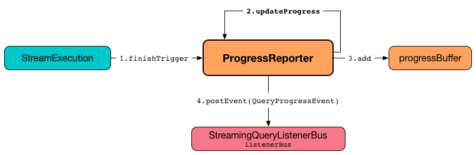

# ProgressReporter

`ProgressReporter` is an [abstraction](#contract) of [execution progress reporters](#implementations) that report statistics of execution of a streaming query.

## Contract

### <span id="currentBatchId"> currentBatchId

```scala
currentBatchId: Long
```

ID of the streaming batch

Used when:

* `MicroBatchExecution` is requested to [plan a query for the batch](../micro-batch-execution/MicroBatchExecution.md#runBatch-queryPlanning) (while [running a batch](../micro-batch-execution/MicroBatchExecution.md#runBatch))
* `ContinuousExecution` is requested to [plan a query for the epoch](../continuous-execution/ContinuousExecution.md#runContinuous-queryPlanning) (while [running continuously](../micro-batch-execution/MicroBatchExecution.md#runContinuous))
* `ProgressReporter` is requested for a new [StreamingQueryProgress](StreamingQueryProgress.md) (while [finishing a trigger](#finishTrigger))
* _other usage_

### <span id="id"> id

```scala
id: UUID
```

[Universally unique identifier (UUID)]({{ java.api }}/java/util/UUID.html) of the streaming query (that remains unchanged between restarts)

### <span id="lastExecution"> lastExecution

```scala
lastExecution: QueryExecution
```

[IncrementalExecution](../IncrementalExecution.md) of the streaming execution round (a batch or an epoch)

`IncrementalExecution` is created and executed in the **queryPlanning** phase of [MicroBatchExecution](../micro-batch-execution/MicroBatchExecution.md) and [ContinuousExecution](../continuous-execution/ContinuousExecution.md) stream execution engines.

### <span id="logicalPlan"> logicalPlan

```scala
logicalPlan: LogicalPlan
```

Logical query plan of the streaming query

!!! important
    The most interesting usage of the `LogicalPlan` is when stream execution engines replace (_transform_) input [StreamingExecutionRelation](../logical-operators/StreamingExecutionRelation.md) and [StreamingDataSourceV2Relation](../logical-operators/StreamingDataSourceV2Relation.md) operators with (operators with) data or `LocalRelation` (to represent no data at a source).

Used when `ProgressReporter` is requested for the following:

* [extract statistics from the most recent query execution](#extractExecutionStats) (to add `watermark` metric for [streaming watermark](../logical-operators/EventTimeWatermark.md))
* [extractSourceToNumInputRows](#extractSourceToNumInputRows)

### <span id="name"> name

```scala
name: String
```

Name of the streaming query

### <span id="newData"> newData

```scala
newData: Map[SparkDataStream, LogicalPlan]
```

[SparkDataStream](../SparkDataStream.md)s (from all data [sources](#sources)) with the more recent unprocessed input data (as `LogicalPlan`)

Used exclusively for [MicroBatchExecution](../micro-batch-execution/MicroBatchExecution.md) (when requested to [run a single micro-batch](../micro-batch-execution/MicroBatchExecution.md#runBatch))

Used when `ProgressReporter` is requested to [extractSourceToNumInputRows](#extractSourceToNumInputRows)

### <span id="offsetSeqMetadata"> offsetSeqMetadata

```scala
offsetSeqMetadata: OffsetSeqMetadata
```

[OffsetSeqMetadata](../OffsetSeqMetadata.md) (with the current micro-batch [event-time watermark](../OffsetSeqMetadata.md#batchWatermarkMs) and [timestamp](../OffsetSeqMetadata.md#batchTimestampMs))

### <span id="postEvent"> postEvent

```scala
postEvent(
  event: StreamingQueryListener.Event): Unit
```

Posts [StreamingQueryListener.Event](StreamingQueryListener.md#Event)

Used when:

* `ProgressReporter` is requested to [update progress](#updateProgress) (and posts a [QueryProgressEvent](StreamingQueryListener.md#QueryProgressEvent))
* `StreamExecution` is requested to [run stream processing](../StreamExecution.md#runStream) (and posts a [QueryStartedEvent](StreamingQueryListener.md#QueryStartedEvent) at the beginning and a [QueryTerminatedEvent](StreamingQueryListener.md#QueryTerminatedEvent) after a query has been stopped)

### <span id="runId"> runId

```scala
runId: UUID
```

[Universally unique identifier (UUID)](https://docs.oracle.com/javase/8/docs/api/java/util/UUID.html) of a single run of the streaming query (that changes every restart)

### <span id="sink"> sink

```scala
sink: Table
```

The one and only `Table` of the streaming query

### <span id="sinkCommitProgress"> sinkCommitProgress

```scala
sinkCommitProgress: Option[StreamWriterCommitProgress]
```

`StreamWriterCommitProgress` with number of output rows:

* `None` when `MicroBatchExecution` stream execution engine is requested to [populateStartOffsets](../micro-batch-execution/MicroBatchExecution.md#populateStartOffsets)

* Assigned a `StreamWriterCommitProgress` when `MicroBatchExecution` stream execution engine is about to complete [running a micro-batch](../micro-batch-execution/MicroBatchExecution.md#runBatch)

Used when [finishTrigger](#finishTrigger) (and [updating progress](#updateProgress))

### <span id="sources"> sources

```scala
sources: Seq[SparkDataStream]
```

### <span id="sparkSession"> sparkSession

```scala
sparkSession: SparkSession
```

`SparkSession` of the streaming query

!!! tip
    Find out more on [SparkSession](https://jaceklaskowski.github.io/mastering-spark-sql-book/SparkSession/) in [The Internals of Spark SQL](https://jaceklaskowski.github.io/mastering-spark-sql-book) online book.

### <span id="triggerClock"> triggerClock

```scala
triggerClock: Clock
```

Clock of the streaming query

## Implementations

* [StreamExecution](../StreamExecution.md)

## <span id="noDataProgressEventInterval"> spark.sql.streaming.noDataProgressEventInterval

`ProgressReporter` uses the [spark.sql.streaming.noDataProgressEventInterval](../configuration-properties.md#spark.sql.streaming.noDataProgressEventInterval) configuration property to control how long to wait between two progress events when there is no data (default: `10000L`) when [finishing a trigger](#finishTrigger).

## Demo

```text
import org.apache.spark.sql.streaming.Trigger
import scala.concurrent.duration._
val sampleQuery = spark
  .readStream
  .format("rate")
  .load
  .writeStream
  .format("console")
  .option("truncate", false)
  .trigger(Trigger.ProcessingTime(10.seconds))
  .start

// Using public API
import org.apache.spark.sql.streaming.SourceProgress
scala> sampleQuery.
     |   lastProgress.
     |   sources.
     |   map { case sp: SourceProgress =>
     |     s"source = ${sp.description} => endOffset = ${sp.endOffset}" }.
     |   foreach(println)
source = RateSource[rowsPerSecond=1, rampUpTimeSeconds=0, numPartitions=8] => endOffset = 663

scala> println(sampleQuery.lastProgress.sources(0))
res40: org.apache.spark.sql.streaming.SourceProgress =
{
  "description" : "RateSource[rowsPerSecond=1, rampUpTimeSeconds=0, numPartitions=8]",
  "startOffset" : 333,
  "endOffset" : 343,
  "numInputRows" : 10,
  "inputRowsPerSecond" : 0.9998000399920015,
  "processedRowsPerSecond" : 200.0
}

// With a hack
import org.apache.spark.sql.execution.streaming.StreamingQueryWrapper
val offsets = sampleQuery.
  asInstanceOf[StreamingQueryWrapper].
  streamingQuery.
  availableOffsets.
  map { case (source, offset) =>
    s"source = $source => offset = $offset" }
scala> offsets.foreach(println)
source = RateSource[rowsPerSecond=1, rampUpTimeSeconds=0, numPartitions=8] => offset = 293
```

## <span id="progressBuffer"> StreamingQueryProgress Queue

```scala
progressBuffer: Queue[StreamingQueryProgress]
```

`progressBuffer` is a [scala.collection.mutable.Queue](https://www.scala-lang.org/api/2.12.x/scala/collection/mutable/Queue.html) of [StreamingQueryProgress](StreamingQueryProgress.md)es.

`progressBuffer` has a new `StreamingQueryProgress` added when `ProgressReporter` is requested to [update progress of a streaming query](#updateProgress).

The oldest `StreamingQueryProgress` is removed (_dequeued_) above [spark.sql.streaming.numRecentProgressUpdates](../configuration-properties.md#spark.sql.streaming.numRecentProgressUpdates) threshold.

`progressBuffer` is used when `ProgressReporter` is requested for the [last](#lastProgress) and the [recent StreamingQueryProgresses](#recentProgress).

## <span id="status"><span id="currentStatus"> Current StreamingQueryStatus

```scala
status: StreamingQueryStatus
```

`status` is the current [StreamingQueryStatus](StreamingQueryStatus.md).

`status` is used when `StreamingQueryWrapper` is requested for the [current status of a streaming query](../StreamingQuery.md#status).

## <span id="updateProgress"> Updating Progress of Streaming Query

```scala
updateProgress(
  newProgress: StreamingQueryProgress): Unit
```

`updateProgress` records the input `newProgress` and posts a [QueryProgressEvent](StreamingQueryListener.md#QueryProgressEvent) event.



`updateProgress` adds the input `newProgress` to [progressBuffer](#progressBuffer).

`updateProgress` removes elements from [progressBuffer](#progressBuffer) if their number is or exceeds the value of [spark.sql.streaming.numRecentProgressUpdates](../configuration-properties.md#spark.sql.streaming.numRecentProgressUpdates) configuration property.

`updateProgress` [posts a QueryProgressEvent](#postEvent) (with the input `newProgress`).

`updateProgress` prints out the following INFO message to the logs:

```text
Streaming query made progress: [newProgress]
```

`updateProgress` is used when `ProgressReporter` is requested to [finish up a trigger](#finishTrigger).

## <span id="startTrigger"> Initializing Query Progress for New Trigger

```scala
startTrigger(): Unit
```

`startTrigger` prints out the following DEBUG message to the logs:

```text
Starting Trigger Calculation
```

.startTrigger's Internal Registry Changes For New Trigger
[cols="30,70",options="header",width="100%"]
|===
| Registry
| New Value

| <<lastTriggerStartTimestamp, lastTriggerStartTimestamp>>
| <<currentTriggerStartTimestamp, currentTriggerStartTimestamp>>

| <<currentTriggerStartTimestamp, currentTriggerStartTimestamp>>
| Requests the <<triggerClock, trigger clock>> for the current timestamp (in millis)

| <<currentStatus, currentStatus>>
| Enables (`true`) the `isTriggerActive` flag of the <<currentStatus, currentStatus>>

| <<currentTriggerStartOffsets, currentTriggerStartOffsets>>
| `null`

| <<currentTriggerEndOffsets, currentTriggerEndOffsets>>
| `null`

| <<currentDurationsMs, currentDurationsMs>>
| Clears the <<currentDurationsMs, currentDurationsMs>>

|===

`startTrigger` is used when:

* `MicroBatchExecution` stream execution engine is requested to [run an activated streaming query](../micro-batch-execution/MicroBatchExecution.md#runActivatedStream) (at the [beginning of every trigger](../micro-batch-execution/MicroBatchExecution.md#runActivatedStream-startTrigger))

* `ContinuousExecution` stream execution engine is requested to [run an activated streaming query](../continuous-execution/ContinuousExecution.md#runContinuous) (at the beginning of every trigger)

`StreamExecution` starts [running batches](../StreamExecution.md#runStream) (as part of [TriggerExecutor](../StreamExecution.md#triggerExecutor) executing a batch runner).

## <span id="finishTrigger"> Finishing Up Streaming Batch (Trigger)

```scala
finishTrigger(hasNewData: Boolean): Unit
```

`finishTrigger` sets [currentTriggerEndTimestamp](#currentTriggerEndTimestamp) to the current time (using [triggerClock](#triggerClock)).

`finishTrigger` <<extractExecutionStats, extractExecutionStats>>.

`finishTrigger` calculates the *processing time* (in seconds) as the difference between the <<currentTriggerEndTimestamp, end>> and <<currentTriggerStartTimestamp, start>> timestamps.

`finishTrigger` calculates the *input time* (in seconds) as the difference between the start time of the <<currentTriggerStartTimestamp, current>> and <<lastTriggerStartTimestamp, last>> triggers.

.ProgressReporter's finishTrigger and Timestamps
image::images/ProgressReporter-finishTrigger-timestamps.png[align="center"]

`finishTrigger` prints out the following DEBUG message to the logs:

```text
Execution stats: [executionStats]
```

`finishTrigger` creates a <<SourceProgress, SourceProgress>> (aka source statistics) for <<sources, every source used>>.

`finishTrigger` creates a <<SinkProgress, SinkProgress>> (aka sink statistics) for the <<sink, sink>>.

`finishTrigger` creates a [StreamingQueryProgress](StreamingQueryProgress.md).

If there was any data (using the input `hasNewData` flag), `finishTrigger` resets <<lastNoDataProgressEventTime, lastNoDataProgressEventTime>> (i.e. becomes the minimum possible time) and <<updateProgress, updates query progress>>.

Otherwise, when no data was available (using the input `hasNewData` flag), `finishTrigger` <<updateProgress, updates query progress>> only when <<lastNoDataProgressEventTime, lastNoDataProgressEventTime>> passed.

In the end, `finishTrigger` disables `isTriggerActive` flag of <<currentStatus, StreamingQueryStatus>> (i.e. sets it to `false`).

NOTE: `finishTrigger` is used exclusively when `MicroBatchExecution` is requested to <<MicroBatchExecution.md#runActivatedStream, run the activated streaming query>> (after <<MicroBatchExecution.md#runActivatedStream-triggerExecution, triggerExecution Phase>> at the end of a streaming batch).

## <span id="reportTimeTaken"> Time-Tracking Section (Recording Execution Time)

```scala
reportTimeTaken[T](
  triggerDetailKey: String)(
  body: => T): T
```

`reportTimeTaken` measures the time to execute `body` and records it in the [currentDurationsMs](#currentDurationsMs) internal registry under `triggerDetailKey` key. If the `triggerDetailKey` key was recorded already, the current execution time is added.

In the end, `reportTimeTaken` prints out the following DEBUG message to the logs and returns the result of executing `body`.

```text
[triggerDetailKey] took [time] ms
```

`reportTimeTaken` is used when [stream execution engines](../StreamExecution.md) are requested to execute the following phases (that appear as `triggerDetailKey` in the DEBUG message in the logs):

1. `MicroBatchExecution`
    1. [triggerExecution](../micro-batch-execution/MicroBatchExecution.md#runActivatedStream-triggerExecution)
    1. [getOffset](../micro-batch-execution/MicroBatchExecution.md#constructNextBatch-getOffset)
    1. [setOffsetRange](../micro-batch-execution/MicroBatchExecution.md#constructNextBatch-setOffsetRange)
    1. [getEndOffset](../micro-batch-execution/MicroBatchExecution.md#constructNextBatch-getEndOffset)
    1. [walCommit](../micro-batch-execution/MicroBatchExecution.md#constructNextBatch-walCommit)
    1. [getBatch](../micro-batch-execution/MicroBatchExecution.md#runBatch-getBatch)
    1. [queryPlanning](../micro-batch-execution/MicroBatchExecution.md#runBatch-queryPlanning)
    1. [addBatch](../micro-batch-execution/MicroBatchExecution.md#runBatch-addBatch)

1. `ContinuousExecution`
    1. [queryPlanning](../continuous-execution/ContinuousExecution.md#runContinuous-queryPlanning)
    1. [runContinuous](../continuous-execution/ContinuousExecution.md#runContinuous-runContinuous)

## <span id="updateStatusMessage"> Updating Status Message

```scala
updateStatusMessage(
  message: String): Unit
```

`updateStatusMessage` simply updates the `message` in the [StreamingQueryStatus](#currentStatus) internal registry.

`updateStatusMessage` is used when:

* `StreamExecution` is requested to [run stream processing](../StreamExecution.md#runStream)

* `MicroBatchExecution` is requested to [run an activated streaming query](../micro-batch-execution/MicroBatchExecution.md#runActivatedStream) or [construct the next streaming micro-batch](../micro-batch-execution/MicroBatchExecution.md#constructNextBatch)

## <span id="extractExecutionStats"> Generating Execution Statistics

```scala
extractExecutionStats(
  hasNewData: Boolean): ExecutionStats
```

`extractExecutionStats` generates an [ExecutionStats](ExecutionStats.md) of the <<lastExecution, last execution>> of the streaming query.

Internally, `extractExecutionStats` generate *watermark* metric (using the [event-time watermark](../OffsetSeqMetadata.md#batchWatermarkMs) of the <<offsetSeqMetadata, OffsetSeqMetadata>>) if there is a [EventTimeWatermark](../logical-operators/EventTimeWatermark.md) unary logical operator in the <<logicalPlan, logical plan>> of the streaming query.

`extractExecutionStats` [extractStateOperatorMetrics](#extractStateOperatorMetrics).

`extractExecutionStats` [extractSourceToNumInputRows](#extractSourceToNumInputRows).

`extractExecutionStats` finds the [EventTimeWatermarkExec](../physical-operators/EventTimeWatermarkExec.md) unary physical operator (with non-zero [EventTimeStats](../EventTimeStatsAccum.md)) and generates *max*, *min*, and *avg* statistics.

In the end, `extractExecutionStats` creates a [ExecutionStats](ExecutionStats.md) with the execution statistics.

If the input `hasNewData` flag is turned off (`false`), `extractExecutionStats` returns an [ExecutionStats](ExecutionStats.md) with no input rows and event-time statistics (that require data to be processed to have any sense).

NOTE: `extractExecutionStats` is used exclusively when `ProgressReporter` is requested to <<finishTrigger, finish up a streaming batch (trigger) and generate a StreamingQueryProgress>>.

## <span id="extractStateOperatorMetrics"> Generating StateStoreWriter Metrics (StateOperatorProgress)

```scala
extractStateOperatorMetrics(
  hasNewData: Boolean): Seq[StateOperatorProgress]
```

`extractStateOperatorMetrics` requests the <<lastExecution, QueryExecution>> for the optimized execution plan (`executedPlan`) and finds all [StateStoreWriter](../physical-operators/StateStoreWriter.md) physical operators and requests them for [StateOperatorProgress](../physical-operators/StateStoreWriter.md#getProgress).

`extractStateOperatorMetrics` clears (_zeros_) the *numRowsUpdated* metric for the given `hasNewData` turned off (`false`).

`extractStateOperatorMetrics` returns an empty collection for the <<lastExecution, QueryExecution>> uninitialized (`null`).

`extractStateOperatorMetrics` is used when `ProgressReporter` is requested to [generate execution statistics](#extractExecutionStats).

## <span id="recordTriggerOffsets"> Recording Trigger Offsets (StreamProgress)

```scala
recordTriggerOffsets(
  from: StreamProgress,
  to: StreamProgress): Unit
```

`recordTriggerOffsets` simply sets (_records_) the <<currentTriggerStartOffsets, currentTriggerStartOffsets>> and <<currentTriggerEndOffsets, currentTriggerEndOffsets>> internal registries to the [json](../Offset.md#json) representations of the `from` and `to` [StreamProgresses](../StreamProgress.md).

`recordTriggerOffsets` is used when:

* `MicroBatchExecution` is requested to <<MicroBatchExecution.md#runActivatedStream, run the activated streaming query>>

* `ContinuousExecution` is requested to <<ContinuousExecution.md#commit, commit an epoch>>

## <span id="lastProgress"> Last StreamingQueryProgress

```scala
lastProgress: StreamingQueryProgress
```

The last [StreamingQueryProgress](StreamingQueryProgress.md)

## currentDurationsMs

[scala.collection.mutable.HashMap]({{ scala.api }}/index.html#scala.collection.mutable.HashMap) of action names (aka _triggerDetailKey_) and their cumulative times (in milliseconds).


Starts empty when `ProgressReporter` [sets the state for a new batch](#startTrigger) with new entries added or updated when [reporting execution time](#reportTimeTaken) (of an action).

`currentDurationsMs` is available as `durationMs` of a streaming query.

```text
scala> :type q
org.apache.spark.sql.streaming.StreamingQuery

scala> query.lastProgress.durationMs
res1: java.util.Map[String,Long] = {triggerExecution=60, queryPlanning=1, getBatch=5, getOffset=0, addBatch=30, walCommit=23}

scala> println(q.lastProgress)
{
  "id" : "03fc78fc-fe19-408c-a1ae-812d0e28fcee",
  "runId" : "8c247071-afba-40e5-aad2-0e6f45f22488",
  "name" : null,
  "timestamp" : "2017-08-14T20:30:00.004Z",
  "batchId" : 1,
  "numInputRows" : 432,
  "inputRowsPerSecond" : 0.9993568953312452,
  "processedRowsPerSecond" : 1380.1916932907347,
  "durationMs" : {
    "addBatch" : 237,
    "getBatch" : 26,
    "getOffset" : 0,
    "queryPlanning" : 1,
    "triggerExecution" : 313,
    "walCommit" : 45
  },
  "stateOperators" : [ ],
  "sources" : [ {
    "description" : "RateSource[rowsPerSecond=1, rampUpTimeSeconds=0, numPartitions=8]",
    "startOffset" : 0,
    "endOffset" : 432,
    "numInputRows" : 432,
    "inputRowsPerSecond" : 0.9993568953312452,
    "processedRowsPerSecond" : 1380.1916932907347
  } ],
  "sink" : {
    "description" : "ConsoleSink[numRows=20, truncate=true]"
  }
}
```

## Internal Properties

### currentTriggerEndTimestamp

Timestamp of when the current batch/trigger has ended

Default: `-1L`

### currentTriggerStartOffsets

```scala
currentTriggerStartOffsets: Map[BaseStreamingSource, String]
```

Start offsets (in [JSON format](../Offset.md#json)) per streaming source

Used exclusively when <<finishTrigger, finishing up a streaming batch (trigger) and generating StreamingQueryProgress>> (for a [SourceProgress](SourceProgress.md))

Reset (`null`) when <<startTrigger, initializing a query progress for a new trigger>>

Initialized when <<recordTriggerOffsets, recording trigger offsets (StreamProgress)>>

### currentTriggerStartTimestamp

Timestamp of when the current batch/trigger has started

Default: `-1L`

### lastTriggerStartTimestamp

Timestamp of when the last batch/trigger started

Default: `-1L`

## Logging

Configure logging of the [concrete stream execution progress reporters](#implementations) to see what happens inside:

* [ContinuousExecution](../continuous-execution/ContinuousExecution.md#logging)

* [MicroBatchExecution](../micro-batch-execution/MicroBatchExecution.md#logging)
