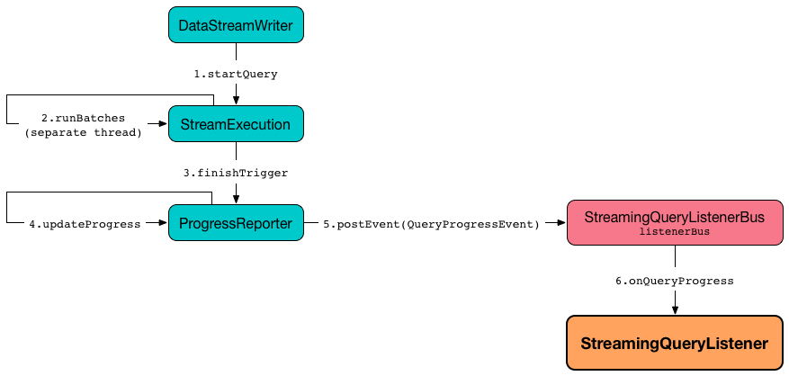
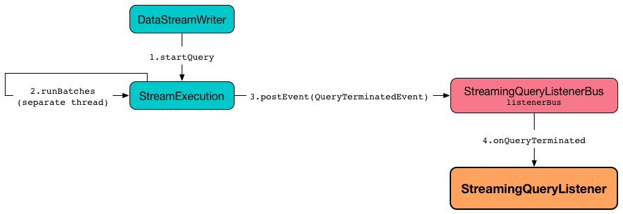

# StreamingQueryListener &mdash; Intercepting Life Cycle Events of Streaming Queries

`StreamingQueryListener` is an [abstraction](#contract) of listeners to be notified about the [life cycle events](#events) of all the streaming queries in a Spark Structured Streaming application:

* [Query started](#onQueryStarted)
* [Query made progress](#onQueryProgress)
* [Query terminated](#onQueryTerminated)

`StreamingQueryListener` is used internally by `StreamingQueryListenerBus` to [post a streaming event to all registered StreamingQueryListeners](../StreamingQueryListenerBus.md#doPostEvent).

`StreamingQueryListener` can be used by Spark developers to [intercept events](#contract) in Spark Structured Streaming applications.

## Contract

### <span id="onQueryProgress"> onQueryProgress

```scala
onQueryProgress(
  event: QueryProgressEvent): Unit
```

Informs that `MicroBatchExecution` has finished [triggerExecution phase](../MicroBatchExecution.md#runActivatedStream-triggerExecution) (the end of a streaming batch)



### <span id="onQueryStarted"> onQueryStarted

```scala
onQueryStarted(
  event: QueryStartedEvent): Unit
```

Informs that `DataStreamWriter` was requested to [start execution of the streaming query](../DataStreamWriter.md#start) (on the [stream execution thread](../StreamExecution.md#queryExecutionThread))


!!! note
    `onQueryStarted` is used internally to unblock the [starting thread](../StreamExecution.md#start) of `StreamExecution`.

### <span id="onQueryTerminated"> onQueryTerminated

```scala
onQueryTerminated(
  event: QueryTerminatedEvent): Unit
```

Informs that a streaming query was <<StreamingQuery.md#stop, stopped>> or terminated due to an error



## <span id="events"> Lifecycle Events

`StreamingQueryListener` is informed about the life cycle events when `StreamingQueryListenerBus` is requested to [doPostEvent](../StreamingQueryListenerBus.md#doPostEvent).

### QueryStartedEvent

* [id](../StreamingQuery.md#id)
* [runId](../StreamingQuery.md#runId)
* [name](../StreamingQuery.md#name)

Intercepted by [onQueryStarted](#onQueryStarted)

Posted when `StreamExecution` is requested to [run stream processing](../StreamExecution.md#runStream) (when `DataStreamWriter` is requested to [start execution of the streaming query](../DataStreamWriter.md#start) on the [stream execution thread](../StreamExecution.md#queryExecutionThread))

### QueryProgressEvent

* [StreamingQueryProgress](StreamingQueryProgress.md)

Intercepted by [onQueryProgress](#onQueryProgress)

Posted when `ProgressReporter` is requested to [update progress of a streaming query](ProgressReporter.md#updateProgress) (after `MicroBatchExecution` has finished [triggerExecution phase](../MicroBatchExecution.md#runActivatedStream-triggerExecution) at the end of a streaming batch)

### QueryTerminatedEvent

* [id](../StreamingQuery.md#id)
* [runId](../StreamingQuery.md#runId)
* [exception](../StreamExecution.md#exception) if terminated due to an error

Intercepted by [onQueryTerminated](#onQueryTerminated)

Posted when `StreamExecution` is requested to [run stream processing](../StreamExecution.md#runStream) (and the streaming query was [stopped](../StreamingQuery.md#stop) or terminated due to an error)

## Registering StreamingQueryListener

`StreamingQueryListener` can be registered using [StreamingQueryManager.addListener](../StreamingQueryManager.md#addListener) method.

```text
val queryListener: StreamingQueryListener = ...
spark.streams.addListener(queryListener)
```

## Deregistering StreamingQueryListener

`StreamingQueryListener` can be deregistered using [StreamingQueryManager.removeListener](../StreamingQueryManager.md#removeListener) method.

```scala
val queryListener: StreamingQueryListener = ...
spark.streams.removeListener(queryListener)
```
