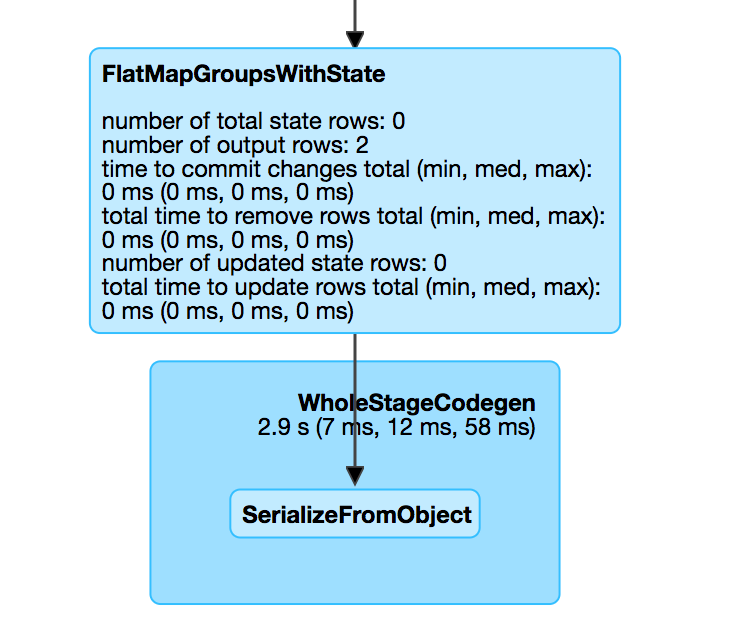

# FlatMapGroupsWithStateExec Unary Physical Operator

`FlatMapGroupsWithStateExec` is a unary physical operator that represents [FlatMapGroupsWithState](../logical-operators/FlatMapGroupsWithState.md) logical operator at execution time.

!!! note
    A unary physical operator (`UnaryExecNode`) is a physical operator with a single [child](#child) physical operator.

    Read up on [UnaryExecNode](https://jaceklaskowski.github.io/mastering-spark-sql-book/physical-operators/UnaryExecNode/) (and physical operators in general) in [The Internals of Spark SQL](https://jaceklaskowski.github.io/mastering-spark-sql-book) online book.

`FlatMapGroupsWithStateExec` is an `ObjectProducerExec` physical operator and so produces a [single output object](#outputObjAttr).

!!! tip
    Read up on [ObjectProducerExec](https://jaceklaskowski.github.io/mastering-spark-sql-book/physical-operators/ObjectProducerExec/) physical operator in [The Internals of Spark SQL](https://jaceklaskowski.github.io/mastering-spark-sql-book) online book.

!!! tip
    Check out [Demo: Internals of FlatMapGroupsWithStateExec Physical Operator](../demo/spark-sql-streaming-demo-FlatMapGroupsWithStateExec.md).

!!! note
    `FlatMapGroupsWithStateExec` is given an [OutputMode](#outputMode) when created, but it does not seem to be used at all. Check out the question [What's the purpose of OutputMode in flatMapGroupsWithState? How/where is it used?](https://stackoverflow.com/q/56921772/1305344) on StackOverflow.

## Creating Instance

`FlatMapGroupsWithStateExec` takes the following to be created:

* <span id="func"> **User-defined state function** that is applied to every group (of type `(Any, Iterator[Any], LogicalGroupState[Any]) => Iterator[Any]`)
* <span id="keyDeserializer"> Deserializer expression for keys
* <span id="valueDeserializer"> Deserializer expression for values
* <span id="groupingAttributes"> Grouping attributes (as used for grouping in [KeyValueGroupedDataset](../KeyValueGroupedDataset.md#groupingAttributes) for `mapGroupsWithState` or `flatMapGroupsWithState` operators)
* <span id="dataAttributes"> Data attributes
* <span id="outputObjAttr"> Output object attribute (that is the reference to the single object field this operator outputs)
* <span id="stateInfo"> Optional [StatefulOperatorStateInfo](../spark-sql-streaming-StatefulOperatorStateInfo.md)
* <span id="stateEncoder"> State encoder (`ExpressionEncoder[Any]`)
* <span id="stateFormatVersion"> State format version
* <span id="outputMode"> [OutputMode](../OutputMode.md)
* <span id="timeoutConf"> [GroupStateTimeout](../spark-sql-streaming-GroupStateTimeout.md)
* <span id="batchTimestampMs"> Optional [Batch Processing Time](../spark-structured-streaming-batch-processing-time.md)
* <span id="eventTimeWatermark"> Optional [Event-Time Watermark](../spark-sql-streaming-watermark.md)
* <span id="child"> Child physical operator

`FlatMapGroupsWithStateExec` is created when [FlatMapGroupsWithStateStrategy](../spark-sql-streaming-FlatMapGroupsWithStateStrategy.md) execution planning strategy is executed (and plans a [FlatMapGroupsWithState](../logical-operators/FlatMapGroupsWithState.md) logical operator for execution).

## <span id="doExecute"> Executing Physical Operator

```scala
doExecute(): RDD[InternalRow]
```

`doExecute` first initializes the [metrics](StateStoreWriter.md#metrics) (which happens on the driver).

`doExecute` then requests the [child](#child) physical operator to execute (and generate an `RDD[InternalRow]`).

`doExecute` uses [StateStoreOps](../spark-sql-streaming-StateStoreOps.md) to [create a StateStoreRDD](../spark-sql-streaming-StateStoreOps.md#mapPartitionsWithStateStore) with a `storeUpdateFunction` that does the following (for a partition):

1. Creates an [InputProcessor](../InputProcessor.md) for a given [StateStore](../spark-sql-streaming-StateStore.md)

1. (only when the [GroupStateTimeout](#timeoutConf) is [EventTimeTimeout](../spark-sql-streaming-GroupStateTimeout.md#EventTimeTimeout)) Filters out late data based on the [event-time watermark](../spark-sql-streaming-WatermarkSupport.md#watermarkPredicateForData), i.e. rows from a given `Iterator[InternalRow]` that are older than the [event-time watermark](../spark-sql-streaming-WatermarkSupport.md#watermarkPredicateForData) are excluded from the steps that follow

1. Requests the `InputProcessor` to [create an iterator of a new data processed](../InputProcessor.md#processNewData) from the (possibly filtered) iterator

1. Requests the `InputProcessor` to [create an iterator of a timed-out state data](../InputProcessor.md#processTimedOutState)

1. Creates an iterator by concatenating the above iterators (with the new data processed first)

1. In the end, creates a `CompletionIterator` that executes a completion function (`completionFunction`) after it has successfully iterated through all the elements (i.e. when a client has consumed all the rows). The completion method requests the given `StateStore` to [commit changes](../spark-sql-streaming-StateStore.md#commit) followed by [setting the store-specific metrics](StateStoreWriter.md#setStoreMetrics)

`doExecute` is part of Spark SQL's `SparkPlan` abstraction.

## <span id="metrics"> Performance Metrics

`FlatMapGroupsWithStateExec` uses the performance metrics of [StateStoreWriter](StateStoreWriter.md#metrics).



## <span id="StateStoreWriter"> StateStoreWriter

`FlatMapGroupsWithStateExec` is a [stateful physical operator that can write to a state store](StateStoreWriter.md) (and `MicroBatchExecution` requests [whether to run another batch or not](#shouldRunAnotherBatch) based on the [GroupStateTimeout](#timeoutConf)).

`FlatMapGroupsWithStateExec` uses the [GroupStateTimeout](#timeoutConf) (and possibly the updated [metadata](../OffsetSeqMetadata.md)) when asked [whether to run another batch or not](#shouldRunAnotherBatch) (when `MicroBatchExecution` is requested to [construct the next streaming micro-batch](../MicroBatchExecution.md#constructNextBatch) when requested to [run the activated streaming query](../MicroBatchExecution.md#runActivatedStream)).

## <span id="WatermarkSupport"> Streaming Event-Time Watermark Support

`FlatMapGroupsWithStateExec` is a [physical operator that supports streaming event-time watermark](../spark-sql-streaming-WatermarkSupport.md).

`FlatMapGroupsWithStateExec` is given the [optional event time watermark](#eventTimeWatermark) when created.

The [event-time watermark](#eventTimeWatermark) is initially undefined (`None`) when planned for execution (in [FlatMapGroupsWithStateStrategy](../spark-sql-streaming-FlatMapGroupsWithStateStrategy.md) execution planning strategy).

!!! note
    `FlatMapGroupsWithStateStrategy` converts [FlatMapGroupsWithState](../logical-operators/FlatMapGroupsWithState.md) unary logical operator to `FlatMapGroupsWithStateExec` physical operator with undefined [StatefulOperatorStateInfo](#stateInfo), [batchTimestampMs](#batchTimestampMs), and [eventTimeWatermark](#eventTimeWatermark).

The [event-time watermark](#eventTimeWatermark) (with the [StatefulOperatorStateInfo](#stateInfo) and the [batchTimestampMs](#batchTimestampMs)) is only defined to the [current event-time watermark](../OffsetSeqMetadata.md#batchWatermarkMs) of the given [OffsetSeqMetadata](../IncrementalExecution.md#offsetSeqMetadata) when `IncrementalExecution` query execution pipeline is requested to apply the [state](../IncrementalExecution.md#state) preparation rule (as part of the [preparations](../IncrementalExecution.md#preparations) rules).

!!! note
    The [preparations](../IncrementalExecution.md#preparations) rules are executed (applied to a physical query plan) at the `executedPlan` phase of Structured Query Execution Pipeline to generate an optimized physical query plan ready for execution).

    Read up on [Structured Query Execution Pipeline](https://jaceklaskowski.github.io/mastering-spark-sql-book/QueryExecution/) in [The Internals of Spark SQL](https://jaceklaskowski.github.io/mastering-spark-sql-book/) online book.

`IncrementalExecution` is used as the [lastExecution](../StreamExecution.md#lastExecution) of the available [streaming query execution engines](../StreamExecution.md#extensions). It is created in the **queryPlanning** phase (of the [MicroBatchExecution](../MicroBatchExecution.md#runBatch-queryPlanning) and [ContinuousExecution](../ContinuousExecution.md#runContinuous-queryPlanning) execution engines) based on the current [OffsetSeqMetadata](../StreamExecution.md#offsetSeqMetadata).

!!! note
    The [optional event-time watermark](#eventTimeWatermark) can only be defined when the [state](../IncrementalExecution.md#state) preparation rule is executed which is at the `executedPlan` phase of Structured Query Execution Pipeline which is also part of the **queryPlanning** phase.

## <span id="stateManager"> StateManager

```scala
stateManager: StateManager
```

While being created, `FlatMapGroupsWithStateExec` creates a [StateManager](../spark-sql-streaming-StateManager.md) (with the [state encoder](#stateEncoder) and the [isTimeoutEnabled](#isTimeoutEnabled) flag).

A `StateManager` is [created](../spark-sql-streaming-FlatMapGroupsWithStateExecHelper.md#createStateManager) per [state format version](#stateFormatVersion) that is given while creating a `FlatMapGroupsWithStateExec` (to choose between the [available implementations](../spark-sql-streaming-StateManagerImplBase.md#implementations)).

The [state format version](#stateFormatVersion) is controlled by [spark.sql.streaming.flatMapGroupsWithState.stateFormatVersion](../spark-sql-streaming-properties.md#spark.sql.streaming.flatMapGroupsWithState.stateFormatVersion) internal configuration property.

The `StateManager` is used exclusively when `FlatMapGroupsWithStateExec` physical operator is [executed](#doExecute) for the following:

* [State schema](../spark-sql-streaming-StateManager.md#stateSchema) (for the [value schema](../spark-sql-streaming-StateStoreRDD.md#valueSchema) of a [StateStoreRDD](../spark-sql-streaming-StateStoreRDD.md))

* [State data for a key in a StateStore](../spark-sql-streaming-StateManager.md#getState) while [processing new data](../InputProcessor.md#processNewData)

* [All state data (for all keys) in a StateStore](../spark-sql-streaming-StateManager.md#getAllState) while [processing timed-out state data](../InputProcessor.md#processTimedOutState)

* [Removing the state for a key from a StateStore](../spark-sql-streaming-StateManager.md#removeState) when [all rows have been processed](../InputProcessor.md#onIteratorCompletion)

* [Persisting the state for a key in a StateStore](../spark-sql-streaming-StateManager.md#putState) when [all rows have been processed](../InputProcessor.md#onIteratorCompletion)

## <span id="keyExpressions"> keyExpressions Method

```scala
keyExpressions: Seq[Attribute]
```

`keyExpressions` simply returns the [grouping attributes](#groupingAttributes).

`keyExpressions` is part of the [WatermarkSupport](../spark-sql-streaming-WatermarkSupport.md#keyExpressions) abstraction.

## <span id="shouldRunAnotherBatch"> Checking Out Whether Last Batch Execution Requires Another Non-Data Batch or Not

```scala
shouldRunAnotherBatch(
  newMetadata: OffsetSeqMetadata): Boolean
```

`shouldRunAnotherBatch` uses the [GroupStateTimeout](#timeoutConf) as follows:

* With [EventTimeTimeout](../spark-sql-streaming-GroupStateTimeout.md#EventTimeTimeout), `shouldRunAnotherBatch` is `true` only when the [event-time watermark](#eventTimeWatermark) is defined and is older (below) the [event-time watermark](../OffsetSeqMetadata.md#batchWatermarkMs) of the given `OffsetSeqMetadata`

* With [NoTimeout](../spark-sql-streaming-GroupStateTimeout.md#NoTimeout) (and other [GroupStateTimeouts](../spark-sql-streaming-GroupStateTimeout.md#extensions) if there were any), `shouldRunAnotherBatch` is always `false`

* With [ProcessingTimeTimeout](../spark-sql-streaming-GroupStateTimeout.md#ProcessingTimeTimeout), `shouldRunAnotherBatch` is always `true`

`shouldRunAnotherBatch` is part of the [StateStoreWriter](StateStoreWriter.md#shouldRunAnotherBatch) abstraction.

## Internal Properties

### <span id="isTimeoutEnabled"> isTimeoutEnabled Flag

Flag that says whether the [GroupStateTimeout](#timeoutConf) is not [NoTimeout](../spark-sql-streaming-GroupStateTimeout.md#NoTimeout)

Used when:

* `FlatMapGroupsWithStateExec` is created (and creates the internal [StateManager](#stateManager))
* `InputProcessor` is requested to [processTimedOutState](../InputProcessor.md#processTimedOutState)

### <span id="watermarkPresent"> watermarkPresent Flag

Flag that says whether the [child](#child) physical operator has a [watermark attribute](../EventTimeWatermark.md#delayKey) (among the output attributes).

Used when `InputProcessor` is requested to [callFunctionAndUpdateState](../InputProcessor.md#callFunctionAndUpdateState)

## Logging

Enable `ALL` logging level for `org.apache.spark.sql.execution.streaming.FlatMapGroupsWithStateExec` logger to see what happens inside.

Add the following line to `conf/log4j.properties`:

```text
log4j.logger.org.apache.spark.sql.execution.streaming.FlatMapGroupsWithStateExec=ALL
```

Refer to [Logging](../spark-logging.md).
