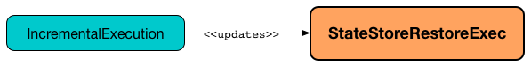

# StateStoreRestoreExec Unary Physical Operator

## <span id="requiredChildDistribution"> Required Child Output Distribution

```scala
requiredChildDistribution: Seq[Distribution]
```

`requiredChildDistribution` is part of the `SparkPlan` ([Spark SQL]({{ book.spark_sql }}/physical-operators/SparkPlan/#requiredChildDistribution)) abstraction.

---

`requiredChildDistribution`...FIXME

## Review Me

`StateStoreRestoreExec` is a unary physical operator that [restores (reads) a streaming state from a state store](StateStoreReader.md) (for the keys from the <<child, child>> physical operator).

`StateStoreRestoreExec` is <<creating-instance, created>> exclusively when [StatefulAggregationStrategy](../execution-planning-strategies/StatefulAggregationStrategy.md) execution planning strategy is requested to plan a [streaming aggregation](../streaming-aggregation/index.md) for execution (`Aggregate` logical operators in the logical plan of a streaming query).


The optional <<stateInfo, StatefulOperatorStateInfo>> is initially undefined (i.e. when `StateStoreRestoreExec` is <<creating-instance, created>>). `StateStoreRestoreExec` is updated to hold the streaming batch-specific execution property when `IncrementalExecution` [prepares a streaming physical plan for execution](../IncrementalExecution.md#preparations) (and [state](../IncrementalExecution.md#state) preparation rule is executed when `StreamExecution` MicroBatchExecution.md#runBatch-queryPlanning[plans a streaming query] for a streaming batch).



When <<doExecute, executed>>, `StateStoreRestoreExec` executes the <<child, child>> physical operator and [creates a StateStoreRDD to map over partitions](../StateStoreOps.md#mapPartitionsWithStateStore) with `storeUpdateFunction` that restores the state for the keys in the input rows if available.

[[output]]
The output schema of `StateStoreRestoreExec` is exactly the <<child, child>>'s output schema.

[[outputPartitioning]]
The output partitioning of `StateStoreRestoreExec` is exactly the <<child, child>>'s output partitioning.

=== [[metrics]] Performance Metrics (SQLMetrics)

[cols="1m,1,3",options="header",width="100%"]
|===
| Key
| Name (in UI)
| Description

| numOutputRows
| number of output rows
| [[numOutputRows]] The number of input rows from the <<child, child>> physical operator (for which `StateStoreRestoreExec` tried to find the state)
|===

.StateStoreRestoreExec in web UI (Details for Query)
image::images/StateStoreRestoreExec-webui-query-details.png[align="center"]

## Creating Instance

`StateStoreRestoreExec` takes the following to be created:

* [[keyExpressions]] **Key expressions** (Catalyst attributes for the grouping keys)
* [[stateInfo]] Optional [StatefulOperatorStateInfo](../StatefulOperatorStateInfo.md) (default: `None`)
* [[stateFormatVersion]] Version of the state format (based on the [spark.sql.streaming.aggregation.stateFormatVersion](../configuration-properties.md#spark.sql.streaming.aggregation.stateFormatVersion) configuration property)
* [[child]] Child physical operator (`SparkPlan`)

=== [[stateManager]] StateStoreRestoreExec and StreamingAggregationStateManager -- `stateManager` Property

[source, scala]
----
stateManager: StreamingAggregationStateManager
----

`stateManager` is a [StreamingAggregationStateManager](../StreamingAggregationStateManager.md) that is created together with `StateStoreRestoreExec`.

The `StreamingAggregationStateManager` is created for the <<keyExpressions, keys>>, the output schema of the <<child, child>> physical operator and the <<stateFormatVersion, version of the state format>>.

The `StreamingAggregationStateManager` is used when `StateStoreRestoreExec` is requested to <<doExecute, generate a recipe for a distributed computation (as a RDD[InternalRow])>> for the following:

* [Schema of the values in a state store](../StreamingAggregationStateManager.md#getStateValueSchema)

* [Extracting the columns for the key from the input row](../StreamingAggregationStateManager.md#getKey)

* [Looking up the value of a key from a state store](../StreamingAggregationStateManager.md#get)

## <span id="doExecute"> Executing Physical Operator (Generating RDD[InternalRow])

```scala
doExecute(): RDD[InternalRow]
```

`doExecute` is part of the `SparkPlan` abstraction.

Internally, `doExecute` executes <<child, child>> physical operator and [creates a StateStoreRDD](../StateStoreOps.md#mapPartitionsWithStateStore) with `storeUpdateFunction` that does the following per <<child, child>> operator's RDD partition:

1. Generates an unsafe projection to access the key field (using <<keyExpressions, keyExpressions>> and the output schema of <<child, child>> operator).

1. For every input row (as `InternalRow`)

* Extracts the key from the row (using the unsafe projection above)

* [Gets the saved state](../StateStore.md#get) in `StateStore` for the key if available (it might not be if the key appeared in the input the first time)

* Increments <<numOutputRows, numOutputRows>> metric (that in the end is the number of rows from the <<child, child>> operator)

* Generates collection made up of the current row and possibly the state for the key if available

NOTE: The number of rows from `StateStoreRestoreExec` is the number of rows from the <<child, child>> operator with additional rows for the saved state.

NOTE: There is no way in `StateStoreRestoreExec` to find out how many rows had associated state available in a state store. You would have to use the corresponding `StateStoreSaveExec` operator's StateStoreSaveExec.md#metrics[metrics] (most likely `number of total state rows` but that could depend on the output mode).
