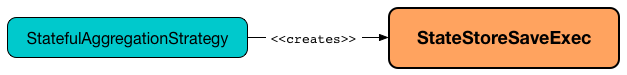
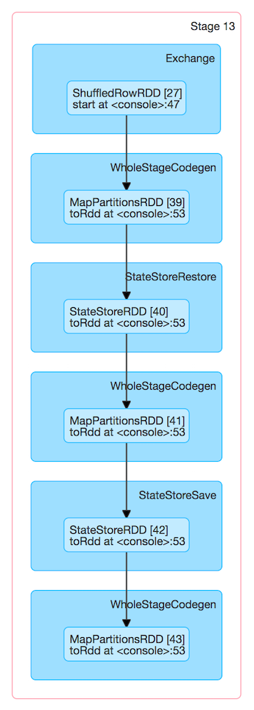
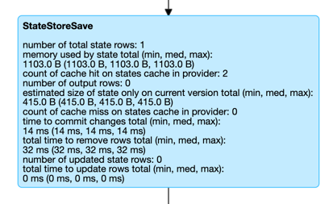

# StateStoreSaveExec Physical Operator

`StateStoreSaveExec` is a unary physical operator ([Spark SQL]({{ book.spark_sql }}/physical-operators/UnaryExecNode)) that [saves a streaming state to a state store](StateStoreWriter.md) with [support for streaming watermark](../WatermarkSupport.md).

## <span id="requiredChildDistribution"> Required Child Output Distribution

```scala
requiredChildDistribution: Seq[Distribution]
```

`requiredChildDistribution` is part of the `SparkPlan` ([Spark SQL]({{ book.spark_sql }}/physical-operators/SparkPlan/#requiredChildDistribution)) abstraction.

---

`requiredChildDistribution`...FIXME

## Review Me

`StateStoreSaveExec` is <<creating-instance, created>> when [StatefulAggregationStrategy](../execution-planning-strategies/StatefulAggregationStrategy.md) execution planning strategy is requested to plan a [streaming aggregation](../streaming-aggregation/index.md) for execution (`Aggregate` logical operators in the logical plan of a streaming query).



The optional properties, i.e. the <<stateInfo, StatefulOperatorStateInfo>>, the <<outputMode, output mode>>, and the <<eventTimeWatermark, event-time watermark>>, are initially undefined when `StateStoreSaveExec` is <<creating-instance, created>>. `StateStoreSaveExec` is updated to hold execution-specific configuration when `IncrementalExecution` is requested to [prepare the logical plan (of a streaming query) for execution](../IncrementalExecution.md#preparing-for-execution) (when the [state preparation rule](../IncrementalExecution.md#state) is executed).


!!! note
    Unlike [StateStoreRestoreExec](StateStoreRestoreExec.md) operator, `StateStoreSaveExec` takes [output mode](#outputMode) and [event time watermark](#eventTimeWatermark) when [created](#creating-instance).

When <<doExecute, executed>>, `StateStoreSaveExec` [creates a StateStoreRDD to map over partitions](../StateStoreOps.md#mapPartitionsWithStateStore) with `storeUpdateFunction` that manages the `StateStore`.




!!! note
    The number of partitions of [StateStoreRDD](../StateStoreOps.md#mapPartitionsWithStateStore) (and hence the number of Spark tasks) is what was defined for the <<child, child>> physical plan.

    There will be that many `StateStores` as there are partitions in `StateStoreRDD`.

NOTE: `StateStoreSaveExec` <<doExecute, behaves>> differently per output mode.

When <<doExecute, executed>>, `StateStoreSaveExec` executes the <<child, child>> physical operator and [creates a StateStoreRDD](../StateStoreOps.md#mapPartitionsWithStateStore) (with `storeUpdateFunction` specific to the output mode).

[[output]]
The output schema of `StateStoreSaveExec` is exactly the <<child, child>>'s output schema.

[[outputPartitioning]]
The output partitioning of `StateStoreSaveExec` is exactly the <<child, child>>'s output partitioning.

[[stateManager]]
`StateStoreRestoreExec` uses a [StreamingAggregationStateManager](../StreamingAggregationStateManager.md) (that is [created](../StreamingAggregationStateManager.md#createStateManager) for the [keyExpressions](#keyExpressions), the output of the [child](#child) physical operator and the [stateFormatVersion](#stateFormatVersion)).

[[logging]]
[TIP]
====
Enable `ALL` logging level for `org.apache.spark.sql.execution.streaming.StateStoreSaveExec` to see what happens inside.

Add the following line to `conf/log4j.properties`:

```
log4j.logger.org.apache.spark.sql.execution.streaming.StateStoreSaveExec=ALL
```

Refer to <<spark-sql-streaming-spark-logging.md#, Logging>>.
====

=== [[metrics]] Performance Metrics (SQLMetrics)

`StateStoreSaveExec` uses the performance metrics as [other stateful physical operators that write to a state store](StateStoreWriter.md#metrics).



The following table shows how the performance metrics are computed (and so their exact meaning).

[cols="30,70",options="header",width="100%"]
|===
| Name (in web UI)
| Description

| total time to update rows
a| [[allUpdatesTimeMs]] [Time taken](StateStoreWriter.md#timeTakenMs) to read the input rows and [store them in a state store](../StreamingAggregationStateManager.md#put) (possibly filtering out expired rows per [watermarkPredicateForData](../WatermarkSupport.md#watermarkPredicateForData) predicate)

The number of rows stored is the <<numUpdatedStateRows, number of updated state rows>> metric

* For <<outputMode, Append>> output mode, the [time taken](StateStoreWriter.md#timeTakenMs) to filter out expired rows (per the required [watermarkPredicateForData](../WatermarkSupport.md#watermarkPredicateForData) predicate) and the <<stateManager, StreamingAggregationStateManager>> to [store rows in a state store](../StreamingAggregationStateManager.md#put)

* For <<outputMode, Complete>> output mode, the [time taken](StateStoreWriter.md#timeTakenMs) to go over all the input rows and request the <<stateManager, StreamingAggregationStateManager>> to [store rows in a state store](../StreamingAggregationStateManager.md#put)

* For <<outputMode, Update>> output mode, the [time taken](StateStoreWriter.md#timeTakenMs) to filter out expired rows (per the optional [watermarkPredicateForData](../WatermarkSupport.md#watermarkPredicateForData) predicate) and the <<stateManager, StreamingAggregationStateManager>> to [store rows in a state store](../StreamingAggregationStateManager.md#put)

| total time to remove rows
a| [[allRemovalsTimeMs]]

* For <<outputMode, Append>> output mode, the time taken for the <<stateManager, StreamingAggregationStateManager>> to [remove all expired entries from a state store](../StreamingAggregationStateManager.md#remove) (per [watermarkPredicateForKeys](../WatermarkSupport.md#watermarkPredicateForKeys) predicate) that is the total time of iterating over [all entries in the state store](../StreamingAggregationStateManager.md#iterator) (the number of entries [removed from a state store](../StreamingAggregationStateManager.md#remove) is the difference between the number of output rows of the [child](#child) operator and the [number of total state rows](#numTotalStateRows) metric)

* For <<outputMode, Complete>> output mode, always `0`

* For <<outputMode, Update>> output mode, the [time taken](StateStoreWriter.md#timeTakenMs) for the <<stateManager, StreamingAggregationStateManager>> to [remove all expired entries from a state store](../WatermarkSupport.md#removeKeysOlderThanWatermark) (per [watermarkPredicateForKeys](../WatermarkSupport.md#watermarkPredicateForKeys) predicate)

| time to commit changes
a| [[commitTimeMs]] [Time taken](StateStoreWriter.md#timeTakenMs) for the [StreamingAggregationStateManager](#stateManager) to [commit changes to a state store](../StreamingAggregationStateManager.md#commit)

| number of output rows
a| [[numOutputRows]]

* For <<outputMode, Append>> output mode, the metric does not seem to be used

* For <<outputMode, Complete>> output mode, the number of rows in a [StateStore](../StateStore.md) (i.e. all [values](../StreamingAggregationStateManager.md#values) in a [StateStore](../StateStore.md) in the <<stateManager, StreamingAggregationStateManager>> that should be equivalent to the <<numTotalStateRows, number of total state rows>> metric)

* For <<outputMode, Update>> output mode, the number of rows that the <<stateManager, StreamingAggregationStateManager>> was requested to [store in a state store](../StreamingAggregationStateManager.md#put) (that did not expire per the optional [watermarkPredicateForData](../WatermarkSupport.md#watermarkPredicateForData) predicate) that is equivalent to the <<numUpdatedStateRows, number of updated state rows>> metric)

| number of total state rows
a| [[numTotalStateRows]] Number of entries in a [state store](../StateStore.md) at the very end of <<doExecute, executing the StateStoreSaveExec operator>> (aka _numTotalStateRows_)

Corresponds to `numRowsTotal` attribute in `stateOperators` in [StreamingQueryProgress](../monitoring/StreamingQueryProgress.md) (and is available as `sq.lastProgress.stateOperators` for an operator).

| number of updated state rows
a| [[numUpdatedStateRows]] Number of the entries that [were stored as updates in a state store](../StateStore.md#put) in a trigger and for the keys in the result rows of the upstream physical operator (aka _numUpdatedStateRows_)

* For <<outputMode, Append>> output mode, the number of input rows that have not expired yet (per the required [watermarkPredicateForData](../WatermarkSupport.md#watermarkPredicateForData) predicate) and that the <<stateManager, StreamingAggregationStateManager>> was requested to [store in a state store](../StreamingAggregationStateManager.md#put) (the time taken is the <<allUpdatesTimeMs, total time to update rows>> metric)

* For <<outputMode, Complete>> output mode, the number of input rows (which should be exactly the number of output rows from the <<child, child operator>>)

* For <<outputMode, Update>> output mode, the number of rows that the <<stateManager, StreamingAggregationStateManager>> was requested to [store in a state store](../StreamingAggregationStateManager.md#put) (that did not expire per the optional [watermarkPredicateForData](../WatermarkSupport.md#watermarkPredicateForData) predicate) that is equivalent to the <<numOutputRows, number of output rows>> metric)

Corresponds to `numRowsUpdated` attribute in `stateOperators` in [StreamingQueryProgress](../monitoring/StreamingQueryProgress.md) (and is available as `sq.lastProgress.stateOperators` for an operator).

| memory used by state
a| [[stateMemory]] Estimated memory used by a [StateStore](../StateStore.md) (aka _stateMemory_) after `StateStoreSaveExec` finished <<doExecute, execution>> (per the [StateStoreMetrics](../spark-sql-streaming-StateStoreMetrics.md#memoryUsedBytes) of the [StateStore](../StateStore.md#metrics))
|===

## Creating Instance

`StateStoreSaveExec` takes the following to be created:

* [[keyExpressions]] **Key expressions** (Catalyst attributes for the grouping keys)
* [[stateInfo]] Execution-specific [StatefulOperatorStateInfo](../StatefulOperatorStateInfo.md) (default: `None`)
* [[outputMode]] Execution-specific [OutputMode](../OutputMode.md) (default: `None`)
* [[eventTimeWatermark]] [Event-time watermark](../streaming-watermark/index.md) (default: `None`)
* [[stateFormatVersion]] Version of the state format (based on the [spark.sql.streaming.aggregation.stateFormatVersion](../configuration-properties.md#spark.sql.streaming.aggregation.stateFormatVersion) configuration property)
* [[child]] Child physical operator (`SparkPlan`)

## <span id="doExecute"> Executing Physical Operator

```scala
doExecute(): RDD[InternalRow]
```

`doExecute` is part of the `SparkPlan` abstraction (Spark SQL).

Internally, `doExecute` initializes [metrics](StateStoreWriter.md#metrics).

NOTE: `doExecute` requires that the optional <<outputMode, outputMode>> is at this point defined (that should have happened when `IncrementalExecution` [had prepared a streaming aggregation for execution](../IncrementalExecution.md#preparations)).

`doExecute` executes <<child, child>> physical operator and [creates a StateStoreRDD](../StateStoreOps.md#mapPartitionsWithStateStore) with `storeUpdateFunction` that:

1. Generates an unsafe projection to access the key field (using <<keyExpressions, keyExpressions>> and the output schema of <<child, child>>).

1. Branches off per <<outputMode, output mode>>: <<doExecute-Append, Append>>, <<doExecute-Complete, Complete>> and <<doExecute-Update, Update>>.

`doExecute` throws an `UnsupportedOperationException` when executed with an invalid <<outputMode, output mode>>:

```text
Invalid output mode: [outputMode]
```

==== [[doExecute-Append]] Append Output Mode

NOTE: [Append](../OutputMode.md#Append) is the default output mode when not specified explicitly.

NOTE: `Append` output mode requires that a streaming query defines [event-time watermark](../streaming-watermark/index.md) (e.g. using [withWatermark](../operators/withWatermark.md) operator) on the event-time column that is used in aggregation (directly or using [window](../operators/window.md) standard function).

For [Append](../OutputMode.md#Append) output mode, `doExecute` does the following:

1. Finds late (aggregate) rows from <<child, child>> physical operator (that have expired per [watermark](../WatermarkSupport.md#watermarkPredicateForData))

1. [Stores the late rows in the state store](../StateStore.md#put) and increments the <<numUpdatedStateRows, numUpdatedStateRows>> metric

1. [Gets all the added (late) rows from the state store](../StateStore.md#getRange)

1. Creates an iterator that [removes the late rows from the state store](../StateStore.md#remove) when requested the next row and in the end [commits the state updates](../StateStore.md#commit)

TIP: Refer to <<spark-sql-streaming-demo-watermark-aggregation-append.md#, Demo: Streaming Watermark with Aggregation in Append Output Mode>> for an example of `StateStoreSaveExec` with `Append` output mode.

CAUTION: FIXME When is "Filtering state store on:" printed out?

---

1. Uses [watermarkPredicateForData](../WatermarkSupport.md#watermarkPredicateForData) predicate to exclude matching rows and (like in [Complete](#doExecute-Complete) output mode) [stores all the remaining rows](../StateStore.md#put) in `StateStore`.

1. (like in <<doExecute-Complete, Complete>> output mode) While storing the rows, increments <<numUpdatedStateRows, numUpdatedStateRows>> metric (for every row) and records the total time in <<allUpdatesTimeMs, allUpdatesTimeMs>> metric.

1. [Takes all the rows](../StateStore.md#getRange) from `StateStore` and returns a `NextIterator` that:

* In `getNext`, finds the first row that matches [watermarkPredicateForKeys](../WatermarkSupport.md#watermarkPredicateForKeys) predicate, [removes it](../StateStore.md#remove) from `StateStore`, and returns it back.
+
If no row was found, `getNext` also marks the iterator as finished.

* In `close`, records the time to iterate over all the rows in <<allRemovalsTimeMs, allRemovalsTimeMs>> metric, [commits the updates](../StateStore.md#commit) to `StateStore` followed by recording the time in <<commitTimeMs, commitTimeMs>> metric and [recording StateStore metrics](StateStoreWriter.md#setStoreMetrics).

### <span id="doExecute-Complete"> Complete Output Mode

For [Complete](../OutputMode.md#Complete) output mode, `doExecute` does the following:

1. Takes all `UnsafeRow` rows (from the parent iterator)

1. [Stores the rows by key in the state store](../StateStore.md#put) eagerly (i.e. all rows that are available in the parent iterator before proceeding)

1. [Commits the state updates](../StateStore.md#commit)

1. In the end, [reads the key-row pairs from the state store](../StateStore.md#iterator) and passes the rows along (i.e. to the following physical operator)

The number of keys stored in the state store is recorded in <<numUpdatedStateRows, numUpdatedStateRows>> metric.

NOTE: In `Complete` output mode the <<numOutputRows, numOutputRows>> metric is exactly the <<numTotalStateRows, numTotalStateRows>> metric.

TIP: Refer to <<spark-sql-streaming-StateStoreSaveExec-Complete.md#, Demo: StateStoreSaveExec with Complete Output Mode>> for an example of `StateStoreSaveExec` with `Complete` output mode.

---

1. [Stores all rows](../StateStore.md#put) (as `UnsafeRow`) in `StateStore`.

1. While storing the rows, increments <<numUpdatedStateRows, numUpdatedStateRows>> metric (for every row) and records the total time in <<allUpdatesTimeMs, allUpdatesTimeMs>> metric.

1. Records `0` in <<allRemovalsTimeMs, allRemovalsTimeMs>> metric.

1. [Commits the state updates](../StateStore.md#commit) to `StateStore` and records the time in <<commitTimeMs, commitTimeMs>> metric.

1. [Records StateStore metrics](StateStoreWriter.md#setStoreMetrics)

1. In the end, [takes all the rows stored](../StateStore.md#iterator) in `StateStore` and increments [numOutputRows](#numOutputRows) metric.

### <span id="doExecute-Update"> Update Output Mode

For [Update](../OutputMode.md#Update) output mode, `doExecute` returns an iterator that filters out late aggregate rows (per [watermark](../WatermarkSupport.md#watermarkPredicateForData) if defined) and [stores the "young" rows in the state store](../StateStore.md#put) (one by one, i.e. every `next`).

With no more rows available, that [removes the late rows from the state store](../StateStore.md#remove) (all at once) and [commits the state updates](../StateStore.md#commit).

TIP: Refer to <<spark-sql-streaming-StateStoreSaveExec-Update.md#, Demo: StateStoreSaveExec with Update Output Mode>> for an example of `StateStoreSaveExec` with `Update` output mode.

---

`doExecute` returns `Iterator` of rows that uses [watermarkPredicateForData](../WatermarkSupport.md#watermarkPredicateForData) predicate to filter out late rows.

In `hasNext`, when rows are no longer available:

1. Records the total time to iterate over all the rows in <<allUpdatesTimeMs, allUpdatesTimeMs>> metric.

1. [removeKeysOlderThanWatermark](../WatermarkSupport.md#removeKeysOlderThanWatermark) and records the time in <<allRemovalsTimeMs, allRemovalsTimeMs>> metric.

1. [Commits the updates](../StateStore.md#commit) to `StateStore` and records the time in <<commitTimeMs, commitTimeMs>> metric.

1. [Records StateStore metrics](StateStoreWriter.md#setStoreMetrics)

In `next`, [stores a row](../StateStore.md#put) in `StateStore` and increments [numOutputRows](#numOutputRows) and [numUpdatedStateRows](#numUpdatedStateRows) metrics.

=== [[shouldRunAnotherBatch]] Checking Out Whether Last Batch Execution Requires Another Non-Data Batch or Not -- `shouldRunAnotherBatch` Method

```scala
shouldRunAnotherBatch(
  newMetadata: OffsetSeqMetadata): Boolean
```

`shouldRunAnotherBatch` is positive (`true`) when all of the following are met:

* <<outputMode, Output mode>> is either [Append](../OutputMode.md#Append) or [Update](../OutputMode.md#Update)

* <<eventTimeWatermark, Event-time watermark>> is defined and is older (below) the current [event-time watermark](../OffsetSeqMetadata.md#batchWatermarkMs) (of the given `OffsetSeqMetadata`)

Otherwise, `shouldRunAnotherBatch` is negative (`false`).

`shouldRunAnotherBatch` is part of the [StateStoreWriter](StateStoreWriter.md#shouldRunAnotherBatch) abstraction.
