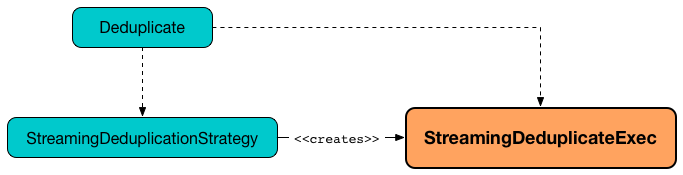

# StreamingDeduplicateExec Unary Physical Operator

`StreamingDeduplicateExec` is a unary physical operator that [writes state to StateStore](StateStoreWriter.md) with [support for streaming watermark](../WatermarkSupport.md).

[NOTE]
====
A unary physical operator (`UnaryExecNode`) is a physical operator with a single <<child, child>> physical operator.

Read up on https://jaceklaskowski.gitbooks.io/mastering-spark-sql/spark-sql-SparkPlan.html[UnaryExecNode] (and physical operators in general) in https://bit.ly/spark-sql-internals[The Internals of Spark SQL] book.
====

`StreamingDeduplicateExec` is <<creating-instance, created>> exclusively when [StreamingDeduplicationStrategy](../StreamingDeduplicationStrategy.md) execution planning strategy is executed (to plan Deduplicate unary logical operators).



```text
val uniqueValues = spark.
  readStream.
  format("rate").
  load.
  dropDuplicates("value")  // <-- creates Deduplicate logical operator

scala> println(uniqueValues.queryExecution.logical.numberedTreeString)
00 Deduplicate [value#214L], true
01 +- StreamingRelation DataSource(org.apache.spark.sql.SparkSession@4785f176,rate,List(),None,List(),None,Map(),None), rate, [timestamp#213, value#214L]

scala> uniqueValues.explain
== Physical Plan ==
StreamingDeduplicate [value#214L], StatefulOperatorStateInfo(<unknown>,5a65879c-67bc-4e77-b417-6100db6a52a2,0,0), 0
+- Exchange hashpartitioning(value#214L, 200)
   +- StreamingRelation rate, [timestamp#213, value#214L]

// Start the query and hence StreamingDeduplicateExec
import scala.concurrent.duration._
import org.apache.spark.sql.streaming.{OutputMode, Trigger}
val sq = uniqueValues.
  writeStream.
  format("console").
  option("truncate", false).
  trigger(Trigger.ProcessingTime(10.seconds)).
  outputMode(OutputMode.Update).
  start

// sorting not supported for non-aggregate queries
// and so values are unsorted

-------------------------------------------
Batch: 0
-------------------------------------------
+---------+-----+
|timestamp|value|
+---------+-----+
+---------+-----+

-------------------------------------------
Batch: 1
-------------------------------------------
+-----------------------+-----+
|timestamp              |value|
+-----------------------+-----+
|2017-07-25 22:12:03.018|0    |
|2017-07-25 22:12:08.018|5    |
|2017-07-25 22:12:04.018|1    |
|2017-07-25 22:12:06.018|3    |
|2017-07-25 22:12:05.018|2    |
|2017-07-25 22:12:07.018|4    |
+-----------------------+-----+

-------------------------------------------
Batch: 2
-------------------------------------------
+-----------------------+-----+
|timestamp              |value|
+-----------------------+-----+
|2017-07-25 22:12:10.018|7    |
|2017-07-25 22:12:09.018|6    |
|2017-07-25 22:12:12.018|9    |
|2017-07-25 22:12:13.018|10   |
|2017-07-25 22:12:15.018|12   |
|2017-07-25 22:12:11.018|8    |
|2017-07-25 22:12:14.018|11   |
|2017-07-25 22:12:16.018|13   |
|2017-07-25 22:12:17.018|14   |
|2017-07-25 22:12:18.018|15   |
+-----------------------+-----+

// Eventually...
sq.stop
```

[[metrics]]
`StreamingDeduplicateExec` uses the performance metrics of [StateStoreWriter](StateStoreWriter.md#metrics).

.StreamingDeduplicateExec in web UI (Details for Query)
image::images/StreamingDeduplicateExec-webui-query-details.png[align="center"]

[[output]]
The output schema of `StreamingDeduplicateExec` is exactly the <<child, child>>'s output schema.

[[outputPartitioning]]
The output partitioning of `StreamingDeduplicateExec` is exactly the <<child, child>>'s output partitioning.

[source, scala]
----
/**
// Start spark-shell with debugging and Kafka support
  SPARK_SUBMIT_OPTS="-agentlib:jdwp=transport=dt_socket,server=y,suspend=n,address=5005" \
  ./bin/spark-shell \
  --packages org.apache.spark:spark-sql-kafka-0-10_2.11:2.3.0-SNAPSHOT
*/
// Reading
val topic1 = spark.
  readStream.
  format("kafka").
  option("subscribe", "topic1").
  option("kafka.bootstrap.servers", "localhost:9092").
  option("startingOffsets", "earliest").
  load

// Processing with deduplication
// Don't use watermark
// The following won't work due to https://issues.apache.org/jira/browse/SPARK-21546
/**
val records = topic1.
  withColumn("eventtime", 'timestamp).  // <-- just to put the right name given the purpose
  withWatermark(eventTime = "eventtime", delayThreshold = "30 seconds"). // <-- use the renamed eventtime column
  dropDuplicates("value").  // dropDuplicates will use watermark
                            // only when eventTime column exists
  // include the watermark column => internal design leak?
  select('key cast "string", 'value cast "string", 'eventtime).
  as[(String, String, java.sql.Timestamp)]
*/

val records = topic1.
  dropDuplicates("value").
  select('key cast "string", 'value cast "string").
  as[(String, String)]

scala> records.explain
== Physical Plan ==
*Project [cast(key#0 as string) AS key#249, cast(value#1 as string) AS value#250]
+- StreamingDeduplicate [value#1], StatefulOperatorStateInfo(<unknown>,68198b93-6184-49ae-8098-006c32cc6192,0,0), 0
   +- Exchange hashpartitioning(value#1, 200)
      +- *Project [key#0, value#1]
         +- StreamingRelation kafka, [key#0, value#1, topic#2, partition#3, offset#4L, timestamp#5, timestampType#6]

// Writing
import org.apache.spark.sql.streaming.{OutputMode, Trigger}
import scala.concurrent.duration._
val sq = records.
  writeStream.
  format("console").
  option("truncate", false).
  trigger(Trigger.ProcessingTime(10.seconds)).
  queryName("from-kafka-topic1-to-console").
  outputMode(OutputMode.Update).
  start

// Eventually...
sq.stop
----

[TIP]
====
Enable `INFO` logging level for `org.apache.spark.sql.execution.streaming.StreamingDeduplicateExec` to see what happens inside.

Add the following line to `conf/log4j.properties`:

```
log4j.logger.org.apache.spark.sql.execution.streaming.StreamingDeduplicateExec=INFO
```

Refer to spark-sql-streaming-spark-logging.md[Logging].
====

=== [[doExecute]] Executing Physical Operator (Generating RDD[InternalRow]) -- `doExecute` Method

[source, scala]
----
doExecute(): RDD[InternalRow]
----

NOTE: `doExecute` is part of `SparkPlan` Contract to generate the runtime representation of an physical operator as a distributed computation over internal binary rows on Apache Spark (i.e. `RDD[InternalRow]`).

Internally, `doExecute` initializes [metrics](StateStoreWriter.md#metrics).

`doExecute` executes <<child, child>> physical operator and [creates a StateStoreRDD](../StateStoreOps.md#mapPartitionsWithStateStore) with `storeUpdateFunction` that:

1. Generates an unsafe projection to access the key field (using <<keyExpressions, keyExpressions>> and the output schema of <<child, child>>).

1. Filters out rows from `Iterator[InternalRow]` that match `watermarkPredicateForData` (when defined and <<timeoutConf, timeoutConf>> is `EventTimeTimeout`)

1. For every row (as `InternalRow`)

* Extracts the key from the row (using the unsafe projection above)

* [Gets the saved state](../StateStore.md#get) in `StateStore` for the key

* (when there was a state for the key in the row) Filters out (aka _drops_) the row

* (when there was _no_ state for the key in the row) Stores a new (and empty) state for the key and increments <<numUpdatedStateRows, numUpdatedStateRows>> and <<numOutputRows, numOutputRows>> metrics.

1. In the end, `storeUpdateFunction` creates a `CompletionIterator` that executes a completion function (aka `completionFunction`) after it has successfully iterated through all the elements (i.e. when a client has consumed all the rows).
+
The completion function does the following:

* Updates <<allUpdatesTimeMs, allUpdatesTimeMs>> metric (that is the total time to execute `storeUpdateFunction`)

* Updates <<allRemovalsTimeMs, allRemovalsTimeMs>> metric with the time taken to [remove keys older than the watermark from the StateStore](../WatermarkSupport.md#removeKeysOlderThanWatermark)

* Updates <<commitTimeMs, commitTimeMs>> metric with the time taken to [commit the changes to the StateStore](../StateStore.md#commit)

* [Sets StateStore-specific metrics](StateStoreWriter.md#setStoreMetrics)

## Creating Instance

`StreamingDeduplicateExec` takes the following when created:

* [[keyExpressions]] Duplicate keys (as used in [dropDuplicates](../operators/dropDuplicates.md) operator)
* [[child]] Child physical operator (`SparkPlan`)
* [[stateInfo]] [StatefulOperatorStateInfo](../StatefulOperatorStateInfo.md)
* [[eventTimeWatermark]] Event-time watermark

## <span id="shouldRunAnotherBatch"> Checking Out Whether Last Batch Execution Requires Another Non-Data Batch or Not

```scala
shouldRunAnotherBatch(
  newMetadata: OffsetSeqMetadata): Boolean
```

`shouldRunAnotherBatch`...FIXME

`shouldRunAnotherBatch` is part of the [StateStoreWriter](StateStoreWriter.md#shouldRunAnotherBatch) abstraction.
