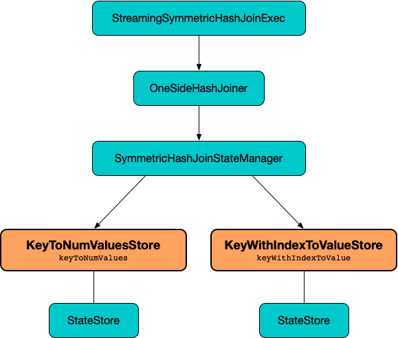

# KeyToNumValuesStore

`KeyToNumValuesStore` is a [StateStoreHandler](spark-sql-streaming-StateStoreHandler.md) (of [KeyToNumValuesType](spark-sql-streaming-StateStoreHandler.md#KeyToNumValuesType)) for [SymmetricHashJoinStateManager](SymmetricHashJoinStateManager.md#keyToNumValues) to manage a <<stateStore, join state>>.



[[stateStore]]
As a [StateStoreHandler](spark-sql-streaming-StateStoreHandler.md), `KeyToNumValuesStore` manages a [state store](StateStore.md) (that is [loaded](spark-sql-streaming-StateStoreHandler.md#getStateStore)) with the join keys (per [key schema](SymmetricHashJoinStateManager.md#keySchema)) and their count (per <<longValueSchema, value schema>>).

[[longValueSchema]]
`KeyToNumValuesStore` uses the schema for values in the <<stateStore, state store>> with one field `value` (of type `long`) that is the number of value rows (count).

[[logging]]
[TIP]
====
Enable `ALL` logging level for `org.apache.spark.sql.execution.streaming.state.SymmetricHashJoinStateManager$KeyToNumValuesStore` to see what happens inside.

Add the following line to `conf/log4j.properties`:

```
log4j.logger.org.apache.spark.sql.execution.streaming.state.SymmetricHashJoinStateManager$KeyToNumValuesStore=ALL
```

Refer to <<spark-sql-streaming-spark-logging.md#, Logging>>.
====

=== [[get]] Looking Up Number Of Value Rows For Given Key (Value Count) -- `get` Method

[source, scala]
----
get(key: UnsafeRow): Long
----

`get` requests the <<stateStore, StateStore>> for the [value for the given key](StateStore.md#get) and returns the long value at ``0``th position (of the row found) or `0`.

`get` is used when `SymmetricHashJoinStateManager` is requested for the [values for a given key](SymmetricHashJoinStateManager.md#get) and [append a new value to a given key](SymmetricHashJoinStateManager.md#append).

=== [[put]] Storing Key Count For Given Key -- `put` Method

[source, scala]
----
put(
  key: UnsafeRow,
  numValues: Long): Unit
----

`put` stores the `numValues` at the ``0``th position (of the internal unsafe row) and requests the <<stateStore, StateStore>> to [store it with the given key](StateStore.md#put).

`put` requires that the `numValues` count is greater than `0` (or throws an `IllegalArgumentException`).

`put` is used when `SymmetricHashJoinStateManager` is requested for the [append a new value to a given key](SymmetricHashJoinStateManager.md#append) and [updateNumValueForCurrentKey](SymmetricHashJoinStateManager.md#updateNumValueForCurrentKey).

=== [[iterator]] All State Keys and Values -- `iterator` Method

[source, scala]
----
iterator: Iterator[KeyAndNumValues]
----

`iterator` simply requests the <<stateStore, StateStore>> for [all state keys and values](StateStore.md#getRange).

`iterator` is used when `SymmetricHashJoinStateManager` is requested to [removeByKeyCondition](SymmetricHashJoinStateManager.md#removeByKeyCondition) and [removeByValueCondition](SymmetricHashJoinStateManager.md#removeByValueCondition).

=== [[remove]] Removing State Key -- `remove` Method

[source, scala]
----
remove(key: UnsafeRow): Unit
----

`remove` simply requests the <<stateStore, StateStore>> to [remove the given key](StateStore.md#remove).

`remove` is used when...FIXME
