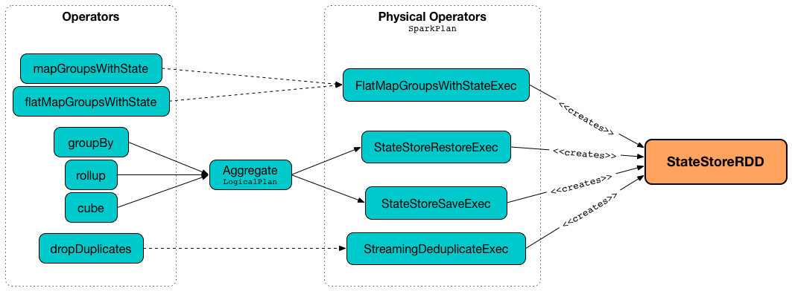
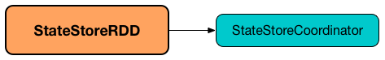

# StateStoreRDD

`StateStoreRDD` is a [BaseStateStoreRDD](BaseStateStoreRDD.md).



## Creating Instance

`StateStoreRDD` takes the following to be created:

* <span id="dataRDD"> Data RDD (`RDD[T]` to update the aggregates in a state store)
* <span id="storeUpdateFunction"> Store update function (`(StateStore, Iterator[T]) => Iterator[U]` where `T` is the type of rows in the [data RDD](#dataRDD))
* <span id="checkpointLocation"> Checkpoint directory
* <span id="queryRunId"> Run ID of the streaming query
* <span id="operatorId"> Operator ID
* <span id="storeVersion"> Store Version
* <span id="keySchema"> Key Schema
* <span id="valueSchema"> Value Schema
* [numColsPrefixKey](#numColsPrefixKey)
* <span id="sessionState"> `SessionState`
* <span id="storeCoordinator"> [StateStoreCoordinatorRef](StateStoreCoordinatorRef.md)
* <span id="extraOptions"> Extra Options

`StateStoreRDD` is created when:

* `StateStoreOps` is requested to [mapPartitionsWithStateStore](StateStoreOps.md#mapPartitionsWithStateStore)

### <span id="numColsPrefixKey"> numColsPrefixKey

`StateStoreRDD` is given `numColsPrefixKey` when [created](#creating-instance) (that is passed in directly from [StateStoreOps.mapPartitionsWithStateStore](StateStoreOps.md#mapPartitionsWithStateStore)).

`numColsPrefixKey` is used to [look up a StateStore](StateStore.md#get) while [computing a partition](#compute).

<!---
## Review Me

`StateStoreRDD` is an `RDD` for <<compute, executing storeUpdateFunction>> with [StateStore](StateStore.md) (and data from partitions of the <<dataRDD, data RDD>>).

`StateStoreRDD` is <<creating-instance, created>> for the following stateful physical operators (using [StateStoreOps.mapPartitionsWithStateStore](StateStoreOps.md#mapPartitionsWithStateStore)):

* [FlatMapGroupsWithStateExec](../physical-operators/FlatMapGroupsWithStateExec.md)
* [StateStoreRestoreExec](../physical-operators/StateStoreRestoreExec.md)
* [StateStoreSaveExec](../physical-operators/StateStoreSaveExec.md)
* [StreamingDeduplicateExec](../physical-operators/StreamingDeduplicateExec.md)
* [StreamingGlobalLimitExec](../physical-operators/StreamingGlobalLimitExec.md)

`StateStoreRDD` uses `StateStoreCoordinator` for the <<getPreferredLocations, preferred locations of a partition>> for job scheduling.



[[getPartitions]]
`getPartitions` is exactly the partitions of the <<dataRDD, data RDD>>.

## <span id="compute"> Computing Partition

```scala
compute(
  partition: Partition,
  ctxt: TaskContext): Iterator[U]
```

`compute` is part of the `RDD` abstraction.

`compute` computes <<dataRDD, dataRDD>> passing the result on to <<storeUpdateFunction, storeUpdateFunction>> (with a configured [StateStore](StateStore.md)).

Internally, (and similarly to <<getPreferredLocations, getPreferredLocations>>) `compute` creates a <<StateStoreProviderId.md#, StateStoreProviderId>> with `StateStoreId` (using <<checkpointLocation, checkpointLocation>>, <<operatorId, operatorId>> and the index of the input `partition`) and <<queryRunId, queryRunId>>.

`compute` then requests `StateStore` for [the store for the StateStoreProviderId](StateStore.md#get).

In the end, `compute` computes <<dataRDD, dataRDD>> (using the input `partition` and `ctxt`) followed by executing <<storeUpdateFunction, storeUpdateFunction>> (with the store and the result).

=== [[getPreferredLocations]] Placement Preferences of Partition (Preferred Locations) -- `getPreferredLocations` Method

[source, scala]
----
getPreferredLocations(partition: Partition): Seq[String]
----

NOTE: `getPreferredLocations` is a part of the RDD Contract to specify placement preferences (aka _preferred task locations_), i.e. where tasks should be executed to be as close to the data as possible.

`getPreferredLocations` creates a <<StateStoreProviderId.md#, StateStoreProviderId>> with `StateStoreId` (using <<checkpointLocation, checkpointLocation>>, <<operatorId, operatorId>> and the index of the input `partition`) and <<queryRunId, queryRunId>>.

NOTE: <<checkpointLocation, checkpointLocation>> and <<operatorId, operatorId>> are shared across different partitions and so the only difference in <<StateStoreProviderId.md#, StateStoreProviderIds>> is the partition index.

In the end, `getPreferredLocations` requests <<storeCoordinator, StateStoreCoordinatorRef>> for the [location of the state store](StateStoreCoordinatorRef.md#getLocation) for the [StateStoreProviderId](StateStoreProviderId.md).
-->
