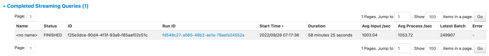

# StreamingQueryPage

`StreamingQueryPage` is a `WebUIPage` ([Spark Core]({{ book.spark_core }}/webui/WebUIPage)) that [renders](#render) the following sections as **Streaming Query**:

* [Active Streaming Queries](#active-streaming-queries)
* [Completed Streaming Queries](#completed-streaming-queries)

## Creating Instance

`StreamingQueryPage` takes the following to be created:

* <span id="parent"> Parent [StreamingQueryTab](StreamingQueryTab.md)

`StreamingQueryPage` is created when:

* `StreamingQueryTab` is [created](StreamingQueryTab.md) (and attaches this and [StreamingQueryStatisticsPage](StreamingQueryStatisticsPage.md) pages)

## Active Streaming Queries

## Completed Streaming Queries

<figure markdown>
  
</figure>

Column Name | Description
------------|------------
 Name |
 Status |
 ID |
 Run ID |
 Start Time |
 Duration |
 Avg Input /sec | Total of [inputRowsPerSecond](../monitoring/StreamingQueryProgress.md#inputRowsPerSecond)s of all [StreamingQueryProgress](../monitoring/StreamingQueryProgress.md)es by the number of the [StreamingQueryProgress](../monitoring/StreamingQueryProgress.md)es
 Avg Process /sec | Total of [processedRowsPerSecond](../monitoring/StreamingQueryProgress.md#processedRowsPerSecond)s of all [StreamingQueryProgress](../monitoring/StreamingQueryProgress.md)es by the number of the [StreamingQueryProgress](../monitoring/StreamingQueryProgress.md)es
 Latest Batch | [batchId](../monitoring/StreamingQueryProgress.md#batchId) of the last [StreamingQueryProgress](../monitoring/StreamingQueryProgress.md)
 Error |

## <span id="render"> Rendering Page

```scala
render(
  request: HttpServletRequest): Seq[Node]
```

`render` is part of the `WebUIPage` ([Spark Core]({{ book.spark_core }}/webui/WebUIPage#render)) abstraction.

---

`render` renders an HTML page with **Streaming Query** title and [generateStreamingQueryTable](#generateStreamingQueryTable).

### <span id="generateStreamingQueryTable"> generateStreamingQueryTable

```scala
generateStreamingQueryTable(
  request: HttpServletRequest): Seq[Node]
```

`generateStreamingQueryTable` requests the [StreamingQueryStatusStore](StreamingQueryTab.md#store) for [allQueryUIData](StreamingQueryStatusStore.md#allQueryUIData) that is split into active and inactive queries.

`generateStreamingQueryTable` renders [Active Streaming Queries](#active-streaming-queries) section for the active streaming queries.

`generateStreamingQueryTable` renders [Completed Streaming Queries](#completed-streaming-queries) section for the inactive (_completed_) streaming queries.
