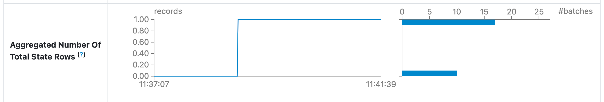
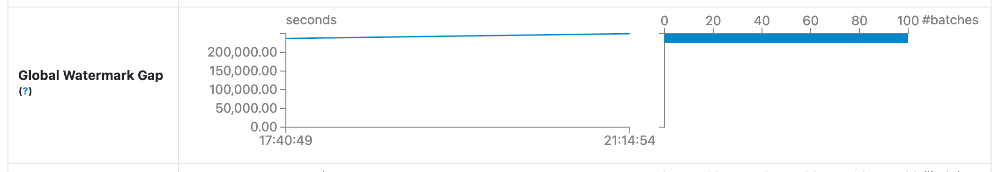

# StreamingQueryStatisticsPage

`StreamingQueryStatisticsPage` is a `WebUIPage` ([Spark Core]({{ book.spark_core }}/webui/WebUIPage)) with `statistics` URL prefix.

`StreamingQueryStatisticsPage` uses `id` request parameter as the `runId` of a streaming query to [render a Streaming Query Statistics page](render).

`StreamingQueryStatisticsPage` renders the following main sections:

* [Basic Info](#generateBasicInfo)
* [Statistics](#generateStatTable)

## Aggregated Number Of Total State Rows

<figure markdown>
  
</figure>

The number of state rows across all stateful operators (i.e., a sum of [numRowsTotal](../monitoring/StateOperatorProgress.md#numRowsTotal) metrics of [stateOperators](../monitoring/StreamingQueryProgress.md#stateOperators) of every [StreamingQueryProgress](../monitoring/StreamingQueryProgress.md))

Displayed only when there are [stateful operators](../monitoring/StreamingQueryProgress.md#stateOperators) in a streaming query.

`StreamingQueryStatisticsPage` uses [generateAggregatedStateOperators](#generateAggregatedStateOperators) to generate a timeline and a histogram for `aggregated-num-total-state-rows-timeline` and `aggregated-num-total-state-rows-histogram` HTML `div`s, respectively.

!!! tip "Demo: Streaming Aggregation"
    Use [Demo: Streaming Aggregation](../demo/streaming-aggregation.md) to learn more.

## Global Watermark Gap

<figure markdown>
  
</figure>

A time series of the gaps (_differences_) between the [batch timestamp](../monitoring/StreamingQueryProgress.md#timestamp) and the global watermark (in secs).

Only displayed when there is a global watermark in a streaming query.

!!! note "Global Watermark of Batch"
    **Global Watermark** of a batch is the value of the `watermark` entry in the [Event Time Statistics](../monitoring/StreamingQueryProgress.md#eventTime) of a [StreamingQueryProgress](../monitoring/StreamingQueryProgress.md).

    `watermark` entry will only be included in the [Event Time Statistics](../monitoring/StreamingQueryProgress.md#eventTime) for a streaming query with [EventTimeWatermark](../logical-operators/EventTimeWatermark.md) logical operator.

`StreamingQueryStatisticsPage` uses [generateWatermark](#generateWatermark) to generate a timeline and a histogram for `watermark-gap-timeline` and `watermark-gap-histogram` HTML `div`s, respectively.

## <span id="render"> Rendering Page

```scala
render(
  request: HttpServletRequest): Seq[Node]
```

`render` is part of the `WebUIPage` ([Spark Core]({{ book.spark_core }}/webui/WebUIPage#render)) abstraction.

---

`render` uses the `id` request parameter for the `runId` of the streaming query to render statistics of.

`render` requests the parent [StreamingQueryTab](#parent) for the [StreamingQueryStatusStore](StreamingQueryTab.md#store) for the [allQueryUIData](StreamingQueryStatusStore.md#allQueryUIData) to find the data of the streaming query (by `runId`).

`render` generates a HTML page with the following sections:

* [generateLoadResources](#generateLoadResources)
* [generateBasicInfo](#generateBasicInfo)
* [generateStatTable](#generateStatTable)

### <span id="generateStatTable"> generateStatTable

```scala
generateStatTable(
  query: StreamingQueryUIData): Seq[Node]
```

`generateStatTable`...FIXME

### <span id="generateWatermark"> generateWatermark

```scala
generateWatermark(
  query: StreamingQueryUIData,
  minBatchTime: Long,
  maxBatchTime: Long,
  jsCollector: JsCollector): Seq[Node]
```

`generateWatermark` finds the global watermark (`watermark` entry in the [eventTime](../monitoring/StreamingQueryProgress.md#eventTime)) of the last [StreamingQueryProgress](../monitoring/StreamingQueryProgress.md) of a streaming query.

Unless found, `generateWatermark` returns _nothing_ (an empty collection).

`generateWatermark` scans [StreamingQueryProgresses](../monitoring/StreamingQueryProgress.md) for which the global watermark is greater than `0` and collects a time series (data points) with the following:

* [Batch timestamp](../monitoring/StreamingQueryProgress.md#timestamp)
* The gap (_difference_) between the batch timestamp and the global watermark (in secs)

`generateWatermark` creates a `GraphUIData` to generate a timeline and a histogram for `watermark-gap-timeline` and `watermark-gap-histogram` HTML `div`s, respectively.

### <span id="generateAggregatedStateOperators"> generateAggregatedStateOperators

```scala
generateAggregatedStateOperators(
  query: StreamingQueryUIData,
  minBatchTime: Long,
  maxBatchTime: Long,
  jsCollector: JsCollector): NodeBuffer
```

`generateAggregatedStateOperators` takes [stateOperators](../monitoring/StreamingQueryProgress.md#stateOperators) of the last [StreamingQueryProgress](../monitoring/StreamingQueryProgress.md) of the given streaming query (as `StreamingQueryUIData`).

Unless available, `generateAggregatedStateOperators` returns _nothing_ (an empty collection).

`generateAggregatedStateOperators` generates data points for a timeline and a histogram for `aggregated-num-total-state-rows` as the sum of [numRowsTotal](../monitoring/StateOperatorProgress.md#numRowsTotal) metrics of [stateOperators](../monitoring/StreamingQueryProgress.md#stateOperators).

`generateAggregatedStateOperators`...FIXME

## Logging

Enable `ALL` logging level for `org.apache.spark.sql.streaming.ui.StreamingQueryStatisticsPage` logger to see what happens inside.

Add the following line to `conf/log4j.properties`:

```text
log4j.logger.org.apache.spark.sql.streaming.ui.StreamingQueryStatisticsPage=ALL
```

Refer to [Logging](../spark-logging.md).
