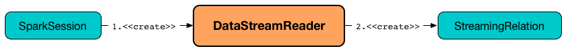

== [[DataStreamReader]] DataStreamReader -- Loading Data from Streaming Data Source

`DataStreamReader` is the <<methods, interface>> to describe how data is <<load, loaded>> to a streaming `Dataset` from a streaming data source by <<format, format>>, <<schema, schema>> and <<options, options>>.

.DataStreamReader and The Others


`DataStreamReader` is used for a Spark developer to describe how Spark Structured Streaming loads datasets from a streaming source (that <<load, in the end>> creates a logical plan for a streaming query).

NOTE: `DataStreamReader` is the Spark developer-friendly API to create a link:spark-sql-streaming-StreamingRelation.adoc[StreamingRelation] logical operator (that represents a link:spark-sql-streaming-Source.adoc[streaming source] in a logical plan).

You can access `DataStreamReader` using `SparkSession.readStream` method.

[source, scala]
----
import org.apache.spark.sql.SparkSession
val spark: SparkSession = ...

val streamReader = spark.readStream
----

[[methods]]
.DataStreamReader's Methods
[cols="1,2",options="header",width="100%"]
|===
| Method
| Description

| <<csv, csv>>
| Sets `csv` as the source <<format, format>>

| <<format, format>>
| Sets the format of datasets

| <<json, json>>
| Sets `json` as the source <<format, format>>

| [[load]] <<load-internals, load>>
| Loads data from a streaming source to a streaming `Dataset`

| <<option, option>>
| Sets a loading option

| <<options, options>>
| Sets one or more loading options

| <<parquet, parquet>>
| Sets `parquet` as the source <<format, format>>

| <<schema, schema>>
| Sets the schema of datasets

| <<text, text>>
| Sets `text` as the source <<format, format>>

| <<textFile, textFile>>
| Returns `Dataset[String]` (not `DataFrame`)
|===

`DataStreamReader` supports many <<format, source formats>> natively and offers the <<format, interface to define custom formats>>:

* <<json, json>>
* <<csv, csv>>
* <<parquet, parquet>>
* <<text, text>>

NOTE: `DataStreamReader` assumes <<parquet, parquet>> file format by default that you can change using `spark.sql.sources.default` property.

NOTE: `hive` source format is not supported.

After you have described the *streaming pipeline* to read datasets from an external streaming data source, you eventually trigger the loading using format-agnostic <<load, load>> or format-specific (e.g. <<json, json>>, <<csv, csv>>) operators.

[[internal-properties]]
.DataStreamReader's Internal Properties (in alphabetical order)
[cols="1,1,2",options="header",width="100%"]
|===
| Name
| Initial Value
| Description

| [[source]] `source`
| `spark.sql.sources.default` property
| Source format of datasets in a streaming data source

| [[userSpecifiedSchema]] `userSpecifiedSchema`
| (empty)
| Optional user-defined schema

| [[extraOptions]] `extraOptions`
| (empty)
| Collection of key-value configuration options
|===

=== [[format]] Specifying Format -- `format` Method

[source, scala]
----
format(source: String): DataStreamReader
----

`format` specifies the `source` format of datasets in a streaming data source.

Internally, `schema` sets <<source, source>> internal property.

=== [[schema]] Specifying Schema -- `schema` Method

[source, scala]
----
schema(schema: StructType): DataStreamReader
schema(schemaString: String): DataStreamReader  // <1>
----
<1> Uses the input DDL-formatted string

`schema` specifies the `schema` of the streaming data source.

Internally, `schema` sets <<userSpecifiedSchema, userSpecifiedSchema>> internal property.

=== [[option]] Specifying Loading Options -- `option` Method

[source, scala]
----
option(key: String, value: String): DataStreamReader
option(key: String, value: Boolean): DataStreamReader
option(key: String, value: Long): DataStreamReader
option(key: String, value: Double): DataStreamReader
----

`option` family of methods specifies additional options to a streaming data source.

There is support for values of `String`, `Boolean`, `Long`, and `Double` types for user convenience, and internally are converted to `String` type.

Internally, `option` sets <<extraOptions, extraOptions>> internal property.

NOTE: You can also set options in bulk using <<options, options>> method. You have to do the type conversion yourself, though.

=== [[options]] Specifying Loading Options -- `options` Method

[source, scala]
----
options(options: scala.collection.Map[String, String]): DataStreamReader
----

`options` method allows specifying one or many options of the streaming input data source.

NOTE: You can also set options one by one using <<option, option>> method.

=== [[load-internals]] Loading Data From Streaming Source (to Streaming Dataset) -- `load` Method

[source, scala]
----
load(): DataFrame
load(path: String): DataFrame // <1>
----
<1> Specifies `path` option before passing the call to parameterless `load()`

`load` loads data from a link:spark-sql-streaming-Source.adoc[streaming data source] to a streaming dataset.

Internally, `load` first link:spark-sql-streaming-DataSource.adoc#creating-instance[creates a DataSource] (using <<userSpecifiedSchema, user-specified schema>>, the <<source, name of the source>> and <<extraOptions, options>>) followed by creating a `DataFrame` with a link:spark-sql-streaming-StreamingRelation.adoc#apply[StreamingRelation] logical operator (for the `DataSource`).

`load` makes sure that the name of the source is not `hive`. Otherwise, `load` reports a `AnalysisException`.

```
Hive data source can only be used with tables, you can not read files of Hive data source directly.
```

=== [[builtin-formats]][[json]][[csv]][[parquet]][[text]][[textFile]] Built-in Formats

[source, scala]
----
json(path: String): DataFrame
csv(path: String): DataFrame
parquet(path: String): DataFrame
text(path: String): DataFrame
textFile(path: String): Dataset[String] // <1>
----
<1> Returns `Dataset[String]` not `DataFrame`

`DataStreamReader` can load streaming datasets from data sources of the following <<format, formats>>:

* `json`
* `csv`
* `parquet`
* `text`

The methods simply pass calls to <<format, format>> followed by <<load, load(path)>>.
