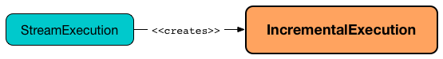

== [[IncrementalExecution]] IncrementalExecution -- QueryExecution of Streaming Datasets

`IncrementalExecution` is a `QueryExecution` for streaming Datasets that link:spark-sql-streaming-StreamExecution.adoc#runBatch-queryPlanning[StreamExecution] uses for incremental execution of the <<logicalPlan, logical query plan>> (every trigger that, when small enough, is supposed to give the impression of near real-time continuous stream processing).

.StreamExecution creates IncrementalExecution (every trigger / streaming batch)

TIP: Details on `QueryExecution` contract can be found in the https://jaceklaskowski.gitbooks.io/mastering-apache-spark/spark-sql-QueryExecution.html[Mastering Apache Spark 2] gitbook.

[[preparations]]
`IncrementalExecution` registers <<state, state>> physical preparation rule with the parent ``QueryExecution``'s `preparations` that prepares the streaming physical plan (using batch-specific execution properties).

`IncrementalExecution` is <<creating-instance, created>> when:

* `StreamExecution` link:spark-sql-streaming-StreamExecution.adoc#runBatch-queryPlanning[plans a streaming query]

* `ExplainCommand` is executed (for link:spark-sql-streaming-Dataset-operators.adoc#explain[explain] operator)

[[internal-registries]]
.IncrementalExecution's Internal Registries and Counters (in alphabetical order)
[cols="1,2",options="header",width="100%"]
|===
| Name
| Description

| [[planner]] `planner`
a| `SparkPlanner` with the following extra planning strategies (in the order of execution):

[[extraPlanningStrategies]]
1. link:spark-sql-streaming-StatefulAggregationStrategy.adoc[StatefulAggregationStrategy]
1. link:spark-sql-streaming-FlatMapGroupsWithStateStrategy.adoc[FlatMapGroupsWithStateStrategy]
1. link:spark-sql-streaming-StreamingRelationStrategy.adoc[StreamingRelationStrategy]
1. link:spark-sql-streaming-StreamingDeduplicationStrategy.adoc[StreamingDeduplicationStrategy]

[[executedPlan]]
[NOTE]
====
`planner` is used to plan (aka _convert_) an optimized logical plan into a physical plan (that is later available as `sparkPlan`).

`sparkPlan` physical plan is then prepared for execution using <<preparations, preparations>> physical optimization rules. The result is later available as `executedPlan` physical plan.
====

| [[state]] `state`
| State preparation rule (i.e. `Rule[SparkPlan]`) that transforms a streaming physical plan (i.e. `SparkPlan` with link:spark-sql-streaming-StateStoreSaveExec.adoc[StateStoreSaveExec], link:spark-sql-streaming-StreamingDeduplicateExec.adoc[StreamingDeduplicateExec] and link:spark-sql-streaming-FlatMapGroupsWithStateExec.adoc[FlatMapGroupsWithStateExec] physical operators) to fill missing properties that are batch-specific, e.g. the current batch.

CAUTION: FIXME Describe the missing properties

Used when `IncrementalExecution` <<preparations, prepares a physical plan>> (i.e. `SparkPlan`) for execution (which is when `StreamExecution` link:spark-sql-streaming-StreamExecution.adoc#runBatch-queryPlanning[runs a streaming batch and plans a streaming query]).

| [[statefulOperatorId]] `statefulOperatorId`
a| Java's `AtomicInteger`

* `0` when `IncrementalExecution` is <<creating-instance, created>>

* Incremented...FIXME
|===

=== [[creating-instance]] Creating IncrementalExecution Instance

`IncrementalExecution` takes the following when created:

* [[sparkSession]] `SparkSession`
* [[logicalPlan]] Logical query plan (i.e. `LogicalPlan` link:spark-sql-streaming-StreamExecution.adoc#runBatch-queryPlanning[with the logical plans of the data sources that have new data and new column attributes])
* [[outputMode]] link:spark-sql-streaming-OutputMode.adoc[OutputMode] (as specified using link:spark-sql-streaming-DataStreamWriter.adoc#outputMode[outputMode] method of `DataStreamWriter`)
* [[checkpointLocation]] `state` checkpoint directory (as link:spark-sql-streaming-StreamExecution.adoc#resolvedCheckpointRoot[specified] using link:spark-sql-streaming-DataStreamWriter.adoc#checkpointLocation[checkpointLocation] option or link:spark-sql-streaming-properties.adoc#spark.sql.streaming.checkpointLocation[spark.sql.streaming.checkpointLocation] Spark property with `queryName` option)
* [[runId]] Run id
* [[currentBatchId]] Current batch id
* [[offsetSeqMetadata]] link:spark-sql-streaming-OffsetSeqMetadata.adoc[OffsetSeqMetadata]

`IncrementalExecution` initializes the <<internal-registries, internal registries and counters>>.
