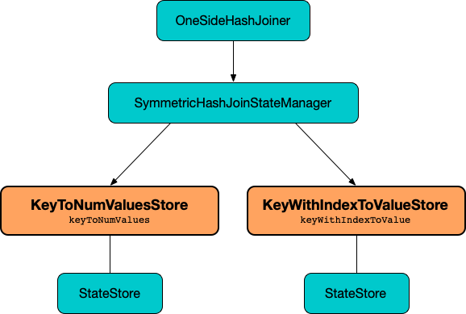

== [[KeyWithIndexToValueStore]] KeyWithIndexToValueStore -- State Store (Handler) Of Join Keys With Index Of Values

`KeyWithIndexToValueStore` is a <<spark-sql-streaming-StateStoreHandler.adoc#, StateStoreHandler>> (of <<spark-sql-streaming-StateStoreHandler.adoc#KeyWithIndexToValueType, KeyWithIndexToValueType>>) for <<spark-sql-streaming-SymmetricHashJoinStateManager.adoc#keyWithIndexToValue, SymmetricHashJoinStateManager>> to manage a <<stateStore, join state>>.

.KeyWithIndexToValueStore and StreamingSymmetricHashJoinExec


[[stateStore]]
As a <<spark-sql-streaming-StateStoreHandler.adoc#, StateStoreHandler>>, `KeyWithIndexToValueStore` manages a <<spark-sql-streaming-StateStore.adoc#, state store>> (that is <<spark-sql-streaming-StateStoreHandler.adoc#getStateStore, loaded>>) for keys and values per the <<keyWithIndexSchema, keys with index>> and <<spark-sql-streaming-SymmetricHashJoinStateManager.adoc#inputValueAttributes, input values>> schemas, respectively.

[[keyWithIndexSchema]]
`KeyWithIndexToValueStore` uses a schema of the <<stateStore, state store>> which is the <<spark-sql-streaming-SymmetricHashJoinStateManager.adoc#keySchema, key schema>> (of the parent `SymmetricHashJoinStateManager`) with an extra field `index` of type `long`.

[[logging]]
[TIP]
====
Enable `ALL` logging level for `org.apache.spark.sql.execution.streaming.state.SymmetricHashJoinStateManager$KeyWithIndexToValueStore` to see what happens inside.

Add the following line to `conf/log4j.properties`:

```
log4j.logger.org.apache.spark.sql.execution.streaming.state.SymmetricHashJoinStateManager$KeyWithIndexToValueStore=ALL
```

Refer to <<spark-sql-streaming-logging.adoc#, Logging>>.
====

=== [[get]] Looking Up State Row For Given Key and Index -- `get` Method

[source, scala]
----
get(
  key: UnsafeRow,
  valueIndex: Long): UnsafeRow
----

`get` simply requests the internal <<stateStore, state store>> to <<spark-sql-streaming-StateStore.adoc#get, look up>> the value for the given <<keyWithIndexRow, key and valueIndex>>.

NOTE: `get` is used exclusively when `SymmetricHashJoinStateManager` is requested to <<spark-sql-streaming-SymmetricHashJoinStateManager.adoc#removeByValueCondition, removeByValueCondition>>

=== [[getAll]] `getAll` Method

[source, scala]
----
getAll(
  key: UnsafeRow,
  numValues: Long): Iterator[KeyWithIndexAndValue]
----

`getAll`...FIXME

NOTE: `getAll` is used when `SymmetricHashJoinStateManager` is requested to <<spark-sql-streaming-SymmetricHashJoinStateManager.adoc#get, get values for a given key>> and <<spark-sql-streaming-SymmetricHashJoinStateManager.adoc#removeByKeyCondition, removeByKeyCondition>>.

=== [[put]] Storing State Row For Given Key and Index -- `put` Method

[source, scala]
----
put(
  key: UnsafeRow,
  valueIndex: Long,
  value: UnsafeRow): Unit
----

`put`...FIXME

NOTE: `put` is used when `SymmetricHashJoinStateManager` is requested to <<spark-sql-streaming-SymmetricHashJoinStateManager.adoc#append, append a new value to a given key>> and <<spark-sql-streaming-SymmetricHashJoinStateManager.adoc#removeByKeyCondition, removeByKeyCondition>>.

=== [[remove]] `remove` Method

[source, scala]
----
remove(
  key: UnsafeRow,
  valueIndex: Long): Unit
----

`remove`...FIXME

NOTE: `remove` is used when `SymmetricHashJoinStateManager` is requested to <<spark-sql-streaming-SymmetricHashJoinStateManager.adoc#removeByKeyCondition, removeByKeyCondition>> and <<spark-sql-streaming-SymmetricHashJoinStateManager.adoc#removeByValueCondition, removeByValueCondition>>.

=== [[keyWithIndexRow]] `keyWithIndexRow` Internal Method

[source, scala]
----
keyWithIndexRow(
  key: UnsafeRow,
  valueIndex: Long): UnsafeRow
----

`keyWithIndexRow` uses the <<keyWithIndexRowGenerator, keyWithIndexRowGenerator>> to generate an `UnsafeRow` for the `key` and sets the `valueIndex` at the <<indexOrdinalInKeyWithIndexRow, indexOrdinalInKeyWithIndexRow>> position.

NOTE: `keyWithIndexRow` is used when `KeyWithIndexToValueStore` is requested to <<get, get>>, <<getAll, getAll>>, <<put, put>>, <<remove, remove>> and <<removeAllValues, removeAllValues>>.

=== [[removeAllValues]] `removeAllValues` Method

[source, scala]
----
removeAllValues(
  key: UnsafeRow,
  numValues: Long): Unit
----

`removeAllValues`...FIXME

NOTE: `removeAllValues` does not _seem_ to be used at all.

=== [[iterator]] `iterator` Method

[source, scala]
----
iterator: Iterator[KeyWithIndexAndValue]
----

`iterator`...FIXME

NOTE: `iterator` does not _seem_ to be used at all.

=== [[internal-properties]] Internal Properties

[cols="30m,70",options="header",width="100%"]
|===
| Name
| Description

| indexOrdinalInKeyWithIndexRow
a| [[indexOrdinalInKeyWithIndexRow]] Position of the index in the key row (which corresponds to the number of the <<spark-sql-streaming-SymmetricHashJoinStateManager.adoc#keyAttributes, key attributes>>)

Used exclusively in the <<keyWithIndexRow, keyWithIndexRow>>

| keyWithIndexExprs
a| [[keyWithIndexExprs]] <<spark-sql-streaming-SymmetricHashJoinStateManager.adoc#keyAttributes, keyAttributes>> with `Literal(1L)` expression appended

Used exclusively for the <<keyWithIndexRowGenerator, keyWithIndexRowGenerator>> projection

| keyWithIndexRowGenerator
a| [[keyWithIndexRowGenerator]] `UnsafeProjection` for the <<keyWithIndexExprs, keyWithIndexExprs>> bound to the <<spark-sql-streaming-SymmetricHashJoinStateManager.adoc#keyAttributes, keyAttributes>>

Used exclusively in <<keyWithIndexRow, keyWithIndexRow>>

|===
