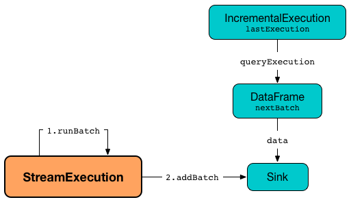

== [[MicroBatchExecution]] MicroBatchExecution -- Stream Execution Engine of Micro-Batch Stream Processing

`MicroBatchExecution` is the <<spark-sql-streaming-StreamExecution.adoc#, stream execution engine>> of <<spark-sql-streaming-micro-batch-stream-processing.adoc#, Micro-Batch Stream Processing>>.

`MicroBatchExecution` is <<creating-instance, created>> when `StreamingQueryManager` is requested to <<spark-sql-streaming-StreamingQueryManager.adoc#createQuery, create a streaming query>> (when `DataStreamWriter` is requested to <<spark-sql-streaming-DataStreamWriter.adoc#start, start an execution of the streaming query>>) with the following:

* Any type of <<sink, sink>> but <<spark-sql-streaming-StreamWriteSupport.adoc#, StreamWriteSupport>>

* Any type of <<trigger, trigger>> but <<spark-sql-streaming-Trigger.adoc#ContinuousTrigger, ContinuousTrigger>>

[source, scala]
----
import org.apache.spark.sql.streaming.Trigger
val query = spark
  .readStream
  .format("rate")
  .load
  .writeStream
  .format("console")          // <-- not a StreamWriteSupport sink
  .option("truncate", false)
  .trigger(Trigger.Once)      // <-- Gives MicroBatchExecution
  .queryName("rate2console")
  .start

// The following gives access to the internals
// And to MicroBatchExecution
import org.apache.spark.sql.execution.streaming.StreamingQueryWrapper
val engine = query.asInstanceOf[StreamingQueryWrapper].streamingQuery
import org.apache.spark.sql.execution.streaming.StreamExecution
assert(engine.isInstanceOf[StreamExecution])

import org.apache.spark.sql.execution.streaming.MicroBatchExecution
val microBatchEngine = engine.asInstanceOf[MicroBatchExecution]
assert(microBatchEngine.trigger == Trigger.Once)
----

=== [[creating-instance]] Creating MicroBatchExecution Instance

`MicroBatchExecution` takes the following to be created:

* [[sparkSession]] `SparkSession`
* [[name]] Name of the streaming query
* [[checkpointRoot]] Path of the checkpoint directory
* [[analyzedPlan]] Analyzed logical query plan of the streaming query (`LogicalPlan`)
* [[sink]] <<spark-sql-streaming-BaseStreamingSink.adoc#, Streaming sink>>
* [[trigger]] <<spark-sql-streaming-Trigger.adoc#, Trigger>>
* [[triggerClock]] Trigger clock (`Clock`)
* [[outputMode]] <<spark-sql-streaming-OutputMode.adoc#, Output mode>>
* [[extraOptions]] Extra options (`Map[String, String]`)
* [[deleteCheckpointOnStop]] `deleteCheckpointOnStop` flag to control whether to delete the checkpoint directory on stop

`MicroBatchExecution` initializes the <<internal-properties, internal properties>>.

=== [[triggerExecutor]] MicroBatchExecution and TriggerExecutor -- `triggerExecutor` Property

[source, scala]
----
triggerExecutor: TriggerExecutor
----

`triggerExecutor` is the <<spark-sql-streaming-TriggerExecutor.adoc#, TriggerExecutor>> of the streaming query that is how micro-batches are executed at regular intervals.

`triggerExecutor` is initialized based on the given <<trigger, Trigger>> (that was used to create the `MicroBatchExecution`):

* <<spark-sql-streaming-TriggerExecutor.adoc#, ProcessingTimeExecutor>> for <<spark-sql-streaming-Trigger.adoc#ProcessingTime, Trigger.ProcessingTime>>

* <<spark-sql-streaming-TriggerExecutor.adoc#, OneTimeExecutor>> for <<spark-sql-streaming-Trigger.adoc#OneTimeTrigger, OneTimeTrigger>> (aka <<spark-sql-streaming-Trigger.adoc#Once, Trigger.Once>> trigger)

`triggerExecutor` throws an `IllegalStateException` when the <<trigger, Trigger>> is not one of the <<spark-sql-streaming-Trigger.adoc#available-implementations, built-in implementations>>.

```
Unknown type of trigger: [trigger]
```

NOTE: `triggerExecutor` is used exclusively when `StreamExecution` is requested to <<runActivatedStream, run an activated streaming query>> (at regular intervals).

=== [[runActivatedStream]] Running Activated Streaming Query -- `runActivatedStream` Method

[source, scala]
----
runActivatedStream(
  sparkSessionForStream: SparkSession): Unit
----

NOTE: `runActivatedStream` is part of <<spark-sql-streaming-StreamExecution.adoc#runActivatedStream, StreamExecution Contract>> to run the activated <<spark-sql-streaming-StreamingQuery.adoc#, streaming query>>.

`runActivatedStream` simply requests the <<triggerExecutor, TriggerExecutor>> to execute micro-batches using the <<batchRunner, batch runner>> (until `MicroBatchExecution` is no longer <<spark-sql-streaming-StreamExecution.adoc#isActive, active>>).

==== [[batchRunner]][[batch-runner]] TriggerExecutor's Batch Runner

The batch runner (of the <<triggerExecutor, TriggerExecutor>>) is executed as long as the `MicroBatchExecution` is <<spark-sql-streaming-StreamExecution.adoc#isActive, active>>.

NOTE: _trigger_ and _batch_ are considered equivalent and used interchangeably.

The batch runner <<spark-sql-streaming-ProgressReporter.adoc#startTrigger, initializes query progress for the new trigger>>.

[[runActivatedStream-triggerExecution]][[runActivatedStream-triggerExecution-populateStartOffsets]]
The batch runner starts *triggerExecution* <<spark-sql-streaming-ProgressReporter.adoc#reportTimeTaken, execution phase>> that includes:

. <<populateStartOffsets, Populating start offsets from checkpoint>> at the very first batch

. <<constructNextBatch, Constructing or skipping the next streaming micro-batch>>

. <<runBatch, Running the streaming micro-batch>>

While <<populateStartOffsets, populating start offsets from checkpoint>> at the very first batch the batch runner prints out the following INFO message to the logs:

```
Stream started from [committedOffsets]
```

The batch runner sets the human-readable description for any Spark job submitted (that streaming sources may submit to get new data) as the <<spark-sql-streaming-StreamExecution.adoc#getBatchDescriptionString, batch description>>.

[[runActivatedStream-triggerExecution-isCurrentBatchConstructed]]
The batch runner <<constructNextBatch, constructs the next streaming micro-batch>> (when the <<isCurrentBatchConstructed, isCurrentBatchConstructed>> internal flag is off).

The batch runner <<recordTriggerOffsets, records trigger offsets>> (with the <<spark-sql-streaming-StreamExecution.adoc#committedOffsets, committed>> and <<spark-sql-streaming-StreamExecution.adoc#availableOffsets, available>> offsets).

The batch runner updates the <<spark-sql-streaming-ProgressReporter.adoc#currentStatus, current StreamingQueryStatus>> with the <<isNewDataAvailable, isNewDataAvailable>> for <<spark-sql-streaming-StreamingQueryStatus.adoc#isDataAvailable, isDataAvailable>> property.

[[runActivatedStream-triggerExecution-runBatch]]
With the <<isCurrentBatchConstructed, isCurrentBatchConstructed>> flag enabled (`true`), the batch runner <<spark-sql-streaming-ProgressReporter.adoc#updateStatusMessage, updates the status message>> to one of the following (per <<isNewDataAvailable, isNewDataAvailable>>) and <<runBatch, runs the streaming micro-batch>>.

```
Processing new data
```

```
No new data but cleaning up state
```

With the <<isCurrentBatchConstructed, isCurrentBatchConstructed>> flag disabled (`false`), the batch runner simply <<spark-sql-streaming-ProgressReporter.adoc#updateStatusMessage, updates the status message>> to the following:

```
Waiting for data to arrive
```

[[runActivatedStream-triggerExecution-finishTrigger]]
The batch runner <<spark-sql-streaming-ProgressReporter.adoc#finishTrigger, finalizes query progress for the trigger>> (with a flag that indicates whether the current batch had new data).

With the <<isCurrentBatchConstructed, isCurrentBatchConstructed>> flag enabled (`true`), the batch runner increments the <<currentBatchId, currentBatchId>> and turns the <<isCurrentBatchConstructed, isCurrentBatchConstructed>> flag off (`false`).

With the <<isCurrentBatchConstructed, isCurrentBatchConstructed>> flag disabled (`false`), the batch runner simply sleeps (as long as configured using the <<spark-sql-streaming-StreamExecution.adoc#pollingDelayMs, spark.sql.streaming.pollingDelay>> configuration property).

In the end, the batch runner <<spark-sql-streaming-ProgressReporter.adoc#updateStatusMessage, updates the status message>> to the following status and returns whether the `MicroBatchExecution` is <<spark-sql-streaming-StreamExecution.adoc#isActive, active>> or not.

```
Waiting for next trigger
```

=== [[populateStartOffsets]] Populating Start Offsets From Checkpoint (Resuming from Checkpoint) -- `populateStartOffsets` Internal Method

[source, scala]
----
populateStartOffsets(
  sparkSessionToRunBatches: SparkSession): Unit
----

`populateStartOffsets` requests the <<spark-sql-streaming-StreamExecution.adoc#offsetLog, Offset Write-Ahead Log>> for the <<spark-sql-streaming-HDFSMetadataLog.adoc#getLatest, latest committed batch id with metadata>> (i.e. <<spark-sql-streaming-OffsetSeq.adoc#, OffsetSeq>>).

NOTE: The batch id could not be available in the write-ahead log when a streaming query started with a new log or no batch was persisted (_added_) to the log before.

`populateStartOffsets` branches off based on whether the latest committed batch was <<populateStartOffsets-getLatest-available, available>> or <<populateStartOffsets-getLatest-not-available, not>>.

NOTE: `populateStartOffsets` is used exclusively when `MicroBatchExecution` is requested to <<runActivatedStream, run an activated streaming query>> (<<runActivatedStream-triggerExecution-populateStartOffsets, before the first micro-batch>>).

==== [[populateStartOffsets-getLatest-available]] Latest Committed Batch Available

When the latest committed batch id with the metadata was available in the <<spark-sql-streaming-StreamExecution.adoc#offsetLog, Offset Write-Ahead Log>>, `populateStartOffsets` (re)initializes the internal state as follows:

* Sets the <<spark-sql-streaming-StreamExecution.adoc#currentBatchId, current batch ID>> to the latest committed batch ID found

* Turns the <<isCurrentBatchConstructed, isCurrentBatchConstructed>> flag on (`true`)

* Sets the <<availableOffsets, available offsets>> to the offsets found in the metadata

When the latest batch ID found is greater than `0`, `populateStartOffsets` requests the <<spark-sql-streaming-StreamExecution.adoc#offsetLog, Offset Write-Ahead Log>> for the <<spark-sql-streaming-HDFSMetadataLog.adoc#get, second latest batch ID with metadata>> or throws an `IllegalStateException` if not found.

```
batch [latestBatchId - 1] doesn't exist
```

`populateStartOffsets` sets the <<committedOffsets, committed offsets>> to the second latest committed offsets.

[[populateStartOffsets-getLatest-available-offsetSeqMetadata]]
`populateStartOffsets` updates the offset metadata.

CAUTION: FIXME Describe me

`populateStartOffsets` requests the <<spark-sql-streaming-StreamExecution.adoc#commitLog, Offset Commit Log>> for the <<spark-sql-streaming-HDFSMetadataLog.adoc#getLatest, latest committed batch id with metadata>> (i.e. <<spark-sql-streaming-CommitMetadata.adoc#, CommitMetadata>>).

CAUTION: FIXME Describe me

When the latest committed batch id with metadata was found which is exactly the latest batch ID (found in the <<spark-sql-streaming-StreamExecution.adoc#commitLog, Offset Commit Log>>), `populateStartOffsets`...FIXME

When the latest committed batch id with metadata was found, but it is not exactly the second latest batch ID (found in the <<spark-sql-streaming-StreamExecution.adoc#commitLog, Offset Commit Log>>), `populateStartOffsets` prints out the following WARN message to the logs:

[options="wrap"]
----
Batch completion log latest batch id is [latestCommittedBatchId], which is not trailing batchid [latestBatchId] by one
----

When no commit log present in the <<spark-sql-streaming-StreamExecution.adoc#commitLog, Offset Commit Log>>, `populateStartOffsets` prints out the following INFO message to the logs:

```
no commit log present
```

In the end, `populateStartOffsets` prints out the following DEBUG message to the logs:

[options="wrap"]
----
Resuming at batch [currentBatchId] with committed offsets [committedOffsets] and available offsets [availableOffsets]
----

==== [[populateStartOffsets-getLatest-not-available]] No Latest Committed Batch

When the latest committed batch id with the metadata could not be found in the <<spark-sql-streaming-StreamExecution.adoc#offsetLog, Offset Write-Ahead Log>>, it is assumed that the streaming query is started for the very first time (or the <<spark-sql-streaming-StreamExecution.adoc#checkpointRoot, checkpoint location>> has changed).

`populateStartOffsets` prints out the following INFO message to the logs:

```
Starting new streaming query.
```

[[populateStartOffsets-currentBatchId-0]]
`populateStartOffsets` sets the <<spark-sql-streaming-StreamExecution.adoc#currentBatchId, current batch ID>> to `0` and creates a new <<watermarkTracker, WatermarkTracker>>.

=== [[constructNextBatch]] Constructing (Or Skipping) Next Streaming Micro-Batch -- `constructNextBatch` Internal Method

[source, scala]
----
constructNextBatch(
  noDataBatchesEnabled: Boolean): Boolean
----

NOTE: `constructNextBatch` will only be executed when the <<isCurrentBatchConstructed, isCurrentBatchConstructed>> internal flag is enabled (`true`).

`constructNextBatch` performs the following steps:

. <<constructNextBatch-latestOffsets, Requesting the latest offsets from every streaming source>> (of the streaming query)

. <<constructNextBatch-availableOffsets, Updating availableOffsets StreamProgress with the latest available offsets>>

. <<constructNextBatch-offsetSeqMetadata, Updating batch metadata with the current event-time watermark and batch timestamp>>

. <<constructNextBatch-shouldConstructNextBatch, Checking whether to construct the next micro-batch or not (skip it)>>

In the end, `constructNextBatch` returns <<constructNextBatch-shouldConstructNextBatch, whether the next streaming micro-batch was constructed or skipped>>.

NOTE: `constructNextBatch` is used exclusively when `MicroBatchExecution` is requested to <<runActivatedStream, run the activated streaming query>>.

==== [[constructNextBatch-latestOffsets]] Requesting Latest Offsets from Streaming Sources

`constructNextBatch` firstly requests the latest available offsets from every <<spark-sql-streaming-StreamExecution.adoc#uniqueSources, streaming source>>.

NOTE: `constructNextBatch` checks out the latest offset in every streaming data source sequentially, i.e. one data source at a time.

.MicroBatchExecution's Getting Offsets From Streaming Sources
image::images/MicroBatchExecution-constructNextBatch.png[align="center"]

For every <<spark-sql-streaming-Source.adoc#, streaming source>> (Data Source API V1), `constructNextBatch` <<spark-sql-streaming-ProgressReporter.adoc#updateStatusMessage, updates the status message>> to the following:

```
Getting offsets from [source]
```

[[constructNextBatch-getOffset]]
In *getOffset* <<spark-sql-streaming-ProgressReporter.adoc#reportTimeTaken, time-tracking section>>, `constructNextBatch` requests the `Source` for the <<getOffset, latest offset>>.

For every <<spark-sql-streaming-MicroBatchReader.adoc#, MicroBatchReader>> (Data Source API V2), `constructNextBatch` <<spark-sql-streaming-ProgressReporter.adoc#updateStatusMessage, updates the status message>> to the following:

```
Getting offsets from [source]
```

[[constructNextBatch-setOffsetRange]]
In *setOffsetRange* <<spark-sql-streaming-ProgressReporter.adoc#reportTimeTaken, time-tracking section>>, `constructNextBatch` finds the available offsets of the source (in the <<availableOffsets, available offset>> internal registry) and, if found, requests the `MicroBatchReader` to <<spark-sql-streaming-MicroBatchReader.adoc#deserializeOffset, deserialize the offset>> (from <<spark-sql-streaming-Offset.adoc#json, JSON format>>). `constructNextBatch` requests the `MicroBatchReader` to <<spark-sql-streaming-MicroBatchReader.adoc#setOffsetRange, set the desired offset range>>.

[[constructNextBatch-getEndOffset]]
In *getEndOffset* <<spark-sql-streaming-ProgressReporter.adoc#reportTimeTaken, time-tracking section>>, `constructNextBatch` requests the `MicroBatchReader` for the <<spark-sql-streaming-MicroBatchReader.adoc#getEndOffset, end offset>>.

==== [[constructNextBatch-availableOffsets]] Updating availableOffsets StreamProgress with Latest Available Offsets

`constructNextBatch` updates the <<spark-sql-streaming-StreamExecution.adoc#availableOffsets, availableOffsets StreamProgress>> with the latest reported offsets.

==== [[constructNextBatch-offsetSeqMetadata]] Updating Batch Metadata with Current Event-Time Watermark and Batch Timestamp

`constructNextBatch` updates the <<spark-sql-streaming-StreamExecution.adoc#offsetSeqMetadata, batch metadata>> with the current <<spark-sql-streaming-WatermarkTracker.adoc#currentWatermark, event-time watermark>> (from the <<watermarkTracker, WatermarkTracker>>) and the batch timestamp.

==== [[constructNextBatch-shouldConstructNextBatch]] Checking Whether to Construct Next Micro-Batch or Not (Skip It)

`constructNextBatch` checks whether or not the next streaming micro-batch should be constructed (`lastExecutionRequiresAnotherBatch`).

`constructNextBatch` uses the <<spark-sql-streaming-StreamExecution.adoc#lastExecution, last IncrementalExecution>> if the <<spark-sql-streaming-IncrementalExecution.adoc#shouldRunAnotherBatch, last execution requires another micro-batch>> (using the <<spark-sql-streaming-StreamExecution.adoc#offsetSeqMetadata, batch metadata>>) and the given `noDataBatchesEnabled` flag is enabled (`true`).

`constructNextBatch` also <<isNewDataAvailable, checks out whether new data is available (based on available and committed offsets)>>.

NOTE: `shouldConstructNextBatch` local flag is enabled (`true`) when <<isNewDataAvailable, there is new data available (based on offsets)>> or the <<spark-sql-streaming-IncrementalExecution.adoc#shouldRunAnotherBatch, last execution requires another micro-batch>> (and the given `noDataBatchesEnabled` flag is enabled).

`constructNextBatch` prints out the following TRACE message to the logs:

[options="wrap"]
----
noDataBatchesEnabled = [noDataBatchesEnabled], lastExecutionRequiresAnotherBatch = [lastExecutionRequiresAnotherBatch], isNewDataAvailable = [isNewDataAvailable], shouldConstructNextBatch = [shouldConstructNextBatch]
----

`constructNextBatch` branches off per whether to <<constructNextBatch-shouldConstructNextBatch-enabled, constructs>> or <<constructNextBatch-shouldConstructNextBatch-disabled, skip>> the next batch (per `shouldConstructNextBatch` flag in the above TRACE message).

==== [[constructNextBatch-shouldConstructNextBatch-enabled]] Constructing Next Micro-Batch -- `shouldConstructNextBatch` Flag Enabled

NOTE: FIXME (`if (shouldConstructNextBatch) ...`)

With the <<constructNextBatch-shouldConstructNextBatch, shouldConstructNextBatch>> flag enabled (`true`), `constructNextBatch`...FIXME

==== [[constructNextBatch-shouldConstructNextBatch-disabled]] Skipping Next Micro-Batch -- `shouldConstructNextBatch` Flag Disabled

With the <<constructNextBatch-shouldConstructNextBatch, shouldConstructNextBatch>> flag disabled (`false`), `constructNextBatch` turns the <<noNewData, noNewData>> flag on (`true`) and wakes up (_notifies_) all threads waiting for the <<spark-sql-streaming-StreamExecution.adoc#awaitProgressLockCondition, awaitProgressLockCondition>> lock.

==== OLD / Review

==== [[constructNextBatch-hasNewData-true]] New Data Available

If <<spark-sql-streaming-ProgressReporter.adoc#lastExecution, lastExecution>> is available (which may not when `constructNextBatch` is executed the very first time), `constructNextBatch` takes the executed physical plan (i.e. `SparkPlan`) and collects all `EventTimeWatermarkExec` physical operators with the count of link:spark-sql-streaming-EventTimeWatermarkExec.adoc#eventTimeStats[eventTimeStats] greater than `0`.

NOTE: The executed physical plan is available as `executedPlan` property of link:spark-sql-streaming-IncrementalExecution.adoc[IncrementalExecution] (which is a custom `QueryExecution`).

`constructNextBatch` prints out the following DEBUG message to the logs:

```
Observed event time stats: [eventTimeStats]
```

`constructNextBatch` calculates the difference between the maximum value of `eventTimeStats` and link:spark-sql-streaming-EventTimeWatermarkExec.adoc#delayMs[delayMs] for every `EventTimeWatermarkExec` physical operator.

NOTE: The maximum value of `eventTimeStats` is the youngest time, i.e. the time the closest to the current time.

`constructNextBatch` then takes the first difference (if available at all) and uses it as a possible new event time watermark.

If the event time watermark candidate is greater than the current watermark (i.e. later time-wise), `constructNextBatch` prints out the following INFO message to the logs:

```
Updating eventTime watermark to: [newWatermarkMs] ms
```

`constructNextBatch` creates a new <<offsetSeqMetadata, OffsetSeqMetadata>> with the new event-time watermark and the current time.

Otherwise, if the eventTime watermark candidate is not greater than the current watermark, `constructNextBatch` simply prints out the following DEBUG message to the logs:

```
Event time didn't move: [newWatermarkMs] <= [batchWatermarkMs]
```

`constructNextBatch` creates a new <<offsetSeqMetadata, OffsetSeqMetadata>> with just the current time.

NOTE: Although `constructNextBatch` collects all the `EventTimeWatermarkExec` physical operators in the executed physical plan of <<spark-sql-streaming-ProgressReporter.adoc#lastExecution, lastExecution>>, only the first matters if available.

NOTE: A physical plan can have as many `EventTimeWatermarkExec` physical operators as link:spark-sql-streaming-Dataset-withWatermark.adoc[withWatermark] operators used in a streaming query.

[NOTE]
====
link:spark-sql-streaming-WatermarkSupport.adoc[Streaming watermark] can be changed between a streaming query's restarts (and be different between what is checkpointed and the current version of the query).

FIXME True? Example?
====

`constructNextBatch` then adds the offsets to metadata log.

`constructNextBatch` link:spark-sql-streaming-ProgressReporter.adoc#updateStatusMessage[updates the status message] to *Writing offsets to log*.

[[constructNextBatch-walCommit]]
In *walCommit* link:spark-sql-streaming-ProgressReporter.adoc#reportTimeTaken[time-tracking section],
`constructNextBatch` link:spark-sql-streaming-HDFSMetadataLog.adoc#add[adds the offsets in the batch] to <<offsetLog, OffsetSeqLog>>.

[NOTE]
====
While writing the offsets to the metadata log, `constructNextBatch` uses the following internal registries:

* <<currentBatchId, currentBatchId>> for the current batch id

* <<availableOffsets, StreamProgress>> for the available offsets

* <<sources, sources>> for the streaming sources

* <<offsetSeqMetadata, OffsetSeqMetadata>>
====

`constructNextBatch` reports a `AssertionError` when writing to the metadata log has failed.

```
Concurrent update to the log. Multiple streaming jobs detected for [currentBatchId]
```

[TIP]
====
Use link:spark-sql-streaming-StreamingQuery.adoc#lastProgress[StreamingQuery.lastProgress] to access `walCommit` duration.

[source, scala]
----
scala> :type sq
org.apache.spark.sql.streaming.StreamingQuery
sq.lastProgress.durationMs.get("walCommit")
----
====

[TIP]
====
Enable INFO logging level for `org.apache.spark.sql.execution.streaming.StreamExecution` logger to be notified about `walCommit` duration.

```
17/08/11 09:04:17 INFO StreamExecution: Streaming query made progress: {
  "id" : "ec8f8228-90f6-4e1f-8ad2-80222affed63",
  "runId" : "f605c134-cfb0-4378-88c1-159d8a7c232e",
  "name" : "rates-to-console",
  "timestamp" : "2017-08-11T07:04:17.373Z",
  "batchId" : 0,
  "numInputRows" : 0,
  "processedRowsPerSecond" : 0.0,
  "durationMs" : {
    "addBatch" : 38,
    "getBatch" : 1,
    "getOffset" : 0,
    "queryPlanning" : 1,
    "triggerExecution" : 62,
    "walCommit" : 19          // <-- walCommit
  },
```
====

`constructNextBatch` commits the offsets for the batch (only when <<currentBatchId, current batch id>> is not ``0``, i.e. when the <<populateStartOffsets-currentBatchId-0, query has just been started>> and `constructNextBatch` is called the first time).

`constructNextBatch` link:spark-sql-streaming-HDFSMetadataLog.adoc#get[takes the previously-committed batch] (from <<offsetLog, OffsetSeqLog>>), extracts the stored offsets per source.

NOTE: `constructNextBatch` uses <<spark-sql-streaming-OffsetSeq.adoc#toStreamProgress, OffsetSeq.toStreamProgress>> and <<sources, sources>> registry to extract the offsets per source.

`constructNextBatch` requests every streaming source to link:spark-sql-streaming-Source.adoc#commit[commit the offsets]

NOTE: `constructNextBatch` uses the `Source` contract to link:spark-sql-streaming-Source.adoc#commit[commit the offsets] (using `Source.commit` method).

`constructNextBatch` reports a `IllegalStateException` when <<currentBatchId, current batch id>> is `0`.

```
batch [currentBatchId] doesn't exist
```

=== [[runBatch]] Running Single Streaming Micro-Batch -- `runBatch` Internal Method

[source, scala]
----
runBatch(sparkSessionToRunBatch: SparkSession): Unit
----

`runBatch` performs the following steps (aka _phases_):

1. <<runBatch-getBatch, getBatch Phase -- Requesting New (and Hence Unprocessed) Data From Streaming Sources>>
1. <<runBatch-withNewSources, withNewSources Phase -- Replacing StreamingExecutionRelations (in Logical Plan) With Relations With New Data or Empty LocalRelation>>
1. <<runBatch-triggerLogicalPlan, triggerLogicalPlan Phase -- Transforming Catalyst Expressions>>
1. <<runBatch-queryPlanning, queryPlanning Phase -- Creating IncrementalExecution for Current Streaming Batch>>
1. <<runBatch-nextBatch, nextBatch Phase -- Creating Dataset (with IncrementalExecution for New Data)>>
1. <<runBatch-addBatch, addBatch Phase -- Adding Current Streaming Batch to Sink>>
1. <<runBatch-awaitBatchLock, awaitBatchLock Phase -- Waking Up Threads Waiting For Stream to Progress>>

NOTE: `runBatch` is used when...FIXME

==== [[runBatch-getBatch]] getBatch Phase -- Requesting Unprocessed Data From Streaming Sources

Internally, `runBatch` first requests the link:spark-sql-streaming-Source.adoc[streaming sources] for unprocessed data (and stores them as `DataFrames` in <<newData, newData>> internal registry).

In *getBatch* link:spark-sql-streaming-ProgressReporter.adoc#reportTimeTaken[time-tracking section], `runBatch` goes over the <<availableOffsets, available offsets per source>> and processes the offsets that <<committedOffsets, have not been committed yet>>.

`runBatch` then requests link:spark-sql-streaming-Source.adoc#getBatch[every source for the data] (as `DataFrame` with the new records).

NOTE: `runBatch` requests the streaming sources for new DataFrames sequentially, source by source.

.StreamExecution's Running Single Streaming Batch (getBatch Phase)
image::images/StreamExecution-runBatch-getBatch.png[align="center"]

`runBatch` prints out the following DEBUG message to the logs:

```
Retrieving data from [source]: [current] -> [available]
```

`runBatch` prints out the following DEBUG message to the logs:

```
getBatch took [timeTaken] ms
```

==== [[runBatch-withNewSources]] withNewSources Phase -- Replacing StreamingExecutionRelations (in Logical Plan) With Relations With New Data or Empty LocalRelation

.StreamExecution's Running Single Streaming Batch (withNewSources Phase)
image::images/StreamExecution-runBatch-withNewSources.png[align="center"]

In *withNewSources* phase, `runBatch` transforms <<logicalPlan, logical query plan>> and replaces every link:spark-sql-streaming-StreamingExecutionRelation.adoc[StreamingExecutionRelation] logical operator with the logical plan of the `DataFrame` with the input data in a batch for the corresponding streaming source.

NOTE: link:spark-sql-streaming-StreamingExecutionRelation.adoc[StreamingExecutionRelation] logical operator is used to represent a streaming source in the <<logicalPlan, logical query plan>> of a streaming `Dataset`.

`runBatch` finds the corresponding `DataFrame` (with the input data) per streaming source in <<newData, newData>> internal registry. If found, `runBatch` takes the logical plan of the `DataFrame`. If not, `runBatch` creates a `LocalRelation` logical relation (for the output schema).

NOTE: <<newData, newData>> internal registry contains entries for streaming sources that have new data available in the current batch.

While replacing `StreamingExecutionRelation` operators, `runBatch` records the output schema of the streaming source (from `StreamingExecutionRelation`) and the `DataFrame` with the new data (in `replacements` temporary internal buffer).

`runBatch` makes sure that the output schema of the streaming source with a new data in the batch has not changed. If the output schema has changed, `runBatch` reports...FIXME

==== [[runBatch-triggerLogicalPlan]] triggerLogicalPlan Phase -- Transforming Catalyst Expressions

`runBatch` transforms Catalyst expressions in `withNewSources` new logical plan (using `replacements` temporary internal buffer).

* Catalyst `Attribute` is replaced with one if recorded in `replacements` internal buffer (that corresponds to the attribute in the `DataFrame` with the new input data in the batch)

* `CurrentTimestamp` and `CurrentDate` Catalyst expressions are replaced with `CurrentBatchTimestamp` expression (with `batchTimestampMs` from <<offsetSeqMetadata, OffsetSeqMetadata>>).

[NOTE]
====
`CurrentTimestamp` Catalyst expression corresponds to `current_timestamp` function.

Find more about `current_timestamp` function in https://jaceklaskowski.gitbooks.io/mastering-apache-spark/spark-sql-functions-datetime.html#current_timestamp[Mastering Apache Spark 2] gitbook.
====

[NOTE]
====
`CurrentDate` Catalyst expression corresponds to `current_date` function.

Find more about `current_date` function in https://jaceklaskowski.gitbooks.io/mastering-apache-spark/spark-sql-functions-datetime.html#current_date[Mastering Apache Spark 2] gitbook.
====

==== [[runBatch-queryPlanning]] queryPlanning Phase -- Creating IncrementalExecution for Current Streaming Batch

.StreamExecution's Query Planning (queryPlanning Phase)
image::images/StreamExecution-runBatch-queryPlanning.png[align="center"]

In *queryPlanning* link:spark-sql-streaming-ProgressReporter.adoc#reportTimeTaken[time-tracking section], `runBatch` link:spark-sql-streaming-IncrementalExecution.adoc#creating-instance[creates] a new `IncrementalExecution` with the following:

* Transformed <<logicalPlan, logical query plan>> with <<runBatch-withNewSources, logical relations>> for every streaming source and <<runBatch-triggerLogicalPlan, corresponding attributes>>

* the streaming query's <<outputMode, output mode>>

* `state` <<checkpointFile, checkpoint directory>> for managing state

* <<runId, current run id>>

* <<currentBatchId, current batch id>>

* <<offsetSeqMetadata, OffsetSeqMetadata>>

The new `IncrementalExecution` is recorded in <<spark-sql-streaming-ProgressReporter.adoc#lastExecution, lastExecution>> property.

Before leaving *queryPlanning* section, `runBatch` forces preparation of the physical plan for execution (i.e. requesting <<spark-sql-streaming-ProgressReporter.adoc#lastExecution, IncrementalExecution>> for link:spark-sql-streaming-IncrementalExecution.adoc#executedPlan[executedPlan]).

NOTE: link:spark-sql-streaming-IncrementalExecution.adoc#executedPlan[executedPlan] is a physical plan (i.e. `SparkPlan`) ready for execution with link:spark-sql-streaming-IncrementalExecution.adoc#preparations[state optimization rules] applied.

==== [[runBatch-nextBatch]] nextBatch Phase -- Creating Dataset (with IncrementalExecution for New Data)

.StreamExecution Creates DataFrame with New Data
image::images/StreamExecution-runBatch-nextBatch.png[align="center"]

`runBatch` creates a `DataFrame` with the new link:spark-sql-streaming-IncrementalExecution.adoc[IncrementalExecution] (as `QueryExecution`) and its analyzed output schema.

NOTE: The new `DataFrame` represents the result of a streaming query.

==== [[runBatch-addBatch]] addBatch Phase -- Adding Current Streaming Batch to Sink

.StreamExecution Creates DataFrame with New Data


In *addBatch* link:spark-sql-streaming-ProgressReporter.adoc#reportTimeTaken[time-tracking section], `runBatch` requests the one and only streaming <<sink, Sink>> to link:spark-sql-streaming-Sink.adoc#addBatch[add the results of a streaming query] (as the `DataFrame` created in <<runBatch-nextBatch, nextBatch Phase>>).

NOTE: `runBatch` uses link:spark-sql-streaming-Sink.adoc#addBatch[Sink.addBatch] method to request the `Sink` to add the results.

NOTE: `runBatch` uses `SQLExecution.withNewExecutionId` to execute and track all the Spark actions (under one execution id) that `Sink` can use when requested to add the results.

NOTE: The new `DataFrame` will only be executed in `Sink.addBatch`.

NOTE: `SQLExecution.withNewExecutionId` posts a `SparkListenerSQLExecutionStart` event before executing `Sink.addBatch` and a `SparkListenerSQLExecutionEnd` event right afterwards.

[TIP]
====
Register `SparkListener` to get notified about the SQL execution events.

You can find more information on `SparkListener` in https://jaceklaskowski.gitbooks.io/mastering-apache-spark/spark-SparkListener.html[Mastering Apache Spark 2] gitbook.
====

==== [[runBatch-awaitBatchLock]] awaitBatchLock Phase -- Waking Up Threads Waiting For Stream to Progress

In *awaitBatchLock* code block (it is not a time-tracking section), `runBatch` acquires a lock on <<awaitProgressLock, awaitProgressLock>>, wakes up all waiting threads on <<awaitProgressLockCondition, awaitProgressLockCondition>> and immediatelly releases <<awaitProgressLock, awaitProgressLock>> lock.

NOTE: <<awaitProgressLockCondition, awaitProgressLockCondition>> is used mainly when `StreamExecution` <<processAllAvailable, processAllAvailable>> (and also when `awaitOffset`, but that seems mainly for testing).

=== [[stop]] Stopping Stream Processing (Execution of Streaming Query) -- `stop` Method

[source, scala]
----
stop(): Unit
----

NOTE: `stop` is part of the <<spark-sql-streaming-StreamingQuery.adoc#stop, StreamingQuery Contract>> to stop a streaming query.

`stop` sets the <<spark-sql-streaming-StreamExecution.adoc#state, state>> to <<spark-sql-streaming-StreamExecution.adoc#TERMINATED, TERMINATED>>.

When the <<spark-sql-streaming-StreamExecution.adoc#queryExecutionThread, stream execution thread>> is alive, `stop` requests the current `SparkContext` to `cancelJobGroup` identified by the <<spark-sql-streaming-StreamExecution.adoc#runId, runId>> and waits for this thread to die. Just to make sure that there are no more streaming jobs, `stop` requests the current `SparkContext` to `cancelJobGroup` identified by the <<spark-sql-streaming-StreamExecution.adoc#runId, runId>> again.

In the end, `stop` prints out the following INFO message to the logs:

```
Query [prettyIdString] was stopped
```

=== [[isNewDataAvailable]] Checking Whether New Data Is Available (Based on Available and Committed Offsets) -- `isNewDataAvailable` Internal Method

[source, scala]
----
isNewDataAvailable: Boolean
----

`isNewDataAvailable` checks whether there is a streaming source (in the <<availableOffsets, available offsets>>) for which <<committedOffsets, committed offsets>> are different from the available offsets or not available (committed) at all.

`isNewDataAvailable` is positive (`true`) when there is at least one such streaming source.

NOTE: `isNewDataAvailable` is used when `MicroBatchExecution` is requested to <<runActivatedStream, run an activated streaming query>> and <<constructNextBatch, construct the next streaming micro-batch>>.

=== [[logicalPlan]] Analyzed Logical Plan With Unique StreamingExecutionRelation Operators -- `logicalPlan` Lazy Property

[source, scala]
----
logicalPlan: LogicalPlan
----

NOTE: `logicalPlan` is part of <<spark-sql-streaming-StreamExecution.adoc#logicalPlan, StreamExecution Contract>> to be the analyzed logical plan of the streaming query.

`logicalPlan` resolves (_replaces_) <<spark-sql-streaming-StreamingRelation.adoc#, StreamingRelation>>, <<spark-sql-streaming-StreamingRelationV2.adoc#, StreamingRelationV2>> logical operators to <<spark-sql-streaming-StreamingExecutionRelation.adoc#, StreamingExecutionRelation>> logical operators. `logicalPlan` uses the transformed logical plan to set the <<spark-sql-streaming-StreamExecution.adoc#uniqueSources, uniqueSources>> and <<sources, sources>> internal registries to be the <<spark-sql-streaming-StreamingExecutionRelation.adoc#source, BaseStreamingSources>> of all the `StreamingExecutionRelations` unique and not, respectively.

NOTE: `logicalPlan` is a Scala lazy value and so the initialization is guaranteed to happen only once at the first access (and is cached for later use afterwards).

Internally, `logicalPlan` transforms the <<analyzedPlan, analyzed logical plan>>.

For every <<spark-sql-streaming-StreamingRelation.adoc#, StreamingRelation>> logical operator, `logicalPlan` tries to replace it with the <<spark-sql-streaming-StreamingExecutionRelation.adoc#, StreamingExecutionRelation>> that was used earlier for the same `StreamingRelation` (if used multiple times in the plan) or creates a new one. While creating a new `StreamingExecutionRelation`, `logicalPlan` requests the `DataSource` to <<spark-sql-streaming-DataSource.adoc#createSource, create a streaming Source>> with the metadata path as `sources/uniqueID` directory in the <<spark-sql-streaming-StreamExecution.adoc#resolvedCheckpointRoot, checkpoint root directory>>. `logicalPlan` prints out the following INFO message to the logs:

```
Using Source [source] from DataSourceV1 named '[sourceName]' [dataSourceV1]
```

For every <<spark-sql-streaming-StreamingRelationV2.adoc#, StreamingRelationV2>> logical operator with a <<spark-sql-streaming-MicroBatchReadSupport.adoc#, MicroBatchReadSupport>> data source (which is not on the list of <<spark-sql-streaming-properties.adoc#spark.sql.streaming.disabledV2MicroBatchReaders, spark.sql.streaming.disabledV2MicroBatchReaders>>), `logicalPlan` tries to replace it with the <<spark-sql-streaming-StreamingExecutionRelation.adoc#, StreamingExecutionRelation>> that was used earlier for the same `StreamingRelationV2` (if used multiple times in the plan) or creates a new one. While creating a new `StreamingExecutionRelation`, `logicalPlan` requests the `MicroBatchReadSupport` to <<spark-sql-streaming-MicroBatchReadSupport.adoc#createMicroBatchReader, create a MicroBatchReader>> with the metadata path as `sources/uniqueID` directory in the <<spark-sql-streaming-StreamExecution.adoc#resolvedCheckpointRoot, checkpoint root directory>>. `logicalPlan` prints out the following INFO message to the logs:

```
Using MicroBatchReader [reader] from DataSourceV2 named '[sourceName]' [dataSourceV2]
```

For every other <<spark-sql-streaming-StreamingRelationV2.adoc#, StreamingRelationV2>> logical operator, `logicalPlan` tries to replace it with the <<spark-sql-streaming-StreamingExecutionRelation.adoc#, StreamingExecutionRelation>> that was used earlier for the same `StreamingRelationV2` (if used multiple times in the plan) or creates a new one. While creating a new `StreamingExecutionRelation`, `logicalPlan` requests the `StreamingRelation` for the underlying <<spark-sql-streaming-StreamingRelation.adoc#dataSource, DataSource>> that is in turn requested to <<spark-sql-streaming-DataSource.adoc#createSource, create a streaming Source>> with the metadata path as `sources/uniqueID` directory in the <<spark-sql-streaming-StreamExecution.adoc#resolvedCheckpointRoot, checkpoint root directory>>. `logicalPlan` prints out the following INFO message to the logs:

```
Using Source [source] from DataSourceV2 named '[sourceName]' [dataSourceV2]
```

`logicalPlan` requests the transformed analyzed logical plan for all `StreamingExecutionRelations` that are then requested for <<spark-sql-streaming-StreamingExecutionRelation.adoc#source, BaseStreamingSources>>, and saves them as the <<sources, sources>> internal registry.

In the end, `logicalPlan` sets the <<spark-sql-streaming-StreamExecution.adoc#uniqueSources, uniqueSources>> internal registry to be the unique `BaseStreamingSources` above.

`logicalPlan` throws an `AssertionError` when not executed on the <<spark-sql-streaming-StreamExecution.adoc#queryExecutionThread, stream execution thread>>.

```
logicalPlan must be initialized in QueryExecutionThread but the current thread was [currentThread]
```

=== [[BATCH_ID_KEY]][[streaming.sql.batchId]] `streaming.sql.batchId` Local Property

`MicroBatchExecution` defines *streaming.sql.batchId* as the name of the local property to be the current *batch* or *epoch IDs* (that Spark tasks can use)

`streaming.sql.batchId` is used when:

* `MicroBatchExecution` is requested to <<runBatch, run a single streaming micro-batch>> (and sets the property to be the current batch ID)

* `DataWritingSparkTask` is requested to run (and needs an epoch ID)

=== [[internal-properties]] Internal Properties

[cols="30m,70",options="header",width="100%"]
|===
| Name
| Description

| isCurrentBatchConstructed
a| [[isCurrentBatchConstructed]] Flag to control whether to <<runBatch, run a streaming micro-batch>> (`true`) or not (`false`)

Default: `false`

* When disabled (`false`), changed to whatever <<constructNextBatch, constructing the next streaming micro-batch>> gives back when <<runActivatedStream, running activated streaming query>>

* Disabled (`false`) after <<runBatch, running a streaming micro-batch>> (when enabled after <<constructNextBatch, constructing the next streaming micro-batch>>)

* Enabled (`true`) when <<populateStartOffsets, populating start offsets>> (when <<runActivatedStream, running an activated streaming query>>) and <<spark-sql-streaming-HDFSMetadataLog.adoc#getLatest, re-starting a streaming query from a checkpoint>> (using the <<spark-sql-streaming-StreamExecution.adoc#offsetLog, Offset Write-Ahead Log>>)

* Disabled (`false`) when <<populateStartOffsets, populating start offsets>> (when <<runActivatedStream, running an activated streaming query>>) and <<spark-sql-streaming-HDFSMetadataLog.adoc#getLatest, re-starting a streaming query from a checkpoint>> when the latest offset checkpointed (written) to the <<spark-sql-streaming-StreamExecution.adoc#offsetLog, offset write-ahead log>> has been successfully processed and <<spark-sql-streaming-HDFSMetadataLog.adoc#getLatest, committed>> to the <<spark-sql-streaming-StreamExecution.adoc#commitLog, Offset Commit Log>>

| readerToDataSourceMap
a| [[readerToDataSourceMap]] (`Map[MicroBatchReader, (DataSourceV2, Map[String, String])]`)

| sources
a| [[sources]] <<spark-sql-streaming-BaseStreamingSource.adoc#, Streaming sources>> (of the <<spark-sql-streaming-StreamingExecutionRelation.adoc#, StreamingExecutionRelations>> of the <<analyzedPlan, analyzed logical query plan>> of the streaming query)

Default: (empty)

NOTE: `sources` is part of the <<spark-sql-streaming-ProgressReporter.adoc#sources, ProgressReporter Contract>> for the <<spark-sql-streaming-BaseStreamingSource.adoc#, streaming sources>> of the streaming query.

* Initialized when `MicroBatchExecution` is requested for the <<logicalPlan, transformed logical query plan>>

Used when:

* <<populateStartOffsets, Populating start offsets>> (for the <<spark-sql-streaming-StreamExecution.adoc#availableOffsets, available>> and <<spark-sql-streaming-StreamExecution.adoc#committedOffsets, committed>> offsets)

* <<constructNextBatch, Constructing or skipping next streaming micro-batch>> (and persisting offsets to write-ahead log)

| watermarkTracker
a| [[watermarkTracker]] <<spark-sql-streaming-WatermarkTracker.adoc#, WatermarkTracker>> that is created when `MicroBatchExecution` is requested to <<populateStartOffsets, populate start offsets>> (when requested to <<runActivatedStream, run an activated streaming query>>)

|===
