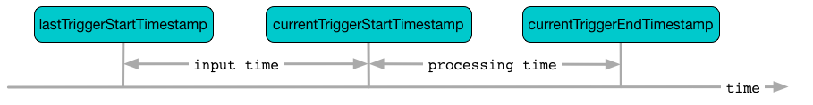

== [[ProgressReporter]] ProgressReporter Contract

`ProgressReporter` is the <<contract, contract>> of <<implementations, stream execution progress reporters>> that report the statistics of execution of a streaming query.

[[contract]]
.ProgressReporter Contract
[cols="30m,70",options="header",width="100%"]
|===
| Method
| Description

| currentBatchId
a| [[currentBatchId]]

[source, scala]
----
currentBatchId: Long
----

Id of the current streaming micro-batch

| id
a| [[id]]

[source, scala]
----
id: UUID
----

https://docs.oracle.com/javase/8/docs/api/java/util/UUID.html[Universally unique identifier (UUID)] of the streaming query (that stays unchanged between restarts)

| lastExecution
a| [[lastExecution]]

[source, scala]
----
lastExecution: QueryExecution
----

`QueryExecution` of the streaming query

| logicalPlan
a| [[logicalPlan]]

[source, scala]
----
logicalPlan: LogicalPlan
----

Logical query plan of the streaming query

Used when `ProgressReporter` is requested for the following:

* <<extractExecutionStats, extract statistics from the most recent query execution>> (to add `watermark` metric when a <<spark-sql-streaming-EventTimeWatermark.adoc#, streaming watermark>> is used)

* <<extractSourceToNumInputRows, extractSourceToNumInputRows>>

| name
a| [[name]]

[source, scala]
----
name: String
----

Name of the streaming query

| newData
a| [[newData]]

[source, scala]
----
newData: Map[BaseStreamingSource, LogicalPlan]
----

<<spark-sql-streaming-BaseStreamingSource.adoc#, Streaming readers and sources>> with the new data (as a `LogicalPlan`)

Used when:

* `ProgressReporter` <<extractExecutionStats, extracts statistics from the most recent query execution>> (to calculate the so-called `inputRows`)

| offsetSeqMetadata
a| [[offsetSeqMetadata]]

[source, scala]
----
offsetSeqMetadata: OffsetSeqMetadata
----

<<spark-sql-streaming-OffsetSeqMetadata.adoc#, OffsetSeqMetadata>> (with the current micro-batch <<spark-sql-streaming-OffsetSeqMetadata.adoc#batchWatermarkMs, event-time watermark>> and <<spark-sql-streaming-OffsetSeqMetadata.adoc#batchTimestampMs, timestamp>>)

| postEvent
a| [[postEvent]]

[source, scala]
----
postEvent(event: StreamingQueryListener.Event): Unit
----

Posts <<spark-sql-streaming-StreamingQueryListener.adoc#, StreamingQueryListener.Event>>

| runId
a| [[runId]]

[source, scala]
----
runId: UUID
----

https://docs.oracle.com/javase/8/docs/api/java/util/UUID.html[Universally unique identifier (UUID)] of the single run of the streaming query (that changes every restart)

| sink
a| [[sink]]

[source, scala]
----
sink: BaseStreamingSink
----

The one and only <<spark-sql-streaming-BaseStreamingSink.adoc#, streaming writer or sink>> of the streaming query

| sources
a| [[sources]]

[source, scala]
----
sources: Seq[BaseStreamingSource]
----

<<spark-sql-streaming-BaseStreamingSource.adoc#, Streaming readers and sources>> of the streaming query

Used when <<finishTrigger, finishing a trigger (and updating progress and marking current status as trigger inactive)>>

| sparkSession
a| [[sparkSession]]

[source, scala]
----
sparkSession: SparkSession
----

`SparkSession` of the streaming query

TIP: Read up on https://jaceklaskowski.gitbooks.io/mastering-spark-sql/spark-sql-SparkSession.html[SparkSession] in https://bit.ly/spark-sql-internals[The Internals of Spark SQL] book.

| triggerClock
a| [[triggerClock]]

[source, scala]
----
triggerClock: Clock
----

Clock of the streaming query

|===

[[implementations]]
NOTE: <<spark-sql-streaming-StreamExecution.adoc#, StreamExecution>> is the one and only known direct extension of the <<contract, ProgressReporter Contract>> in Spark Structured Streaming.

[[noDataProgressEventInterval]]
`ProgressReporter` uses the <<spark-sql-streaming-properties.adoc#spark.sql.streaming.noDataProgressEventInterval, spark.sql.streaming.noDataProgressEventInterval>> configuration property to control how long to wait between two progress events when there is no data (default: `10000L`) when <<finishTrigger, finishing trigger>>.

[[timestampFormat]]
`ProgressReporter` uses *++yyyy-MM-dd'T'HH:mm:ss.SSS'Z'++* time format (with *UTC* timezone).

[source, scala]
----
import org.apache.spark.sql.streaming.Trigger
import scala.concurrent.duration._
val sampleQuery = spark
  .readStream
  .format("rate")
  .load
  .writeStream
  .format("console")
  .option("truncate", false)
  .trigger(Trigger.ProcessingTime(10.seconds))
  .start

// Using public API
import org.apache.spark.sql.streaming.SourceProgress
scala> sampleQuery.
     |   lastProgress.
     |   sources.
     |   map { case sp: SourceProgress =>
     |     s"source = ${sp.description} => endOffset = ${sp.endOffset}" }.
     |   foreach(println)
source = RateSource[rowsPerSecond=1, rampUpTimeSeconds=0, numPartitions=8] => endOffset = 663

scala> println(sampleQuery.lastProgress.sources(0))
res40: org.apache.spark.sql.streaming.SourceProgress =
{
  "description" : "RateSource[rowsPerSecond=1, rampUpTimeSeconds=0, numPartitions=8]",
  "startOffset" : 333,
  "endOffset" : 343,
  "numInputRows" : 10,
  "inputRowsPerSecond" : 0.9998000399920015,
  "processedRowsPerSecond" : 200.0
}

// With a hack
import org.apache.spark.sql.execution.streaming.StreamingQueryWrapper
val offsets = sampleQuery.
  asInstanceOf[StreamingQueryWrapper].
  streamingQuery.
  availableOffsets.
  map { case (source, offset) =>
    s"source = $source => offset = $offset" }
scala> offsets.foreach(println)
source = RateSource[rowsPerSecond=1, rampUpTimeSeconds=0, numPartitions=8] => offset = 293
----

[[logging]]
[TIP]
====
Configure logging of the <<implementations, concrete stream execution progress reporters>> to see what happens inside a `ProgressReporter`:

* <<spark-sql-streaming-ContinuousExecution.adoc#logging, ContinuousExecution>>

* <<spark-sql-streaming-MicroBatchExecution.adoc#logging, MicroBatchExecution>>
====

=== [[progressBuffer]] `progressBuffer` Internal Property

[source, scala]
----
progressBuffer: Queue[StreamingQueryProgress]
----

`progressBuffer` is a https://www.scala-lang.org/api/2.12.x/scala/collection/mutable/Queue.html[scala.collection.mutable.Queue] of <<spark-sql-streaming-StreamingQueryProgress.adoc#, StreamingQueryProgresses>>.

`progressBuffer` has a new `StreamingQueryProgress` added when `ProgressReporter` is requested to <<updateProgress, update progress of a streaming query>>.

When the size (the number of `StreamingQueryProgresses`) is above <<spark-sql-streaming-properties.adoc#spark.sql.streaming.numRecentProgressUpdates, spark.sql.streaming.numRecentProgressUpdates>> threshold, the oldest `StreamingQueryProgress` is removed (_dequeued_).

`progressBuffer` is used when `ProgressReporter` is requested for the <<lastProgress, last>> and the <<recentProgress, recent StreamingQueryProgresses>>

=== [[status]] `status` Method

[source, scala]
----
status: StreamingQueryStatus
----

`status` gives the <<currentStatus, current StreamingQueryStatus>>.

NOTE: `status` is used when `StreamingQueryWrapper` is requested for the current status of a streaming query (that is part of link:spark-sql-streaming-StreamingQuery.adoc#status[StreamingQuery Contract]).

=== [[updateProgress]] Updating Progress of Streaming Query -- `updateProgress` Internal Method

[source, scala]
----
updateProgress(newProgress: StreamingQueryProgress): Unit
----

`updateProgress` records the input `newProgress` and posts a link:spark-sql-streaming-StreamingQueryListener.adoc#QueryProgressEvent[QueryProgressEvent] event.

.ProgressReporter's Reporting Query Progress
image::images/ProgressReporter-updateProgress.png[align="center"]

`updateProgress` adds the input `newProgress` to <<progressBuffer, progressBuffer>>.

`updateProgress` removes elements from <<progressBuffer, progressBuffer>> if their number is or exceeds the value of link:spark-sql-streaming-properties.adoc#spark.sql.streaming.numRecentProgressUpdates[spark.sql.streaming.numRecentProgressUpdates] property.

`updateProgress` <<postEvent, posts a QueryProgressEvent>> (with the input `newProgress`).

`updateProgress` prints out the following INFO message to the logs:

```
Streaming query made progress: [newProgress]
```

NOTE: `updateProgress` synchronizes concurrent access to the <<progressBuffer, progressBuffer>> internal registry.

NOTE: `updateProgress` is used exclusively when `ProgressReporter` is requested to <<finishTrigger, finish up a trigger>>.

=== [[startTrigger]] Initializing Query Progress for New Trigger -- `startTrigger` Method

[source, scala]
----
startTrigger(): Unit
----

`startTrigger` prints out the following DEBUG message to the logs:

```
Starting Trigger Calculation
```

.startTrigger's Internal Registry Changes For New Trigger
[cols="30,70",options="header",width="100%"]
|===
| Registry
| New Value

| <<lastTriggerStartTimestamp, lastTriggerStartTimestamp>>
| <<currentTriggerStartTimestamp, currentTriggerStartTimestamp>>

| <<currentTriggerStartTimestamp, currentTriggerStartTimestamp>>
| Requests the <<triggerClock, trigger clock>> for the current timestamp (in millis)

| <<currentStatus, currentStatus>>
| Enables (`true`) the `isTriggerActive` flag of the <<currentStatus, currentStatus>>

| <<currentTriggerStartOffsets, currentTriggerStartOffsets>>
| `null`

| <<currentTriggerEndOffsets, currentTriggerEndOffsets>>
| `null`

| <<currentDurationsMs, currentDurationsMs>>
| Clears the <<currentDurationsMs, currentDurationsMs>>

|===

NOTE: `startTrigger` is used exclusively when `StreamExecution` starts link:spark-sql-streaming-StreamExecution.adoc#runStream[running batches] (as part of link:spark-sql-streaming-StreamExecution.adoc#triggerExecutor[TriggerExecutor] executing a batch runner).

=== [[finishTrigger]] Finishing Up Streaming Batch (Trigger) and Generating StreamingQueryProgress -- `finishTrigger` Method

[source, scala]
----
finishTrigger(hasNewData: Boolean): Unit
----

Internally, `finishTrigger` sets <<currentTriggerEndTimestamp, currentTriggerEndTimestamp>> to the current time (using <<triggerClock, triggerClock>>).

`finishTrigger` <<extractExecutionStats, extractExecutionStats>>.

`finishTrigger` calculates the *processing time* (in seconds) as the difference between the <<currentTriggerEndTimestamp, end>> and <<currentTriggerStartTimestamp, start>> timestamps.

`finishTrigger` calculates the *input time* (in seconds) as the difference between the start time of the <<currentTriggerStartTimestamp, current>> and <<lastTriggerStartTimestamp, last>> triggers.

.ProgressReporter's finishTrigger and Timestamps


`finishTrigger` prints out the following DEBUG message to the logs:

```
Execution stats: [executionStats]
```

`finishTrigger` creates a <<SourceProgress, SourceProgress>> (aka source statistics) for <<sources, every source used>>.

`finishTrigger` creates a <<SinkProgress, SinkProgress>> (aka sink statistics) for the <<sink, sink>>.

`finishTrigger` creates a link:spark-sql-streaming-StreamingQueryProgress.adoc[StreamingQueryProgress].

If there was any data (using the input `hasNewData` flag), `finishTrigger` resets <<lastNoDataProgressEventTime, lastNoDataProgressEventTime>> (i.e. becomes the minimum possible time) and <<updateProgress, updates query progress>>.

Otherwise, when no data was available (using the input `hasNewData` flag), `finishTrigger` <<updateProgress, updates query progress>> only when <<lastNoDataProgressEventTime, lastNoDataProgressEventTime>> passed.

In the end, `finishTrigger` disables `isTriggerActive` flag of <<currentStatus, StreamingQueryStatus>> (i.e. sets it to `false`).

NOTE: `finishTrigger` is used exclusively when `MicroBatchExecution` is requested to <<spark-sql-streaming-MicroBatchExecution.adoc#runActivatedStream, run the activated streaming query>> (after <<spark-sql-streaming-MicroBatchExecution.adoc#runActivatedStream-triggerExecution, triggerExecution Phase>> at the end of a streaming batch).

=== [[reportTimeTaken]] Time-Tracking Section (Recording Execution Time for Progress Reporting) -- `reportTimeTaken` Method

[source, scala]
----
reportTimeTaken[T](
  triggerDetailKey: String)(
  body: => T): T
----

`reportTimeTaken` measures the time to execute `body` and records it in the <<currentDurationsMs, currentDurationsMs>> internal registry under `triggerDetailKey` key. If the `triggerDetailKey` key was recorded already, the current execution time is added.

In the end, `reportTimeTaken` prints out the following DEBUG message to the logs and returns the result of executing `body`.

```
[triggerDetailKey] took [time] ms
```

[NOTE]
====
`reportTimeTaken` is used when the <<spark-sql-streaming-StreamExecution.adoc#extensions, stream execution engines>> are requested to execute the following phases (that appear as `triggerDetailKey` in the DEBUG message in the logs):

* `MicroBatchExecution`
** <<spark-sql-streaming-MicroBatchExecution.adoc#runActivatedStream-triggerExecution, triggerExecution>>
** <<spark-sql-streaming-MicroBatchExecution.adoc#constructNextBatch-getOffset, getOffset>>
** <<spark-sql-streaming-MicroBatchExecution.adoc#constructNextBatch-setOffsetRange, setOffsetRange>>
** <<spark-sql-streaming-MicroBatchExecution.adoc#constructNextBatch-getEndOffset, getEndOffset>>
** <<spark-sql-streaming-MicroBatchExecution.adoc#constructNextBatch-walCommit, walCommit>>
** <<spark-sql-streaming-MicroBatchExecution.adoc#runBatch-getBatch, getBatch>>
** <<spark-sql-streaming-MicroBatchExecution.adoc#runBatch-queryPlanning, queryPlanning>>
** <<spark-sql-streaming-MicroBatchExecution.adoc#runBatch-addBatch, addBatch>>

* `ContinuousExecution`
** <<spark-sql-streaming-ContinuousExecution.adoc#runContinuous-queryPlanning, queryPlanning>>
** <<spark-sql-streaming-ContinuousExecution.adoc#runContinuous-runContinuous, runContinuous>>
====

=== [[updateStatusMessage]] Updating Status Message -- `updateStatusMessage` Method

[source, scala]
----
updateStatusMessage(message: String): Unit
----

`updateStatusMessage` simply updates the `message` in the <<currentStatus, StreamingQueryStatus>> internal registry.

[NOTE]
====
`updateStatusMessage` is used when:

* `StreamExecution` is requested to <<spark-sql-streaming-StreamExecution.adoc#runStream, run stream processing>>

* `MicroBatchExecution` is requested to <<spark-sql-streaming-MicroBatchExecution.adoc#runActivatedStream, run an activated streaming query>>, <<spark-sql-streaming-MicroBatchExecution.adoc#constructNextBatch, construct the next streaming micro-batch>>
====

=== [[extractExecutionStats]] Generating Execution Statistics -- `extractExecutionStats` Internal Method

[source, scala]
----
extractExecutionStats(hasNewData: Boolean): ExecutionStats
----

`extractExecutionStats` generates an <<spark-sql-streaming-ExecutionStats.adoc#, ExecutionStats>> of the <<lastExecution, last execution>> of the streaming query.

Internally, `extractExecutionStats` generate *watermark* metric (using the <<spark-sql-streaming-OffsetSeqMetadata.adoc#batchWatermarkMs, event-time watermark>> of the <<offsetSeqMetadata, OffsetSeqMetadata>>) if there is a <<spark-sql-streaming-EventTimeWatermark.adoc#, EventTimeWatermark>> unary logical operator in the <<logicalPlan, logical plan>> of the streaming query.

NOTE: <<spark-sql-streaming-EventTimeWatermark.adoc#, EventTimeWatermark>> unary logical operator represents <<spark-sql-streaming-Dataset-operators.adoc#withWatermark, Dataset.withWatermark>> operator in a streaming query.

`extractExecutionStats` <<extractStateOperatorMetrics, extractStateOperatorMetrics>>.

`extractExecutionStats` <<extractSourceToNumInputRows, extractSourceToNumInputRows>>.

`extractExecutionStats` finds the <<spark-sql-streaming-EventTimeWatermarkExec.adoc#, EventTimeWatermarkExec>> unary physical operator (with non-zero <<spark-sql-streaming-EventTimeStatsAccum.adoc#, EventTimeStats>>) and generates *max*, *min*, and *avg* statistics.

In the end, `extractExecutionStats` creates a <<spark-sql-streaming-ExecutionStats.adoc#, ExecutionStats>> with the execution statistics.

If the input `hasNewData` flag is turned off (`false`), `extractExecutionStats` returns an <<spark-sql-streaming-ExecutionStats.adoc#, ExecutionStats>> with no input rows and event-time statistics (that require data to be processed to have any sense).

NOTE: `extractExecutionStats` is used exclusively when `ProgressReporter` is requested to <<finishTrigger, finish up a streaming batch (trigger) and generate a StreamingQueryProgress>>.

=== [[extractStateOperatorMetrics]] `extractStateOperatorMetrics` Internal Method

[source, scala]
----
extractStateOperatorMetrics(
  hasNewData: Boolean): Seq[StateOperatorProgress]
----

`extractStateOperatorMetrics`...FIXME

NOTE: `extractStateOperatorMetrics` is used exclusively when `ProgressReporter` is requested to <<extractExecutionStats, extractExecutionStats>>.

=== [[extractSourceToNumInputRows]] `extractSourceToNumInputRows` Internal Method

[source, scala]
----
extractSourceToNumInputRows(): Map[BaseStreamingSource, Long]
----

`extractSourceToNumInputRows`...FIXME

NOTE: `extractSourceToNumInputRows` is used exclusively when `ProgressReporter` is requested to <<extractExecutionStats, extractExecutionStats>>.

=== [[formatTimestamp]] `formatTimestamp` Internal Method

[source, scala]
----
formatTimestamp(millis: Long): String
----

`formatTimestamp`...FIXME

NOTE: `formatTimestamp` is used when...FIXME

=== [[recordTriggerOffsets]] Recording Trigger Offsets (StreamProgress) -- `recordTriggerOffsets` Method

[source, scala]
----
recordTriggerOffsets(
  from: StreamProgress,
  to: StreamProgress): Unit
----

`recordTriggerOffsets` simply sets (_records_) the <<currentTriggerStartOffsets, currentTriggerStartOffsets>> and <<currentTriggerEndOffsets, currentTriggerEndOffsets>> internal registries to the <<spark-sql-streaming-Offset.adoc#json, json>> representations of the `from` and `to` <<spark-sql-streaming-StreamProgress.adoc#, StreamProgresses>>.

[NOTE]
====
`recordTriggerOffsets` is used when:

* `MicroBatchExecution` is requested to <<spark-sql-streaming-MicroBatchExecution.adoc#runActivatedStream, run the activated streaming query>>

* `ContinuousExecution` is requested to <<spark-sql-streaming-ContinuousExecution.adoc#commit, commit an epoch>>
====

=== [[lastProgress]] Last StreamingQueryProgress -- `lastProgress` Method

[source, scala]
----
lastProgress: StreamingQueryProgress
----

`lastProgress`...FIXME

NOTE: `lastProgress` is used when...FIXME

=== [[recentProgress]] `recentProgress` Method

[source, scala]
----
recentProgress: Array[StreamingQueryProgress]
----

`recentProgress`...FIXME

NOTE: `recentProgress` is used when...FIXME

=== [[internal-properties]] Internal Properties

[cols="30m,70",options="header",width="100%"]
|===
| Name
| Description

| currentDurationsMs
a| [[currentDurationsMs]] http://www.scala-lang.org/api/2.11.11/index.html#scala.collection.mutable.HashMap[scala.collection.mutable.HashMap] of action names (aka _triggerDetailKey_) and their cumulative times (in milliseconds).

Starts empty when `ProgressReporter` <<startTrigger, sets the state for a new batch>> with new entries added or updated when <<reportTimeTaken, reporting execution time>> (of an action).

[TIP]
====
You can see the current value of `currentDurationsMs` in progress reports under `durationMs`.

[options="wrap"]
----
scala> query.lastProgress.durationMs
res3: java.util.Map[String,Long] = {triggerExecution=60, queryPlanning=1, getBatch=5, getOffset=0, addBatch=30, walCommit=23}
----
====

| currentStatus
a| [[currentStatus]] <<spark-sql-streaming-StreamingQueryStatus.adoc#, StreamingQueryStatus>> with the current status of the streaming query

Available using <<status, status>> method

* `message` updated with <<updateStatusMessage, updateStatusMessage>>

| currentTriggerEndOffsets
a| [[currentTriggerEndOffsets]]

| currentTriggerEndTimestamp
a| [[currentTriggerEndTimestamp]] Timestamp of when the current batch/trigger has ended

Default: `-1L`

| currentTriggerStartOffsets
a| [[currentTriggerStartOffsets]]

| currentTriggerStartTimestamp
a| [[currentTriggerStartTimestamp]] Timestamp of when the current batch/trigger has started

Default: `-1L`

| lastNoDataProgressEventTime
a| [[lastNoDataProgressEventTime]]

Default: `Long.MinValue`

| lastTriggerStartTimestamp
a| [[lastTriggerStartTimestamp]] Timestamp of when the last batch/trigger started

Default: `-1L`

| metricWarningLogged
a| [[metricWarningLogged]] Flag to...FIXME

Default: `false`

|===
