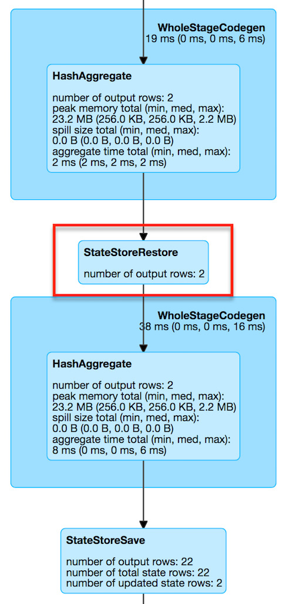

== [[StateStoreRestoreExec]] StateStoreRestoreExec Unary Physical Operator -- Restoring State of Streaming Aggregates

`StateStoreRestoreExec` is a unary physical operator (i.e. `UnaryExecNode`) that link:spark-sql-streaming-StateStoreReader.adoc[restores a state from a state store] (for the keys in the input rows).

`StateStoreRestoreExec` is <<creating-instance, created>> exclusively when <<spark-sql-streaming-StatefulAggregationStrategy.adoc#, StatefulAggregationStrategy>> execution planning strategy is executed (and plans `Aggregate` logical operators in a streaming structured query).

.StateStoreRestoreExec and StatefulAggregationStrategy

[NOTE]
====
`Aggregate` logical operator is the result of:

* `RelationalGroupedDataset` aggregations, i.e. `agg` and  `pivot` operators

* `KeyValueGroupedDataset` aggregations, i.e. `mapGroups`, `flatMapGroups`, `mapGroupsWithState`, `flatMapGroupsWithState`, `reduceGroups`, and `agg`, `cogroup` operators

* SQL's `GROUP BY` clause (possibly with `WITH CUBE` or `WITH ROLLUP`)
====

The optional property <<stateInfo, StatefulOperatorStateInfo>> is initially undefined (i.e. when `StateStoreRestoreExec` is <<creating-instance, created>>). `StateStoreRestoreExec` is updated to hold the streaming batch-specific execution property when `IncrementalExecution` link:spark-sql-streaming-IncrementalExecution.adoc#preparations[prepares a streaming physical plan for execution] (and link:spark-sql-streaming-IncrementalExecution.adoc#state[state] preparation rule is executed when `StreamExecution` link:spark-sql-streaming-MicroBatchExecution.adoc#runBatch-queryPlanning[plans a streaming query] for a streaming batch).

.StateStoreRestoreExec and IncrementalExecution
image::images/StateStoreRestoreExec-IncrementalExecution.png[align="center"]

[source, scala]
----
val counts = spark.
  readStream.
  format("rate").
  load.
  withWatermark(eventTime = "timestamp", delayThreshold = "20 seconds").
  groupBy(window($"timestamp", "5 seconds") as "group").
  agg(count("value") as "value_count").
  orderBy($"value_count".asc)

// Logical plan with Aggregate logical operator
scala> println(counts.queryExecution.logical.numberedTreeString)
00 'Sort ['value_count ASC NULLS FIRST], true
01 +- Aggregate [window#66-T20000ms], [window#66-T20000ms AS group#59, count(value#53L) AS value_count#65L]
02    +- Filter isnotnull(timestamp#52-T20000ms)
03       +- Project [named_struct(start, precisetimestampconversion(((((CASE WHEN (cast(CEIL((cast((precisetimestampconversion(timestamp#52-T20000ms, TimestampType, LongType) - 0) as double) / cast(5000000 as double))) as double) = (cast((precisetimestampconversion(timestamp#52-T20000ms, TimestampType, LongType) - 0) as double) / cast(5000000 as double))) THEN (CEIL((cast((precisetimestampconversion(timestamp#52-T20000ms, TimestampType, LongType) - 0) as double) / cast(5000000 as double))) + cast(1 as bigint)) ELSE CEIL((cast((precisetimestampconversion(timestamp#52-T20000ms, TimestampType, LongType) - 0) as double) / cast(5000000 as double))) END + cast(0 as bigint)) - cast(1 as bigint)) * 5000000) + 0), LongType, TimestampType), end, precisetimestampconversion((((((CASE WHEN (cast(CEIL((cast((precisetimestampconversion(timestamp#52-T20000ms, TimestampType, LongType) - 0) as double) / cast(5000000 as double))) as double) = (cast((precisetimestampconversion(timestamp#52-T20000ms, TimestampType, LongType) - 0) as double) / cast(5000000 as double))) THEN (CEIL((cast((precisetimestampconversion(timestamp#52-T20000ms, TimestampType, LongType) - 0) as double) / cast(5000000 as double))) + cast(1 as bigint)) ELSE CEIL((cast((precisetimestampconversion(timestamp#52-T20000ms, TimestampType, LongType) - 0) as double) / cast(5000000 as double))) END + cast(0 as bigint)) - cast(1 as bigint)) * 5000000) + 0) + 5000000), LongType, TimestampType)) AS window#66, timestamp#52-T20000ms, value#53L]
04          +- EventTimeWatermark timestamp#52: timestamp, interval 20 seconds
05             +- StreamingRelation DataSource(org.apache.spark.sql.SparkSession@4785f176,rate,List(),None,List(),None,Map(),None), rate, [timestamp#52, value#53L]

// Physical plan with StateStoreRestoreExec (as StateStoreRestore in the output)
scala> counts.explain
== Physical Plan ==
*Sort [value_count#65L ASC NULLS FIRST], true, 0
+- Exchange rangepartitioning(value_count#65L ASC NULLS FIRST, 200)
   +- *HashAggregate(keys=[window#66-T20000ms], functions=[count(value#53L)])
      +- StateStoreSave [window#66-T20000ms], StatefulOperatorStateInfo(<unknown>,c4a68192-b90b-40cc-b2c5-d996584eb0da,0,0), Append, 0
         +- *HashAggregate(keys=[window#66-T20000ms], functions=[merge_count(value#53L)])
            +- StateStoreRestore [window#66-T20000ms], StatefulOperatorStateInfo(<unknown>,c4a68192-b90b-40cc-b2c5-d996584eb0da,0,0)
               +- *HashAggregate(keys=[window#66-T20000ms], functions=[merge_count(value#53L)])
                  +- Exchange hashpartitioning(window#66-T20000ms, 200)
                     +- *HashAggregate(keys=[window#66-T20000ms], functions=[partial_count(value#53L)])
                        +- *Project [named_struct(start, precisetimestampconversion(((((CASE WHEN (cast(CEIL((cast((precisetimestampconversion(timestamp#52-T20000ms, TimestampType, LongType) - 0) as double) / 5000000.0)) as double) = (cast((precisetimestampconversion(timestamp#52-T20000ms, TimestampType, LongType) - 0) as double) / 5000000.0)) THEN (CEIL((cast((precisetimestampconversion(timestamp#52-T20000ms, TimestampType, LongType) - 0) as double) / 5000000.0)) + 1) ELSE CEIL((cast((precisetimestampconversion(timestamp#52-T20000ms, TimestampType, LongType) - 0) as double) / 5000000.0)) END + 0) - 1) * 5000000) + 0), LongType, TimestampType), end, precisetimestampconversion(((((CASE WHEN (cast(CEIL((cast((precisetimestampconversion(timestamp#52-T20000ms, TimestampType, LongType) - 0) as double) / 5000000.0)) as double) = (cast((precisetimestampconversion(timestamp#52-T20000ms, TimestampType, LongType) - 0) as double) / 5000000.0)) THEN (CEIL((cast((precisetimestampconversion(timestamp#52-T20000ms, TimestampType, LongType) - 0) as double) / 5000000.0)) + 1) ELSE CEIL((cast((precisetimestampconversion(timestamp#52-T20000ms, TimestampType, LongType) - 0) as double) / 5000000.0)) END + 0) - 1) * 5000000) + 5000000), LongType, TimestampType)) AS window#66, value#53L]
                           +- *Filter isnotnull(timestamp#52-T20000ms)
                              +- EventTimeWatermark timestamp#52: timestamp, interval 20 seconds
                                 +- StreamingRelation rate, [timestamp#52, value#53L]
----

[[metrics]]
.StateStoreRestoreExec's SQLMetrics
[cols="1,1,2",options="header",width="100%"]
|===
| Key
| Name (in UI)
| Description

| [[numOutputRows]] `numOutputRows`
| number of output rows
| The number of input rows from the <<child, child>> physical operator (for which `StateStoreRestoreExec` tried to find the state)
|===

.StateStoreRestoreExec in web UI (Details for Query)

When <<doExecute, executed>>, `StateStoreRestoreExec` executes the <<child, child>> physical operator and link:spark-sql-streaming-StateStoreOps.adoc#mapPartitionsWithStateStore[creates a StateStoreRDD to map over partitions] with `storeUpdateFunction` that restores the saved state for the keys in input rows if available.

[[output]]
The output schema of `StateStoreRestoreExec` is exactly the <<child, child>>'s output schema.

[[outputPartitioning]]
The output partitioning of `StateStoreRestoreExec` is exactly the <<child, child>>'s output partitioning.

[[stateManager]]
`StateStoreRestoreExec` uses a <<spark-sql-streaming-StreamingAggregationStateManager.adoc#, StreamingAggregationStateManager>> (that is <<spark-sql-streaming-StreamingAggregationStateManager.adoc#createStateManager, created>> for the <<keyExpressions, keyExpressions>>, the output of the <<child, child>> physical operator and the <<stateFormatVersion, stateFormatVersion>>).

=== [[doExecute]] Executing StateStoreRestoreExec -- `doExecute` Method

[source, scala]
----
doExecute(): RDD[InternalRow]
----

NOTE: `doExecute` is a part of `SparkPlan` contract to produce the result of a physical operator as an RDD of internal binary rows (i.e. `InternalRow`).

Internally, `doExecute` executes <<child, child>> physical operator and link:spark-sql-streaming-StateStoreOps.adoc#mapPartitionsWithStateStore[creates a StateStoreRDD] with `storeUpdateFunction` that does the following per <<child, child>> operator's RDD partition:

1. Generates an unsafe projection to access the key field (using <<keyExpressions, keyExpressions>> and the output schema of <<child, child>> operator).

1. For every input row (as `InternalRow`)

* Extracts the key from the row (using the unsafe projection above)

* link:spark-sql-streaming-StateStore.adoc#get[Gets the saved state] in `StateStore` for the key if available (it might not be if the key appeared in the input the first time)

* Increments <<numOutputRows, numOutputRows>> metric (that in the end is the number of rows from the <<child, child>> operator)

* Generates collection made up of the current row and possibly the state for the key if available

NOTE: The number of rows from `StateStoreRestoreExec` is the number of rows from the <<child, child>> operator with additional rows for the saved state.

NOTE: There is no way in `StateStoreRestoreExec` to find out how many rows had associated state available in a state store. You would have to use the corresponding `StateStoreSaveExec` operator's link:spark-sql-streaming-StateStoreSaveExec.adoc#metrics[metrics] (most likely `number of total state rows` but that could depend on the output mode).

=== [[creating-instance]] Creating StateStoreRestoreExec Instance

`StateStoreRestoreExec` takes the following when created:

* [[keyExpressions]] Catalyst expressions for keys (as used for aggregation in link:spark-sql-streaming-Dataset-operators.adoc#groupBy[groupBy] operator)
* [[stateInfo]] link:spark-sql-streaming-StatefulOperatorStateInfo.adoc[StatefulOperatorStateInfo]
* [[stateFormatVersion]] `stateFormatVersion` (that is the value of <<spark-sql-streaming-properties.adoc#spark.sql.streaming.aggregation.stateFormatVersion, spark.sql.streaming.aggregation.stateFormatVersion>> configuration property)
* [[child]] Child physical operator
