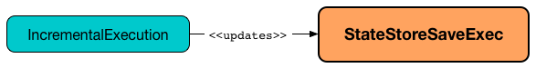
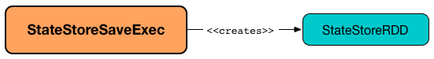
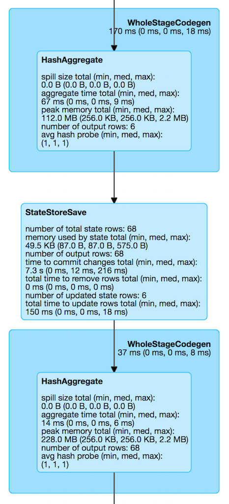

== [[StateStoreSaveExec]] StateStoreSaveExec Unary Physical Operator -- Saving State of Streaming Aggregates

`StateStoreSaveExec` is a unary physical operator that <<spark-sql-streaming-StateStoreWriter.adoc#, saves a streaming state to a state store>> with <<spark-sql-streaming-WatermarkSupport.adoc#, support for streaming watermark>>.

[NOTE]
====
A unary physical operator (`UnaryExecNode`) is a physical operator with a single <<child, child>> physical operator.

Read up on https://jaceklaskowski.gitbooks.io/mastering-spark-sql/spark-sql-SparkPlan.html[UnaryExecNode] (and physical operators in general) in https://bit.ly/spark-sql-internals[The Internals of Spark SQL] book.
====

`StateStoreSaveExec` is <<creating-instance, created>> exclusively when <<spark-sql-streaming-StatefulAggregationStrategy.adoc#, StatefulAggregationStrategy>> execution planning strategy is executed (and plans `Aggregate` logical operators in a streaming structured query).

.StateStoreSaveExec and StatefulAggregationStrategy
image::images/StateStoreSaveExec-StatefulAggregationStrategy.png[align="center"]

[NOTE]
====
`Aggregate` logical operator is the result of:

* `RelationalGroupedDataset` aggregations, i.e. `agg` and  `pivot` operators

* `KeyValueGroupedDataset` aggregations, i.e. `mapGroups`, `flatMapGroups`, `mapGroupsWithState`, `flatMapGroupsWithState`, `reduceGroups`, and `agg`, `cogroup` operators

* SQL's `GROUP BY` clause (possibly with `WITH CUBE` or `WITH ROLLUP`)
====

The optional properties, i.e. <<stateInfo, StatefulOperatorStateInfo>>, <<outputMode, output mode>>, and <<eventTimeWatermark, event time watermark>>, are undefined when `StateStoreSaveExec` is <<creating-instance, created>>. `StateStoreSaveExec` is updated to hold their streaming batch-specific execution properties when `IncrementalExecution` link:spark-sql-streaming-IncrementalExecution.adoc#preparations[prepares a streaming physical plan for execution] (and link:spark-sql-streaming-IncrementalExecution.adoc#state[state] preparation rule is executed when `StreamExecution` link:spark-sql-streaming-MicroBatchExecution.adoc#runBatch-queryPlanning[plans a streaming query] for a streaming batch).

.StateStoreSaveExec and IncrementalExecution


NOTE: Unlike link:spark-sql-streaming-StateStoreRestoreExec.adoc[StateStoreRestoreExec] operator, `StateStoreSaveExec` takes <<outputMode, output mode>> and <<eventTimeWatermark, event time watermark>> when <<creating-instance, created>>.

When <<doExecute, executed>>, `StateStoreSaveExec` link:spark-sql-streaming-StateStoreOps.adoc#mapPartitionsWithStateStore[creates a StateStoreRDD to map over partitions] with `storeUpdateFunction` that manages the `StateStore`.

.StateStoreSaveExec creates StateStoreRDD


[source, scala]
----
// START: Only for easier debugging
// The state is then only for one partition
// which should make monitoring easier
import org.apache.spark.sql.internal.SQLConf.SHUFFLE_PARTITIONS
spark.sessionState.conf.setConf(SHUFFLE_PARTITIONS, 1)

assert(spark.sessionState.conf.numShufflePartitions == 1)
// END: Only for easier debugging

val counts = spark
  .readStream
  .format("rate")
  .load
  .groupBy(window($"timestamp", "5 seconds") as "group")
  .agg(count("value") as "value_count") // <-- creates an Aggregate logical operator
  .orderBy("group")  // <-- makes for easier checking
scala> counts.explain
== Physical Plan ==
*(5) Sort [group#5 ASC NULLS FIRST], true, 0
+- Exchange rangepartitioning(group#5 ASC NULLS FIRST, 1)
   +- *(4) HashAggregate(keys=[window#11], functions=[count(value#1L)])
      +- StateStoreSave [window#11], state info [ checkpoint = <unknown>, runId = ba5e4345-6d7a-4aca-b480-231ae9268916, opId = 0, ver = 0, numPartitions = 1], Append, 0, 2
         +- *(3) HashAggregate(keys=[window#11], functions=[merge_count(value#1L)])
            +- StateStoreRestore [window#11], state info [ checkpoint = <unknown>, runId = ba5e4345-6d7a-4aca-b480-231ae9268916, opId = 0, ver = 0, numPartitions = 1], 2
               +- *(2) HashAggregate(keys=[window#11], functions=[merge_count(value#1L)])
                  +- Exchange hashpartitioning(window#11, 1)
                     +- *(1) HashAggregate(keys=[window#11], functions=[partial_count(value#1L)])
                        +- *(1) Project [named_struct(start, precisetimestampconversion(((((CASE WHEN (cast(CEIL((cast((precisetimestampconversion(timestamp#0, TimestampType, LongType) - 0) as double) / 5000000.0)) as double) = (cast((precisetimestampconversion(timestamp#0, TimestampType, LongType) - 0) as double) / 5000000.0)) THEN (CEIL((cast((precisetimestampconversion(timestamp#0, TimestampType, LongType) - 0) as double) / 5000000.0)) + 1) ELSE CEIL((cast((precisetimestampconversion(timestamp#0, TimestampType, LongType) - 0) as double) / 5000000.0)) END + 0) - 1) * 5000000) + 0), LongType, TimestampType), end, precisetimestampconversion(((((CASE WHEN (cast(CEIL((cast((precisetimestampconversion(timestamp#0, TimestampType, LongType) - 0) as double) / 5000000.0)) as double) = (cast((precisetimestampconversion(timestamp#0, TimestampType, LongType) - 0) as double) / 5000000.0)) THEN (CEIL((cast((precisetimestampconversion(timestamp#0, TimestampType, LongType) - 0) as double) / 5000000.0)) + 1) ELSE CEIL((cast((precisetimestampconversion(timestamp#0, TimestampType, LongType) - 0) as double) / 5000000.0)) END + 0) - 1) * 5000000) + 5000000), LongType, TimestampType)) AS window#11, value#1L]
                           +- *(1) Filter isnotnull(timestamp#0)
                              +- StreamingRelation rate, [timestamp#0, value#1L]

// Start the query and hence execute StateStoreSaveExec
import scala.concurrent.duration._
import org.apache.spark.sql.streaming.{OutputMode, Trigger}
val t = Trigger.ProcessingTime(1.hour) // should be enough time for exploration
val sq = counts
  .writeStream
  .format("console")
  .option("truncate", false)
  .trigger(t)
  .outputMode(OutputMode.Complete)
  .start

// wait till the first batch which should happen right after start

import org.apache.spark.sql.execution.streaming._
val lastExecution = sq.asInstanceOf[StreamingQueryWrapper].streamingQuery.lastExecution
scala> println(lastExecution.logical.numberedTreeString)
00 WriteToDataSourceV2 org.apache.spark.sql.execution.streaming.sources.MicroBatchWriter@4d8749e7
01 +- Sort [group#5 ASC NULLS FIRST], true
02    +- Aggregate [window#11], [window#11 AS group#5, count(value#1L) AS value_count#10L]
03       +- Filter isnotnull(timestamp#0)
04          +- Project [named_struct(start, precisetimestampconversion(((((CASE WHEN (cast(CEIL((cast((precisetimestampconversion(timestamp#0, TimestampType, LongType) - 0) as double) / cast(5000000 as double))) as double) = (cast((precisetimestampconversion(timestamp#0, TimestampType, LongType) - 0) as double) / cast(5000000 as double))) THEN (CEIL((cast((precisetimestampconversion(timestamp#0, TimestampType, LongType) - 0) as double) / cast(5000000 as double))) + cast(1 as bigint)) ELSE CEIL((cast((precisetimestampconversion(timestamp#0, TimestampType, LongType) - 0) as double) / cast(5000000 as double))) END + cast(0 as bigint)) - cast(1 as bigint)) * 5000000) + 0), LongType, TimestampType), end, precisetimestampconversion((((((CASE WHEN (cast(CEIL((cast((precisetimestampconversion(timestamp#0, TimestampType, LongType) - 0) as double) / cast(5000000 as double))) as double) = (cast((precisetimestampconversion(timestamp#0, TimestampType, LongType) - 0) as double) / cast(5000000 as double))) THEN (CEIL((cast((precisetimestampconversion(timestamp#0, TimestampType, LongType) - 0) as double) / cast(5000000 as double))) + cast(1 as bigint)) ELSE CEIL((cast((precisetimestampconversion(timestamp#0, TimestampType, LongType) - 0) as double) / cast(5000000 as double))) END + cast(0 as bigint)) - cast(1 as bigint)) * 5000000) + 0) + 5000000), LongType, TimestampType)) AS window#11, timestamp#0, value#1L]
05             +- Project [timestamp#211 AS timestamp#0, value#212L AS value#1L]
06                +- Streaming RelationV2 rate[timestamp#211, value#212L]
----

.StateStoreSaveExec and StateStoreRDD (after streamingBatch.toRdd.count)
image::images/StateStoreSaveExec-StateStoreRDD-count.png[align="center"]

[NOTE]
====
The number of partitions of link:spark-sql-streaming-StateStoreOps.adoc#mapPartitionsWithStateStore[StateStoreRDD] (and hence the number of Spark tasks) is what was defined for the <<child, child>> physical plan.

There will be that many `StateStores` as there are partitions in `StateStoreRDD`.
====

NOTE: `StateStoreSaveExec` <<doExecute, behaves>> differently per output mode.

[[metrics]]
`StateStoreSaveExec` uses the performance metrics of <<spark-sql-streaming-StateStoreWriter.adoc#metrics, StateStoreWriter>>.

.StateStoreSaveExec's Performance Metrics
[cols="1m,2",options="header",width="100%"]
|===
| Key
| Usage

| allUpdatesTimeMs
| [[allUpdatesTimeMs]]

| allRemovalsTimeMs
| [[allRemovalsTimeMs]]

| commitTimeMs
| [[commitTimeMs]]

| numOutputRows
| [[numOutputRows]]

| numTotalStateRows
| [[numTotalStateRows]] Number of the state keys in the link:spark-sql-streaming-StateStore.adoc[state store]

Corresponds to `numRowsTotal` in `stateOperators` in link:spark-sql-streaming-StreamingQueryProgress.adoc[StreamingQueryProgress] (and is available as `sq.lastProgress.stateOperators(0).numRowsTotal` for ``0``th operator).

| numUpdatedStateRows
a| [[numUpdatedStateRows]] Number of the state keys that link:spark-sql-streaming-StateStore.adoc#put[were stored as updates in the state store] in a trigger and for the keys in the result rows of the upstream physical operator.

* In `Complete` output mode, `numUpdatedStateRows` is the number of input rows (which should be exactly the number of output rows from the upstream operator)

CAUTION: FIXME

* In `Append` output mode, `numUpdatedStateRows` is the number of input rows with keys that have not expired yet (per required watermark)

* In `Update` output mode, `numUpdatedStateRows` is exactly <<numOutputRows, number of output rows>>, i.e. the number of keys that have not expired yet if watermark has been defined at all (which is optional).

CAUTION: FIXME

NOTE: You can see the current value as `numRowsUpdated` attribute in `stateOperators` in link:spark-sql-streaming-StreamingQueryProgress.adoc[StreamingQueryProgress] (that is available as `StreamingQuery.lastProgress.stateOperators(n).numRowsUpdated` for ``n``th operator).

| stateMemory
| [[stateMemory]] Memory used by the link:spark-sql-streaming-StateStore.adoc[StateStore]

|===

.StateStoreSaveExec in web UI (Details for Query)


When <<doExecute, executed>>, `StateStoreSaveExec` executes the <<child, child>> physical operator and link:spark-sql-streaming-StateStoreOps.adoc#mapPartitionsWithStateStore[creates a StateStoreRDD] (with `storeUpdateFunction` specific to the output mode).

[[output]]
The output schema of `StateStoreSaveExec` is exactly the <<child, child>>'s output schema.

[[outputPartitioning]]
The output partitioning of `StateStoreSaveExec` is exactly the <<child, child>>'s output partitioning.

[[stateManager]]
`StateStoreRestoreExec` uses a <<spark-sql-streaming-StreamingAggregationStateManager.adoc#, StreamingAggregationStateManager>> (that is <<spark-sql-streaming-StreamingAggregationStateManager.adoc#createStateManager, created>> for the <<keyExpressions, keyExpressions>>, the output of the <<child, child>> physical operator and the <<stateFormatVersion, stateFormatVersion>>).

[TIP]
====
Enable `INFO` logging level for `org.apache.spark.sql.execution.streaming.StateStoreSaveExec` to see what happens inside.

Add the following line to `conf/log4j.properties`:

```
log4j.logger.org.apache.spark.sql.execution.streaming.StateStoreSaveExec=INFO
```

Refer to link:spark-sql-streaming-logging.adoc[Logging].
====

=== [[doExecute]] Executing Physical Operator (Generating RDD[InternalRow]) -- `doExecute` Method

[source, scala]
----
doExecute(): RDD[InternalRow]
----

NOTE: `doExecute` is part of `SparkPlan` Contract to generate the runtime representation of an physical operator as a distributed computation over internal binary rows on Apache Spark (i.e. `RDD[InternalRow]`).

Internally, `doExecute` initializes link:spark-sql-streaming-StateStoreWriter.adoc#metrics[metrics].

NOTE: `doExecute` requires that the optional <<outputMode, outputMode>> is at this point defined (that should have happened when `IncrementalExecution` link:spark-sql-streaming-IncrementalExecution.adoc#preparations[had prepared a streaming aggregation for execution]).

`doExecute` executes <<child, child>> physical operator and link:spark-sql-streaming-StateStoreOps.adoc#mapPartitionsWithStateStore[creates a StateStoreRDD] with `storeUpdateFunction` that:

1. Generates an unsafe projection to access the key field (using <<keyExpressions, keyExpressions>> and the output schema of <<child, child>>).

1. Branches off per <<outputMode, output mode>>.

[[doExecute-branches]]
.doExecute's Behaviour per Output Mode
[cols="1,2",options="header",width="100%"]
|===
| Output Mode
| doExecute's Behaviour

| [[doExecute-Append]] `Append`
a|

NOTE: `Append` is the link:spark-sql-streaming-OutputMode.adoc#default-output-mode[default output mode] when unspecified.

NOTE: `Append` output mode requires that a streaming query defines event time watermark (using link:spark-sql-streaming-Dataset-withWatermark.adoc[withWatermark] operator) on the event time column that is used in aggregation (directly or using link:spark-sql-streaming-window.adoc[window] function).

1. Finds late (aggregate) rows from <<child, child>> physical operator (that have expired per link:spark-sql-streaming-WatermarkSupport.adoc#watermarkPredicateForData[watermark])

1. link:spark-sql-streaming-StateStore.adoc#put[Stores the late rows in the state store] (and increments <<numUpdatedStateRows, numUpdatedStateRows>> metric)

1. link:spark-sql-streaming-StateStore.adoc#getRange[Gets all the added (late) rows from the state store]

1. Creates an iterator that link:spark-sql-streaming-StateStore.adoc#remove[removes the late rows from the state store] when requested the next row and in the end link:spark-sql-streaming-StateStore.adoc#commit[commits the state updates]

NOTE: <<numUpdatedStateRows, numUpdatedStateRows>> metric is the number of rows that...FIXME

TIP: Refer to link:spark-sql-streaming-StateStoreSaveExec-Append.adoc[Demo: StateStoreSaveExec with Append Output Mode] for an example of `StateStoreSaveExec` in `Append` output mode.

CAUTION: FIXME When is "Filtering state store on:" printed out?

CAUTION: FIXME Track numUpdatedStateRows metric

---

1. Uses link:spark-sql-streaming-WatermarkSupport.adoc#watermarkPredicateForData[watermarkPredicateForData] predicate to exclude matching rows and (like in <<doExecute-Complete, Complete>> output mode) link:spark-sql-streaming-StateStore.adoc#put[stores all the remaining rows] in `StateStore`.

1. (like in <<doExecute-Complete, Complete>> output mode) While storing the rows, increments <<numUpdatedStateRows, numUpdatedStateRows>> metric (for every row) and records the total time in <<allUpdatesTimeMs, allUpdatesTimeMs>> metric.

1. link:spark-sql-streaming-StateStore.adoc#getRange[Takes all the rows] from `StateStore` and returns a `NextIterator` that:

* In `getNext`, finds the first row that matches link:spark-sql-streaming-WatermarkSupport.adoc#watermarkPredicateForKeys[watermarkPredicateForKeys] predicate, link:spark-sql-streaming-StateStore.adoc#remove[removes it] from `StateStore`, and returns it back.
+
If no row was found, `getNext` also marks the iterator as finished.

* In `close`, records the time to iterate over all the rows in <<allRemovalsTimeMs, allRemovalsTimeMs>> metric, link:spark-sql-streaming-StateStore.adoc#commit[commits the updates] to `StateStore` followed by recording the time in <<commitTimeMs, commitTimeMs>> metric and link:spark-sql-streaming-StateStoreWriter.adoc#setStoreMetrics[recording StateStore metrics].

| [[doExecute-Complete]] link:spark-sql-streaming-OutputMode.adoc#Complete[Complete]
a|

1. Takes all `UnsafeRow` rows (from the parent iterator)

1. link:spark-sql-streaming-StateStore.adoc#put[Stores the rows by key in the state store] eagerly (i.e. all rows that are available in the parent iterator before proceeding)

1. link:spark-sql-streaming-StateStore.adoc#commit[Commits the state updates]

1. In the end, `doExecute` link:spark-sql-streaming-StateStore.adoc#iterator[reads the key-row pairs from the state store] and passes the rows along (i.e. to the following physical operator)

The number of keys stored in the state store is recorded in <<numUpdatedStateRows, numUpdatedStateRows>> metric.

NOTE: In `Complete` output mode <<numOutputRows, numOutputRows>> metric is exactly <<numTotalStateRows, numTotalStateRows>> metric.

TIP: Refer to link:spark-sql-streaming-StateStoreSaveExec-Complete.adoc[Demo: StateStoreSaveExec with Complete Output Mode] for an example of `StateStoreSaveExec` in `Complete` output mode.

---

1. link:spark-sql-streaming-StateStore.adoc#put[Stores all rows] (as `UnsafeRow`) in `StateStore`.

1. While storing the rows, increments <<numUpdatedStateRows, numUpdatedStateRows>> metric (for every row) and records the total time in <<allUpdatesTimeMs, allUpdatesTimeMs>> metric.

1. Records `0` in <<allRemovalsTimeMs, allRemovalsTimeMs>> metric.

1. link:spark-sql-streaming-StateStore.adoc#commit[Commits the state updates] to `StateStore` and records the time in <<commitTimeMs, commitTimeMs>> metric.

1. link:spark-sql-streaming-StateStoreWriter.adoc#setStoreMetrics[Records StateStore metrics].

1. In the end, link:spark-sql-streaming-StateStore.adoc#iterator[takes all the rows stored] in `StateStore` and increments <<numOutputRows, numOutputRows>> metric.

| [[doExecute-Update]] `Update`
a|

Returns an iterator that filters out late aggregate rows (per link:spark-sql-streaming-WatermarkSupport.adoc#watermarkPredicateForData[watermark] if defined) and link:spark-sql-streaming-StateStore.adoc#put[stores the "young" rows in the state store] (one by one, i.e. every `next`). With no more rows available, that link:spark-sql-streaming-StateStore.adoc#remove[removes the late rows from the state store] (all at once) and link:spark-sql-streaming-StateStore.adoc#commit[commits the state updates].

TIP: Refer to link:spark-sql-streaming-StateStoreSaveExec-Update.adoc[Demo: StateStoreSaveExec with Update Output Mode] for an example of `StateStoreSaveExec` in `Update` output mode.

---

Returns `Iterator` of rows that uses link:spark-sql-streaming-WatermarkSupport.adoc#watermarkPredicateForData[watermarkPredicateForData] predicate to filter out late rows.

In `hasNext`, when rows are no longer available:

1. Records the total time to iterate over all the rows in <<allUpdatesTimeMs, allUpdatesTimeMs>> metric.

1. link:spark-sql-streaming-WatermarkSupport.adoc#removeKeysOlderThanWatermark[removeKeysOlderThanWatermark] and records the time in <<allRemovalsTimeMs, allRemovalsTimeMs>> metric.

1. link:spark-sql-streaming-StateStore.adoc#commit[Commits the updates] to `StateStore` and records the time in <<commitTimeMs, commitTimeMs>> metric.

1. link:spark-sql-streaming-StateStoreWriter.adoc#setStoreMetrics[Records StateStore metrics].

In `next`, link:spark-sql-streaming-StateStore.adoc#put[stores a row] in `StateStore` and increments <<numOutputRows, numOutputRows>> and <<numUpdatedStateRows, numUpdatedStateRows>> metrics.
|===

`doExecute` reports a `UnsupportedOperationException` when executed with an invalid output mode.

```
Invalid output mode: [outputMode]
```

=== [[creating-instance]] Creating StateStoreSaveExec Instance

`StateStoreSaveExec` takes the following when created:

* [[keyExpressions]] Catalyst expressions for keys (as used for aggregation in link:spark-sql-streaming-Dataset-operators.adoc#groupBy[groupBy] operator)
* [[stateInfo]] link:spark-sql-streaming-StatefulOperatorStateInfo.adoc[StatefulOperatorStateInfo]
* [[outputMode]] link:spark-sql-streaming-OutputMode.adoc[Output mode]
* [[eventTimeWatermark]] Event time watermark (as `long` number)
* [[stateFormatVersion]] `stateFormatVersion` (that is the value of <<spark-sql-streaming-properties.adoc#spark.sql.streaming.aggregation.stateFormatVersion, spark.sql.streaming.aggregation.stateFormatVersion>> configuration property)
* [[child]] Child physical operator
