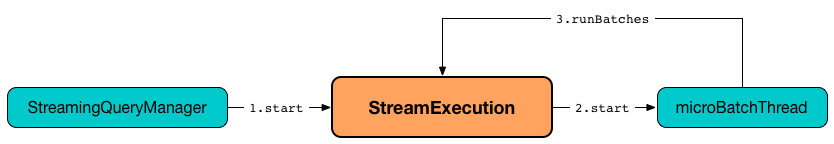
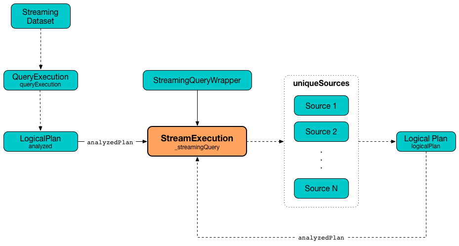
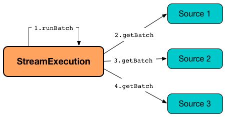
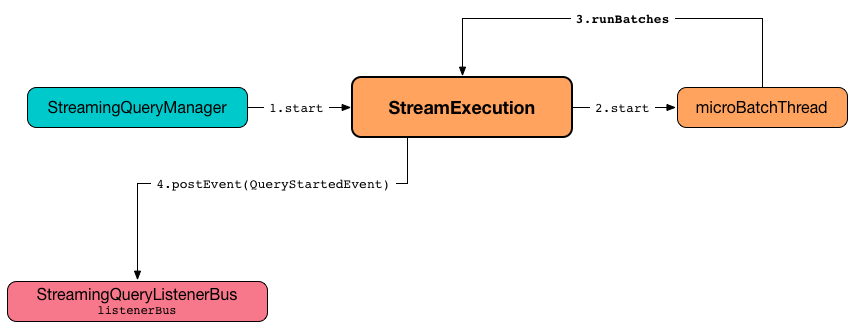
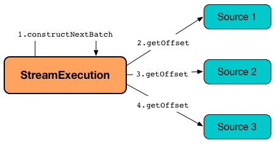

== [[StreamExecution]] StreamExecution -- Execution Environment of Streaming Dataset

`StreamExecution` is the *execution environment* of a link:spark-sql-streaming-StreamingQuery.adoc[single continuous query] (aka _streaming Dataset_) that is executed every <<trigger, trigger>> and in the end <<runBatch-addBatch, writes the result as a Dataset to a sink>>.

NOTE: *Continuous query*, *streaming query*, *continuous Dataset*, *streaming Dataset* are synonyms, and `StreamExecution` uses <<logicalPlan, analyzed logical plan>> internally to refer to it.

`StreamExecution` is <<creating-instance, created>> exclusively when `DataStreamWriter` is link:spark-sql-streaming-DataStreamWriter.adoc#start[started].

[source, scala]
----
scala> spark.version
res0: String = 2.3.0-SNAPSHOT

import org.apache.spark.sql.streaming.Trigger
import scala.concurrent.duration._
val q = spark.
  readStream.
  format("rate").
  load.
  writeStream.
  format("console").
  trigger(Trigger.ProcessingTime(10.minutes)).
  start
scala> :type q
org.apache.spark.sql.streaming.StreamingQuery

// Pull out StreamExecution off StreamingQueryWrapper
import org.apache.spark.sql.execution.streaming.{StreamExecution, StreamingQueryWrapper}
val se = q.asInstanceOf[StreamingQueryWrapper].streamingQuery
scala> :type se
org.apache.spark.sql.execution.streaming.StreamExecution
----

.Creating Instance of StreamExecution
image::images/StreamExecution-creating-instance.png[align="center"]

NOTE: link:spark-sql-streaming-DataStreamWriter.adoc[DataStreamWriter] describes how the results of executing batches of a streaming query are written to a streaming sink.

`StreamExecution` <<start, starts a thread of execution>> that runs the streaming query continuously and concurrently (and <<runBatches, polls for new records in the streaming data sources to create a batch>> every trigger).

.StreamExecution's Starting Streaming Query (on Execution Thread)


`StreamExecution` can be in three states:

* `INITIALIZED` when the instance was created.
* `ACTIVE` when batches are pulled from the sources.
* `TERMINATED` when batches were successfully processed or the query stopped.

`StreamExecution` is a link:spark-sql-streaming-ProgressReporter.adoc[ProgressReporter] and <<postEvent, reports status of the streaming query>> (i.e. when it starts, progresses and terminates) by posting `StreamingQueryListener` events.

`StreamExecution` tracks streaming data sources in <<uniqueSources, uniqueSources>> internal registry.

.StreamExecution's uniqueSources Registry of Streaming Data Sources


`StreamExecution` collects `durationMs` for the execution units of streaming batches.

.StreamExecution's durationMs
image::images/StreamExecution-durationMs.png[align="center"]

[source, scala]
----
scala> :type q
org.apache.spark.sql.streaming.StreamingQuery

scala> println(q.lastProgress)
{
  "id" : "03fc78fc-fe19-408c-a1ae-812d0e28fcee",
  "runId" : "8c247071-afba-40e5-aad2-0e6f45f22488",
  "name" : null,
  "timestamp" : "2017-08-14T20:30:00.004Z",
  "batchId" : 1,
  "numInputRows" : 432,
  "inputRowsPerSecond" : 0.9993568953312452,
  "processedRowsPerSecond" : 1380.1916932907347,
  "durationMs" : {
    "addBatch" : 237,
    "getBatch" : 26,
    "getOffset" : 0,
    "queryPlanning" : 1,
    "triggerExecution" : 313,
    "walCommit" : 45
  },
  "stateOperators" : [ ],
  "sources" : [ {
    "description" : "RateSource[rowsPerSecond=1, rampUpTimeSeconds=0, numPartitions=8]",
    "startOffset" : 0,
    "endOffset" : 432,
    "numInputRows" : 432,
    "inputRowsPerSecond" : 0.9993568953312452,
    "processedRowsPerSecond" : 1380.1916932907347
  } ],
  "sink" : {
    "description" : "ConsoleSink[numRows=20, truncate=true]"
  }
}
----

`StreamExecution` uses <<offsetLog, OffsetSeqLog>> and <<batchCommitLog, BatchCommitLog>> metadata logs for *write-ahead log* (to record offsets to be processed) and that have already been processed and committed to a streaming sink, respectively.

TIP: Monitor `offsets` and `commits` metadata logs to know the progress of a streaming query.

[[internal-registries]]
.StreamExecution's Internal Registries and Counters (in alphabetical order)
[cols="1,2",options="header",width="100%"]
|===
| Name
| Description

| [[availableOffsets]] `availableOffsets`
a| link:spark-sql-streaming-StreamProgress.adoc[StreamProgress] of the streaming sources with their available and unprocessed offsets.

NOTE: `availableOffsets` is a part of link:spark-sql-streaming-ProgressReporter.adoc#availableOffsets[ProgressReporter Contract].

NOTE: link:spark-sql-streaming-StreamProgress.adoc[StreamProgress] is an enhanced `immutable.Map` from Scala with streaming sources as keys and their link:spark-sql-streaming-Offset.adoc[Offsets] as values.

---

Set when (in order):

1. `StreamExecution` resumes and <<populateStartOffsets, populates the start offsets>> with the latest offsets from the <<offsetLog, offset log>> that may have already been processed (and committed to the <<batchCommitLog, batch commit log>> so they are used as the current <<committedOffsets, committed offsets>>)

1. `StreamExecution` <<constructNextBatch, constructs the next streaming batch>> (and gets offsets from the sources)

[NOTE]
====
You can see <<availableOffsets, availableOffsets>> in the DEBUG message in the logs when `StreamExecution` resumes and <<populateStartOffsets, populates the start offsets>>.

```
DEBUG Resuming at batch [currentBatchId] with committed offsets [committedOffsets] and available offsets [availableOffsets]
```
====

Used when:

* `StreamExecution` starts <<runBatches, running streaming batches>> for the first time (i.e. <<currentBatchId, current batch id>> is `-1` which is right at the initialization time)

* `StreamExecution` <<dataAvailable, checks whether a new data is available in the sources>> (and is not recorded in <<committedOffsets, committed offsets>>)

* `StreamExecution` <<constructNextBatch, constructs the next streaming batch>> (and records offsets in the <<offsetLog, write-ahead offset log>>)

* `StreamExecution` <<runBatch, runs a streaming batch>> (and fetches data from the sources that has not been processed yet, i.e. not in <<committedOffsets, committed offsets>> registry)

* `StreamExecution` finishes <<runBatches, running streaming batches>> when data was available in the sources and the offsets have just been committed to a sink (and being added to <<committedOffsets, committed offsets>> registry)

* `StreamExecution` <<toDebugString, prints out debug information>> when a streaming query has terminated due to an exception

NOTE: `availableOffsets` works in tandem with <<committedOffsets, committedOffsets>> registry.

| [[awaitBatchLock]] `awaitBatchLock`
| Java's fair reentrant mutual exclusion https://docs.oracle.com/javase/8/docs/api/java/util/concurrent/locks/ReentrantLock.html[java.util.concurrent.locks.ReentrantLock] (that favors granting access to the longest-waiting thread under contention).

| [[batchCommitLog]] `batchCommitLog`
a| link:spark-sql-streaming-BatchCommitLog.adoc[BatchCommitLog] with `commits` <<checkpointFile, metadata checkpoint directory>> for completed streaming batches (with a single file per batch with a file name being the batch id).

NOTE: *Metadata log* or *metadata checkpoint* are synonyms and are often used interchangeably.

Used when `StreamExecution` <<runBatches, runs streaming batches>> (and records a batch that had data for processing and has finished successfully) and <<populateStartOffsets, populates the start offsets>> (by looking up what has been committed the last time the streaming query ran).

NOTE: `StreamExecution` <<constructNextBatch-purge, discards offsets from the batch commit log>> when the <<currentBatchId, current batch id>> is above link:spark-sql-streaming-properties.adoc#spark.sql.streaming.minBatchesToRetain[spark.sql.streaming.minBatchesToRetain] Spark property (which defaults to `100`).

| [[committedOffsets]] `committedOffsets`
a| link:spark-sql-streaming-StreamProgress.adoc[StreamProgress] of the streaming sources and the committed offsets (i.e. processed already).

NOTE: `committedOffsets` is a part of link:spark-sql-streaming-ProgressReporter.adoc#committedOffsets[ProgressReporter Contract].

| [[currentBatchId]] `currentBatchId`
a| Current batch number

* `-1` when `StreamExecution` is <<creating-instance, created>>

* `0` when `StreamExecution` <<populateStartOffsets, populates start offsets>> (and <<offsetLog, OffsetSeqLog>> is empty, i.e. no offset files in `offsets` directory in checkpoint)

* Incremented when `StreamExecution` <<runBatches, runs streaming batches>> and finishes a trigger that had <<dataAvailable, data available from sources>> (right after <<batchCommitLog, committing the batch>>).

| [[id]] `id`
a| Unique identifier of the streaming query

Set as the `id` of <<streamMetadata, streamMetadata>> when `StreamExecution` is <<creating-instance, created>>.

NOTE: `id` can get fetched from link:spark-sql-streaming-DataStreamWriter.adoc#checkpointLocation[checkpoint metadata] if available and thus recovered when a query is resumed (i.e. restarted after a failure or a planned stop).

| [[initializationLatch]] `initializationLatch`
|

| [[lastExecution]] `lastExecution`
| Last link:spark-sql-streaming-IncrementalExecution.adoc[IncrementalExecution]

| [[logicalPlan]] `logicalPlan`
a| Lazily-generated logical plan (i.e. `LogicalPlan`) of the streaming Dataset

NOTE: `logicalPlan` is a part of link:spark-sql-streaming-ProgressReporter.adoc#logicalPlan[ProgressReporter Contract].

Initialized right after `StreamExecution` starts <<runBatches, running streaming batches>> (which is when <<microBatchThread, stream execution thread>> is started).

Used mainly when `StreamExecution` <<runBatch-withNewSources, replaces StreamingExecutionRelations in a logical query plan with relations with new data>> that has arrived since the last batch.

---

While initializing, `logicalPlan` transforms the <<analyzedPlan, analyzed logical plan>> so that every link:spark-sql-streaming-StreamingRelation.adoc[StreamingRelation] is replaced with a link:spark-sql-streaming-StreamingExecutionRelation.adoc[StreamingExecutionRelation]. `logicalPlan` link:spark-sql-streaming-StreamingExecutionRelation.adoc#creating-instance[creates] a `StreamingExecutionRelation` with `source` created using a metadata path as `/sources/[nextSourceId]` under the <<resolvedCheckpointRoot, checkpoint directory>>.

NOTE: `nextSourceId` is the unique identifier of every `StreamingRelation` in <<analyzedPlan, analyzed logical plan>> starting from `0`.

NOTE: `logicalPlan` uses `DataSource.createSource` factory method to create a link:spark-sql-streaming-Source.adoc[streaming Source] that assumes link:spark-sql-streaming-StreamSourceProvider.adoc[StreamSourceProvider] or `FileFormat` as the implementations of the streaming data sources for reading.

While initializing, `logicalPlan` also initializes <<sources, sources>> and <<uniqueSources, uniqueSources>> registries.

| [[microBatchThread]] `microBatchThread`
a| Thread of execution to run a streaming query concurrently with the name as `stream execution thread for [prettyIdString]` (that uses <<prettyIdString, prettyIdString>> for logging purposes).

When started, `microBatchThread` sets the so-called call site and <<runBatches, runs streaming batches>>.

NOTE: `microBatchThread` is Java's https://docs.oracle.com/javase/8/docs/api/java/lang/Thread.html[java.util.Thread].

[TIP]
====
Use Java's http://docs.oracle.com/javase/8/docs/technotes/guides/management/jconsole.html[jconsole] or https://docs.oracle.com/javase/8/docs/technotes/tools/unix/jstack.html[jstack] to monitor the streaming threads.

[options="wrap"]
----
$ jstack 13056 \| grep -e "stream execution thread"
"stream execution thread for kafka-topic1 [id = 609c5ea3-3e0b-4da9-9814-d0ad336dcadd, runId = 0717993d-e3f4-4e4b-81f5-f4c8a67e44b7]" #175 daemon prio=5 os_prio=31 tid=0x00007fe784978000 nid=0xc723 waiting on condition [0x0000000127cf0000]
----

====

| [[newData]] `newData`
a| The most recent input data (as `DataFrame`) for every link:spark-sql-streaming-Source.adoc[streaming source] (in <<logicalPlan, logical query plan>>) for which there is new data available.

NOTE: `newData` is a part of link:spark-sql-streaming-ProgressReporter.adoc#newData[ProgressReporter Contract].

Set exclusively when `StreamExecution` <<runBatch-getBatch, requests unprocessed data from streaming sources>> (as part of <<runBatch, running a single streaming batch>>).

Used exclusively when `StreamExecution` <<runBatch-withNewSources, replaces StreamingExecutionRelations in a logical query plan with relations with new data>> (as part of <<runBatch, running a single streaming batch>>).

| [[noNewData]] `noNewData`
| Flag whether there are any new offsets available for processing or not.

Turned on (i.e. enabled) when <<constructNextBatch, constructing the next streaming batch>> when no new offsets are available.

| [[offsetLog]] `offsetLog`
a| link:spark-sql-streaming-OffsetSeqLog.adoc[OffsetSeqLog] with `offsets` <<checkpointFile, metadata checkpoint directory>> for *write-ahead log* to record offsets in as ready for processing.

NOTE: *Metadata log* or *metadata checkpoint* are synonyms and are often used interchangeably.

Used when `StreamExecution` <<populateStartOffsets, populates the start offsets>> and <<constructNextBatch, constructs the next streaming batch>> (first to store the current batch's offsets in a write-ahead log and retrieve the previous batch's offsets right afterwards).

NOTE: `StreamExecution` <<constructNextBatch-purge, discards offsets from the offset metadata log>> when the <<currentBatchId, current batch id>> is above link:spark-sql-streaming-properties.adoc#spark.sql.streaming.minBatchesToRetain[spark.sql.streaming.minBatchesToRetain] Spark property (which defaults to `100`).

| [[offsetSeqMetadata]] `offsetSeqMetadata`
a| link:spark-sql-streaming-OffsetSeqMetadata.adoc[OffsetSeqMetadata]

NOTE: `offsetSeqMetadata` is a part of link:spark-sql-streaming-ProgressReporter.adoc#offsetSeqMetadata[ProgressReporter Contract].

* Initialized with `0` for `batchWatermarkMs` and `batchTimestampMs` when `StreamExecution` is <<creating-instance, created>>.

* Updated with `0` for `batchWatermarkMs` and `batchTimestampMs` and `SparkSession` with `spark.sql.adaptive.enabled` disabled when `StreamExecution` <<runBatches, runs streaming batches>>.

* Used in...FIXME

* Copied with `batchTimestampMs` updated with the current time (in milliseconds) when `StreamExecution` <<constructNextBatch, constructs the next streaming batch>>.

| [[prettyIdString]] `prettyIdString`
a| Pretty-identified string for identification in logs (with <<name, name>> if defined).

```
// query name set
queryName [id = xyz, runId = abc]

// no query name
[id = xyz, runId = abc]
```

| [[resolvedCheckpointRoot]] `resolvedCheckpointRoot`
a| Qualified path of the checkpoint directory (as defined using <<checkpointRoot, checkpointRoot>> when `StreamExecution` is <<creating-instance, created>>).

[NOTE]
====
<<checkpointRoot, checkpointRoot>> is defined using `checkpointLocation` option or link:spark-sql-streaming-properties.adoc#spark.sql.streaming.checkpointLocation[spark.sql.streaming.checkpointLocation] Spark property with `queryName` option.

`checkpointLocation` and `queryName` options are defined when `StreamingQueryManager` link:spark-sql-streaming-StreamingQueryManager.adoc#createQuery[creates a streaming query].
====

Used when <<checkpointFile, creating the path to the checkpoint directory>> and when `StreamExecution` finishes <<runBatches, running streaming batches>>.

Used for <<logicalPlan, logicalPlan>> (while transforming <<analyzedPlan, analyzedPlan>> and planning `StreamingRelation` logical operators to corresponding `StreamingExecutionRelation` physical operators with the streaming data sources created passing in the path to `sources` directory to store checkpointing metadata).

[NOTE]
====
You can see `resolvedCheckpointRoot` in the INFO message when `StreamExecution` is <<start, started>>.

[options="wrap"]
----
INFO StreamExecution: Starting [id] with [resolvedCheckpointRoot] to store the query checkpoint.
----

====

Internally, `resolvedCheckpointRoot` creates a Hadoop `org.apache.hadoop.fs.Path` for <<checkpointRoot, checkpointRoot>> and makes it qualified.

NOTE: `resolvedCheckpointRoot` uses `SparkSession` to access `SessionState` for a Hadoop configuration.

| [[runId]] `runId`
|

| [[sources]] `sources`
| All link:spark-sql-streaming-Source.adoc[streaming Sources] in <<logicalPlan, logical query plan>> (that are the link:spark-sql-streaming-StreamingExecutionRelation.adoc#source[sources] from `StreamingExecutionRelation`).

| [[startLatch]] `startLatch`
| Java's https://docs.oracle.com/javase/8/docs/api/java/util/concurrent/CountDownLatch.html[java.util.concurrent.CountDownLatch] with count `1`.

Used when `StreamExecution` is <<start, started>> to get notified when `StreamExecution` has started <<runBatches, running streaming batches>>.

| [[state]] `state`
a| Java's https://docs.oracle.com/javase/8/docs/api/java/util/concurrent/atomic/AtomicReference.html[java.util.concurrent.atomic.AtomicReference] for the three different states a streaming query execution can be:

* `INITIALIZING` (default)
* `ACTIVE` (after the first execution of <<runBatches, runBatches>>)
* `TERMINATED`

| [[streamMetadata]] `streamMetadata`
| `StreamMetadata` from the `metadata` file from <<checkpointFile, checkpoint directory>>. If the `metadata` file is not available it is created (with a new random <<id, id>>).

| [[triggerExecutor]] `triggerExecutor`
a| link:spark-sql-streaming-TriggerExecutor.adoc[TriggerExecutor] per <<trigger, Trigger>>:

* `ProcessingTimeExecutor` for `ProcessingTime`
* `OneTimeExecutor` for `OneTimeTrigger` (aka link:spark-sql-streaming-Trigger.adoc#Once[Once] trigger)

Used when `StreamExecution` starts <<runBatches, running streaming batches>>.

NOTE: `StreamExecution` reports a `IllegalStateException` when `TriggerExecutor` is different from the link:spark-sql-streaming-TriggerExecutor.adoc#available-implementations[two built-in implementations]: `OneTimeExecutor`
or `ProcessingTimeExecutor`.

| [[uniqueSources]] `uniqueSources`
a| Unique link:spark-sql-streaming-Source.adoc[streaming data sources] in a streaming Dataset (after being collected as `StreamingExecutionRelation` from the corresponding <<logicalPlan, logical query plan>>).

NOTE: link:spark-sql-streaming-StreamingExecutionRelation.adoc[StreamingExecutionRelation] is a leaf logical operator (i.e. `LogicalPlan`) that represents a streaming data source (and corresponds to a single link:spark-sql-streaming-StreamingRelation.adoc[StreamingRelation] in <<analyzedPlan, analyzed logical query plan>> of a streaming Dataset).

Used when `StreamExecution`:

* <<constructNextBatch, Constructs the next streaming batch>> (and gets new offsets for every streaming data source)

* <<stopSources, Stops all streaming data sources>>
|===

[TIP]
====
Enable `INFO` or `DEBUG` logging levels for `org.apache.spark.sql.execution.streaming.StreamExecution` to see what happens inside.

Add the following line to `conf/log4j.properties`:

```
log4j.logger.org.apache.spark.sql.execution.streaming.StreamExecution=DEBUG
```

Refer to link:spark-sql-streaming-logging.adoc[Logging].
====

=== [[stopSources]] `stopSources` Internal Method

[source, scala]
----
stopSources(): Unit
----

CAUTION: FIXME

=== [[runBatch]] Running Single Streaming Batch -- `runBatch` Internal Method

[source, scala]
----
runBatch(sparkSessionToRunBatch: SparkSession): Unit
----

`runBatch` performs the following steps:

1. <<runBatch-getBatch, Requesting Unprocessed Data From Streaming Sources>>
1. <<runBatch-withNewSources, Replacing StreamingExecutionRelations (in Logical Plan) With Relations With New Data or Empty LocalRelation>>
1. <<runBatch-triggerLogicalPlan, Transforming Catalyst Expressions (in Logical Plan) With New Data>>
1. <<runBatch-queryPlanning, Query Planning (Creating Streaming QueryExecution for Current Streaming Batch)>>
1. <<runBatch-nextBatch, Creating Dataset with New Data and IncrementalExecution Query Execution>>
1. <<runBatch-addBatch, Adding Current Streaming Batch to Sink>>
1. <<runBatch-awaitBatchLock, Waking Up Threads Waiting For Stream to Progress>>

NOTE: `runBatch` is used exclusively when `StreamExecution` <<runBatches, runs streaming batches>>.

==== [[runBatch-getBatch]] Requesting New (and Hence Unprocessed) Data From Streaming Sources

Internally, `runBatch` first requests the link:spark-sql-streaming-Source.adoc[streaming sources] for unprocessed data (and stores them as `DataFrames` in <<newData, newData>> internal registry).

`runBatch` executes `getBatch` action while link:spark-sql-streaming-ProgressReporter.adoc#reportTimeTaken[tracking the time taken] (under `getBatch` as `triggerDetailKey` that is later available in link:spark-sql-streaming-ProgressReporter.adoc#currentDurationsMs[currentDurationsMs])

The `getBatch` action goes over the <<availableOffsets, available offsets per source>> and processes the offsets that <<committedOffsets, have not been committed yet>>.

`runBatch` then requests link:spark-sql-streaming-Source.adoc#getBatch[every source for the data] (as `DataFrame` with the new records).

NOTE: `runBatch` requests the streaming sources for new DataFrames sequentially, source by source.

.StreamExecution's Running Single Streaming Batch (getBatch Phase)


You should see the following DEBUG message in the logs:

```
DEBUG StreamExecution: Retrieving data from [source]: [current] -> [available]
```

You should then see the following DEBUG message in the logs:

```
DEBUG StreamExecution: getBatch took [timeTaken] ms
```

==== [[runBatch-withNewSources]] Replacing StreamingExecutionRelations (in Logical Plan) With Relations With New Data or Empty LocalRelation

CAUTION: FIXME Describe `withNewSources`

.StreamExecution's Running Single Streaming Batch (withNewSources Phase)
image::images/StreamExecution-runBatch-withNewSources.png[align="center"]

==== [[runBatch-triggerLogicalPlan]] Transforming Catalyst Expressions (in Logical Plan) With New Data

CAUTION: FIXME Describe `triggerLogicalPlan`

==== [[runBatch-queryPlanning]] Query Planning (Creating Streaming QueryExecution for Current Streaming Batch)

In *queryPlanning* link:spark-sql-streaming-ProgressReporter.adoc#reportTimeTaken[time-tracking section], `runBatch` link:spark-sql-streaming-IncrementalExecution.adoc#creating-instance[creates] a new `IncrementalExecution` with the following:

* <<logicalPlan, logical query plan>> transformed with the <<runBatch-withNewSources, logical plans of the streaming sources with a new data>> and <<runBatch-triggerLogicalPlan, attributes>>

* the streaming query's <<outputMode, output mode>>

* `state` <<checkpointFile, checkpoint directory>> for preserving state

* <<currentBatchId, current batch id>>

* <<offsetSeqMetadata, OffsetSeqMetadata>>

The new `IncrementalExecution` is set to <<lastExecution, lastExecution>> property.

In the end, before leaving *queryPlanning* section, `runBatch` forces preparation of the physical plan for execution (by requesting link:spark-sql-streaming-IncrementalExecution.adoc#executedPlan[executedPlan] of the current <<lastExecution, IncrementalExecution>>).

NOTE: link:spark-sql-streaming-IncrementalExecution.adoc#executedPlan[executedPlan] is a physical plan (i.e. `SparkPlan`) ready for execution (and after link:spark-sql-streaming-IncrementalExecution.adoc#preparations[physical optimization rules]).

==== [[runBatch-nextBatch]] Creating Dataset with New Data (and Streaming QueryExecution)

CAUTION: FIXME Describe `nextBatch`

==== [[runBatch-addBatch]] Adding Current Streaming Batch to Sink

CAUTION: FIXME Describe `addBatch`

==== [[runBatch-awaitBatchLock]] Waking Up Threads Waiting For Stream to Progress

CAUTION: FIXME Describe `awaitBatchLock` and later

=== [[runBatches]] Running Streaming Batches -- `runBatches` Internal Method

[source, scala]
----
runBatches(): Unit
----

`runBatches` runs streaming batches of data (that are datasets from every streaming source used).

[source, scala]
----
import org.apache.spark.sql.streaming.Trigger
import scala.concurrent.duration._

val out = spark.
  readStream.
  text("server-logs").
  writeStream.
  format("console").
  queryName("debug").
  trigger(Trigger.ProcessingTime(10.seconds))
scala> val debugStream = out.start
INFO StreamExecution: Starting debug [id = 8b57b0bd-fc4a-42eb-81a3-777d7ba5e370, runId = 920b227e-6d02-4a03-a271-c62120258cea]. Use file:///private/var/folders/0w/kb0d3rqn4zb9fcc91pxhgn8w0000gn/T/temporary-274f9ae1-1238-4088-b4a1-5128fc520c1f to store the query checkpoint.
debugStream: org.apache.spark.sql.streaming.StreamingQuery = org.apache.spark.sql.execution.streaming.StreamingQueryWrapper@58a5b69c

// Enable the log level to see the INFO and DEBUG messages
// log4j.logger.org.apache.spark.sql.execution.streaming.StreamExecution=DEBUG

17/06/18 21:21:07 INFO StreamExecution: Starting new streaming query.
17/06/18 21:21:07 DEBUG StreamExecution: getOffset took 5 ms
17/06/18 21:21:07 DEBUG StreamExecution: Stream running from {} to {}
17/06/18 21:21:07 DEBUG StreamExecution: triggerExecution took 9 ms
17/06/18 21:21:07 DEBUG StreamExecution: Execution stats: ExecutionStats(Map(),List(),Map())
17/06/18 21:21:07 INFO StreamExecution: Streaming query made progress: {
  "id" : "8b57b0bd-fc4a-42eb-81a3-777d7ba5e370",
  "runId" : "920b227e-6d02-4a03-a271-c62120258cea",
  "name" : "debug",
  "timestamp" : "2017-06-18T19:21:07.693Z",
  "numInputRows" : 0,
  "processedRowsPerSecond" : 0.0,
  "durationMs" : {
    "getOffset" : 5,
    "triggerExecution" : 9
  },
  "stateOperators" : [ ],
  "sources" : [ {
    "description" : "FileStreamSource[file:/Users/jacek/dev/oss/spark/server-logs]",
    "startOffset" : null,
    "endOffset" : null,
    "numInputRows" : 0,
    "processedRowsPerSecond" : 0.0
  } ],
  "sink" : {
    "description" : "org.apache.spark.sql.execution.streaming.ConsoleSink@2460208a"
  }
}
17/06/18 21:21:10 DEBUG StreamExecution: Starting Trigger Calculation
17/06/18 21:21:10 DEBUG StreamExecution: getOffset took 3 ms
17/06/18 21:21:10 DEBUG StreamExecution: triggerExecution took 3 ms
17/06/18 21:21:10 DEBUG StreamExecution: Execution stats: ExecutionStats(Map(),List(),Map())
----

Internally, `runBatches` sets the job group as <<runId, runId>>, <<getBatchDescriptionString, getBatchDescriptionString>> and `interruptOnCancel` flag enabled.

NOTE: `runBatches` uses <<sparkSession, SparkSession>> to access `SparkContext` and set the job group.

`runBatches` registers a metric source when link:spark-sql-streaming-properties.adoc#spark.sql.streaming.metricsEnabled[spark.sql.streaming.metricsEnabled] property is enabled (which is disabled by default).

CAUTION: FIXME Metrics

`runBatches` notifies `StreamingQueryListeners` that a streaming query has been started (by <<postEvent, posting a QueryStartedEvent>> with <<id, id>>, <<runId, runId>> and <<name, name>>).

`runBatches` unblocks the <<start, main starting thread>> (by decrementing the count of <<startLatch, startLatch>> that goes to `0` and lets the starting thread continue).

CAUTION: FIXME A picture with two parallel lanes for the starting thread and daemon one for the query.

[[runBatches-initializing-sources]]
`runBatches` <<updateStatusMessage, updates status message>> to *Initializing sources* followed by initialization of the <<logicalPlan, logical plan>> (of the streaming Dataset).

`runBatches` disables adaptive query execution (using `spark.sql.adaptive.enabled` property which is disabled by default) as it could change the number of shuffle partitions.

`runBatches` sets <<offsetSeqMetadata, offsetSeqMetadata>> variable.

`runBatches` sets <<state, state>> to `ACTIVE` (only when the current state is `INITIALIZING` that prevents from repeating the initialization)

NOTE: `runBatches` does the work only when first started (i.e. when <<state, state>> is `INITIALIZING`).

`runBatches` decrements the count of <<initializationLatch, initializationLatch>>.

CAUTION: FIXME `initializationLatch` so what?

`runBatches` requests <<triggerExecutor, TriggerExecutor>> to execute a <<batch-runner, batch runner>>.

NOTE: `runBatches` is used exclusively when `StreamExecution` starts the <<microBatchThread, execution thread for a streaming query>> (i.e. the thread that runs the micro-batches of this stream).

==== [[batch-runner]] Batch Runner

*Batch Runner* (aka `batchRunner`) is an executable block executed by <<triggerExecutor, TriggerExecutor>>.

`batchRunner` <<startTrigger, starts trigger calculation>>.

If <<state, state>> is not `TERMINATED` (which means that the streaming query should still be executed), `batchRunner`  executes the current batch and link:spark-sql-streaming-ProgressReporter.adoc#reportTimeTaken[reports the time taken].

The current batch branches off per <<currentBatchId, currentBatchId>>.

.Current Batch Execution per currentBatchId
[cols="1,1",options="header",width="100%"]
|===
| currentBatchId < 0
| currentBatchId >= 0

a|

1. <<populateStartOffsets, populateStartOffsets>>
1. Setting Job Description as <<getBatchDescriptionString, getBatchDescriptionString>>

```
DEBUG Stream running from [committedOffsets] to [availableOffsets]
```

| 1. <<constructNextBatch, Constructing the next streaming batch>>
|===

If there is <<dataAvailable, data available>>, `batchRunner` marks <<currentStatus, currentStatus>> with `isDataAvailable` enabled.

[NOTE]
====
You can check out the status of a link:spark-sql-streaming-StreamingQuery.adoc[streaming query] using link:spark-sql-streaming-StreamingQuery.adoc#status[status] method.

[source, scala]
----
scala> spark.streams.active(0).status
res1: org.apache.spark.sql.streaming.StreamingQueryStatus =
{
  "message" : "Waiting for next trigger",
  "isDataAvailable" : false,
  "isTriggerActive" : false
}
----
====

`batchRunner` then <<updateStatusMessage, updates the status message>> to *Processing new data* and <<runBatch, runs the batch>>.

.StreamExecution's Running Batches (on Execution Thread)


CAUTION: FIXME Finish me...`finishTrigger(dataAvailable)`

=== [[dataAvailable]] Is Data Available in Sources -- `dataAvailable` Internal Method

CAUTION: FIXME

=== [[populateStartOffsets]] Populating Start Offsets -- `populateStartOffsets` Internal Method

[source, scala]
----
populateStartOffsets(sparkSessionToRunBatches: SparkSession): Unit
----

`populateStartOffsets` requests <<offsetLog, OffsetSeqLog>> for the link:spark-sql-streaming-HDFSMetadataLog.adoc#getLatest[latest committed batch id with its metadata if available].

NOTE: The batch id could not be available in metadata log if a streaming query started with a new metadata log or no batch was committed before.

With the latest committed batch id with the metadata (from <<offsetLog, OffsetSeqLog>>) `populateStartOffsets` sets <<currentBatchId, current batch id>> to the latest committed batch id, and <<availableOffsets, availableOffsets>> to its offsets (considering them unprocessed yet).

NOTE: `populateStartOffsets` may re-execute the latest committed batch.

If the latest batch id is greater than `0`, `populateStartOffsets` requests <<offsetLog, OffsetSeqLog>> for the link:spark-sql-streaming-HDFSMetadataLog.adoc#getLatest[second latest batch with its metadata] (or reports a `IllegalStateException` if not found). `populateStartOffsets` sets <<committedOffsets, committed offsets>> to the second latest committed offsets.

`populateStartOffsets` updates the offset metadata.

CAUTION: FIXME Why is the update needed?

`populateStartOffsets` requests <<batchCommitLog, BatchCommitLog>> for the link:spark-sql-streaming-HDFSMetadataLog.adoc#getLatest[latest processed batch id with its metadata if available].

(only when the latest batch in <<offsetLog, OffsetSeqLog>> is also the latest batch in <<batchCommitLog, BatchCommitLog>>) With the latest processed batch id with the metadata (from <<batchCommitLog, BatchCommitLog>>), `populateStartOffsets` sets <<currentBatchId, current batch id>> as the next after the latest processed batch. `populateStartOffsets` sets <<committedOffsets, committed offsets>> to <<availableOffsets, availableOffsets>>.

CAUTION: FIXME Describe what happens with `availableOffsets`.

`populateStartOffsets` <<constructNextBatch, constructs the next streaming batch>>.

CAUTION: FIXME Describe the WARN message when `latestCommittedBatchId < latestBatchId - 1`.

[options="wrap"]
----
WARN Batch completion log latest batch id is [latestCommittedBatchId], which is not trailing batchid [latestBatchId] by one
----

You should see the following DEBUG message in the logs:

```
DEBUG Resuming at batch [currentBatchId] with committed offsets [committedOffsets] and available offsets [availableOffsets]
```

CAUTION: FIXME Include an example of Resuming at batch

When the latest committed batch id with the metadata could not be found in <<batchCommitLog, BatchCommitLog>>, `populateStartOffsets` prints out the following INFO message to the logs:

```
INFO no commit log present
```

CAUTION: FIXME Include an example of the case when no commit log present.

When the latest committed batch id with the metadata could not be found in <<offsetLog, OffsetSeqLog>>, it is assumed that the streaming query is started for the first time. You should see the following INFO message in the logs:

```
INFO StreamExecution: Starting new streaming query.
```

[[populateStartOffsets-currentBatchId-0]]
`populateStartOffsets` sets <<currentBatchId, current batch id>> to `0` and <<constructNextBatch, constructs the next streaming batch>>.

NOTE: `populateStartOffsets` is used exclusively when <<triggerExecutor, TriggerExecutor>> executes a batch runner for the first time (i.e. <<currentBatchId, current batch id>> is negative).

=== [[updateStatusMessage]] `updateStatusMessage` Internal Method

CAUTION: FIXME

=== [[getBatchDescriptionString]] `getBatchDescriptionString` Internal Method

[source, scala]
----
getBatchDescriptionString: String
----

CAUTION: FIXME

=== [[toDebugString]] `toDebugString` Internal Method

[source, scala]
----
toDebugString(includeLogicalPlan: Boolean): String
----

`toDebugString`...FIXME

NOTE: `toDebugString` is used exclusively when `StreamExecution` <<runBatches, runs streaming batches>> (and a streaming query terminated with exception).

=== [[start]] Starting Streaming Query (on Execution Thread) -- `start` Method

[source, scala]
----
start(): Unit
----

When called, `start` prints the following INFO message to the logs:

```
INFO Starting [id]. Use [resolvedCheckpointRoot] to store the query checkpoint.
```

`start` then sets <<microBatchThread, microBatchThread>> as a daemon thread and starts it.

NOTE: `start` uses Java's link:++https://docs.oracle.com/javase/8/docs/api/java/lang/Thread.html#start--++[java.lang.Thread.start] to run the streaming query on a separate execution thread.

NOTE: When started, a streaming query runs in its own execution thread on JVM.

In the end, `start` waits until <<startLatch, startLatch>> has counted down to zero (which is right after `StreamExecution` has started <<runBatches, running streaming batches>> so there is some pause in the main thread's execution to wait till the streaming query execution thread starts).

NOTE: `start` is used exclusively when `StreamingQueryManager` is requested to link:spark-sql-streaming-StreamingQueryManager.adoc#startQuery[start a streaming query].

=== [[creating-instance]] Creating StreamExecution Instance

`StreamExecution` takes the following when created:

* [[sparkSession]] `SparkSession`
* [[name]] Query name
* [[checkpointRoot]] Path to the checkpoint directory (aka _metadata directory_)
* [[analyzedPlan]] Analyzed logical plan (i.e. `LogicalPlan`)
* [[sink]] link:spark-sql-streaming-Sink.adoc[Streaming sink]
* [[trigger]] link:spark-sql-streaming-Trigger.adoc[Trigger]
* [[triggerClock]] `Clock`
* [[outputMode]] link:spark-sql-streaming-OutputMode.adoc[Output mode] (that is only used when creating `IncrementalExecution` for a streaming batch in <<runBatch-queryPlanning, query planning>>)
* [[deleteCheckpointOnStop]] Flag where to delete the checkpoint on stop

`StreamExecution` initializes the <<internal-registries, internal registries and counters>>.

=== [[checkpointFile]] Creating Path to Checkpoint Directory -- `checkpointFile` Internal Method

[source, scala]
----
checkpointFile(name: String): String
----

`checkpointFile` gives the path of a directory with `name` in <<resolvedCheckpointRoot, checkpoint directory>>.

NOTE: `checkpointFile` uses Hadoop's `org.apache.hadoop.fs.Path`.

NOTE: `checkpointFile` is used for <<streamMetadata, streamMetadata>>, <<offsetLog, OffsetSeqLog>>, <<batchCommitLog, BatchCommitLog>>, and <<lastExecution, lastExecution>> (for <<runBatch, runBatch>>).

=== [[constructNextBatch]] Constructing Next Streaming Batch -- `constructNextBatch` Internal Method

[source, scala]
----
constructNextBatch(): Unit
----

`constructNextBatch` is made up of the following three parts:

1. Firstly, <<constructNextBatch-hasNewData, checking if there is new data available>> by requesting new offsets from every streaming source

1. <<constructNextBatch-hasNewData-true, There is some data to process>> (and so where the next batch is constructed)

1. <<constructNextBatch-hasNewData-false, No data is available>>

[NOTE]
====
`constructNextBatch` is used when `StreamExecution`:

* <<runBatches, Runs streaming batches>>

* <<populateStartOffsets, Populates the start offsets>>
====

==== [[constructNextBatch-hasNewData]] Checking Whether New Data Is Available (by Requesting New Offsets from Sources)

`constructNextBatch` starts by checking whether or not a new data is available in any of the streaming sources (in the <<logicalPlan, logical query plan>>).

`constructNextBatch` acquires <<awaitBatchLock, awaitBatchLock>> and link:spark-sql-streaming-Source.adoc#getOffset[gets the latest offset] from <<uniqueSources, every streaming data source>>.

NOTE: `constructNextBatch` checks out the latest offset in every streaming data source sequentially, i.e. one data source at a time.

.StreamExecution's Getting Offsets From Streaming Sources


NOTE: `constructNextBatch` uses the `Source` contract to link:spark-sql-streaming-Source.adoc#getOffset[get the latest offset] (using `Source.getOffset` method).

`constructNextBatch` <<updateStatusMessage, updates status message>> to *Getting offsets from [source]* for every streaming data source.

`constructNextBatch` link:spark-sql-streaming-ProgressReporter.adoc#reportTimeTaken[reports the time taken] to get the offsets (as *getOffset* entry in `durationMs` entry).

`constructNextBatch` prints out the following DEBUG message to the logs:

```
DEBUG StreamExecution: getOffset took [time] ms
```

`constructNextBatch` adds the streaming sources that have the available offsets to <<availableOffsets, availableOffsets>>.

If there is no <<dataAvailable, data available>> (i.e. no offsets unprocessed in any of the streaming data sources), `constructNextBatch` turns <<noNewData, noNewData>> flag on.

In the end (of this checking-data block), `constructNextBatch` releases <<awaitBatchLock, awaitBatchLock>>

==== [[constructNextBatch-hasNewData-true]] New Data Available

When new data is available, `constructNextBatch` updates the event time watermark (tracked using <<offsetSeqMetadata, offsetSeqMetadata>>) if it finds one in the <<lastExecution, last IncrementalExecution>>.

If <<lastExecution, lastExecution>> is available (which may not when `constructNextBatch` is executed the very first time), `constructNextBatch` takes the executed physical plan (i.e. `SparkPlan`) and collects all `EventTimeWatermarkExec` physical operators with the count of link:spark-sql-streaming-EventTimeWatermarkExec.adoc#eventTimeStats[eventTimeStats] greater than `0`.

NOTE: The executed physical plan is available as `executedPlan` property of link:spark-sql-streaming-IncrementalExecution.adoc[IncrementalExecution] (which is a custom `QueryExecution`).

You should see the following DEBUG message in the logs:

```
DEBUG StreamExecution: Observed event time stats: [eventTimeStats]
```

`constructNextBatch` calculates the difference between the maximum value of `eventTimeStats` and link:spark-sql-streaming-EventTimeWatermarkExec.adoc#delayMs[delayMs] for every `EventTimeWatermarkExec` physical operator.

NOTE: The maximum value of `eventTimeStats` is the youngest time, i.e. the time the closest to the current time.

`constructNextBatch` then takes the first difference (if available at all) and uses it as a possible new event time watermark.

If the event time watermark candidate is greater than the current watermark (i.e. later time-wise), `constructNextBatch` prints out the following INFO message to the logs:

```
INFO StreamExecution: Updating eventTime watermark to: [newWatermarkMs] ms
```

`constructNextBatch` creates a new <<offsetSeqMetadata, OffsetSeqMetadata>> with the new event time watermark and the current time.

Otherwise, if the eventTime watermark candidate is not greater than the current watermark, `constructNextBatch` simply prints out the following DEBUG message to the logs:

```
DEBUG StreamExecution: Event time didn't move: [newWatermarkMs] <= [batchWatermarkMs]
```

`constructNextBatch` creates a new <<offsetSeqMetadata, OffsetSeqMetadata>> with just the current time.

NOTE: Although `constructNextBatch` collects all the `EventTimeWatermarkExec` physical operators in the executed physical plan of <<lastExecution, lastExecution>>, only the first matters if available.

NOTE: A physical plan can have as many `EventTimeWatermarkExec` physical operators as link:spark-sql-streaming-Dataset-withWatermark.adoc[withWatermark] operator was used to create a streaming query.

[NOTE]
====
link:spark-sql-streaming-WatermarkSupport.adoc[Streaming watermark] can be changed between a streaming query's restarts (and be different between what is checkpointed and the current version of the query).

FIXME True? Example?
====

`constructNextBatch` then adds the offsets to metadata log.

`constructNextBatch` <<updateStatusMessage, updates status message>> to *Writing offsets to log*.

`constructNextBatch` link:spark-sql-streaming-ProgressReporter.adoc#reportTimeTaken[reports the time taken] (as *walCommit* entry in `durationMs` entry) to link:spark-sql-streaming-HDFSMetadataLog.adoc#add[add offsets for the batch] to <<offsetLog, OffsetSeqLog>>.

[NOTE]
====
While writing the offsets to the metadata log, `constructNextBatch` uses the following internal registries:

* <<currentBatchId, currentBatchId>> for the current batch id

* <<availableOffsets, StreamProgress>> for the available offsets

* <<sources, sources>> for the streaming sources

* <<offsetSeqMetadata, OffsetSeqMetadata>>
====

`constructNextBatch` reports a `AssertionError` when writing to the metadata log has failed.

```
Concurrent update to the log. Multiple streaming jobs detected for [currentBatchId]
```

[TIP]
====
Use link:spark-sql-streaming-StreamingQuery.adoc#lastProgress[StreamingQuery.lastProgress] to access `walCommit` duration.

[source, scala]
----
scala> :type sq
org.apache.spark.sql.streaming.StreamingQuery
sq.lastProgress.durationMs.get("walCommit")
----
====

[TIP]
====
Enable INFO logging level for `org.apache.spark.sql.execution.streaming.StreamExecution` logger to be notified about `walCommit` duration.

```
17/08/11 09:04:17 INFO StreamExecution: Streaming query made progress: {
  "id" : "ec8f8228-90f6-4e1f-8ad2-80222affed63",
  "runId" : "f605c134-cfb0-4378-88c1-159d8a7c232e",
  "name" : "rates-to-console",
  "timestamp" : "2017-08-11T07:04:17.373Z",
  "batchId" : 0,
  "numInputRows" : 0,
  "processedRowsPerSecond" : 0.0,
  "durationMs" : {
    "addBatch" : 38,
    "getBatch" : 1,
    "getOffset" : 0,
    "queryPlanning" : 1,
    "triggerExecution" : 62,
    "walCommit" : 19          // <-- walCommit
  },
```
====

`constructNextBatch` commits the offsets for the batch (only when <<currentBatchId, current batch id>> is not ``0``, i.e. when the <<populateStartOffsets-currentBatchId-0, query has just been started>> and `constructNextBatch` is called the first time).

`constructNextBatch` link:spark-sql-streaming-HDFSMetadataLog.adoc#get[takes the previously-committed batch] (from <<offsetLog, OffsetSeqLog>>), extracts the stored offsets per source.

NOTE: `constructNextBatch` uses `OffsetSeq.toStreamProgress` and <<sources, sources>> registry to extract the offsets per source.

`constructNextBatch` requests every streaming source to link:spark-sql-streaming-Source.adoc#commit[commit the offsets]

NOTE: `constructNextBatch` uses the `Source` contract to link:spark-sql-streaming-Source.adoc#commit[commit the offsets] (using `Source.commit` method).

`constructNextBatch` reports a `IllegalStateException` when <<currentBatchId, current batch id>> is `0`.

```
batch [currentBatchId] doesn't exist
```

[[constructNextBatch-purge]]
In the end, `constructNextBatch` purges <<offsetLog, OffsetSeqLog>> and <<batchCommitLog, BatchCommitLog>> when <<currentBatchId, current batch id>> is above link:spark-sql-streaming-properties.adoc#spark.sql.streaming.minBatchesToRetain[spark.sql.streaming.minBatchesToRetain] Spark property.

==== [[constructNextBatch-hasNewData-false]] No New Data Available

If there is no new data available, `constructNextBatch` acquires a lock on <<awaitBatchLock, awaitBatchLock>>, wakes up all waiting threads that are waiting for the stream to progress (using <<awaitBatchLockCondition, awaitBatchLockCondition>>), followed by releasing the lock on <<awaitBatchLock, awaitBatchLock>>.

=== [[postEvent]] Posting StreamingQueryListener Event -- `postEvent` Method

[source, scala]
----
postEvent(event: StreamingQueryListener.Event): Unit
----

NOTE: `postEvent` is a part of link:spark-sql-streaming-ProgressReporter.adoc#postEvent[ProgressReporter Contract].

`postEvent` simply requests the `StreamingQueryManager` to link:spark-sql-streaming-StreamingQueryManager.adoc#postListenerEvent[post] the input event (to the link:spark-sql-streaming-StreamingQueryListenerBus.adoc[StreamingQueryListenerBus] in the current `SparkSession`).

NOTE: `postEvent` uses `SparkSession` to access the current `StreamingQueryManager`.

[NOTE]
====
`postEvent` is used when:

* `ProgressReporter` link:spark-sql-streaming-ProgressReporter.adoc#updateProgress[reports update progress] (while link:spark-sql-streaming-ProgressReporter.adoc#finishTrigger[finishing a trigger])

* `StreamExecution` <<runBatches, runs streaming batches>> (and announces starting a streaming query by posting a link:spark-sql-streaming-StreamingQueryListener.adoc#QueryStartedEvent[QueryStartedEvent] and query termination by posting a link:spark-sql-streaming-StreamingQueryListener.adoc#QueryTerminatedEvent[QueryTerminatedEvent])
====
