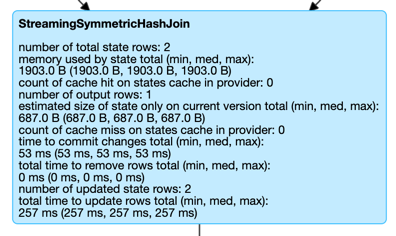

== [[StreamingSymmetricHashJoinExec]] StreamingSymmetricHashJoinExec Binary Physical Operator -- Stream-Stream Joins

`StreamingSymmetricHashJoinExec` is a binary physical operator that represents a <<spark-sql-streaming-join.adoc#, stream-stream equi-join>> at execution.

[NOTE]
====
A binary physical operator (`BinaryExecNode`) is a physical operator with <<left, left>> and <<right, right>> child physical operators.

Read up on https://jaceklaskowski.gitbooks.io/mastering-spark-sql/spark-sql-SparkPlan.html[BinaryExecNode] (and physical operators in general) in https://bit.ly/spark-sql-internals[The Internals of Spark SQL] book.
====

[[supported-join-types]][[joinType]]
`StreamingSymmetricHashJoinExec` supports `Inner`, `LeftOuter`, or `RightOuter` <<joinType, join types>> with the same data types of the <<leftKeys, left>> and the <<rightKeys, right>> keys.

`StreamingSymmetricHashJoinExec` is <<creating-instance, created>> exclusively when <<spark-sql-streaming-StreamingJoinStrategy.adoc#, StreamingJoinStrategy>> execution planning strategy is requested to plan a logical query plan with a `Join` logical operator of two streaming queries with equality predicates (`EqualTo` and `EqualNullSafe`).

When planned for execution, `IncrementalExecution` uses the <<spark-sql-streaming-IncrementalExecution.adoc#state, state preparation rule>> to specify the execution-specific configuration, i.e. <<stateInfo, StatefulOperatorStateInfo>>, <<eventTimeWatermark, event-time watermark>>, and <<stateWatermarkPredicates, JoinStateWatermarkPredicates>>.

`StreamingSymmetricHashJoinExec` is a <<spark-sql-streaming-StateStoreWriter.adoc#, stateful physical operator that writes to a state store>>.

[[output]]
The output schema of `StreamingSymmetricHashJoinExec` is...FIXME

[[outputPartitioning]]
The output partitioning of `StreamingSymmetricHashJoinExec` is...FIXME

=== [[creating-instance]] Creating StreamingSymmetricHashJoinExec Instance

`StreamingSymmetricHashJoinExec` takes the following to be created:

* [[leftKeys]] Left keys (Catalyst expressions of the keys on the left side)
* [[rightKeys]] Right keys (Catalyst expressions of the keys on the right side)
* <<joinType, Join type>>
* [[condition]] Join condition (`JoinConditionSplitPredicates`)
* [[stateInfo]] <<spark-sql-streaming-StatefulOperatorStateInfo.adoc#, StatefulOperatorStateInfo>>
* <<eventTimeWatermark, Event-Time Watermark>>
* <<stateWatermarkPredicates, Watermark Predicates for State Removal>>
* [[left]] Physical operator on the left side (`SparkPlan`)
* [[right]] Physical operator on the right side (`SparkPlan`)

`StreamingSymmetricHashJoinExec` initializes the <<internal-properties, internal properties>>.

=== [[eventTimeWatermark]] Event-Time Watermark -- `eventTimeWatermark` Internal Property

[source, scala]
----
eventTimeWatermark: Option[Long]
----

When <<creating-instance, created>>, `StreamingSymmetricHashJoinExec` can be given the <<spark-sql-streaming-OffsetSeqMetadata.adoc#batchWatermarkMs, event-time watermark>> of the current streaming micro-batch.

`eventTimeWatermark` is an optional property that is specified only when <<spark-sql-streaming-IncrementalExecution.adoc#, IncrementalExecution>> is requested to apply the <<spark-sql-streaming-IncrementalExecution.adoc#state, state preparation rule>> to a physical query plan of a streaming query (to <<spark-sql-streaming-IncrementalExecution.adoc#executedPlan, optimize (prepare) the physical plan of the streaming query>> once for <<spark-sql-streaming-ContinuousExecution.adoc#, ContinuousExecution>> and every trigger for <<spark-sql-streaming-MicroBatchExecution.adoc#, MicroBatchExecution>> in their *queryPlanning* phases).

[NOTE]
====
`eventTimeWatermark` is used when:

* `StreamingSymmetricHashJoinExec` is requested to <<shouldRunAnotherBatch, check out whether the last batch execution requires another non-data batch or not>>

* `OneSideHashJoiner` is requested to <<spark-sql-streaming-StreamingSymmetricHashJoinExec-OneSideHashJoiner.adoc#storeAndJoinWithOtherSide, storeAndJoinWithOtherSide>>
====

=== [[stateWatermarkPredicates]] Watermark Predicates for State Removal -- `stateWatermarkPredicates` Internal Property

[source, scala]
----
stateWatermarkPredicates: JoinStateWatermarkPredicates
----

When <<creating-instance, created>>, `StreamingSymmetricHashJoinExec` is given a <<spark-sql-streaming-JoinStateWatermarkPredicates.adoc#, JoinStateWatermarkPredicates>> for the <<left, left>> and <<right, right>> join sides (using the <<spark-sql-streaming-StreamingSymmetricHashJoinHelper.adoc#getStateWatermarkPredicates, StreamingSymmetricHashJoinHelper>> utility).

`stateWatermarkPredicates` contains the left and right predicates only when <<spark-sql-streaming-IncrementalExecution.adoc#, IncrementalExecution>> is requested to apply the <<spark-sql-streaming-IncrementalExecution.adoc#state, state preparation rule>> to a physical query plan of a streaming query (to <<spark-sql-streaming-IncrementalExecution.adoc#executedPlan, optimize (prepare) the physical plan of the streaming query>> once for <<spark-sql-streaming-ContinuousExecution.adoc#, ContinuousExecution>> and every trigger for <<spark-sql-streaming-MicroBatchExecution.adoc#, MicroBatchExecution>> in their *queryPlanning* phases).

[NOTE]
====
`stateWatermarkPredicates` is used when `StreamingSymmetricHashJoinExec` is requested for the following:

* <<processPartitions, Process partitions of the left and right sides of the stream-stream join>> (and creating <<spark-sql-streaming-StreamingSymmetricHashJoinExec-OneSideHashJoiner.adoc#, OneSideHashJoiners>>)

* <<shouldRunAnotherBatch, Checking out whether the last batch execution requires another non-data batch or not>>
====

=== [[requiredChildDistribution]] Required Partition Requirements -- `requiredChildDistribution` Method

[source, scala]
----
requiredChildDistribution: Seq[Distribution]
----

[NOTE]
====
`requiredChildDistribution` is part of the `SparkPlan` Contract for the required partition requirements (aka _required child distribution_) of the input data, i.e. how the output of the children physical operators is split across partitions before this operator can be executed.

Read up on https://jaceklaskowski.gitbooks.io/mastering-spark-sql/spark-sql-SparkPlan.html[SparkPlan Contract] in https://bit.ly/spark-sql-internals[The Internals of Spark SQL] online book.
====

`requiredChildDistribution` returns two `HashClusteredDistributions` for the <<leftKeys, left>> and <<rightKeys, right>> keys with the required <<spark-sql-streaming-StatefulOperatorStateInfo.adoc#numPartitions, number of partitions>> based on the <<stateInfo, StatefulOperatorStateInfo>>.

[NOTE]
====
`requiredChildDistribution` is used exclusively when `EnsureRequirements` physical query plan optimization is executed (and enforces partition requirements).

Read up on https://jaceklaskowski.gitbooks.io/mastering-spark-sql/spark-sql-EnsureRequirements.html[EnsureRequirements Physical Query Optimization] in https://bit.ly/spark-sql-internals[The Internals of Spark SQL] online book.
====

[NOTE]
====
`HashClusteredDistribution` becomes `HashPartitioning` at execution that distributes rows across partitions (generates partition IDs of rows) based on `Murmur3Hash` of the join expressions (separately for the <<leftKeys, left>> and <<rightKeys, right>> keys) modulo the required number of partitions.

Read up on https://jaceklaskowski.gitbooks.io/mastering-spark-sql/spark-sql-Distribution-HashClusteredDistribution.html[HashClusteredDistribution] in https://bit.ly/spark-sql-internals[The Internals of Spark SQL] online book.
====

=== [[metrics]] Performance Metrics (SQLMetrics)

`StreamingSymmetricHashJoinExec` uses the performance metrics as <<spark-sql-streaming-StateStoreWriter.adoc#metrics, other stateful physical operators that write to a state store>>.

.StreamingSymmetricHashJoinExec in web UI (Details for Query)

The following table shows how the performance metrics are computed (and so their exact meaning).

[cols="30,70",options="header",width="100%"]
|===
| Name (in web UI)
| Description

| total time to update rows
a| [[allUpdatesTimeMs]] Processing time of all rows

| total time to remove rows
a| [[allRemovalsTimeMs]]

| time to commit changes
a| [[commitTimeMs]]

| number of output rows
a| [[numOutputRows]] Total number of output rows

| number of total state rows
a| [[numTotalStateRows]]

| number of updated state rows
a| [[numUpdatedStateRows]]

| memory used by state
a| [[stateMemory]]
|===

=== [[shouldRunAnotherBatch]] Checking Out Whether Last Batch Execution Requires Another Non-Data Batch or Not -- `shouldRunAnotherBatch` Method

[source, scala]
----
shouldRunAnotherBatch(
  newMetadata: OffsetSeqMetadata): Boolean
----

NOTE: `shouldRunAnotherBatch` is part of the <<spark-sql-streaming-StateStoreWriter.adoc#shouldRunAnotherBatch, StateStoreWriter Contract>> to indicate whether <<spark-sql-streaming-MicroBatchExecution.adoc#, MicroBatchExecution>> should run another non-data batch (based on the updated <<spark-sql-streaming-OffsetSeqMetadata.adoc#, OffsetSeqMetadata>> with the current event-time watermark and the batch timestamp).

`shouldRunAnotherBatch`...FIXME

=== [[doExecute]] Executing Physical Operator (Generating RDD[InternalRow]) -- `doExecute` Method

[source, scala]
----
doExecute(): RDD[InternalRow]
----

NOTE: `doExecute` is part of `SparkPlan` Contract to generate the runtime representation of a physical operator as a recipe for distributed computation over internal binary rows on Apache Spark (`RDD[InternalRow]`).

`doExecute` first requests the `StreamingQueryManager` for the <<spark-sql-streaming-StreamingQueryManager.adoc#stateStoreCoordinator, StateStoreCoordinatorRef>> to the `StateStoreCoordinator` RPC endpoint (for the driver).

`doExecute` then uses `SymmetricHashJoinStateManager` utility to <<spark-sql-streaming-SymmetricHashJoinStateManager.adoc#allStateStoreNames, get the names of the state stores>> for the <<spark-sql-streaming-SymmetricHashJoinStateManager.adoc#LeftSide, left>> and <<spark-sql-streaming-SymmetricHashJoinStateManager.adoc#RightSide, right>> sides of the streaming join.

In the end, `doExecute` requests the <<left, left>> and <<right, right>> child physical operators to execute (generate an RDD) and then <<spark-sql-streaming-StateStoreAwareZipPartitionsHelper.adoc#stateStoreAwareZipPartitions, stateStoreAwareZipPartitions>> with <<processPartitions, processPartitions>> (and with the `StateStoreCoordinatorRef` and the state stores).

=== [[processPartitions]] Processing Partitions of Left and Right Sides of Stream-Stream Join -- `processPartitions` Internal Method

[source, scala]
----
processPartitions(
  leftInputIter: Iterator[InternalRow],
  rightInputIter: Iterator[InternalRow]): Iterator[InternalRow]
----

`processPartitions` creates a <<spark-sql-streaming-StreamingSymmetricHashJoinExec-OneSideHashJoiner.adoc#, OneSideHashJoiner>> for the <<spark-sql-streaming-SymmetricHashJoinStateManager.adoc#LeftSide, LeftSide>> and all other properties for the left-hand join side (`leftSideJoiner`).

`processPartitions` creates a <<spark-sql-streaming-StreamingSymmetricHashJoinExec-OneSideHashJoiner.adoc#, OneSideHashJoiner>> for the <<spark-sql-streaming-SymmetricHashJoinStateManager.adoc#RightSide, RightSide>> and all other properties for the right-hand join side (`rightSideJoiner`).

`processPartitions` requests the `OneSideHashJoiner` for the left-hand join side to <<spark-sql-streaming-StreamingSymmetricHashJoinExec-OneSideHashJoiner.adoc#storeAndJoinWithOtherSide, storeAndJoinWithOtherSide>> with the right-hand side one and the `OneSideHashJoiner` for the right-hand join side to do the same with the left-hand side one.

`processPartitions`...FIXME

NOTE: `processPartitions` is used exclusively when `StreamingSymmetricHashJoinExec` physical operator is requested to <<doExecute, execute>>.

=== [[internal-properties]] Internal Properties

[cols="30m,70",options="header",width="100%"]
|===
| Name
| Description

| hadoopConfBcast
a| [[hadoopConfBcast]] Hadoop Configuration broadcast (to the Spark cluster)

Used exclusively to <<joinStateManager, create a SymmetricHashJoinStateManager>>

| joinStateManager
a| [[joinStateManager]] <<spark-sql-streaming-SymmetricHashJoinStateManager.adoc#, SymmetricHashJoinStateManager>>

Used when `OneSideHashJoiner` is requested to <<spark-sql-streaming-StreamingSymmetricHashJoinExec-OneSideHashJoiner.adoc#storeAndJoinWithOtherSide, storeAndJoinWithOtherSide>>, <<spark-sql-streaming-StreamingSymmetricHashJoinExec-OneSideHashJoiner.adoc#removeOldState, removeOldState>>, <<spark-sql-streaming-StreamingSymmetricHashJoinExec-OneSideHashJoiner.adoc#commitStateAndGetMetrics, commitStateAndGetMetrics>>, and for the <<spark-sql-streaming-StreamingSymmetricHashJoinExec-OneSideHashJoiner.adoc#get, values for a given key>>

| nullLeft
a| [[nullLeft]] `GenericInternalRow` of the size of the output schema of the <<left, left physical operator>>

| nullRight
a| [[nullRight]] `GenericInternalRow` of the size of the output schema of the <<right, right physical operator>>

| storeConf
a| [[storeConf]] <<spark-sql-streaming-StateStoreConf.adoc#, StateStoreConf>>

Used exclusively to <<joinStateManager, create a SymmetricHashJoinStateManager>>

|===
