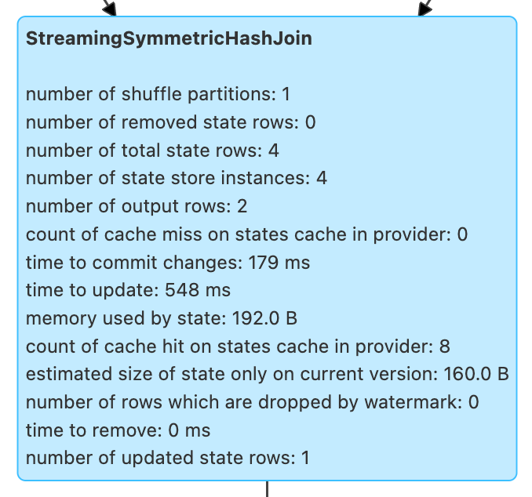

== [[StreamingSymmetricHashJoinExec]] StreamingSymmetricHashJoinExec Binary Physical Operator -- Stream-Stream Joins

`StreamingSymmetricHashJoinExec` is a binary physical operator that represents a <<spark-sql-streaming-join.adoc#, stream-stream equi-join>> at execution time.

[NOTE]
====
A binary physical operator (`BinaryExecNode`) is a physical operator with <<left, left>> and <<right, right>> child physical operators.

Read up on https://jaceklaskowski.gitbooks.io/mastering-spark-sql/spark-sql-SparkPlan.html[BinaryExecNode] (and physical operators in general) in https://bit.ly/spark-sql-internals[The Internals of Spark SQL] online book.
====

[[supported-join-types]][[joinType]]
`StreamingSymmetricHashJoinExec` supports `Inner`, `LeftOuter`, and `RightOuter` join types (with the <<leftKeys, left>> and the <<rightKeys, right>> keys using the exact same data types).

`StreamingSymmetricHashJoinExec` is <<creating-instance, created>> exclusively when <<spark-sql-streaming-StreamingJoinStrategy.adoc#, StreamingJoinStrategy>> execution planning strategy is requested to plan a logical query plan with a `Join` logical operator of two streaming queries with equality predicates (`EqualTo` and `EqualNullSafe`).

`StreamingSymmetricHashJoinExec` is given execution-specific configuration (i.e. <<stateInfo, StatefulOperatorStateInfo>>, <<eventTimeWatermark, event-time watermark>>, and <<stateWatermarkPredicates, JoinStateWatermarkPredicates>>) when `IncrementalExecution` is requested to plan a streaming query for execution (and uses the <<spark-sql-streaming-IncrementalExecution.adoc#state, state preparation rule>>).

`StreamingSymmetricHashJoinExec` uses two <<spark-sql-streaming-OneSideHashJoiner.adoc#, OneSideHashJoiners>> (for the <<processPartitions-leftSideJoiner, left>> and <<processPartitions-rightSideJoiner, right>> sides of the join) to manage join state when <<processPartitions, processing partitions of the left and right sides of a stream-stream join>>.

`StreamingSymmetricHashJoinExec` is a <<spark-sql-streaming-StateStoreWriter.adoc#, stateful physical operator that writes to a state store>>.

=== [[creating-instance]] Creating StreamingSymmetricHashJoinExec Instance

`StreamingSymmetricHashJoinExec` takes the following to be created:

* [[leftKeys]] Left keys (Catalyst expressions of the keys on the left side)
* [[rightKeys]] Right keys (Catalyst expressions of the keys on the right side)
* <<joinType, Join type>>
* [[condition]] Join condition (`JoinConditionSplitPredicates`)
* [[stateInfo]] <<spark-sql-streaming-StatefulOperatorStateInfo.adoc#, StatefulOperatorStateInfo>>
* <<eventTimeWatermark, Event-Time Watermark>>
* <<stateWatermarkPredicates, Watermark Predicates for State Removal>>
* [[left]] Physical operator on the left side (`SparkPlan`)
* [[right]] Physical operator on the right side (`SparkPlan`)

`StreamingSymmetricHashJoinExec` initializes the <<internal-properties, internal properties>>.

=== [[output]] Output Schema -- `output` Method

[source, scala]
----
output: Seq[Attribute]
----

NOTE: `output` is part of the `QueryPlan` Contract to describe the attributes of (the schema of) the output.

`output` schema depends on the <<joinType, join type>>:

* For `Cross` and `Inner` (`InnerLike`) joins, it is the output schema of the <<left, left>> and <<right, right>> operators

* For `LeftOuter` joins, it is the output schema of the <<left, left>> operator with the attributes of the <<right, right>> operator with `nullability` flag enabled (`true`)

* For `RightOuter` joins, it is the output schema of the <<right, right>> operator with the attributes of the <<left, left>> operator with `nullability` flag enabled (`true`)

`output` throws an `IllegalArgumentException` for other join types:

```
[className] should not take [joinType] as the JoinType
```

=== [[outputPartitioning]] Output Partitioning -- `outputPartitioning` Method

[source, scala]
----
outputPartitioning: Partitioning
----

NOTE: `outputPartitioning` is part of the `SparkPlan` Contract to specify how data should be partitioned across different nodes in the cluster.

`outputPartitioning` depends on the <<joinType, join type>>:

* For `Cross` and `Inner` (`InnerLike`) joins, it is a `PartitioningCollection` of the output partitioning of the <<left, left>> and <<right, right>> operators

* For `LeftOuter` joins, it is a `PartitioningCollection` of the output partitioning of the <<left, left>> operator

* For `RightOuter` joins, it is a `PartitioningCollection` of the output partitioning of the <<right, right>> operator

`outputPartitioning` throws an `IllegalArgumentException` for other join types:

```
[className] should not take [joinType] as the JoinType
```

=== [[eventTimeWatermark]] Event-Time Watermark -- `eventTimeWatermark` Internal Property

[source, scala]
----
eventTimeWatermark: Option[Long]
----

When <<creating-instance, created>>, `StreamingSymmetricHashJoinExec` can be given the <<spark-sql-streaming-OffsetSeqMetadata.adoc#batchWatermarkMs, event-time watermark>> of the current streaming micro-batch.

`eventTimeWatermark` is an optional property that is specified only after <<spark-sql-streaming-IncrementalExecution.adoc#, IncrementalExecution>> was requested to apply the <<spark-sql-streaming-IncrementalExecution.adoc#state, state preparation rule>> to a physical query plan of a streaming query (to <<spark-sql-streaming-IncrementalExecution.adoc#executedPlan, optimize (prepare) the physical plan of the streaming query>> once for <<spark-sql-streaming-ContinuousExecution.adoc#, ContinuousExecution>> and every trigger for <<spark-sql-streaming-MicroBatchExecution.adoc#, MicroBatchExecution>> in their *queryPlanning* phases).

[NOTE]
====
`eventTimeWatermark` is used when:

* `StreamingSymmetricHashJoinExec` is requested to <<shouldRunAnotherBatch, check out whether the last batch execution requires another non-data batch or not>>

* `OneSideHashJoiner` is requested to <<spark-sql-streaming-OneSideHashJoiner.adoc#storeAndJoinWithOtherSide, storeAndJoinWithOtherSide>>
====

=== [[stateWatermarkPredicates]] Watermark Predicates for State Removal -- `stateWatermarkPredicates` Internal Property

[source, scala]
----
stateWatermarkPredicates: JoinStateWatermarkPredicates
----

When <<creating-instance, created>>, `StreamingSymmetricHashJoinExec` is given a <<spark-sql-streaming-JoinStateWatermarkPredicates.adoc#, JoinStateWatermarkPredicates>> for the <<left, left>> and <<right, right>> join sides (using the <<spark-sql-streaming-StreamingSymmetricHashJoinHelper.adoc#getStateWatermarkPredicates, StreamingSymmetricHashJoinHelper>> utility).

`stateWatermarkPredicates` contains the left and right predicates only when <<spark-sql-streaming-IncrementalExecution.adoc#, IncrementalExecution>> is requested to apply the <<spark-sql-streaming-IncrementalExecution.adoc#state, state preparation rule>> to a physical query plan of a streaming query (to <<spark-sql-streaming-IncrementalExecution.adoc#executedPlan, optimize (prepare) the physical plan of the streaming query>> once for <<spark-sql-streaming-ContinuousExecution.adoc#, ContinuousExecution>> and every trigger for <<spark-sql-streaming-MicroBatchExecution.adoc#, MicroBatchExecution>> in their *queryPlanning* phases).

[NOTE]
====
`stateWatermarkPredicates` is used when `StreamingSymmetricHashJoinExec` is requested for the following:

* <<processPartitions, Process partitions of the left and right sides of the stream-stream join>> (and creating <<spark-sql-streaming-OneSideHashJoiner.adoc#, OneSideHashJoiners>>)

* <<shouldRunAnotherBatch, Checking out whether the last batch execution requires another non-data batch or not>>
====

=== [[requiredChildDistribution]] Required Partition Requirements -- `requiredChildDistribution` Method

[source, scala]
----
requiredChildDistribution: Seq[Distribution]
----

[NOTE]
====
`requiredChildDistribution` is part of the `SparkPlan` Contract for the required partition requirements (aka _required child distribution_) of the input data, i.e. how the output of the children physical operators is split across partitions before this operator can be executed.

Read up on https://jaceklaskowski.gitbooks.io/mastering-spark-sql/spark-sql-SparkPlan.html[SparkPlan Contract] in https://bit.ly/spark-sql-internals[The Internals of Spark SQL] online book.
====

`requiredChildDistribution` returns two `HashClusteredDistributions` for the <<leftKeys, left>> and <<rightKeys, right>> keys with the required <<spark-sql-streaming-StatefulOperatorStateInfo.adoc#numPartitions, number of partitions>> based on the <<stateInfo, StatefulOperatorStateInfo>>.

[NOTE]
====
`requiredChildDistribution` is used exclusively when `EnsureRequirements` physical query plan optimization is executed (and enforces partition requirements).

Read up on https://jaceklaskowski.gitbooks.io/mastering-spark-sql/spark-sql-EnsureRequirements.html[EnsureRequirements Physical Query Optimization] in https://bit.ly/spark-sql-internals[The Internals of Spark SQL] online book.
====

[NOTE]
====
`HashClusteredDistribution` becomes `HashPartitioning` at execution that distributes rows across partitions (generates partition IDs of rows) based on `Murmur3Hash` of the join expressions (separately for the <<leftKeys, left>> and <<rightKeys, right>> keys) modulo the required number of partitions.

Read up on https://jaceklaskowski.gitbooks.io/mastering-spark-sql/spark-sql-Distribution-HashClusteredDistribution.html[HashClusteredDistribution] in https://bit.ly/spark-sql-internals[The Internals of Spark SQL] online book.
====

=== [[metrics]] Performance Metrics (SQLMetrics)

`StreamingSymmetricHashJoinExec` uses the performance metrics as <<spark-sql-streaming-StateStoreWriter.adoc#metrics, other stateful physical operators that write to a state store>>.

.StreamingSymmetricHashJoinExec in web UI (Details for Query)


The following table shows how the performance metrics are computed (and so their exact meaning).

[cols="30,70",options="header",width="100%"]
|===
| Name (in web UI)
| Description

| total time to update rows
a| [[allUpdatesTimeMs]] Processing time of all rows

| total time to remove rows
a| [[allRemovalsTimeMs]]

| time to commit changes
a| [[commitTimeMs]]

| number of output rows
a| [[numOutputRows]] Total number of output rows

| number of total state rows
a| [[numTotalStateRows]]

| number of updated state rows
a| [[numUpdatedStateRows]] <<spark-sql-streaming-OneSideHashJoiner.adoc#updatedStateRowsCount, Number of updated state rows>> of the <<processPartitions-leftSideJoiner, left>> and <<processPartitions-rightSideJoiner, right>> `OneSideHashJoiners`

| memory used by state
a| [[stateMemory]]
|===

=== [[shouldRunAnotherBatch]] Checking Out Whether Last Batch Execution Requires Another Non-Data Batch or Not -- `shouldRunAnotherBatch` Method

[source, scala]
----
shouldRunAnotherBatch(
  newMetadata: OffsetSeqMetadata): Boolean
----

NOTE: `shouldRunAnotherBatch` is part of the <<spark-sql-streaming-StateStoreWriter.adoc#shouldRunAnotherBatch, StateStoreWriter Contract>> to indicate whether <<spark-sql-streaming-MicroBatchExecution.adoc#, MicroBatchExecution>> should run another non-data batch (based on the updated <<spark-sql-streaming-OffsetSeqMetadata.adoc#, OffsetSeqMetadata>> with the current event-time watermark and the batch timestamp).

`shouldRunAnotherBatch` is positive (`true`) when all of the following are positive:

* Either the <<spark-sql-streaming-JoinStateWatermarkPredicates.adoc#left, left>> or <<spark-sql-streaming-JoinStateWatermarkPredicates.adoc#right, right>> join state watermark predicates are defined (in the <<stateWatermarkPredicates, JoinStateWatermarkPredicates>>)

* <<eventTimeWatermark, Event-time watermark>> threshold (of the `StreamingSymmetricHashJoinExec` operator) is defined and the current <<spark-sql-streaming-OffsetSeqMetadata.adoc#batchWatermarkMs, event-time watermark>> threshold of the given `OffsetSeqMetadata` is above (_greater than_) it, i.e. moved above

`shouldRunAnotherBatch` is negative (`false`) otherwise.

=== [[doExecute]] Executing Physical Operator (Generating RDD[InternalRow]) -- `doExecute` Method

[source, scala]
----
doExecute(): RDD[InternalRow]
----

NOTE: `doExecute` is part of `SparkPlan` Contract to generate the runtime representation of a physical operator as a recipe for distributed computation over internal binary rows on Apache Spark (`RDD[InternalRow]`).

`doExecute` first requests the `StreamingQueryManager` for the <<spark-sql-streaming-StreamingQueryManager.adoc#stateStoreCoordinator, StateStoreCoordinatorRef>> to the `StateStoreCoordinator` RPC endpoint (for the driver).

`doExecute` then uses `SymmetricHashJoinStateManager` utility to <<spark-sql-streaming-SymmetricHashJoinStateManager.adoc#allStateStoreNames, get the names of the state stores>> for the <<spark-sql-streaming-SymmetricHashJoinStateManager.adoc#LeftSide, left>> and <<spark-sql-streaming-SymmetricHashJoinStateManager.adoc#RightSide, right>> sides of the streaming join.

In the end, `doExecute` requests the <<left, left>> and <<right, right>> child physical operators to execute (generate an RDD) and then <<spark-sql-streaming-StateStoreAwareZipPartitionsHelper.adoc#stateStoreAwareZipPartitions, stateStoreAwareZipPartitions>> with <<processPartitions, processPartitions>> (and with the `StateStoreCoordinatorRef` and the state stores).

=== [[processPartitions]] Processing Partitions of Left and Right Sides of Stream-Stream Join -- `processPartitions` Internal Method

[source, scala]
----
processPartitions(
  leftInputIter: Iterator[InternalRow],
  rightInputIter: Iterator[InternalRow]): Iterator[InternalRow]
----

[[processPartitions-updateStartTimeNs]]
`processPartitions` records the current time (as _updateStartTimeNs_ for the <<allUpdatesTimeMs, total time to update rows>> performance metric in <<onOutputCompletion, onOutputCompletion>>).

[[processPartitions-postJoinFilter]]
`processPartitions` creates a new predicate (_postJoinFilter_) based on the `bothSides` of the <<condition, JoinConditionSplitPredicates>> if defined or `true` literal.

[[processPartitions-leftSideJoiner]]
`processPartitions` creates a <<spark-sql-streaming-OneSideHashJoiner.adoc#, OneSideHashJoiner>> for the <<spark-sql-streaming-SymmetricHashJoinStateManager.adoc#LeftSide, LeftSide>> and all other properties for the left-hand join side (`leftSideJoiner`).

[[processPartitions-rightSideJoiner]]
`processPartitions` creates a <<spark-sql-streaming-OneSideHashJoiner.adoc#, OneSideHashJoiner>> for the <<spark-sql-streaming-SymmetricHashJoinStateManager.adoc#RightSide, RightSide>> and all other properties for the right-hand join side (`rightSideJoiner`).

[[processPartitions-leftOutputIter]][[processPartitions-rightOutputIter]]
`processPartitions` requests the `OneSideHashJoiner` for the left-hand join side to <<spark-sql-streaming-OneSideHashJoiner.adoc#storeAndJoinWithOtherSide, storeAndJoinWithOtherSide>> with the right-hand side one (that creates a `leftOutputIter` row iterator) and the `OneSideHashJoiner` for the right-hand join side to do the same with the left-hand side one (and creates a `rightOutputIter` row iterator).

[[processPartitions-innerOutputCompletionTimeNs]]
`processPartitions` records the current time (as _innerOutputCompletionTimeNs_ for the <<allRemovalsTimeMs, total time to remove rows>> performance metric in <<onOutputCompletion, onOutputCompletion>>).

[[processPartitions-innerOutputIter]]
`processPartitions` creates a `CompletionIterator` with the left and right output iterators (with the rows of the `leftOutputIter` first followed by `rightOutputIter`). When no rows are left to process, the `CompletionIterator` records the completion time.

[[processPartitions-outputIter]]
`processPartitions` creates a join-specific output `Iterator[InternalRow]` of the output rows based on the <<joinType, join type>> (of the `StreamingSymmetricHashJoinExec`):

* For `Inner` joins, `processPartitions` simply uses the <<processPartitions-innerOutputIter, output iterator of the left and right rows>>

* For `LeftOuter` joins, `processPartitions`...

* For `RightOuter` joins, `processPartitions`...

* For other joins, `processPartitions` simply throws an `IllegalArgumentException`.

[[processPartitions-outputIterWithMetrics]]
`processPartitions` creates an `UnsafeProjection` for the <<output, output>> (and the output of the <<left, left>> and <<right, right>> child operators) that counts all the rows of the <<processPartitions-outputIter, join-specific output iterator>> (as the <<numOutputRows, numOutputRows>> metric) and generate an output projection.

In the end, `processPartitions` returns a `CompletionIterator` with with the <<processPartitions-outputIterWithMetrics, output iterator with the rows counted (as numOutputRows metric)>> and <<processPartitions-onOutputCompletion, onOutputCompletion>> completion function.

NOTE: `processPartitions` is used exclusively when `StreamingSymmetricHashJoinExec` physical operator is requested to <<doExecute, execute>>.

==== [[processPartitions-onOutputCompletion]][[onOutputCompletion]] Calculating Performance Metrics (Output Completion Callback) -- `onOutputCompletion` Internal Method

[source, scala]
----
onOutputCompletion: Unit
----

`onOutputCompletion` calculates the <<allUpdatesTimeMs, total time to update rows>> performance metric (that is the time since the <<processPartitions-updateStartTimeNs, processPartitions>> was executed).

`onOutputCompletion` adds the time for the inner join to complete (since <<processPartitions-innerOutputCompletionTimeNs, innerOutputCompletionTimeNs>> time marker) to the <<allRemovalsTimeMs, total time to remove rows>> performance metric.

`onOutputCompletion` records the time to <<spark-sql-streaming-OneSideHashJoiner.adoc#removeOldState, remove old state>> (per the <<spark-sql-streaming-OneSideHashJoiner.adoc#stateWatermarkPredicate, join state watermark predicate>> for the <<left, left>> and the <<right, right>> streaming queries) and adds it to the <<allRemovalsTimeMs, total time to remove rows>> performance metric.

NOTE: `onOutputCompletion` triggers the <<spark-sql-streaming-OneSideHashJoiner.adoc#removeOldState, old state removal>> eagerly by iterating over the state rows to be deleted.

`onOutputCompletion` records the time for the <<processPartitions-leftSideJoiner, left>> and <<processPartitions-rightSideJoiner, right>> `OneSideHashJoiners` to <<spark-sql-streaming-OneSideHashJoiner.adoc#commitStateAndGetMetrics, commit any state changes>> that becomes the <<commitTimeMs, time to commit changes>> performance metric.

`onOutputCompletion` calculates the <<numUpdatedStateRows, number of updated state rows>> performance metric (as the <<spark-sql-streaming-OneSideHashJoiner.adoc#numUpdatedStateRows, number of updated state rows>> of the <<processPartitions-leftSideJoiner, left>> and <<processPartitions-rightSideJoiner, right>> streaming queries).

`onOutputCompletion` calculates the <<numTotalStateRows, number of total state rows>> performance metric (as the sum of the <<spark-sql-streaming-StateStoreMetrics.adoc#numKeys, number of keys>> in the <<spark-sql-streaming-SymmetricHashJoinStateManager.adoc#keyWithIndexToValue, KeyWithIndexToValueStore>> of the <<processPartitions-leftSideJoiner, left>> and <<processPartitions-rightSideJoiner, right>> streaming queries).

`onOutputCompletion` calculates the <<stateMemory, memory used by state>> performance metric (as the sum of the <<spark-sql-streaming-StateStoreMetrics.adoc#memoryUsedBytes, memory used>> by the <<spark-sql-streaming-SymmetricHashJoinStateManager.adoc#keyToNumValues, KeyToNumValuesStore>> and <<spark-sql-streaming-SymmetricHashJoinStateManager.adoc#keyWithIndexToValue, KeyWithIndexToValueStore>> of the <<processPartitions-leftSideJoiner, left>> and <<processPartitions-rightSideJoiner, right>> streams).

In the end, `onOutputCompletion` calculates the <<spark-sql-streaming-StateStoreMetrics.adoc#customMetrics, custom metrics>>.

=== [[internal-properties]] Internal Properties

[cols="30m,70",options="header",width="100%"]
|===
| Name
| Description

| hadoopConfBcast
a| [[hadoopConfBcast]] Hadoop Configuration broadcast (to the Spark cluster)

Used exclusively to <<joinStateManager, create a SymmetricHashJoinStateManager>>

| joinStateManager
a| [[joinStateManager]] <<spark-sql-streaming-SymmetricHashJoinStateManager.adoc#, SymmetricHashJoinStateManager>>

Used when `OneSideHashJoiner` is requested to <<spark-sql-streaming-OneSideHashJoiner.adoc#storeAndJoinWithOtherSide, storeAndJoinWithOtherSide>>, <<spark-sql-streaming-OneSideHashJoiner.adoc#removeOldState, removeOldState>>, <<spark-sql-streaming-OneSideHashJoiner.adoc#commitStateAndGetMetrics, commitStateAndGetMetrics>>, and for the <<spark-sql-streaming-OneSideHashJoiner.adoc#get, values for a given key>>

| nullLeft
a| [[nullLeft]] `GenericInternalRow` of the size of the output schema of the <<left, left physical operator>>

| nullRight
a| [[nullRight]] `GenericInternalRow` of the size of the output schema of the <<right, right physical operator>>

| storeConf
a| [[storeConf]] <<spark-sql-streaming-StateStoreConf.adoc#, StateStoreConf>>

Used exclusively to <<joinStateManager, create a SymmetricHashJoinStateManager>>

|===
