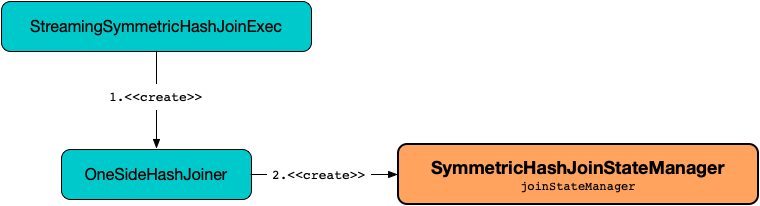

== [[SymmetricHashJoinStateManager]] SymmetricHashJoinStateManager

`SymmetricHashJoinStateManager` is <<creating-instance, created>> for the left and right <<spark-sql-streaming-OneSideHashJoiner.adoc#joinStateManager, OneSideHashJoiners>> of a <<spark-sql-streaming-StreamingSymmetricHashJoinExec.adoc#, StreamingSymmetricHashJoinExec>> physical operator (one for each side when `StreamingSymmetricHashJoinExec` is requested to <<spark-sql-streaming-StreamingSymmetricHashJoinExec.adoc#processPartitions, process partitions>>).

.SymmetricHashJoinStateManager and Stream-Stream Join


`SymmetricHashJoinStateManager` manages join state using the <<keyToNumValues, KeyToNumValuesStore>> and the <<keyWithIndexToValue, KeyWithIndexToValueStore>> state store handlers (and simply acts like their facade).

=== [[creating-instance]] Creating SymmetricHashJoinStateManager Instance

`SymmetricHashJoinStateManager` takes the following to be created:

* [[joinSide]] <<joinSide-internals, JoinSide>>
* [[inputValueAttributes]] Attributes of input values
* [[joinKeys]] Join keys (`Seq[Expression]`)
* [[stateInfo]] <<spark-sql-streaming-StatefulOperatorStateInfo.adoc#, StatefulOperatorStateInfo>>
* [[storeConf]] <<spark-sql-streaming-StateStoreConf.adoc#, StateStoreConf>>
* [[hadoopConf]] Hadoop https://hadoop.apache.org/docs/r2.7.3/api/org/apache/hadoop/conf/Configuration.html[Configuration]

`SymmetricHashJoinStateManager` initializes the <<internal-properties, internal properties>>.

=== [[keyToNumValues]][[keyWithIndexToValue]] KeyToNumValuesStore and KeyWithIndexToValueStore State Store Handlers -- `keyToNumValues` and `keyWithIndexToValue` Internal Properties

`SymmetricHashJoinStateManager` uses a <<spark-sql-streaming-KeyToNumValuesStore.adoc#, KeyToNumValuesStore>> (`keyToNumValues`) and a <<spark-sql-streaming-KeyWithIndexToValueStore.adoc#, KeyWithIndexToValueStore>> (`keyWithIndexToValue`) internally that are created immediately when `SymmetricHashJoinStateManager` is <<creating-instance, created>> (for a <<spark-sql-streaming-OneSideHashJoiner.adoc#joinStateManager, OneSideHashJoiner>>).

`keyToNumValues` and `keyWithIndexToValue` are used when `SymmetricHashJoinStateManager` is requested for the following:

* <<get, Retrieving the value rows by key>>

* <<append, Append a new value row to a given key>>

* <<removeByKeyCondition, removeByKeyCondition>>

* <<removeByValueCondition, removeByValueCondition>>

* <<commit, Commit state changes>>

* <<abortIfNeeded, Abort state changes>>

* <<metrics, Performance metrics>>

=== [[joinSide-internals]] Join Side Marker -- `JoinSide` Internal Enum

`JoinSide` can be one of the two possible values:

* [[LeftSide]][[left]] `LeftSide` (alias: `left`)

* [[RightSide]][[right]] `RightSide` (alias: `right`)

They are both used exclusively when `StreamingSymmetricHashJoinExec` binary physical operator is requested to <<spark-sql-streaming-StreamingSymmetricHashJoinExec.adoc#doExecute, execute>> (and <<spark-sql-streaming-StreamingSymmetricHashJoinExec.adoc#processPartitions, process partitions>> with an <<spark-sql-streaming-OneSideHashJoiner.adoc#, OneSideHashJoiner>>).

=== [[metrics]] Performance Metrics -- `metrics` Method

[source, scala]
----
metrics: StateStoreMetrics
----

`metrics` returns the combined <<spark-sql-streaming-StateStoreMetrics.adoc#, StateStoreMetrics>> of the <<keyToNumValues, KeyToNumValuesStore>> and the <<keyWithIndexToValue, KeyWithIndexToValueStore>> state store handlers.

NOTE: `metrics` is used exclusively when `OneSideHashJoiner` is requested to <<spark-sql-streaming-OneSideHashJoiner.adoc#commitStateAndGetMetrics, commitStateAndGetMetrics>>.

=== [[removeByKeyCondition]] `removeByKeyCondition` Method

[source, scala]
----
removeByKeyCondition(
  removalCondition: UnsafeRow => Boolean): Iterator[UnsafeRowPair]
----

`removeByKeyCondition` creates an `Iterator` of `UnsafeRowPairs` that <<removeByKeyCondition-getNext, removes keys and values>> for which the given `removalCondition` predicate holds.

[[removeByKeyCondition-allKeyToNumValues]]
`removeByKeyCondition` uses the <<keyToNumValues, KeyToNumValuesStore>> for <<spark-sql-streaming-KeyToNumValuesStore.adoc#iterator, all state keys and values (in the underlying state store)>>.

NOTE: `removeByKeyCondition` is used exclusively when `OneSideHashJoiner` is requested to <<spark-sql-streaming-OneSideHashJoiner.adoc#removeOldState, remove an old state>> (for <<spark-sql-streaming-JoinStateWatermarkPredicate.adoc#JoinStateKeyWatermarkPredicate, JoinStateKeyWatermarkPredicate>>).

==== [[removeByKeyCondition-getNext]] `getNext` Internal Method (of `removeByKeyCondition` Method)

[source, scala]
----
getNext(): UnsafeRowPair
----

`getNext` goes over the keys and values in the <<removeByKeyCondition-allKeyToNumValues, allKeyToNumValues>> sequence and <<spark-sql-streaming-KeyToNumValuesStore.adoc#remove, removes keys>> (from the <<keyToNumValues, KeyToNumValuesStore>>) and the <<spark-sql-streaming-KeyWithIndexToValueStore.adoc#, corresponding values>> (from the <<keyWithIndexToValue, KeyWithIndexToValueStore>>) for which the given `removalCondition` predicate holds.

=== [[removeByValueCondition]] `removeByValueCondition` Method

[source, scala]
----
removeByValueCondition(
  removalCondition: UnsafeRow => Boolean): Iterator[UnsafeRowPair]
----

`removeByValueCondition`...FIXME

NOTE: `removeByValueCondition` is used exclusively when `OneSideHashJoiner` is requested to <<spark-sql-streaming-OneSideHashJoiner.adoc#removeOldState, remove an old state>> (when <<spark-sql-streaming-JoinStateWatermarkPredicate.adoc#JoinStateValueWatermarkPredicate, JoinStateValueWatermarkPredicate>> is used).

=== [[append]] Appending New Value Row to Key -- `append` Method

[source, scala]
----
append(
  key: UnsafeRow,
  value: UnsafeRow): Unit
----

`append` requests the <<keyToNumValues, KeyToNumValuesStore>> for the <<spark-sql-streaming-KeyToNumValuesStore.adoc#get, number of value rows for the given key>>.

In the end, `append` requests the stores for the following:

* <<keyWithIndexToValue, KeyWithIndexToValueStore>> to <<spark-sql-streaming-KeyWithIndexToValueStore.adoc#put, store the given value row>>

* <<keyToNumValues, KeyToNumValuesStore>> to <<spark-sql-streaming-KeyToNumValuesStore.adoc#put, store the given key with the number of value rows incremented>>.

NOTE: `append` is used exclusively when `OneSideHashJoiner` is requested to <<spark-sql-streaming-OneSideHashJoiner.adoc#storeAndJoinWithOtherSide, storeAndJoinWithOtherSide>>.

=== [[get]] Retrieving Value Rows By Key -- `get` Method

[source, scala]
----
get(key: UnsafeRow): Iterator[UnsafeRow]
----

`get` requests the <<keyToNumValues, KeyToNumValuesStore>> for the <<spark-sql-streaming-KeyToNumValuesStore.adoc#get, number of value rows for the given key>>.

In the end, `get` requests the <<keyWithIndexToValue, KeyWithIndexToValueStore>> to <<spark-sql-streaming-KeyWithIndexToValueStore.adoc#getAll, retrieve that number of value rows for the given key>> and leaves value rows only.

NOTE: `get` is used when `OneSideHashJoiner` is requested to <<spark-sql-streaming-OneSideHashJoiner.adoc#storeAndJoinWithOtherSide, storeAndJoinWithOtherSide>> and <<spark-sql-streaming-OneSideHashJoiner.adoc#get, retrieving value rows for a key>>.

=== [[commit]] Committing State (Changes) -- `commit` Method

[source, scala]
----
commit(): Unit
----

`commit` simply requests the <<keyToNumValues, keyToNumValues>> and <<keyWithIndexToValue, keyWithIndexToValue>> state store handlers to <<spark-sql-streaming-StateStoreHandler.adoc#commit, commit state changes>>.

NOTE: `commit` is used exclusively when `OneSideHashJoiner` is requested to <<spark-sql-streaming-OneSideHashJoiner.adoc#commitStateAndGetMetrics, commit state changes and get performance metrics>>.

=== [[abortIfNeeded]] Aborting State (Changes) -- `abortIfNeeded` Method

[source, scala]
----
abortIfNeeded(): Unit
----

`abortIfNeeded`...FIXME

NOTE: `abortIfNeeded` is used when...FIXME

=== [[allStateStoreNames]] `allStateStoreNames` Object Method

[source, scala]
----
allStateStoreNames(joinSides: JoinSide*): Seq[String]
----

`allStateStoreNames` simply returns the <<getStateStoreName, names of the state stores>> for all possible combinations of the given `JoinSides` and the two possible store types (e.g. <<spark-sql-streaming-StateStoreHandler.adoc#KeyToNumValuesType, keyToNumValues>> and <<spark-sql-streaming-StateStoreHandler.adoc#KeyWithIndexToValueType, keyWithIndexToValue>>).

NOTE: `allStateStoreNames` is used exclusively when `StreamingSymmetricHashJoinExec` physical operator is requested to <<spark-sql-streaming-StreamingSymmetricHashJoinExec.adoc#doExecute, execute and generate the runtime representation>> (as a `RDD[InternalRow]`).

=== [[getStateStoreName]] `getStateStoreName` Object Method

[source, scala]
----
getStateStoreName(
  joinSide: JoinSide,
  storeType: StateStoreType): String
----

`getStateStoreName` simply returns a string of the following format:

```
[joinSide]-[storeType]
```

[NOTE]
====
`getStateStoreName` is used when:

* `StateStoreHandler` is requested to <<spark-sql-streaming-StateStoreHandler.adoc#getStateStore, load a state store>>

* `SymmetricHashJoinStateManager` utility is requested for <<allStateStoreNames, allStateStoreNames>> (for `StreamingSymmetricHashJoinExec` physical operator to <<spark-sql-streaming-StreamingSymmetricHashJoinExec.adoc#doExecute, execute and generate the runtime representation>>)
====

=== [[updateNumValueForCurrentKey]] `updateNumValueForCurrentKey` Internal Method

[source, scala]
----
updateNumValueForCurrentKey(): Unit
----

`updateNumValueForCurrentKey`...FIXME

NOTE: `updateNumValueForCurrentKey` is used exclusively when `SymmetricHashJoinStateManager` is requested to <<removeByValueCondition, removeByValueCondition>>.

=== [[internal-properties]] Internal Properties

[cols="30m,70",options="header",width="100%"]
|===
| Name
| Description

| keyAttributes
a| [[keyAttributes]] Key attributes, i.e. `AttributeReferences` of the <<keySchema, key schema>>

Used exclusively in `KeyWithIndexToValueStore` when requested for the <<spark-sql-streaming-KeyWithIndexToValueStore.adoc#keyWithIndexExprs, keyWithIndexExprs>>, <<spark-sql-streaming-KeyWithIndexToValueStore.adoc#indexOrdinalInKeyWithIndexRow, indexOrdinalInKeyWithIndexRow>>, <<spark-sql-streaming-KeyWithIndexToValueStore.adoc#keyWithIndexRowGenerator, keyWithIndexRowGenerator>> and <<spark-sql-streaming-KeyWithIndexToValueStore.adoc#keyRowGenerator, keyRowGenerator>>

| keySchema
a| [[keySchema]] Key schema (`StructType`) based on the <<joinKeys, join keys>> with the names in the format of *field* and their ordinals (index)

Used when:

* `SymmetricHashJoinStateManager` is requested for the <<keyAttributes, key attributes>> (for <<spark-sql-streaming-KeyWithIndexToValueStore.adoc#, KeyWithIndexToValueStore>>)

* `KeyToNumValuesStore` is requested for the <<spark-sql-streaming-KeyToNumValuesStore.adoc#stateStore, state store>>

* `KeyWithIndexToValueStore` is requested for the <<spark-sql-streaming-KeyWithIndexToValueStore.adoc#keyWithIndexSchema, keyWithIndexSchema>> (for the internal <<spark-sql-streaming-KeyWithIndexToValueStore.adoc#stateStore, state store>>)

|===
