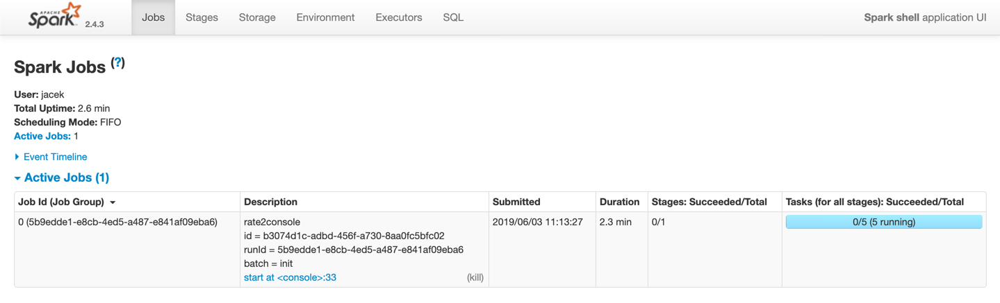

== Continuous Stream Processing (Structured Streaming V2)

*Continuous Stream Processing* is one of the two stream processing engines in <<spark-structured-streaming.adoc#, Spark Structured Streaming>> that is used for execution of structured streaming queries with <<spark-sql-streaming-Trigger.adoc#Continuous, Trigger.Continuous>> trigger.

NOTE: The other feature-richer stream processing engine is <<spark-sql-streaming-micro-batch-processing.adoc#, Micro-Batch Stream Processing>>.

Continuous Stream Processing execution engine uses the novel *Data Source API V2* (Spark SQL) and for the very first time makes stream processing truly *continuous*.

NOTE: Read up on https://jaceklaskowski.gitbooks.io/mastering-spark-sql/spark-sql-data-source-api-v2.html[Data Source API V2] in https://bit.ly/spark-sql-internals[The Internals of Spark SQL] book.

Because of the two innovative changes Continuous Stream Processing is often referred to as *Structured Streaming V2*.

[source, scala]
----
import org.apache.spark.sql.streaming.Trigger
import scala.concurrent.duration._
val sq = spark
  .readStream
  .format("rate")
  .load
  .writeStream
  .format("console")
  .option("truncate", false)
  .trigger(Trigger.Continuous(15.seconds)) // <-- Uses ContinuousExecution for execution
  .queryName("rate2console")
  .start

scala> :type sq
org.apache.spark.sql.streaming.StreamingQuery

assert(sq.isActive)

// sq.stop
----

Under the covers, Continuous Stream Processing uses <<spark-sql-streaming-ContinuousExecution.adoc#, ContinuousExecution>> stream execution engine. When requested to <<spark-sql-streaming-ContinuousExecution.adoc#runActivatedStream, run an activated streaming query>>, `ContinuousExecution` adds <<spark-sql-streaming-WriteToContinuousDataSourceExec.adoc#, WriteToContinuousDataSourceExec>> physical operator as the top-level operator in the physical query plan of the streaming query.

[source, scala]
----
scala> :type sq
org.apache.spark.sql.streaming.StreamingQuery

scala> sq.explain
== Physical Plan ==
WriteToContinuousDataSource ConsoleWriter[numRows=20, truncate=false]
+- *(1) Project [timestamp#758, value#759L]
   +- *(1) ScanV2 rate[timestamp#758, value#759L]
----

From now on, you may think of a streaming query as a soon-to-be-generated <<spark-sql-streaming-ContinuousWriteRDD.adoc#, ContinuousWriteRDD>> - an RDD data structure that Spark developers use to describe a distributed computation.

When the streaming query is started (and the top-level `WriteToContinuousDataSourceExec` operator is requested to <<spark-sql-streaming-WriteToContinuousDataSourceExec.adoc#doExecute, execute>>), it simply requests the underlying `ContinuousWriteRDD` to collect.

That collect operator is how a Spark job is run (as tasks over all partitions of the RDD) as described by the <<spark-sql-streaming-ContinuousWriteRDD.adoc#compute, ContinuousWriteRDD.compute>> "protocol" (a recipe for the tasks to be scheduled to run on Spark executors).

.Creating Instance of StreamExecution

While the <<spark-sql-streaming-ContinuousWriteRDD.adoc#compute, tasks are computing partitions>> (of the `ContinuousWriteRDD`), they keep running <<spark-sql-streaming-ContinuousWriteRDD.adoc#compute-loop, until killed or completed>>. And that's the _ingenious design trick_ of how the streaming query (as a Spark job with the distributed tasks running on executors) runs continuously and indefinitely.

When `DataStreamReader` is requested to <<spark-sql-streaming-DataStreamReader.adoc#load, create a streaming query for a ContinuousReadSupport data source>>, it creates...FIXME
